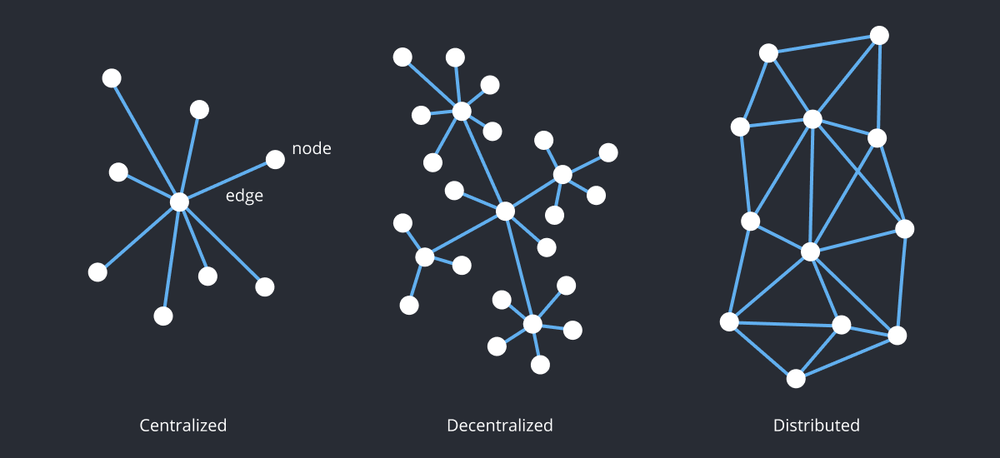
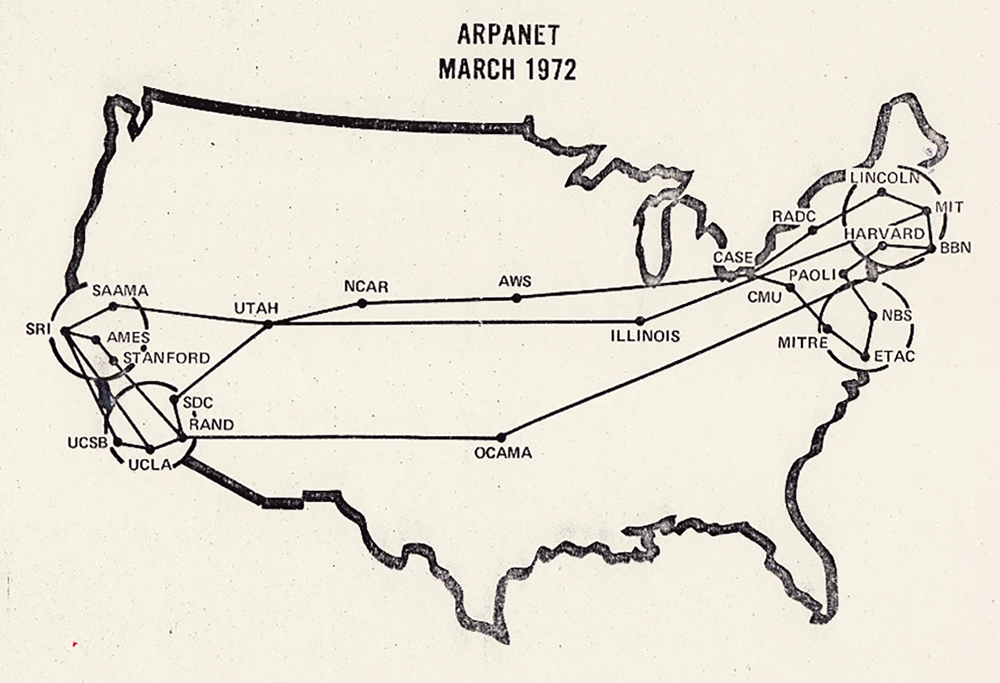
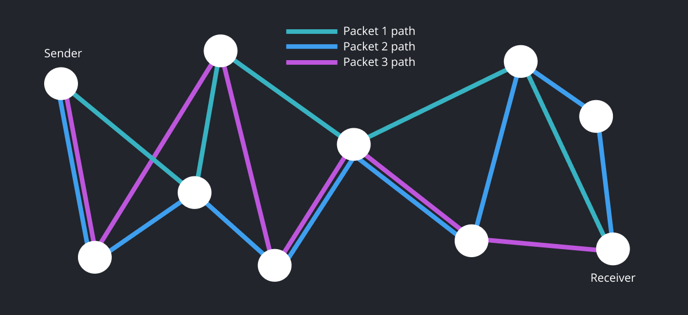
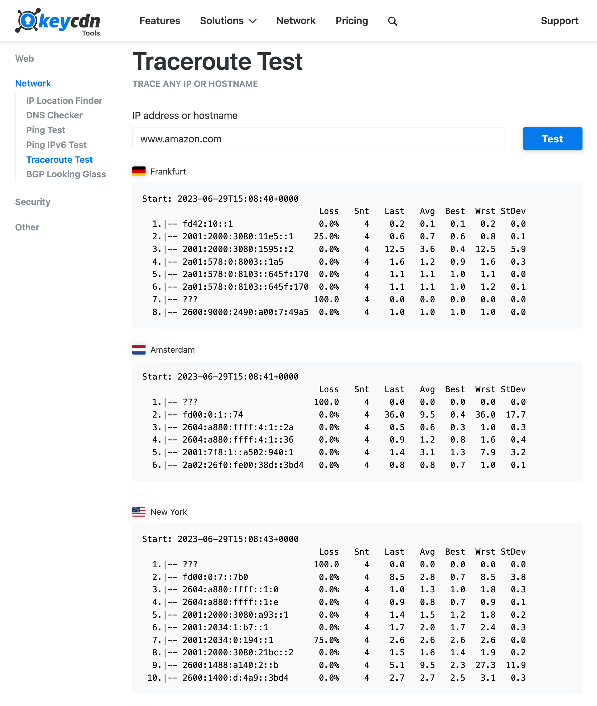
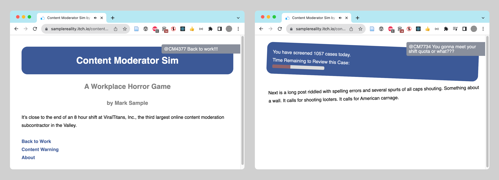
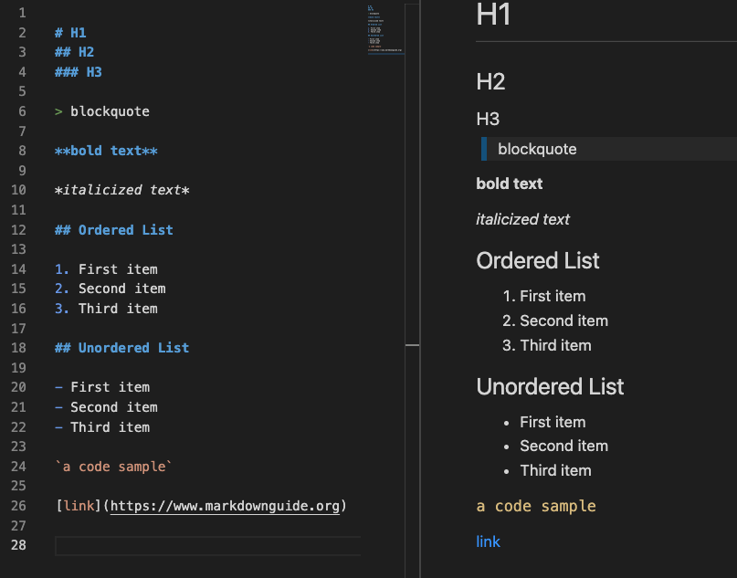
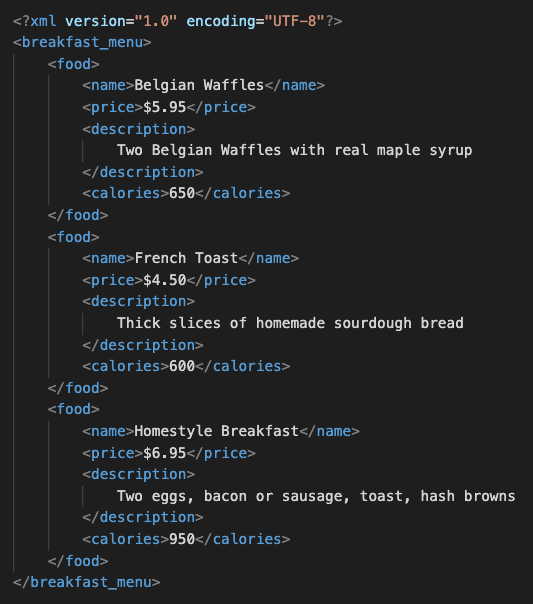

Chapter 1 begins with the origins of the internet, factors in the rise of the information age, and how the various impacts of networked computers can be understood by looking at other media revolutions. Likewise, we introduce the foundational components for making websites, the command line, Git version control, and publishing a simple web page on the internet.

Visual representations of centralized, decentralized, and distributed networks.

 
“Arpanet 1972 Map” by UCLA and BBN

 
A diagram showing how packet switching technology allows data to break apart and come together. 

You can use the website https://tools.keycdn.com/traceroute to see the path that data takes as it moves across the internet (see callout). The packet switching process occurs at each internet switch, or router (like the one in your home) to connect sub-networks to the internet. Finally, TCP/IP is the packet-switching Transmission Control Protocol (TCP) + Internet Protocol (IP). These standards are the rules that govern how computers connect to the internet.

 
Content Delivery Network (CDN) - The online tool at https://tools.keycdn.com/traceroute shows the paths and response time (in milliseconds) taken to retrieve data from Amazon.com, starting from different locations around the world. A Content Delivery Network (CDN) consists of several servers located around the world which each have a copy of the same data. When you visit amazon.com, the network will retrieve the web page from the server that is physically closest to speed the time it takes to load the data.

 
Mark Sample, Content Moderator Sim, Version 2, August 29, 2020. https://samplereality.itch.io/content-moderator-sim 

 
Sample markdown code (on the left) showing basic text formatting (on the right). 

 
XML (eXtensible Markup Language) is a customizable markup language. It contains no formatting, but provides access to the data it contains through its named elements and hierarchical structure. 

