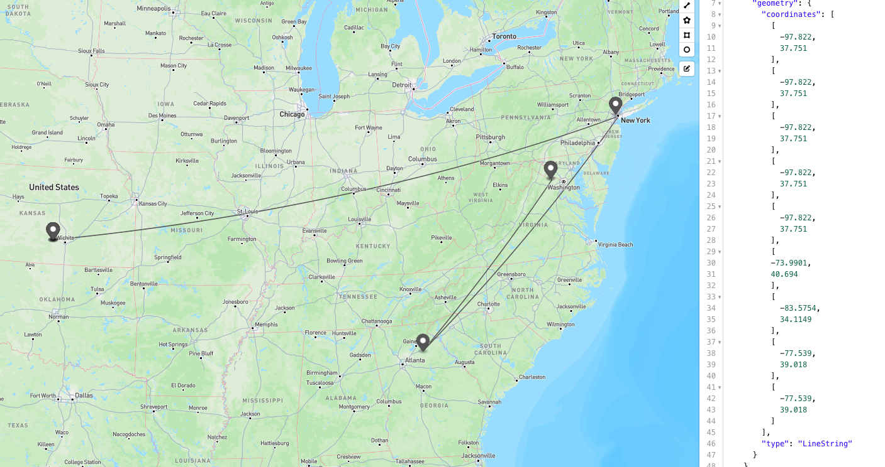
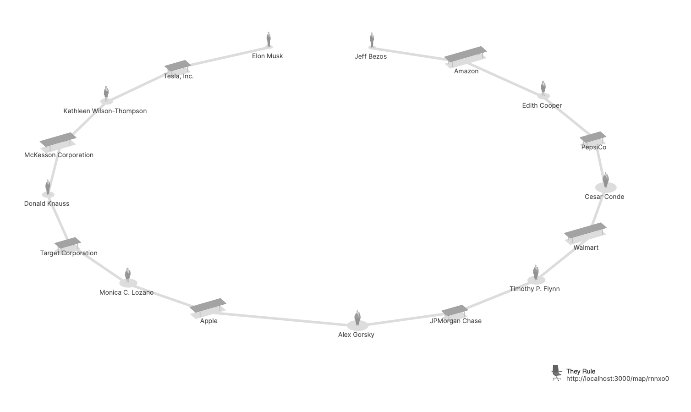

import Excerpt from '@/components/Excerpt.astro';
import Overview from '@/components/Overview.astro';

<Overview>{frontmatter.description}</Overview>

## Networks

<figure>

Visual representations of centralized, decentralized, and distributed networks.

</figure>

<figure>

 
“Arpanet 1972 Map” by UCLA and BBN

</figure>

<figure>

 
A diagram showing how packet switching technology allows data to break apart and come together. 

</figure>

## Use Traceroute

One way to visualize the packet switching process is through the traceroute command. In this exercise you will use an online tool to show the paths and response times (in milliseconds) to retrieve data from any domain from major datacenters around the globe.

1. Start by checking DNS information for a domain. Go to https://tools.keycdn.com/dig and enter a domain name to test. The IP address will be listed to the right of the domain name.
1. Paste the IP address from the first step into the form at https://tools.keycdn.com/traceroute to see the path that data takes as it moves across the internet. 
1. The geo tool at https://tools.keycdn.com/geo shows your own IP when you first open the page, but you can use it to find the locations for each IP address and map the points and path, like we did with [geojson.io](https://geojson.io) below:

<figure>

 
All the servers between the "New York" timezone test and the datacenter that serves owenmundy.com.

</figure>

<figure>

 
The traceroute for Amazon.com from different locations around the world. A Content Delivery Network (CDN) consists of several servers located around the world which each have a copy of the same data. When you visit Amazon.com, the network will retrieve the web page from the server that is physically closest to speed the time it takes to load the data.

</figure>

## Markup Languages

<figure>

 
Mark Sample, Content Moderator Sim, Version 2, August 29, 2020. https://samplereality.itch.io/content-moderator-sim 

</figure>

<figure>

 
Sample markdown code (on the left) showing basic text formatting (on the right). 

</figure>

<figure>

 
XML (eXtensible Markup Language) is a customizable markup language. It contains no formatting, but provides access to the data it contains through its named elements and hierarchical structure. 

</figure>

## Case Study

<figure>

 
Josh On, They Rule (2023). The connections between Elon Musk and Jeff Bezos on [TheyRule.net](https://TheyRule.net).

</figure>
