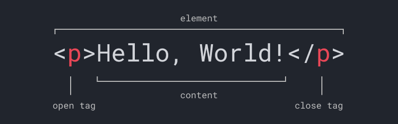
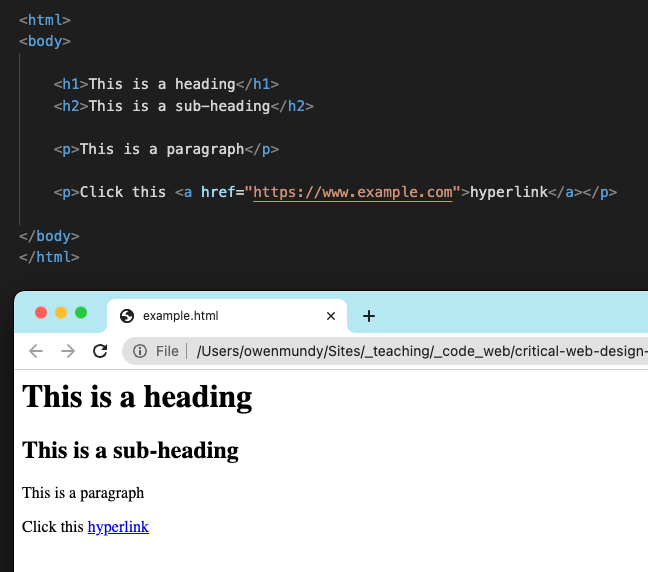
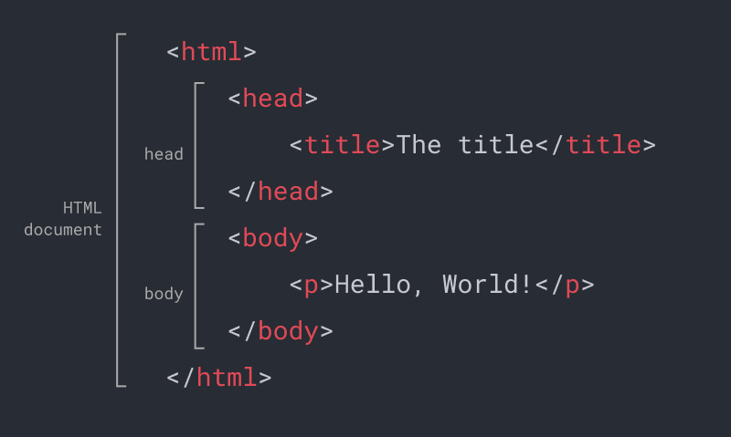
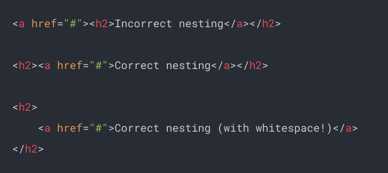
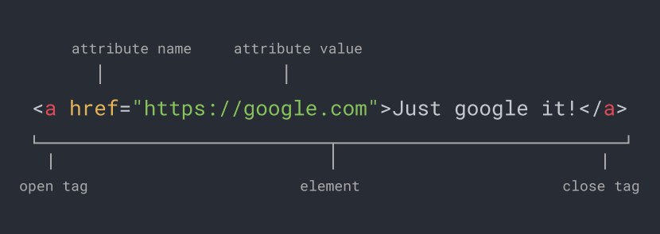

:::note[About]{icon="information"}
👉 Create a basic web page using Codepen.io.
:::


<figure>   


Code playgrounds like https://codepen.io make it easy to test and share HTML, CSS, and Javascript in a “web environment.”
</figure>


1. In Chrome, go to https://codepen.io
1. Click “Start Coding.” You will see an area where you can type HTML, CSS, and Javascript, as well as a preview window containing the outcome of your work.
1. Type the following code into the HTML section. Codepen will automatically refresh the preview window to show your updates. HTML is the language that structures the content of web pages.

```html
<h1>Hello, World!</h1>
```

4. Type the following code into the CSS section. As you can see, CSS is the language that controls the presentation of web pages.

```css
h1 {
	color: hotpink;
}
```

5. Type the following code into the Javascript section. Javascript is the language used to control the behavior of web pages. You can see in our screenshot in Figure 0.2 you will need to click the console button to see the output from console.log().

```js
console.log("Hello, World!");
```

6. We will be using codepen.io throughout this book. Feel free to continue experimenting or look through their examples. It might also be a good idea to create a free account to save your work.

7. Explore other examples to see the range of things one can do with a code playground.
	1. https://codepen.io/owenmundy/pen/QWzJKVz
	1. https://codepen.io/sfi0zy/pen/GRwEQjd 
	1. https://codepen.io/Str3lla/pen/yLQLyzY 
	1. https://codepen.io/isladjan/pen/abdyPBw 
	1. https://codepen.io/tholman/pen/kvxQmA


 
This diagram shows the structure of an HTML element, including the opening tag, content contained within, and the closing tag. Tags use predefined names between a less than and greater than sign. 


HTML code and its corresponding text formatting when viewed with a web browser. This page is displayed using only vanilla HTML so its elements appear using the default format of the browser, as no CSS has been applied to change the presentation.


 
This diagram shows the required structure of an HTML document.



Figure 1.15 The first line shows incorrect nesting (the `<a>` tag is closed before the `<h2>`). The second line shows the proper structure. The third shows how to use whitespace with nesting to make the code readable and easier to see if there are nesting problems.



Figure 1.16 An anchor tag with an href attribute. The attribute value can be wrapped in single or double quotes.


## Continue Learning

- 


:::tip[Continue Learning]
See the other markup language examples (e.g. [markdown](https://github.com/criticalwebdesign/book/blob/main/01-networks/examples/example.md)) in the repo. 
:::