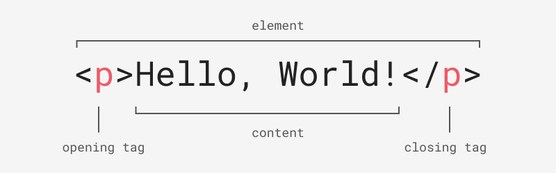
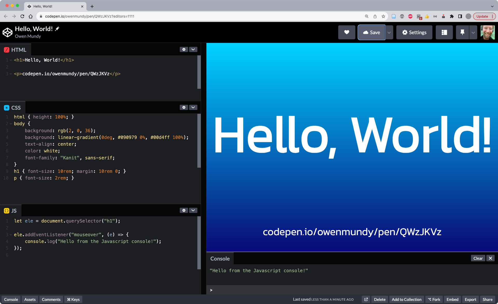
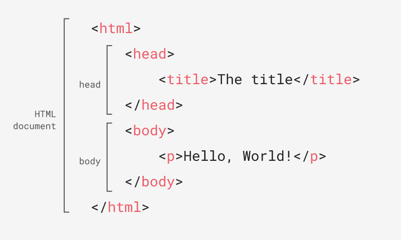
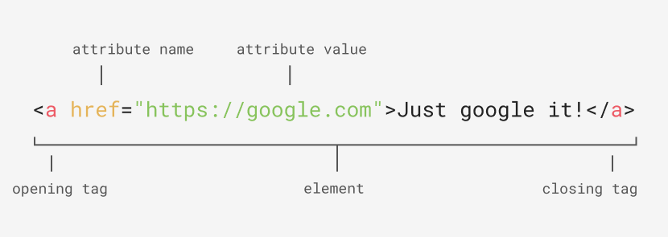
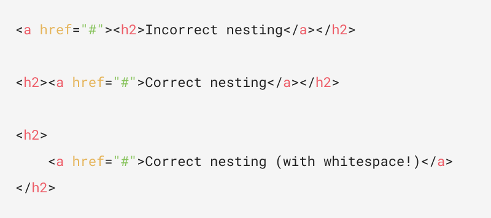

import CustomAside from '@/components/CustomAside.astro';

<CustomAside type="overview">{frontmatter.description}</CustomAside>


## Hello, World! using Codepen

<CustomAside type="excerpt" reference="Exercise 1.1.1"></CustomAside>


Code playgrounds like [codepen.io/pen](https://codepen.io/pen/) or [Github Codespaces](https://github.com/codespaces) make it easy to test and share HTML, CSS, and Javascript in a “web environment.” 


:::note
Codepen recently added new features that complicate their interface. To open a simple pen → 
[codepen.io/pen](https://codepen.io/pen/)
:::


1. In Chrome, go to [codepen.io/pen](https://codepen.io/pen/)
1. Click “Start Coding.” You will see an area where you can type HTML, CSS, and Javascript, as well as a preview window containing the outcome of your work.
1. Type the following code into the HTML section. Codepen will automatically refresh the preview window to show your updates. HTML is the language that structures the content of web pages.


```html
<h1>Hello, World!</h1>
```


<figure>


This diagram shows the structure of an HTML element, including the opening tag, content contained within, and the closing tag. Tags use predefined names between a less than and greater than sign. 
</figure>


4. Add this CSS style rule. As you can see, CSS is the language that controls the presentation of web pages.

```css
h1 {
	color: hotpink;
}
```

5. Type the following code into the Javascript section. Javascript is the language used to control the behavior of web pages. You will need to click the console button to see the output from `console.log()`.

```js
console.log("Hello, World!");
```

6. We will be using codepen.io throughout this book. Feel free to continue experimenting or look through their examples. It might also be a good idea to create a free account to save your work.

7. Explore other examples to see the range of things one can do with a code playground.
	1. https://codepen.io/owenmundy/pen/QWzJKVz
	1. https://codepen.io/sfi0zy/pen/GRwEQjd 
	1. https://codepen.io/Str3lla/pen/yLQLyzY 
	1. https://codepen.io/isladjan/pen/abdyPBw 
	1. https://codepen.io/tholman/pen/kvxQmA


<figure>   


You can also see a slightly more advanced "Hello, World!" at https://bit.ly/cwd-codepen-hello-world  
</figure>


## Continue Exploring HTML


<figure>

 
This diagram shows the required structure of an HTML document.
</figure>


<figure>


An anchor tag with an href attribute. The attribute value can be wrapped in single or double quotes.
</figure>


<figure>

 
The first line shows incorrect nesting (the `<a>` tag is closed before the `<h2>`). The second line shows the proper structure. The third shows how to use whitespace with nesting to make the code readable and easier to see if there are nesting problems.
</figure>


:::tip[Continue Learning]
See other markup language examples (e.g. [markdown](https://github.com/criticalwebdesign/book/blob/main/01-networks/examples/example.md) or [XML](https://github.com/criticalwebdesign/book/blob/main/01-networks/examples/example.xml)) in the repo. 
:::


