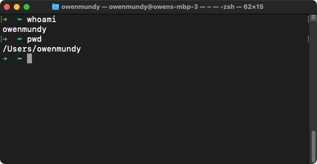

<div class="callout-intro">
👉 Install and use the command line to explore your machine and the network
</div>


## About the Command Line

Software like Microsoft Word lets you create, modify, and save your files to your computer using menus and buttons. Your operating system makes this possible through a **graphical user interface (GUI)**. Using the GUI you can also create, move, or delete files on your computer by interacting with icons presented on a “desktop” by moving a computer mouse. 

The **command line** likewise allows you to explore your computer and edit files, by typing and running commands using only a text interface. Depending on the context, the command line might be referred to as a **shell**, **terminal**, or **console**. While you will spend most of your time designing for the web using a GUI, knowing how to use the command line will enable you to quickly explore files stored on your computer, troubleshoot network issues, and investigate network records. 


## Folder vs. Directory, etc.

Starting with the next exercise, you will create a folder for projects in this book and then use the command line to navigate your hard drive.

Before we begin, it is important to establish your digital work space. Throughout this book you will be editing and testing local copies of your files and then uploading them (essentially mirroring your local copy) to share them on the internet. One of the first things you should know is that a **folder** and **directory** are the same thing. When working with web servers you may see one name more than the other, but these terms are interchangeable. 

When we refer to anything **local** we are speaking about files stored on your own computer. Whereas **remote** indicates files stored on a web server and must be accessed across a network. Usually, local files are not accessible to anyone but you, while remote files are **hosted**, or **live**, and publicly accessible so that others can see them.

The files you create while completing exercises in this book will each have a specific **file path**, or address, to describe the location where they are stored on your computer. A path consists of the names of all the containing folders, separated by forward slashes, until the name of the file itself. 


:::note[Author’s Note]
Web pages are composed of many different files, so it is essential to keep your web projects organized. Maintaining a similar folder structure also keeps your file paths consistent. To keep your file paths organized and make it easier to follow the book, you should keep all your websites in one location that you will create on your hard drive now. 
:::


## Find Your Home Folder
<!-- Owen: The default location ~/Documents/Github/ is perfectly acceptable. And, it's cross platform. Removing requirement to use Sites folder and changing this to "Find Home Folder". -->


**MacOS**

1. Go to the Finder (click the picture of the blue face in your Dock).
1. From the **Finder Menu** (the top menu bar) choose File > New Finder Window. 
1. From the Finder Menu, select Go > Home. You are looking at your user **home directory**. It should include folders such as “Applications, Desktop, Documents” and more. 
1. Bookmark this folder by dragging it to the sidebar.
1. Show the file path while you are browsing the Finder by choosing View > Show Path Bar. Knowing a file's path makes it easier to navigate to your files in the Finder, on the command line, and ultimately, online.


**Windows**

1. Open a new File Explorer window.
1. Go to your home directory using one of the these options:
	1. Press the Windows key + R to open the Run program, type **%HOMEPATH%** and press OK.
	1. Or, at the top of the File Explorer window, click in the path bar and type **C:\Users** and press return, then double click the folder with your username.
1. You are now looking at your user home directory. 
1. Bookmark this folder by dragging it to the sidebar.


## Install a Command Line Application

To perform basic commands you may need to install an application, depending on your operating system. Install and/or open the terminal as described below:

- Mac: The Terminal application is already installed. Use Spotlight (Cmd+Space) to open.
- Windows: Install and then open Git Bash [gitforwindows.org](https://gitforwindows.org) We recommend using the default settings during the installation when prompted.
- Linux: [LXTerminal](https://www.raspberrypi.org/documentation/usage/terminal/) is already installed. Locate and open LXTerminal.


## Command Line Basics

With your command line application open (Terminal or Git Bash) you should see a prompt — the $ % or # symbol — which designates where you will type commands.

<figure>

 
A screenshot of the MacOS Terminal showing output from the whoami and pwd commands.
</figure>

Run each of the commands in Table 1.2.1 by typing them, one at a time, at the prompt, followed by pressing the return (Enter on Windows) key. Type them in the order in which they appear. 
If you make a mistake press backspace to change your input. At any time you can use Ctl+c (the two keys at the same time) to cancel a command.

. | Command | Description
--- | --- | ---
1 | `whoami` | Display [the username of the current user](https://en.wikipedia.org/wiki/Whoami). From this point on we will use the term `<username>` to let you know to replace it with your username.
2 | `cd ~/` | Change to your home directory. CD is short for change directory and ~/ (tilda with a forward slash) is a reference to your home directory. Use this command any time "go home".
3 | `pwd` | Display the full path of your current folder, or [working directory](https://en.wikipedia.org/wiki/Pwd). By default your terminal should open in your home directory and (on Mac) will look like this: `/Users/<username>/`
4 | `ls` | [List the files](https://en.wikipedia.org/wiki/Ls) in your current directory. 
5 | `cd Sites` | Change into the new Sites directory you created above. 
6 | `pwd` | Now that you have created these directories and changed to them, this command will show (on a Mac) the following path: `/Users/<username>/Sites`
7 | `touch test.html` | [Create a new file](https://en.wikipedia.org/wiki/Touch_(command)) called test.html
8 | `ls` | List files to confirm the new file was created
9 | `echo "hello world" > test.html` | Write some text in the new file. If you want to see your changes you will have to look in the file itself. On the command line it will seem as though nothing happened!
10 | `cat test.html` | View contents of new file (as in "[concat](https://en.wikipedia.org/wiki/Cat_(Unix))")
11 |  | Search the web to find the command modifier to instruct the ls command to [list files with their modified date](https://en.wikipedia.org/wiki/Ls). 
12 |  | Search the web for the command modifier that lists all files, including hidden files.


:::tip[Pro Tip]
Press the tab key after the first few characters of a file or folder name to have the OS autocomplete the name.
:::


## Run Network Commands

An **IP address** is a numerical label used to identify and connect devices to the internet. Assigned by your wifi router or Internet Service Provider (ISP), it is required before your device can send data through the network. For example, if you open Chrome and search “[what is my ip](https://www.google.com/search?q=what+is+my+IP)” the result will be a number that looks like this: 24.224.66.226. 

Each IP address is unique, but not easy to remember. A **domain name** such as “Google.com” is a human-readable string of characters that points to an IP address or web host. You can use the ping command in the terminal to find the correlating IP address of any domain name. 

1. Type `ping google.com` at the prompt in our terminal window to find Google’s IP address. Like sonar in a submarine, ping returns the time it takes to receive a response from the address you enter.
1. Review your results. You can press `Ctl+c` to stop retrieving information. You might see an address like [64.233.177.104](http://64.233.177.104) or [142.250.138.102](https://142.250.138.102).  You will see additional information, too, such as how long in milliseconds it took to receive a response from the IP you requested.

While easier to recall than the numbers in an IP address, domain names must be resolved via the **Domain Name System (DNS**) to learn the IP address of the web host. When you open a website in your browser, this is what happens:

1. A user types a domain name into a web browser.
1. The browser performs a DNS query to find the IP address of the server.
1. The browser then requests website files using the server's IP.


## Get Network Status

You can find more information about a DNS entry with the following commands. Open your command line interface (Terminal, for instance) and type the following commands after the prompt. Remember to press the `return` key to run the command:


1. The **whois** command returns the name of the person on record for the domain (and therefore, IP address) you view. When you use whois to find information about an IP address associated with a company. On Windows, you may need to use this website to perform this task: https://lookup.icann.org 

```bash
whois amazon.com
```

2. The **ping** command tests network connectivity. It reveals additional information, as you learned in your earlier use of `ping` to find the IP address associated with Google.com.

```bash
ping amazon.com
```

3. The **curl** (Client URL) command offers a variety of functions for evaluating resources on a network. The above command will fetch the response headers, or metadata that describes the data returned from a server. This includes several properties and their corresponding values like `Content-Type` which is set to `text/html` (a web page), among other information related to the page's origin, security, and performance. Used without any modifiers (e.g. `curl google.com`) it simply displays the contents of an HTML page in the shell. 

```bash
curl --head google.com
```

Now that you are comfortable using the command line to explore your hard drive, domain name, and IP address, you are ready to learn about Github and connect to it from the command line, too. 

