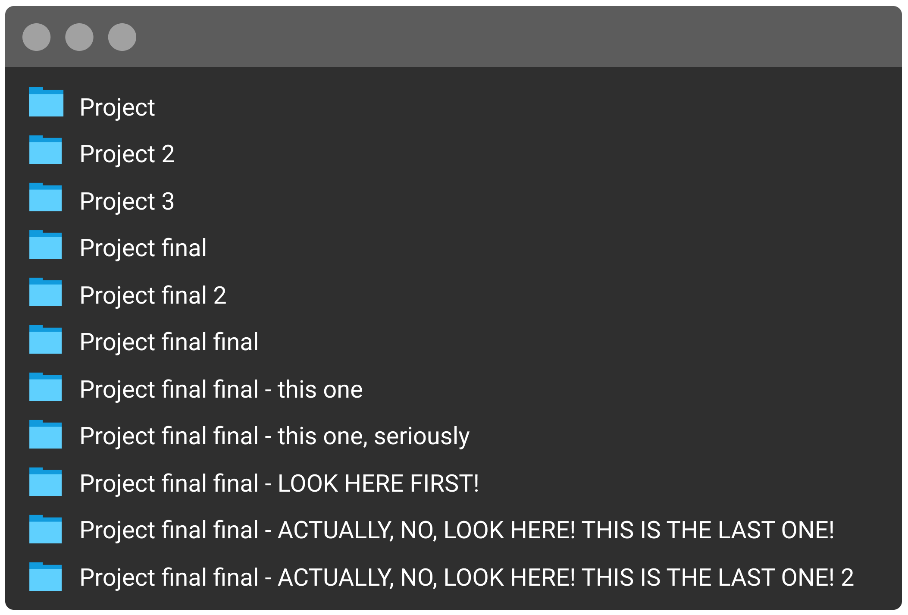
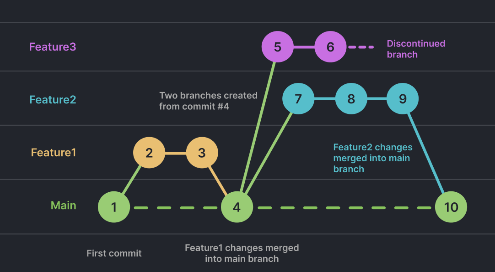
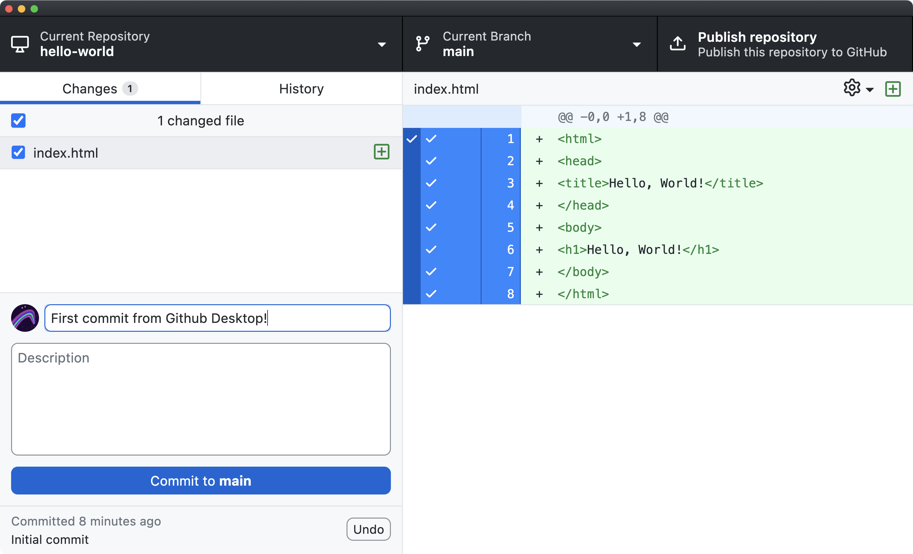
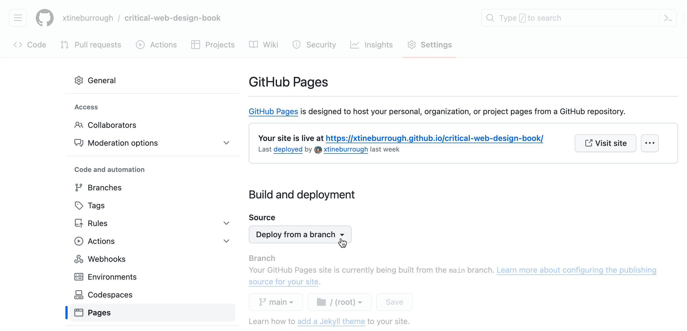
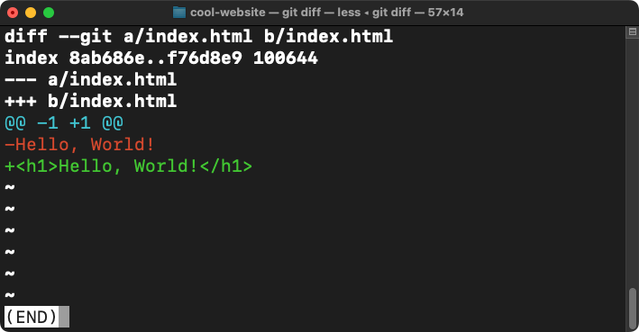

import Excerpt from '@/components/Excerpt.astro';
import Overview from '@/components/Overview.astro';

<Overview>{frontmatter.description}</Overview>


{/* 
IN THE BOOK
## Why use version control?
 
  
 */}


## Install and Configure Git

:::caution
You should be familiar with the [Command Line](./1-2-command-line.md) to complete the following exercises.
:::


There are many ways to install Git, depending on your operating system. First, run the following on the command line to see if it is already installed. 

```bash
git --version
```

You will see the version if it is already installed. If not, you might be prompted to install Git when you do this, which you can, or you can follow our recommended instructions.

<b>For MacOS</b>

1. Install the homebrew package manager using the install script at: https://brew.sh
1. Then run: `brew install git`

<b>For Windows</b>

1. Download Git here [gitforwindows.org](https://gitforwindows.org)
1. Run the installer. We recommend installing Git Bash and using the default settings during the installation when prompted.

<b>Both Mac and Windows</b>

Once installed, configure Git on the command line using the following two commands, replacing the sample information with your own:

```text
git config --global user.name "Jane Doe"
git config --global user.email janedoe@example.com
```

While all Git tasks can be performed on the command line, we will show you how to streamline the version control process using Github Desktop.


## Install a Code Editor

For local development we suggest using [Visual Studio Code (VS Code)](https://visualstudio.microsoft.com/downloads/), which is free, popular, and will likely exist for many years. The list of editors we have tried includes Dreamweaver, TextWrangler, Coda, Sublime, and Atom; and we are certain that in some future moment we will use a new or different editor, too. If you are a student working with peers in a classroom, you may want to choose the same editor  so you can help each other as you are learning. Consider also that there are many benefits to trying new and unfamiliar tools, especially since adaptability and "learning to learn" is essential for developing and incorporating the changing technologies for the web.


## Install Github Desktop

Github Desktop makes it easy to keep track and view information about your repositories, as well as list and push changes you make to your projects.

1. Download and install Github Desktop https://desktop.github.com
2. Create a Github account https://github.com/join and login to Github Desktop.


:::note[Track Existing Projects with Github Desktop]
If you already have a project on your computer you want to start tracking with Git and/or publish with Github Pages you can drag the project folder into Github Desktop which will prompt you to initialize a new repository in the project.
:::


## Create a Website with Git

This exercise establishes best practices for setting up a new website project, including the index.html page, and tracking and publishing with Git. While you are working through this book, you will create a new folder and repository for the prompt in each chapter. This allows you to publish individual projects with unique URLs and keep your files organized.

1. In Github Desktop, choose File > New Repository.
1. In the dialog box that appears: Name the repository `hello-world`. The default location `~/Documents/Github` is fine. Check "Initialize the project with a README".
1. Click "Create Repository" This will create a new folder at `~/Documents/Github/hello-world` and begin tracking it with Git.
1. Open the project folder in VS Code by choosing Repository > Open in Visual Studio Code
1. In VS Code, create a new file in the project and name it `index.html`

:::caution
File paths on the Web are case sensitive!
:::

6. Add the html, head, and body elements that define the structure of an HTML file. Notice that VS Code will add the closing tags by default. Your code should look like the following:

```html
<html>
	<head>
		<title>Hello, World!</title>
	</head>
	<body>
		<h1>Hello, World!</h1>
	</body>
</html>
```

7. Save the file and preview your work in the web browser using any of these options:
    - In VS Code, right click the file and choose Open in Default Browser...
    - In Google Chrome, select File > Open File to locate the `index.html` file.
    - In the Finder, double click the file to open it in Chrome.

<figure>


Github Desktop with changes to the index.html file

</figure>


8. In Github Desktop, you can see the changes you've made to `index.html` highlighted in green with + signs to let you know they are additions to the file. Deletions will be highlighted in red and appear with a - sign.
9. Create your first commit by adding a commit message explaining the basics of your changes. Press commit to main and your commit will be saved in the git history. You can verify this under the History tab.

Congratulations! Not only have you created your first web page, you have also completed a basic Git workflow to edit and commit changes to a repository. In the next exercise you will post the repository on Github and set up Github Pages to publish this site to the WWW.


## Publish Your Repo on Github

Since you created this project on your computer's hard drive, it only exists “locally.” In this exercise you will push files in your repo to create a remote copy on github.com.

1. At the top of Github Desktop, click the button to “Publish this repository to Github”. This opens a dialogue to create a remote copy for this repo on Github.com with the same name. Deselect "keep this code private" and click Publish Repository.
1. After Github uploads your code, choose Repository > View on Github to open the remote copy. Now you are viewing your repo in the web browser, where you can see the history of commits as you did in Github Desktop. 
1. Test that your local and remote copy are synced by going to Github Desktop and choosing Fetch origin.  


## Enable GitHub Pages

See Exercise 1.2.2 in the book to learn how to publish your website with GitHub Pages for the world to see.

<figure>



</figure>


## Continue Learning


<figure>

import YoutubeVideo from '@/components/YoutubeVideo.astro';

<div class="max-w-2xl mx-auto not-content">
  <YoutubeVideo src="https://www.youtube.com/watch?v=9mput42uZsQ" />
</div>

The [Gource project](https://gource.io/) makes it possible to visualize the work performed in a Git repository over time. This video visualizes the history of the development of the Python language.

</figure>


## Git on the Command Line

Most basic Git tasks can be performed using a GUI like Github Desktop. However, performing these operations using the command line offers advanced controls in addition to making the process of creating a new repository clear.

1. Open your command line application and perform the following commands to create and initialize the project.

```bash
# Navigate to your Sites folder
cd ~/Sites

# Create a project folder and change into it
mkdir hello-website && cd hello-website

# Display your path to confirm you are in the directory directory
pwd
#-> /Users/<username>/Sites/hello-website

# Initialize Git inside this folder
git init

# Check the status to confirm git is now initialized
git status
```

2. In your Finder (or Explorer) drag the hello-website folder onto the VS Code icon in your Dock. This will open the whole project in the text editor.

3. Open index.html in VS Code. Add the following basic web page code and save your file.

```html
<html>
	<head></head>
	<body>
		Hello, World!
	</body>
</html>
```

4. Back in the command line, run the following to commit the file.

```bash
# Stage the file
git add index.html

# See that the file is now ready to commit
git status

# Create your first commit
git commit -m "First commit from the command line"

# Confirm there are no more changes
git status
```

5. In VS Code change the text inside the `<body>` tag of index.html to:

```html
<h1>Hello, World!</h1>
```

6. In command line, type `git diff` to see the modifications to this file. Those in green are additions, and red are deletions. Press `q` to exit and return to the prompt.

7. Commit the file in the command line

```bash
git commit -m "Second commit from the command line"
```


<figure>


The git diff command is a powerful feature that allows you to see what has changed in a file before or after you commit it to the repository.

</figure>


