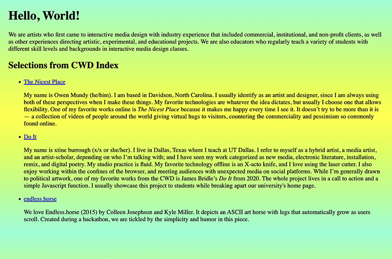

{/* 
import CustomAside from '@/components/CustomAside.astro';

<CustomAside type="overview">{frontmatter.description}</CustomAside> 
*/}

In this chapter you will create and publish your first web page using GitHub Codespaces. In addition to “Hello, World,” you will search the [Critical Web Design Index](http://criticalwebdesign.github.io/index), then display links to works that inspire you.

- Preview the [live page](https://criticalwebdesign.github.io/book/01-networks/1-3/) and [work files](https://github.com/criticalwebdesign/book/tree/main/01-networks) 
- [Videos from this chapter](https://criticalwebdesign.github.io/wiki/resources/videos/#chapter-1)

<figure>

After finishing the modules, we made a web page with some of our biographical information and selections we chose from the Critical Web Design index. We added a background gradient color, increased the size of the heading, and added margins to the web page. View
our code in the repo to see how!
</figure>

