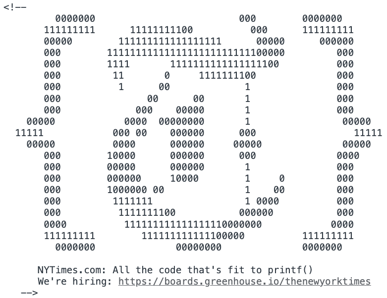
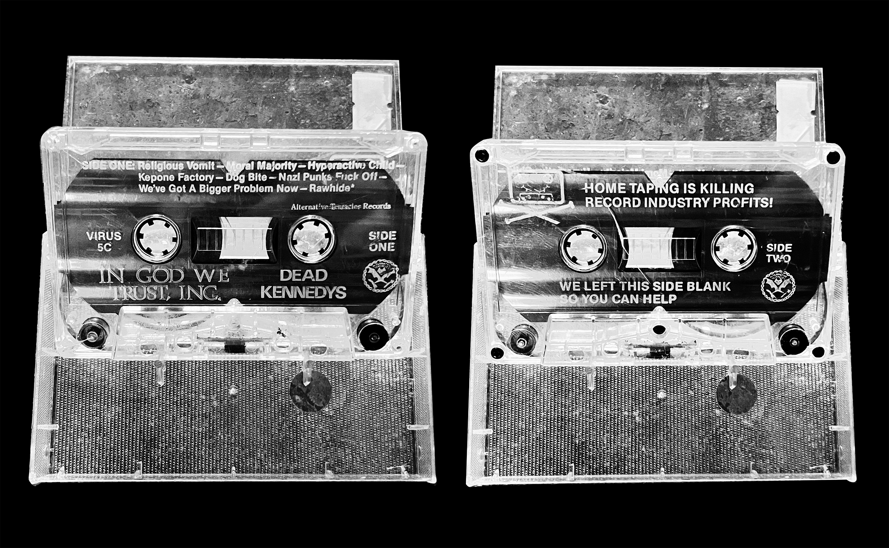
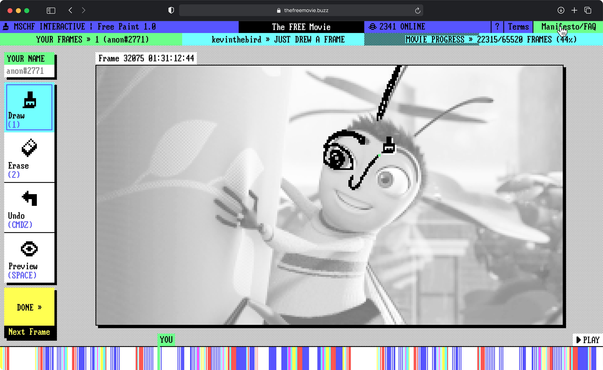
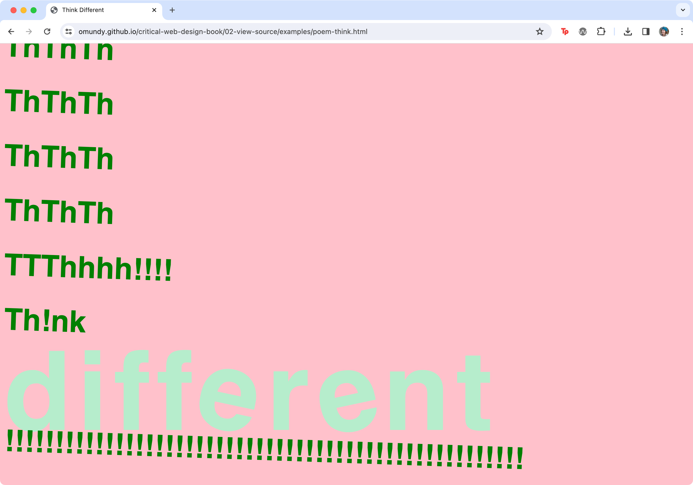
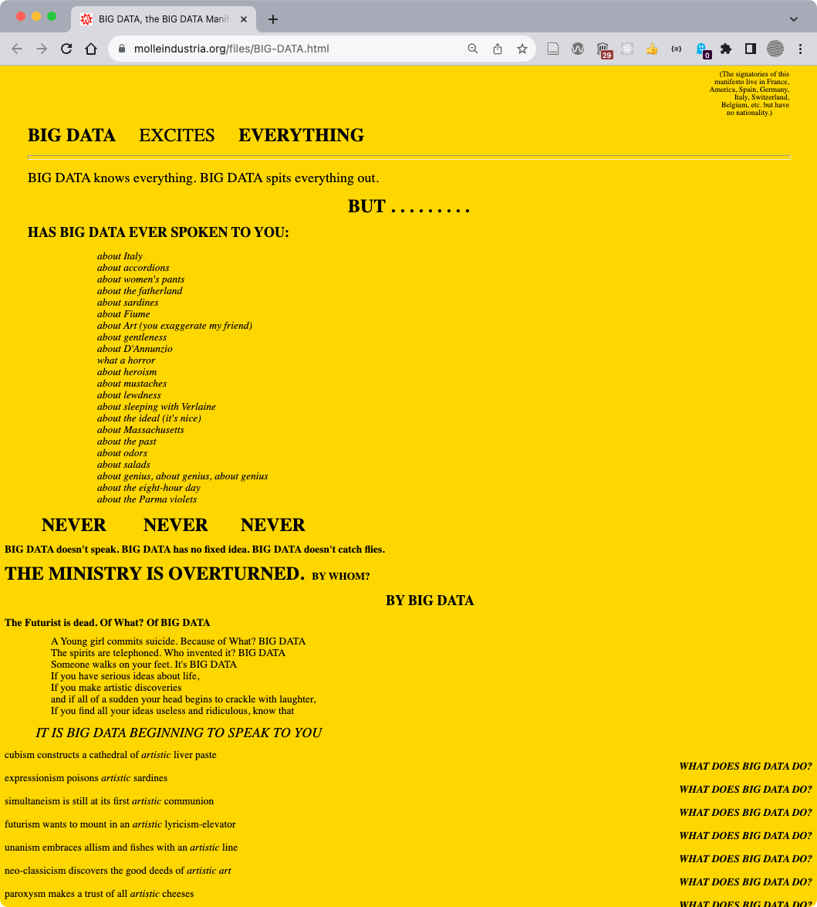
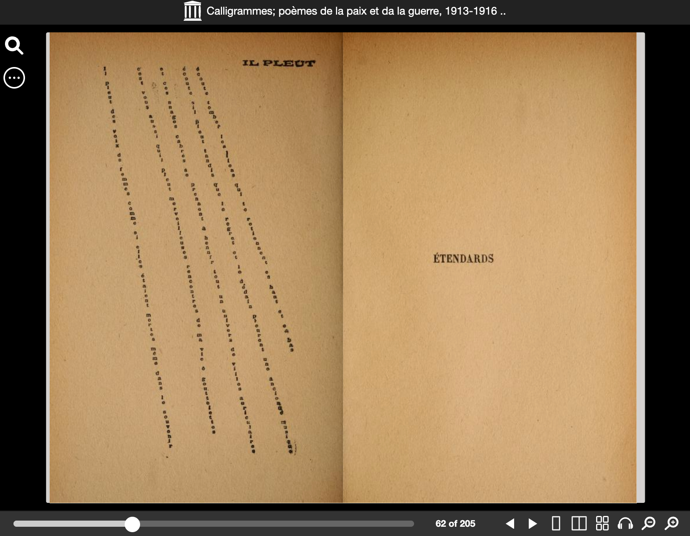
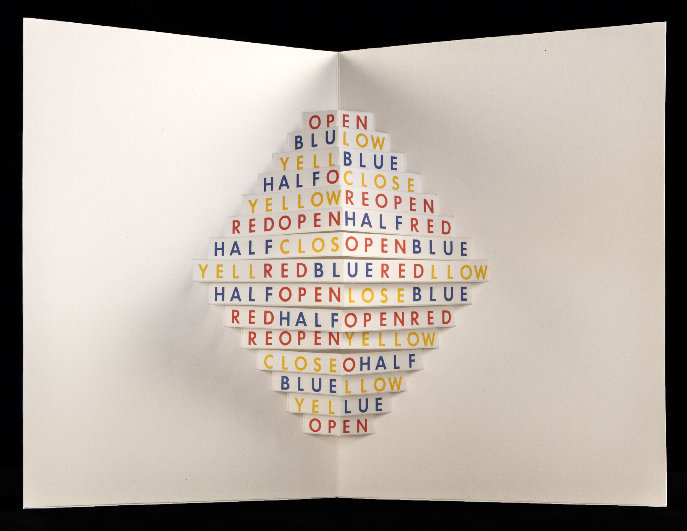
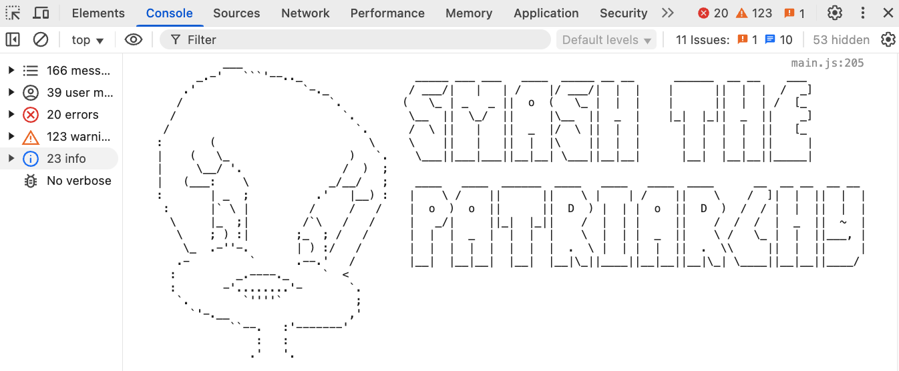
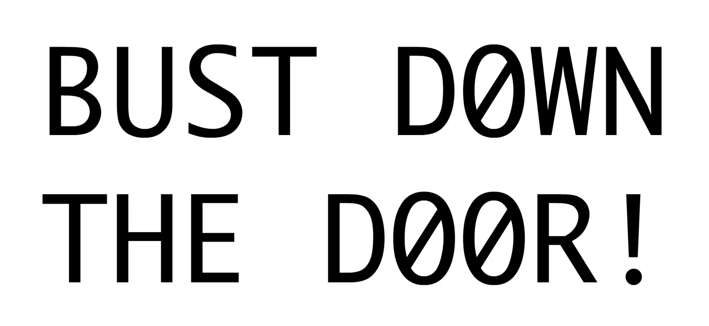

In Chapter 2 readers will learn about copyleft practices and concrete poetry while reimagining a quote from a design manifesto for the browser using HTML, CSS, and Javascript. Following the prompts in Chapter 2, readers will choose a license for their manifesto/concrete poem and cite their source in the console. 

## Free Information

<figure>

Figure 2.1 This ASCII art image of The New York Times logo can only be viewed by using developer features found in all web browsers. See more at https://omundy.github.io/console.love

</figure>

<figure>

Dead Kennedys, “In God We Trust, Inc.” cassette tape. Side B of the Dead Kennedys’ 1981 album, “In God We Trust, Inc.” features the message “Home taping is killing record industry profits! We left this side blank so you can help.” This cassette tape encouraged sharing and free distribution before the rise of Napster and other digital sharing websites (Figure 2.2). 

</figure>

## Case Study

<figure>

MSCHF, web interface for crowdsourced drawing, The FREE Movie, 2019 (ongoing).

</figure>

:::note[More MSCHF]
Visit [thefreemovie.buzz](https://thefreemovie.buzz) to watch and contribute to the current movie. Readers should also know about other online works by MSCHF like [pyramid.chat](https://pyramid.chat), [cdgrandprix.com](https://cdgrandprix.com), [onlybags.biz](https://onlybags.biz), [antirobocall.com](https://antirobocall.com), [screamclub.club](https://screamclub.club), and others that you can find at their main website [mschf.com](https://mschf.com).
:::

## Chapter Prompt

<figure>

After completing the exercises in this chapter you will create a work of expressive typography based on a manifesto of your choice. 

</figure>

## Design Manifestos

A list of manifestos by artists, designers, and engineers:

- https://molleindustria.org/files/BIG-DATA.html 
- https://designmanifestos.org 
- https://designmanifestos.org/first-things-first-a-manifesto-2020-edition/ 
- https://antisoftware.club/manifesto.html 
- https://criticalengineering.org 

<figure>

BIG DATA is a manifesto written and designed by Molleindustria https://molleindustria.org/files/BIG-DATA.html that mimics Tristan Tzara’s 1921 Dadaist manifesto design. See Tzara’s DADA soulève tout in the Museum of Modern Art’s online collection, https://www.moma.org/collection/works/184054. 

</figure>

## Concrete Poetry

<figure>

Guillaume Apollinaire, Calligrammes book of concrete poetry, 1918. Courtesy of the Public Domain Review website.

</figure>

<figure>

Open (Abre), Augusto de Campos and Julio Plaza, Poemobiles 1968-1974, Getty Research Institute, Los Angeles (92-B21581).This work is featured in the Getty Research Institute’s 2017 exhibition, Concrete Poetry: Words and Sounds in Graphic Space. [View this and additional works](https://www.getty.edu/research/exhibitions_events/exhibitions/concrete_poetry/). 

</figure>

<figure>

"SMASH THE PATRIARCHY" ASCII art found in DevTools console “What is Code?” by Paul Ford. 

</figure>

<figure>

“BUST DOWN THE DOOR!” by Young-Hae Chang Heavy Industries, 2000 animated text synched to a jazz soundtrack. https://www.yhchang.com/BUST_DOWN_THE_DOOR!_V.html 

</figure>

