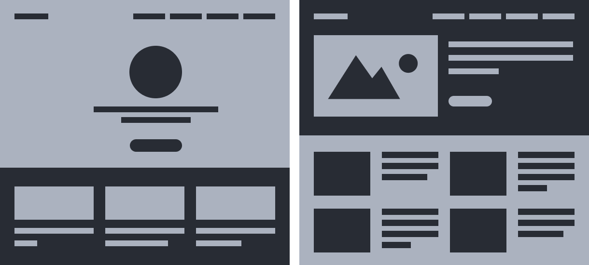
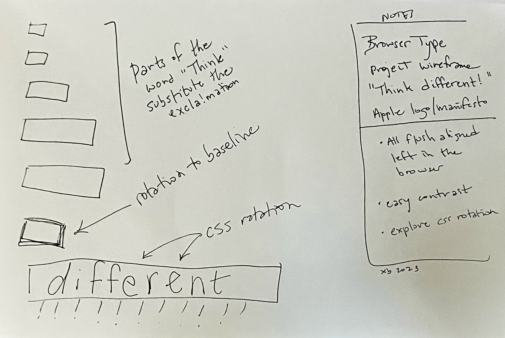
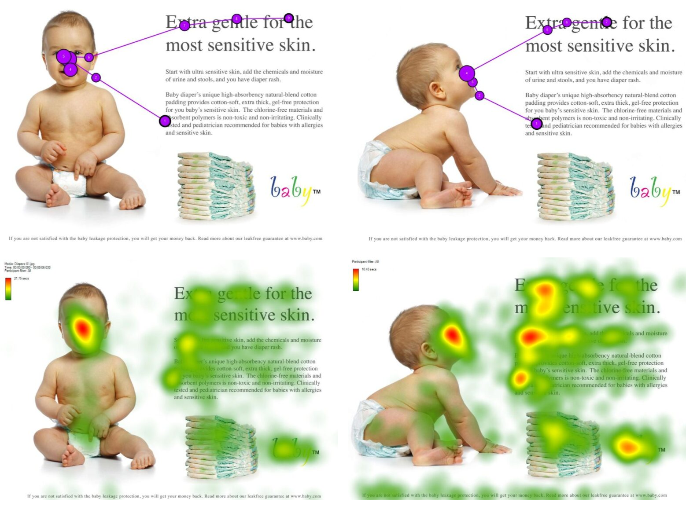
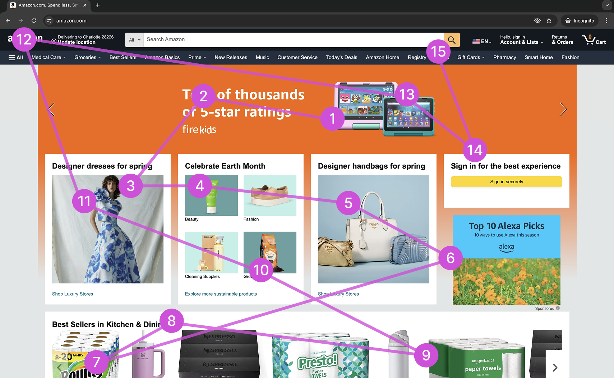
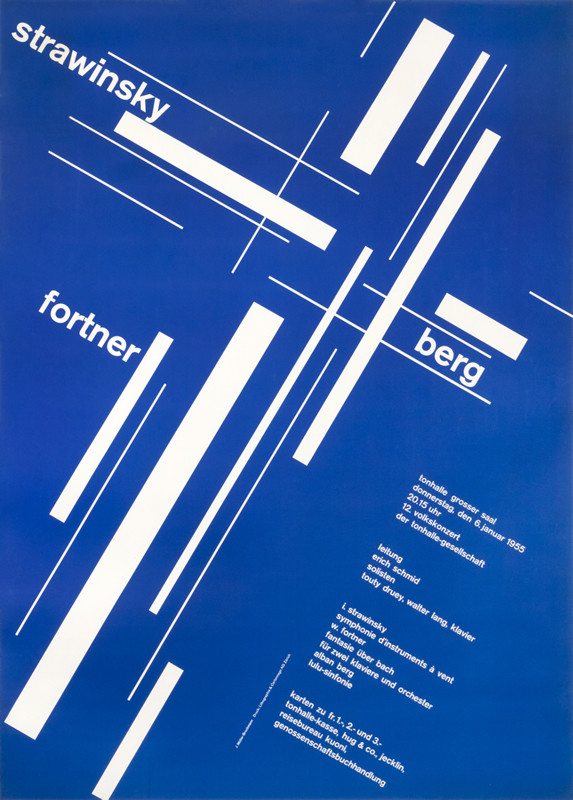

import Excerpt from '@/components/Excerpt.astro';
import Overview from '@/components/Overview.astro';

<Overview>{frontmatter.description}</Overview>

## Wireframing

Designers create wireframes at the beginning of the process using simple geometrical shapes to decide where they will place content in the layouts. 

<figure>

</figure>

<figure>

The wireframe Owen made for the example he designed for this chapter was created with pencil on graph paper. See the result at https://criticalwebdesign.github.io/book/02-view-source/examples/poem-evil.html 

</figure>

<figure>

The wireframe drawing for the example xtine designed for this chapter expresses the Apple slogan “Think Different!” It was created in a sketchbook with ink. It’s a good idea to leave notes for yourself and a date as you are working. 

</figure>

## Eye Movement Test

<figure>

In the baby product ad at the top, the results of an eye movement test show the order and location of the test user's focus as they move their eyes around the design. The second row shows a heatmap from the eye tracking test. While the composition on the left shows only one strong heat spot, in the composition on the right, participants’ eyes followed the gaze of the baby to increase engagement with important information on the page. This is an example of using leading lines (in this case the baby’s gaze) to direct attention. Image appears courtesy of James Breeze, made with Tobii eye tracker. See: [Eye Tracking 2021 – You Look Where They Look!](https://www.objectiveexperience.com/eye-tracking-ux-research/)

</figure>

<figure>

Another example showing eye movement

</figure>

## How to "Eye Test" a Design

1. Close your eyes for a few seconds, then open them and look directly at the Muller-Brockmann poster below.
1. Name each element that draws the focus of your eyes, in order of appearance. 
1. Does the order of appearance match the order of importance in the content in the design? 
1. Do your eyes ever get stuck, leave the page, or struggle to find meaning when looking at the design?

<figure>

Strawinsky, Berg, Fortner - Tonhalle, by Josef Muller-Brockmann, 1955

</figure>

## Apply the Eye Movement Test 

1. Look at a design in process (something you or a colleagues are working on)
1. Which variation are you most attracted to? Why?
1. Evaluate the design using the Eye Movement Test (above). Do the things you see help to move your eyes around the page and continue engaging with the content?
1. Does the page use whitespace in a way that helps to communicate the overall organization of content?
1. Are there things in the design that prevent understanding the content, meaning, or organization? What are they?
1. Work on a new wireframe or simplified design to reflect changes to help your audiences find content faster, and with less effort.
