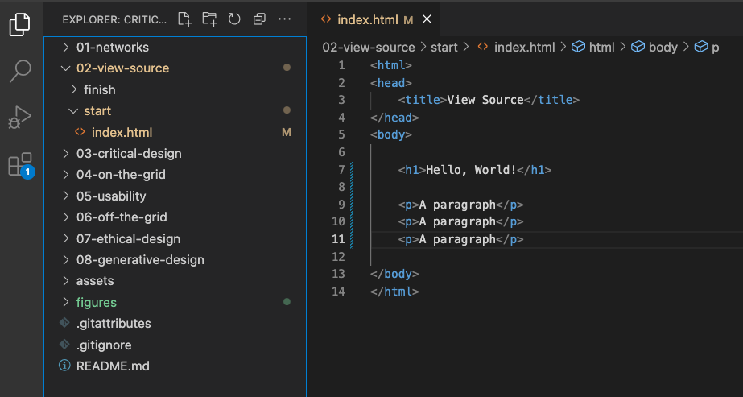
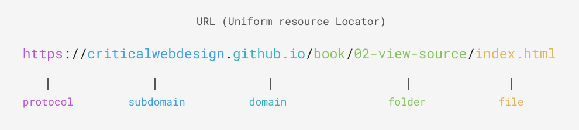
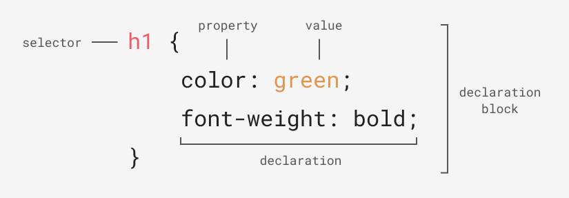
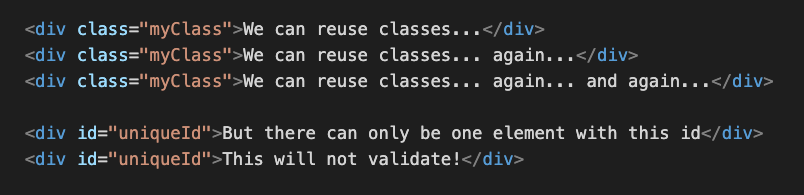
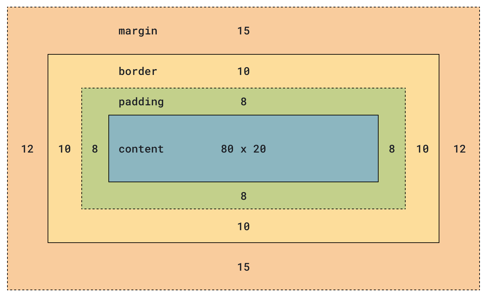
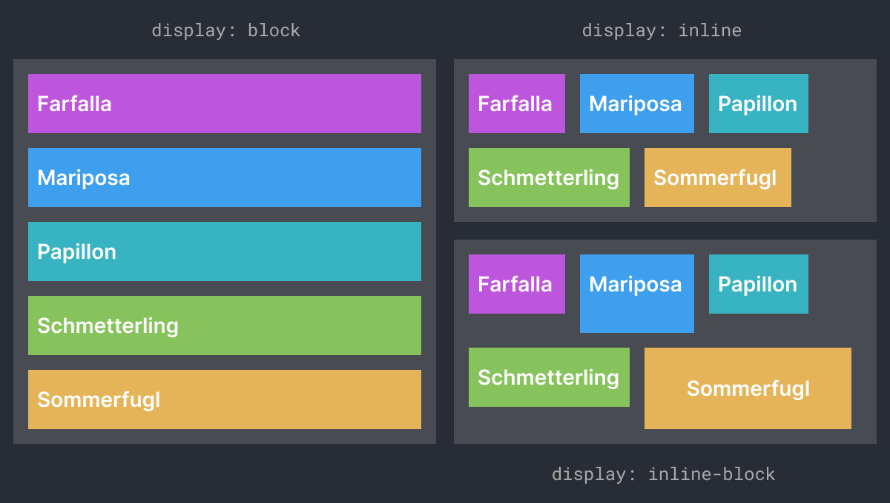
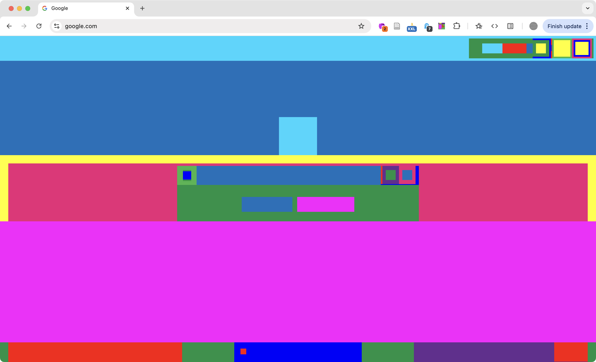
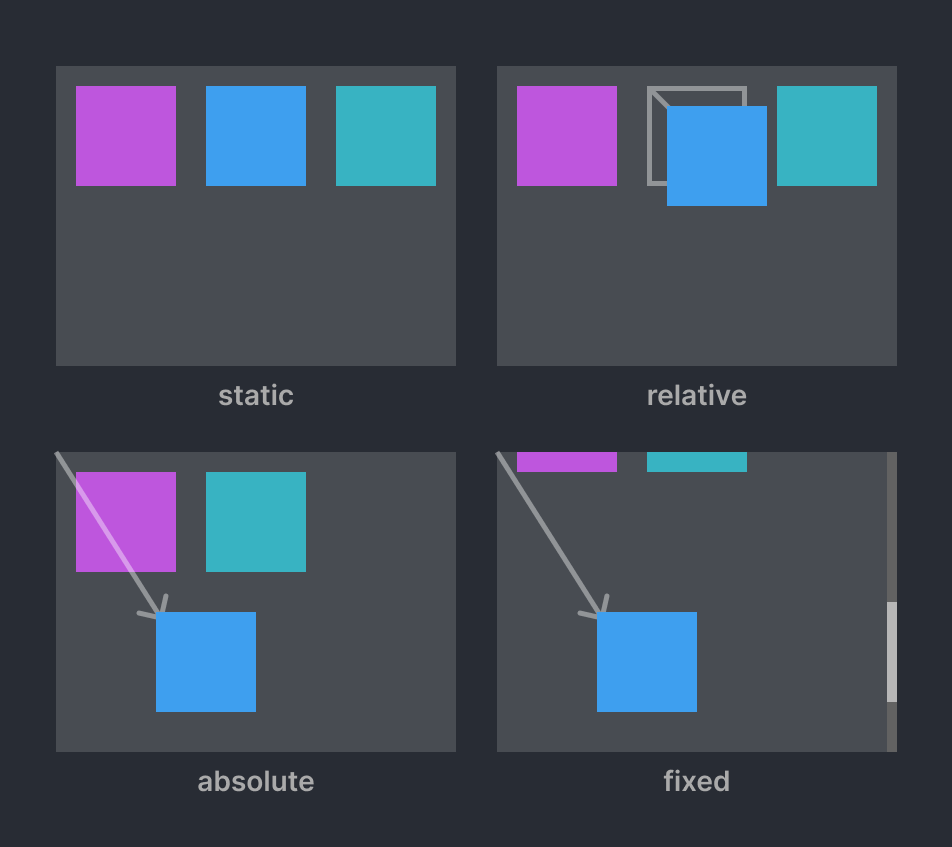
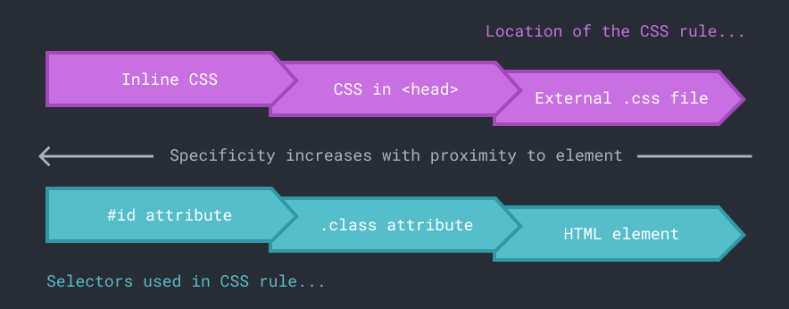

<div class="callout-intro">
👉 Using CSS display and position properties.
</div>


<!-- 
<figure>


The hierarchy of folders and files in your website is the file address or path.

</figure>
 -->


## HTML and CSS

<figure>


This figure shows the primary components of a URL for a “breakfast burrito”

</figure>


<figure>


This CSS diagram shows the anatomy of a rule, including the selector, and properties and values in the declaration block. 

</figure>


## Classes vs. Ids

<figure>


Class attributes can be reused in HTML, but IDs can be just used once.

</figure>


## CSS Box Model

<figure>


A diagram showing the margin, border, padding, and content components of the CSS box model.

</figure>

<figure>


An example showing the difference between block-level, inline, and inline-block elements flow in a page.

</figure>

<figure>


Abstract Browsing by Rafaël Rozendaal and Reinier Feijen (2014) is a browser extension that transforms all block-level elements on every webpage into colorful abstract patterns. 

</figure>


## CSS Position

<figure>



</figure>


- **Static** is the default, and causes the element to "go with the flow" of the page. 
- **Relative** position means an element's position can be offset using the top, right, bottom, or left properties. 
- **Absolute** position will make the element's origin the top left of a page. 
- **Fixed** position is the same as absolute, except the element will stay fixed even if the page scrolls.


## Using CSS Display and Position Properties

Edit the box model properties in CSS.

1. Open view-source/index.html in VS Code. In the <style> element, add a new CSS rule for paragraphs and set their display property to inline-block. If you test your work you'll see they are no longer taking up the full width.

```css
p { 
	display: inline-block; 
}
```

2. Update the p rule in CSS to reflect the code sample below. The code shown in gray was already added. You can see the updated rule adds spacing between the paragraphs.

```css
p {
	display: inline-block;
	width: 70px;
	height: 20px;
	margin: 20px 20px 0 0;
	padding: 10px;
	background-color: lavender;
}
```

3. Another way to affect an element's position is by completely removing it from the flow of the page. Add a new class to your CSS using the code below. Then add this class to the last paragraph element on the page. This will cause the paragraph to be positioned relative to the top left corner of the browser window. See this codepen for more https://codepen.io/owenmundy/pen/LYmRqob 

```css
.anywhere {
	position: absolute;
	top: 350px;
	left: 180px;
}
```


## CSS Specificity 

Unless you explicitly override them, all styles set in parent elements are inherited by the child elements. If you set a parent element purple, then all the child elements will also be purple. The word “cascading” in the CSS name refers to the way the language resolves conflicting rules in a specific order. When conflicts arise the most important style wins. The term for how the CSS cascade determines the winner is **specificity** (Figure) and it primarily depends on two factors: what kind of selector you use for the rule and where in the document you apply it. One rule of thumb is, "the closer the rule is applied to the element to be styled, the more likely it will override the others." Browsers give priority to rules included as inline styles first, then it will look at the head of the page, then an external stylesheet, and lastly it will apply any browser defaults.

<figure>


CSS specificity describes how likely a rule will be used by the browser over others applied to the same elements. 

</figure>


