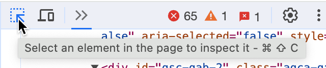
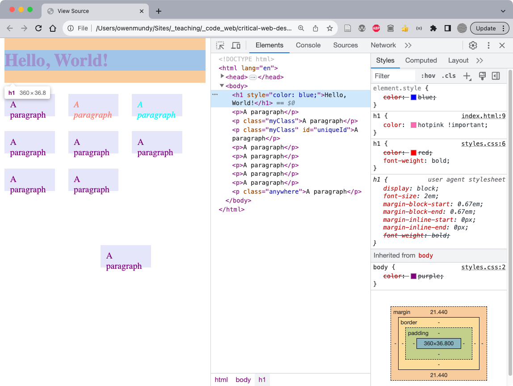
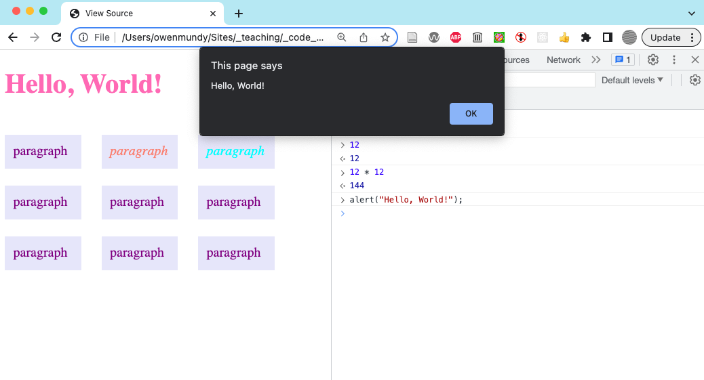
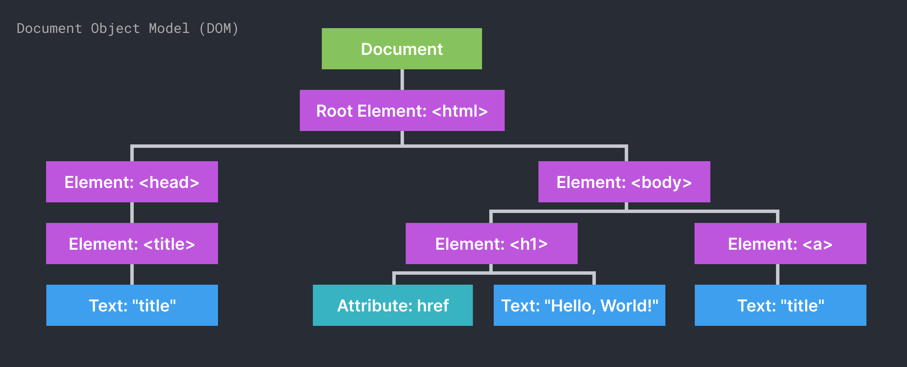
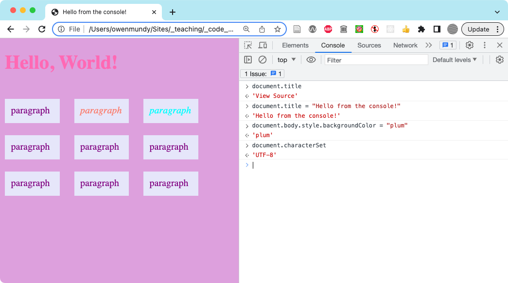
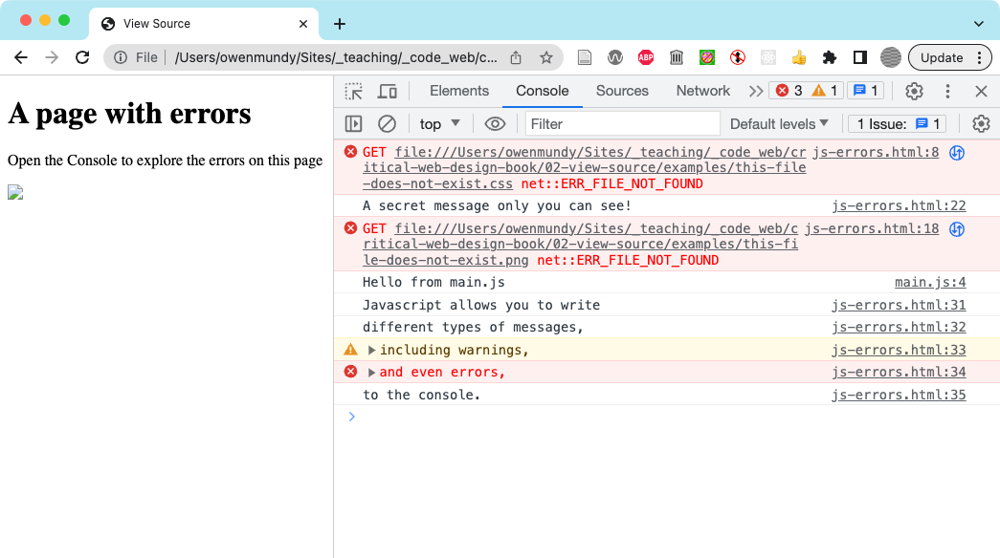
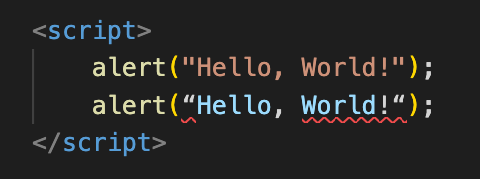
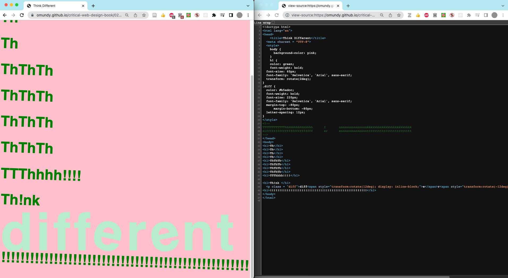
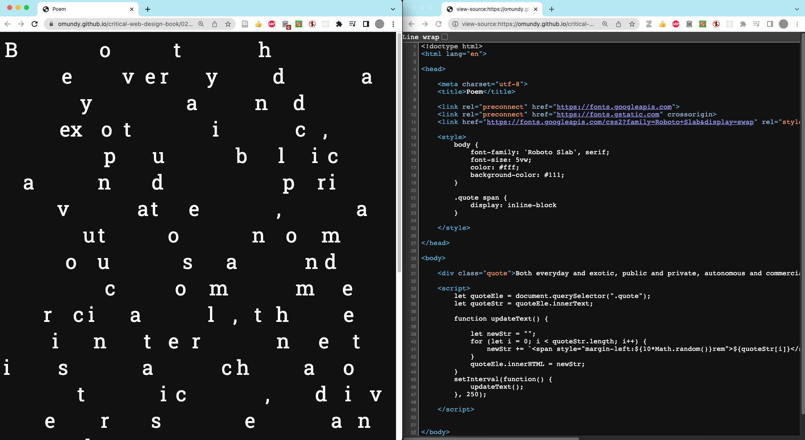

👉 Learn about additive color model used on the web

<figure>

Figure 2.22 Use the Element tool to select and inspect elements on the page.

</figure>

<figure>

Figure 2.23 Using the DevTools, developers can see and manipulate a live version of the page. The element is visualized in the bottom right using the Box Model diagram. 

</figure>

<figure>

Figure 2.24 We tested Javascript directly in the Console in this exercise.

</figure>

<figure>

Figure 2.25 The hierarchical document object visualized.

</figure>

<figure>

Figure 2.25 Use the Console to test Javascript before you save it in your script tag.

</figure>

<figure>

Figure 2.26 The Console can show several types of messages, warnings, and errors to let you know about issues with your page.
 
</figure>

<figure>

Figure 2.28 VS Code and other editors use color to let you know when your code syntax is not correct. The first line in this image uses dumb quotes so the formatter changes the color to indicate it is recognized as a string. The second line uses smart quotes (a.k.a. "curly quotes") so the formatter shows the string does not conform to a single color and adds red underlines to signify the syntax error.

</figure>

> Best Practices: Avoid smart quotes
> You should always design with smart quotes and code in dumb quotes.

<figure>

Figure 2.29 This outcome https://criticalwebdesign.github.io/book/02-view-source/examples/poem-think.html is based on Apple’s “Different” manifesto/campaign. It employs inline and block styles as well as some negative values for margins to emphasize repetition and contrast in scale, value, and form (rotation). 

</figure>

<figure>

Figure 2.30 This outcome https://criticalwebdesign.github.io/book/02-view-source/examples/poem-chaos.html uses Javascript to update the CSS of the page to create an animated rendition of Rachel Greene's description of the possibilities and "chaos" of the WWW from her book, Internet Art. 

</figure>

