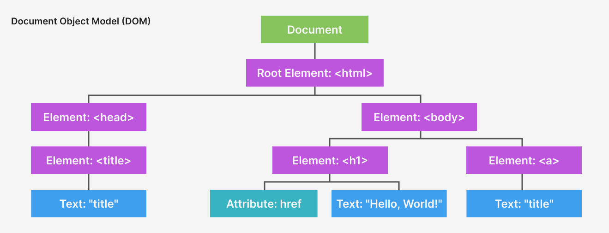

import CustomAside from '@/components/CustomAside.astro';

<CustomAside type="overview">{frontmatter.description}</CustomAside>

## Inspect CSS Rules with DevTools

import YoutubeVideo from '@/components/YoutubeVideo.astro';

<figure>

  <YoutubeVideo src="https://www.youtube.com/watch?v=vk9JEVxFzvs&list=PLAy6P5IoEjy3khbtmo1lJTv_482KKpMe7" />

This video demonstrates how to test JS expressions in the DevTools Console. I opened the Console by pressing Command+Option+J on my Mac. You can also get there from the Google Chrome Browser's View Menu, then Developer, then JavaScript Console.
</figure>

<CustomAside type="excerpt" reference="Exercise 2.2.5">Use DevTools to explore HTML, CSS, and JS in a web page.</CustomAside>

1. Right+click anywhere on a web page and choose "Inspect".
1. Mouse over HTML elements in DevTools to see the corresponding elements on the page.
1. Select one of the elements to see the CSS applied to it and a visualization using the Box Model diagram in the bottom right. 

<figure>

</figure>

4. Use the Element tool to select and inspect elements directly on the page.

<figure>

</figure>

## Run Javascript in the Console

<figure>

We tested Javascript directly in the Console in this exercise.

</figure>

<figure>

The hierarchical document object visualized.

</figure>

<figure>

Use the Console to test Javascript before you save it in your script tag.

</figure>

## Javascript Errors

<figure>

The Console can show several types of messages, warnings, and errors to let you know about issues with your page.
 
</figure>

:::caution[Avoid smart quotes]
You should always design with smart quotes and code in dumb quotes.
:::

<figure>

VS Code and other editors use color to let you know when your code syntax is not correct. The first line in this image uses dumb quotes so the formatter changes the color to indicate it is recognized as a string. The second line uses smart quotes (a.k.a. "curly quotes") so the formatter shows the string does not conform to a single color and adds red underlines to signify the syntax error.

</figure>

## Finished Prompt

<figure>

This outcome https://criticalwebdesign.github.io/book/02-view-source/2-3 is based on Apple’s “Different” manifesto/campaign. It employs inline and block styles as well as some negative values for margins to emphasize repetition and contrast in scale, value, and form (rotation). 

</figure>

<figure>

This outcome https://criticalwebdesign.github.io/book/02-view-source/examples/poem-chaos.html uses Javascript to update the CSS of the page to create an animated rendition of Rachel Greene's description of the possibilities and "chaos" of the WWW from her book, Internet Art. 

</figure>

