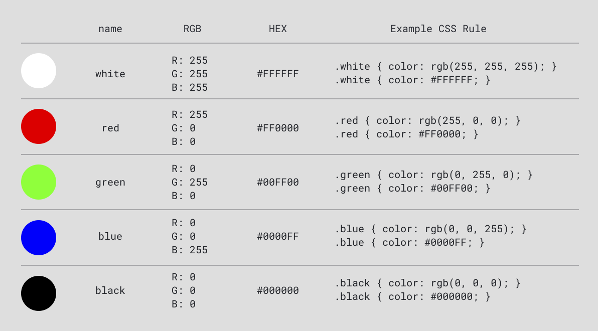

import CustomAside from '@/components/CustomAside.astro';

<CustomAside type="overview">{frontmatter.description}</CustomAside>


## Color on the Web

<CustomAside type="excerpt" reference="Section 3.1.1"></CustomAside>


As you can see in the case study, color is an essential part of a brand identity. Color enabled xtine's project to reference the original while adding additional information to transform it into a form of commentary.

A color model explains how colors interact. The colors you see when you print a document or mix paint come from light reflecting off the pigments. As you add more pigments to a material (like paper or canvas) it becomes darker, even muddy. Thus the four primary pigments in CMYK (Cyan Magenta Yellow Black) printer ink is an example of the **subtractive color** model. 

Alternately, in the **additive color** model used by computer screens and digital cameras, light is mixed together, rather than pigments, to produce the color humans perceive. Additive color is based on 256 possible values for each channel in the RGB (red, green, and blue) color space. Computers store and use binary data so these values range from `0-255`, which can be seen in the below table. 


<figure>


Color values expressed in RGB, Hex, and CSS. Each rule in the CSS column will create the same color in the browser.

</figure>


## Explore Color in Figma

Play with additive color in Figma's color selector.

1. Open Figma and create a shape.
1. With the shape selected, click the color box in the fill option on the right panel.
1. In the panel that opens, change the color system from Hex to RGB to show the red, green, and blue values.
1. Drag the circle in the color picker to the bottom left corner to see RGB values change to the minimum values `0,0,0`. Then drag it to the top left to see maximum values for RGB `255,255,255`. Note that increasing the values in each channel results in colors that appear lighter. For example, when all three are set to the maximum amount of light `255,255,255`, the result is white, while `0,0,0` is black. 
1. Change the color system back to Hex. The hexadecimal number system is another popular way to denote colors in CSS. Each character in the hexadecimal system uses 16 possible values, from `0-9`, followed by alphabetic characters `A-F`. With hexadecimal color, characters 1-2 represent red, 3-4 are green, and 5-6 are blue. Explore the equivilant values for the same colors.
1. Explore the table while you continue to play.


## Alpha Channel

The colors discussed so far are all opaque. To control transparency of your color you can add a fourth alpha channel to the RGB colors. To do this in CSS use either the `rgba()` function (the fourth channel is a value from 0-1) or the HEXA notation which adds a 7th and 8th character to your hexadecimal color values.

```css
.red50pct { color: rgba(255, 0, 0, 0.5); }
.red50pct { color: #ff000080; }
```


## Color Palette Generators

There are many websites where you can see the relationship between these, including color palette generators like [rgbacolorpicker.com](https://rgbacolorpicker.com) and [coolors.co](https://coolors.co/)


