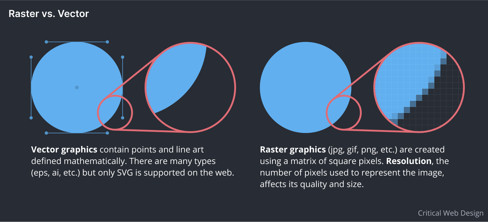
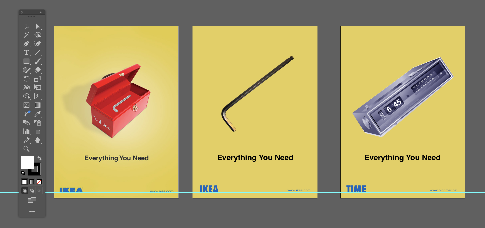
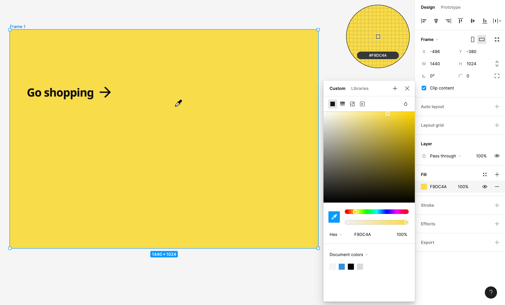
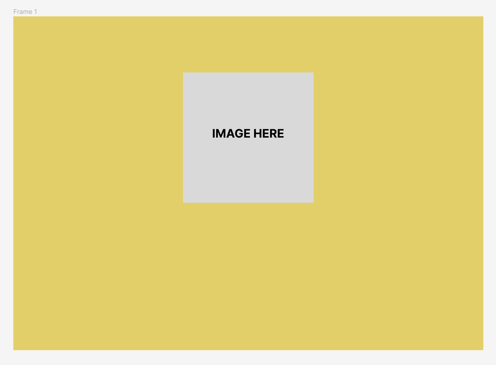
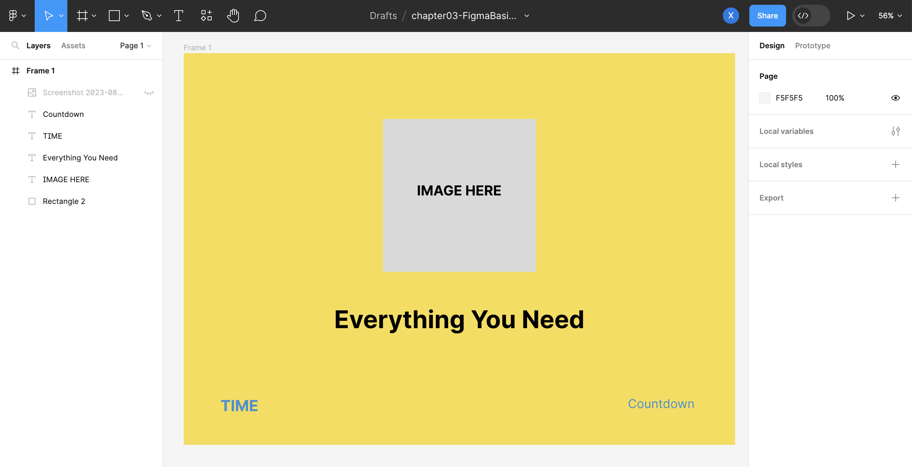
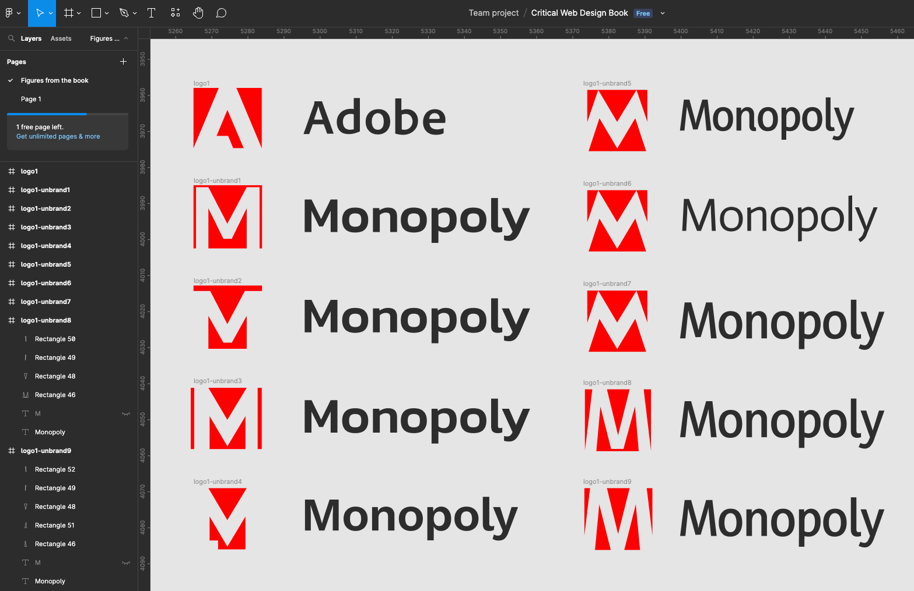
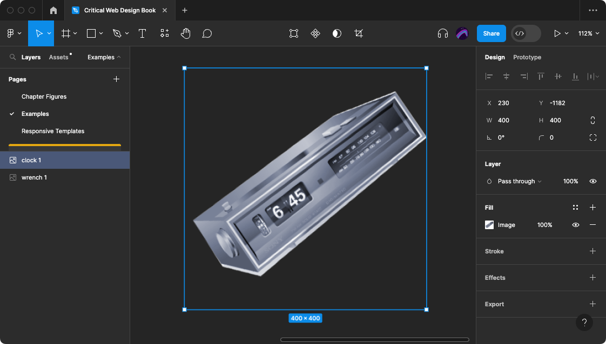
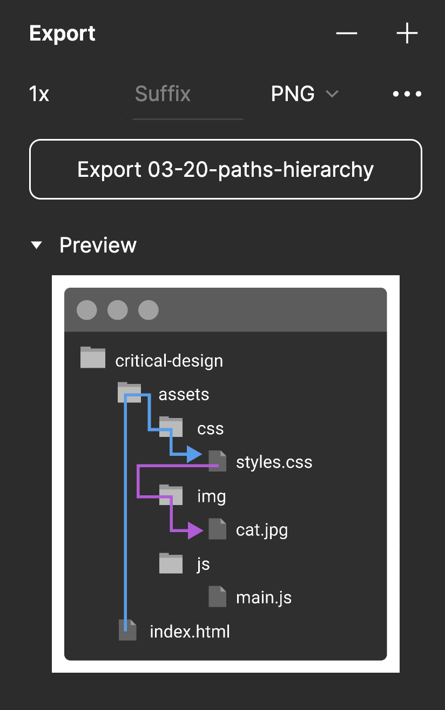

👉 Explore basic concepts in the Figma interface.

## Figma Basics

As software tools like Figma can change often, we encourage you to explore their onboarding tutorials to learn the basics. Below are the essential steps and concepts for beginning a layout design in Figma.

:::note[Author's Note]
Create a free [Figma](https://figma.com) account for this exercise.
:::

1. Open and login to Figma either in a web browser https://figma.com or by downloading and installing their client. 
1. Create a new Figma file. Figma organizes files inside projects, which are further organized under teams. Figma is cloud-based (files are stored on their server), which allows you to collaborate by adding other users to your team. 

<figure>

Vector graphics contain points and line art defined mathematically. Raster graphics are created using a matrix of square pixels. Figma can use and export both vector and raster graphics.

</figure>

3. You will see a blank Canvas. This is the backdrop where you will add frames containing your designs.
4. Explore the options in the File menu at the top left of the window. Select the Frame tool. Create a new Frame by selecting the Desktop (1440x1024) preset (among others for mobile, tablet, and even paper sizes) from the menu on the right. Like Artboards in Photoshop or Illustrator, Frames in Figma organize and define the dimensions for each composition you create.

<figure>

This layout shows a screenshot of an original advertisement (left) with mock-up images showing how the company name and graphics might change when the user interacts with the page. Notice that the typeface for the company does not match the original (we’ll discuss that in the next section), but the background color and overall layout helps convey the similarities between the original and its transformation. 

</figure>

5. We are creating a spoof of an IKEA advertisement in this example, so we will sample colors from their website. Create a screenshot from https://ikea.com and place the image file in your Figma composition by navigating to the Main Menu > File > Place Image. Alternatively, you can copy and paste or drag the image to your Figma canvas. 
6. Set the background color of the frame to match the yellow in the company’s brand. Select the frame and click on the color chip in the Fill area of the right side panel. Use the eyedropper to select the yellow color in the IKEA logo. It is simple to copy the hexadecimal or RGB color values from Figma to your CSS file. 

<figure>

Use the eyedropper to find the CSS, RGB, or Hex values of colors in Figma. 

</figure>

7. Select the Rectangle tool from the Shapes drop down and draw a box to hold space for the image on the page. Our design only includes one image that changes on mouse interaction. For this mock-up we simply need to suggest roughly where that image should appear on the page.

<figure>

The Figma Shapes menu.

</figure>

<figure>

Continue to build a mock-up that loosely shows where elements are placed in the composition. We used the Rectangle tool to draw a placeholder for the image that appears towards the top center of the web page.

</figure>

8. Figma, like other design applications, uses standard key commands for essential operations. Explore the key commands in the menus like undo (`Cmd+Z`), redo (`Cmd+Shift+Z`), copy (`Cmd+C`), and paste (`Cmd+V`) while experimenting as needed. 
9. Notice that you can see the image of your rectangle on the canvas as well as the layer for your new vector shape in the vertical panel on the left side of the screen. As you add more shapes you can organize these layers by dragging them above or below each other in the panel, or select multiple layers by holding the Shift key. Layers can be grouped together by pressing `Cmd+G`.
10. Press the “v” key to switch to the Move tool and click once to select your rectangle. In the Design panel (on the right) you can now see the properties of the object you selected. Experiment with this panel by changing the shape’s color, stroke, and other properties. 
11. Use the Type tool to position type on the page. Pay attention to the weight of the font (Regular, semi-bold, bold, and so on) and color of the typography, but don’t think too much about the typeface yet. For now, select Arial or any sans serif font from the list. You will learn more about typography in the next section of this module. Remember, you are constructing a mock-up and not a final design. 

<figure>

This screenshot of our Figma file shows a rough sketch of the web page we will construct in the next modules. The image is not yet selected or made, nor has the typeface has not yet been selected. However, you can begin to see the colors included in the design, the placement of design elements on the page, and how the eye might move across the compositional space. 

</figure>

<figure>

Owen tried several sans serif font faces before selecting one for his subversion of the Adobe logo.

</figure>

## Export From Figma 

<figure>

Cropping an image in Figma 

</figure>

<figure>

Image export options in Figma.

</figure>

:::tip[Pro Tip]
Scale Figma's UI to make high quality screenshots with `Cmd+Option+Shift+` and `+` or `-`.
:::

