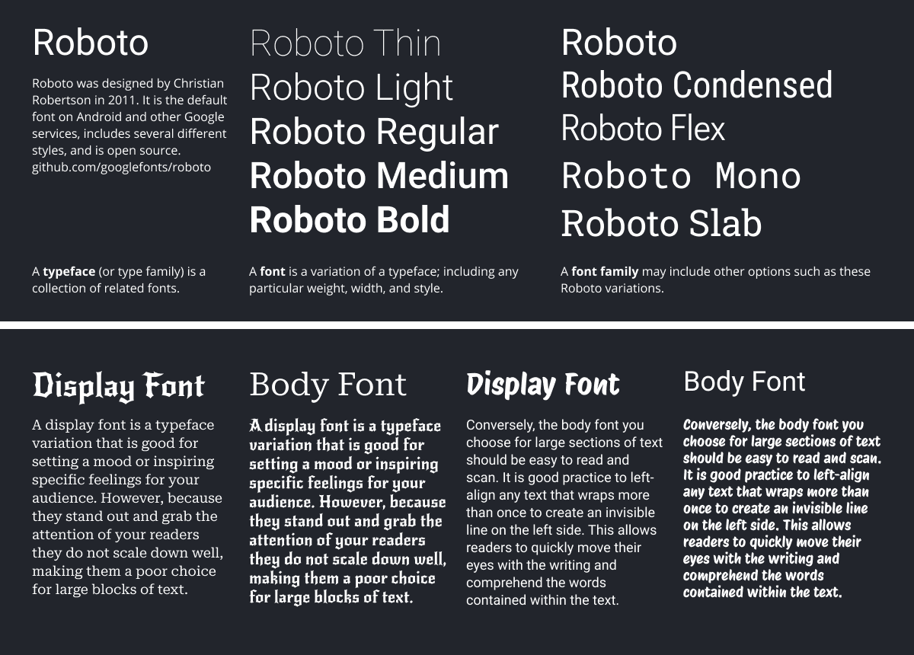
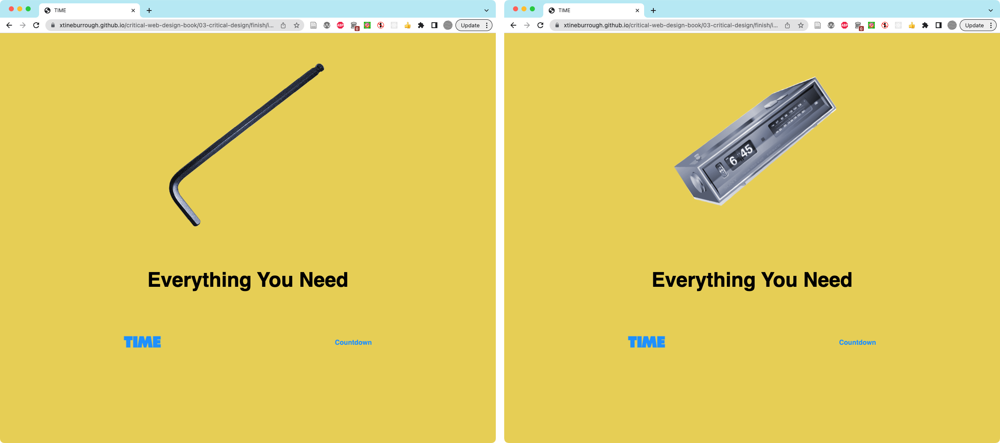
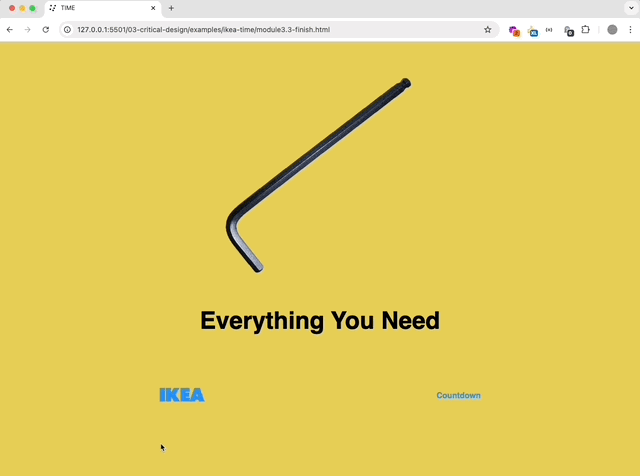
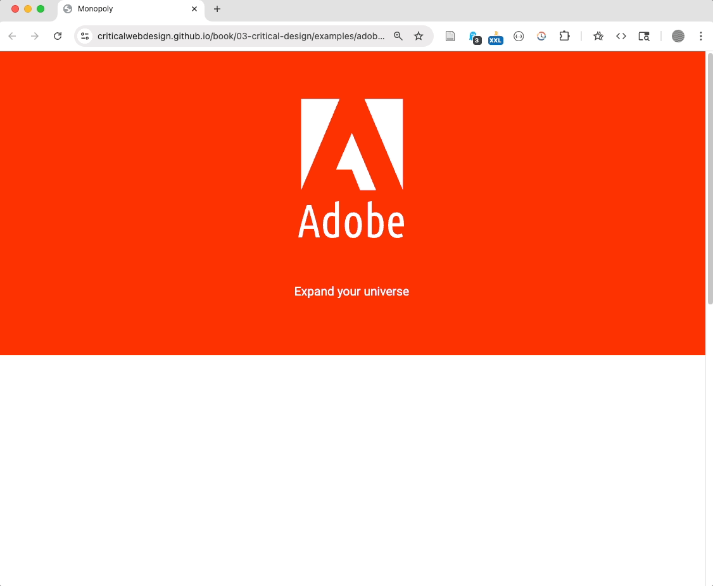

👉 Select a typeface matching the IKEA identity (Chapter 3 prompt) and incorporate it into your design.

## How to Match a Typeface

Use the graphic and steps below to match the Ikea logo typeface (or any) for the chapter 3 prompt.

<figure>

An overview of aspects of a typeface, including the names given to those parts in print (e.g. KERNING) and the CSS property names of their online counterparts (e.g. letter-spacing).

</figure>

1. If your logo includes letters, upload it to [What the Font](https://www.myfonts.com/pages/whatthefont) to discover similar typefaces. You do not have to purchase a typeface. Instead, you can just use the tool to observe the results, leading you to select a free typeface appropriate for your project. 
1. Google Fonts [fonts.google.com](https://fonts.google.com) hosts a series of typefaces made for display on the web. Browse by categories, filter for serif or sans-serif fonts, and preview the font in whatever text you type into the box. 
1. Once you find a matching font, click to see its specimen page. Beneath the preview area, select the font by pressing the Select button (the plus) on the right side of the preview. The Selected family menu appears on the right side of the browser. If it doesn't appear then click on the icon on the top right of the window. You should select several fonts and display them together so you can make a visual comparison as Owen did in his Monopoly project. 
1. Sometimes you can find information about an organization's font using a Web search. Search Google for "IKEA logo font". Often organizations will start with a particular font and modify it to make it hard to copy or better match their identity. Identities also evolve, as you will find with IKEA. The font we chose (and you will download and use in Exercise 3.3.1) was Futura Press. You will also find IKEA Logo Font on dafont.com, which would be viable.  

<figure>

At top, a typeface (also called a type family) is a collection of related fonts, while a font is any variation in weight, width, or style of the characters in the typeface. Below, Which paragraph is easier to read? Which heading grabs your attention? These examples illustrate proper and improper use of display and body fonts. For more explore the typeface categories at fonts.google.com

</figure>

<figure>

This [outcome](https://criticalwebdesign.github.io/book/03-critical-design/3-3) uses the CSS `:hover` pseudoclass to swap the image of the allen wrench with a graphic of an alarm clock. The TIME wordmark is an unbrand of the IKEA logo. 

</figure>

<!--  -->

<figure>

This outcome https://criticalwebdesign.github.io/book/03-critical-design/examples/adobe-monopoly/ uses Javascript to replace the Adobe logo with an unbranded version. The long list below details all the companies they have purchased since 1990 (thankfully, not [Figma](https://www.theverge.com/2023/12/18/24005996/adobe-figma-acquisition-abandoned-termination-fee)).

</figure>