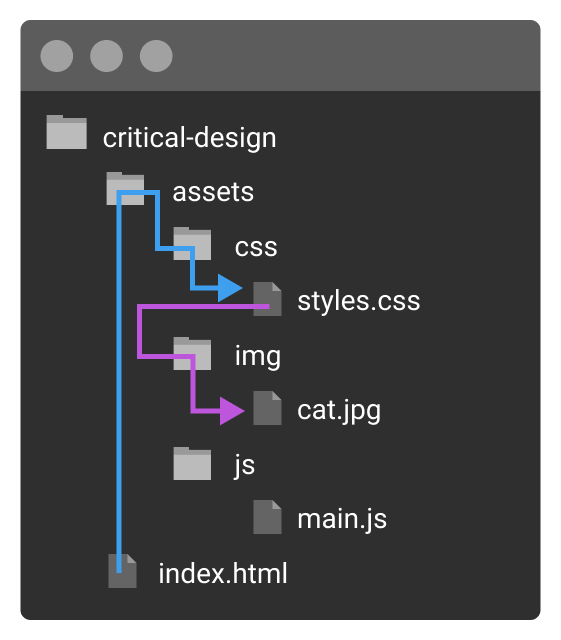

import CustomAside from '@/components/CustomAside.astro';

<CustomAside type="overview">{frontmatter.description}</CustomAside>


## File Paths

<figure>


This graphic shows two relative paths. The light blue line indicates the path that index.html would use to reference styles.css and the purple line shows the path to get from styles.css to cat.jpg.

</figure>


## Add An External Stylesheet

<CustomAside type="excerpt" reference="Exercise 3.2.4"></CustomAside>


Follow the steps to add a CSS file, saving and refreshing your work in the browser each time.

1. In your editor, right click on the left panel under the `view-source/` folder, and select New file... from the context menu. A box will appear to name the file. If you type a path with forward slashes in this box before the filename (and the folder doesn't exist) the editor will automatically create the hierarchy with those folder names. Type the following and press return to make a new folder named `assets`, which contains a new folder named `css`, which contains a new file named `styles.css`. You could do this using several individual steps, but this is faster. 

```css
assets/css/styles.css
```

2. Open the new CSS file, type the following rules, and save it. Like HTML, you can use whitespace as you like in CSS to make contents readable.

```css
body { color: purple; }
h1 {
	color: red;
	font-weight: bold;
}
```

3. Now that you have an external stylesheet, you'll need to link to it from HTML before your styles will be applied. Until you complete this step, you simply have two files that are unaware of one another. Add the link tag in the index.html file, after the `<title>` element, but before the closing `</head>` of the document. If you’re writing in VS Code, the tag is:

```html
<link rel="stylesheet" href="assets/css/styles.css">
```

4. The link tag tells the browser to also fetch this other document when it loads the page. The rel attribute defines the relationship between the HTML and CSS files and the href attribute is the path to the CSS file. Add the following paragraph tags to help test the CSS:

```html
<p>A paragraph</p>
<p>A paragraph</p>
<p>A paragraph</p>
```

5. Save and view your work in the browser. If you followed the instructions, all your paths are correct, and your documents are saved, you should see a red h1 and purple paragraphs. 


## Import a Javascript file into HTML

Link to direct an external Javascript file to the HTML document.

1. Create a new file called **main.js** inside `assets/js`
2. Add this code to main.js to log a message to the console. Save the file. 

```js
console.log("Hello from main.js");
```

3. Before you can see this message in your web page you need to embed the Javascript file in the HTML document using the `<script>` element. VS Code users should open critical-design/index.html and add the following element just before the closing `</body>` tag, so the code executes after the document has loaded. 

```html
<script src="assets/js/main.js"></script>
```

4. Save index.html and preview your work in Chrome. Open the DevTools Console (be sure to navigate to the Console) to confirm the message appears.


