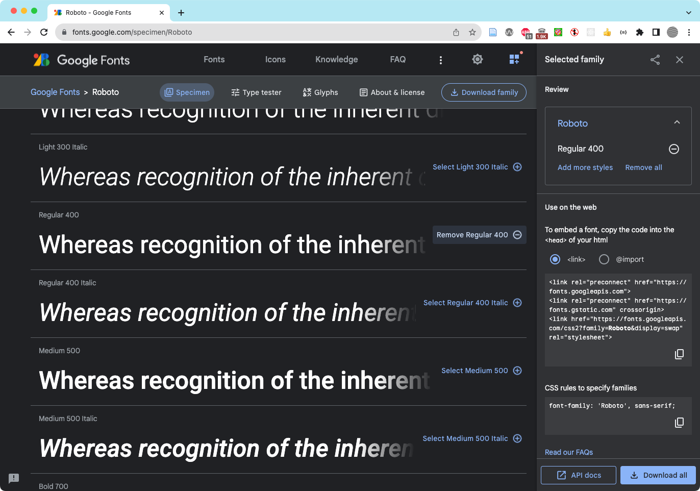

import CustomAside from '@/components/CustomAside.astro';

<CustomAside type="overview">{frontmatter.description}</CustomAside>


## Using Custom Fonts on the Web

Computers display text by matching each character’s unique codepoint (see Unicode discussion in Chapter 2) to its corresponding glyph, or visual representation of a character, in a given font file. For example, `U+0041` is the codepoint for the Latin capital “A”. To display this character on the screen in a specific font each users’ computer needs to access the typeface file containing the glyphs for all the codepoints. If the font is not accessible the text will be displayed in some other (potentially undesirable) default font. It is also possible that a codepoint may not exist in a font because it does not contain characters for a given human language. In this case the character itself will be substituted with a default character.

Nowadays, designers have access to many more typeface options using the CSS @font-face rule that makes it possible to link to a custom font just as you would an image or any other page resource. There are many font MIME types that can be used with @font-face like TrueType (TTF) and OpenType (OTF), but the Web Open Font Format (WOFF) and WOFF2 (the next generation) formats offer the best compression and support across browsers. See the wiki for instructions to use the @font-face rule.  


## Use @font-face to Add Custom Fonts

In this exercise you will use `@font-face` to style text on your page using a custom typeface. The font that we are using is called Futura Press, which we found online with a search for “font used in IKEA logo.” In your own work, you might use a Google Web Font or another custom font that you will download and possibly convert to WOFF format. 

1. Open `index.html` in Chrome and use DevTools to inspect the text on the page. 
2. Find the CSS rule for the body element and examine the font-family declaration. Notice it sets the font to Helvetica, then “falls back” to Arial, and finally defaults to any sans-serif font. Helvetica requires a fee to license so you likely do not have it installed on your system (the sidebar explains how to see installed fonts), so you are actually viewing Arial (which looks very similar). 
3. To add a CSS rule to change the font for the word “TIME” to the Futura Press typeface identified above you will need to add the font file to your project and link it from the CSS file. Download [this TTF (TrueType font)](https://www.wfonts.com/font/futura-press) file and add this file as an asset. If you’re using VS Code, place it next to your CSS file in: `critical-design/assets/css/` 
4. To ensure the font can be viewed on every device it is best to add a WOFF or WOFF2 format. You can convert it using one of many [online tools](https://cloudconvert.com/ttf-to-woff) and save the converted file next to the TTF file.
5. Add the following @font-face rule to your stylesheet right before the `h2` rule. Adjust the filename as needed. Browsers will choose the first supported font from the prioritized list in the src declaration. 

```css
@font-face {
    font-family: "Futura Press";
    src: url(FUTURAPR.woff) format("woff"),
        url(FUTURAPR.ttf)  format("truetype");
}
```

6. Now that the font is referenced and available, update the h2 CSS rule to use it. Notice we also list Helvetica, Arial, and sans-serif as fall-back fonts.

```css
h2 {
    font-family: "Futura Press", Helvetica, Arial, sans-serif;
}
```

7. You may need to use a “hard refresh” before you see the font change (see the Best Practices sidebar).


<figure>


Select and use custom typefaces in your design with Google Fonts.

</figure>


