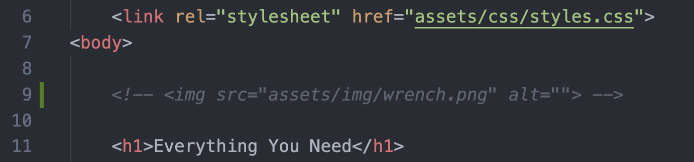
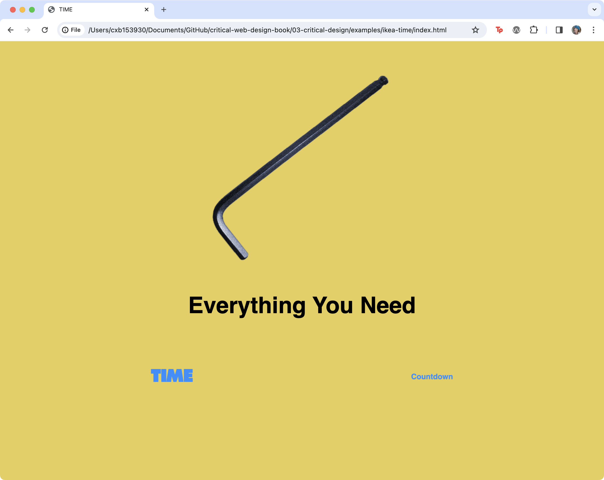

<div class="callout-intro">
👉 Import a Javascript file into HTML and create a mouseover event listener
</div>


<!-- <figure>


We commented-out the image source tag that we implemented in the previous exercise. Using comments like this is a common practice and lets you save code snippets to reference later but disables them in the browser.

</figure> -->


## Import a Javascript file into HTML

Link to direct an external Javascript file to the HTML document.

1. Create a new file called **main.js** inside `assets/js`
2. Add this code to main.js to log a message to the console. Save the file. 

```js
console.log("Hello from main.js");
```

3. Before you can see this message in your web page you need to embed the Javascript file in the HTML document using the <script> element. VS Code users should open critical-design/index.html and add the following element just before the closing </body> tag, so the code executes after the document has loaded. 

```html
<script src="assets/js/main.js"></script>
```

4. Save index.html and preview your work in Chrome. Open the DevTools Console (be sure to navigate to the Console) to confirm the message appears.


## Javascript Variables


<figure>


This code creates a new variable called greeting, and assigns a string of text as the value. 

</figure>


## Store a Reference to an Element in a Variable

```js
let targetElement = document.querySelector("h2");
```


<figure>


DevTools will highlight a target element that you log to the console if you hover over the line. This can be handy for debugging when you need to confirm that a selector is working.

</figure>


## Javascript Event Listeners

An event can be initiated by a user (e.g. click, keypress, mouseover, mouseout, scroll, etc.) or something happening on the web page (like when it finishes loading or catches an error). An event listener “listens” for the event to happen, then calls an event handler which runs code in response to the event. Much of the time “listener” and “handler” are interchangeable, since they need to work together to respond to events.


<figure>


</figure>


```js
let targetElement = document.querySelector("h2");

targetElement.addEventListener("mouseover", function(){
	console.log("Hello!");
	}
);
```

<!--  -->

The above code shows how to add a click event listener in Javascript. 
- Line 1 creates a new variable to store a reference to the target element. 
- Line 3 attaches an event listener to the target element, designating "mouseover" as the name of the event to listen for. 
- Line 4 is the event handler function that wraps code to run when the event occurs. 


:::note[Author's Note]
Sometimes the format may be different, since Javascript doesn’t care about whitespace as long as the syntax is correct.
:::


<figure>


Variation with mouseout

</figure>


<figure>


Variation with mouseover

</figure>


<figure>


This screenshot shows the results of Exercise 3.2.3 in the web browser.

</figure>