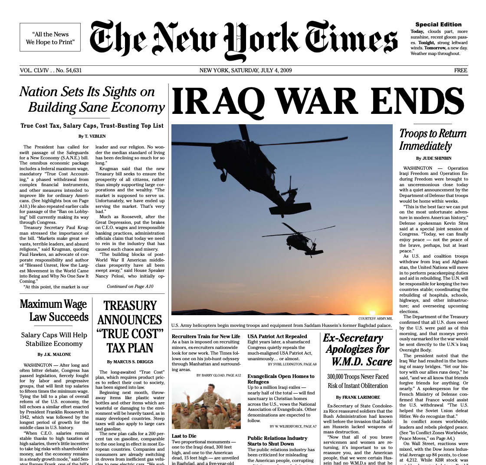
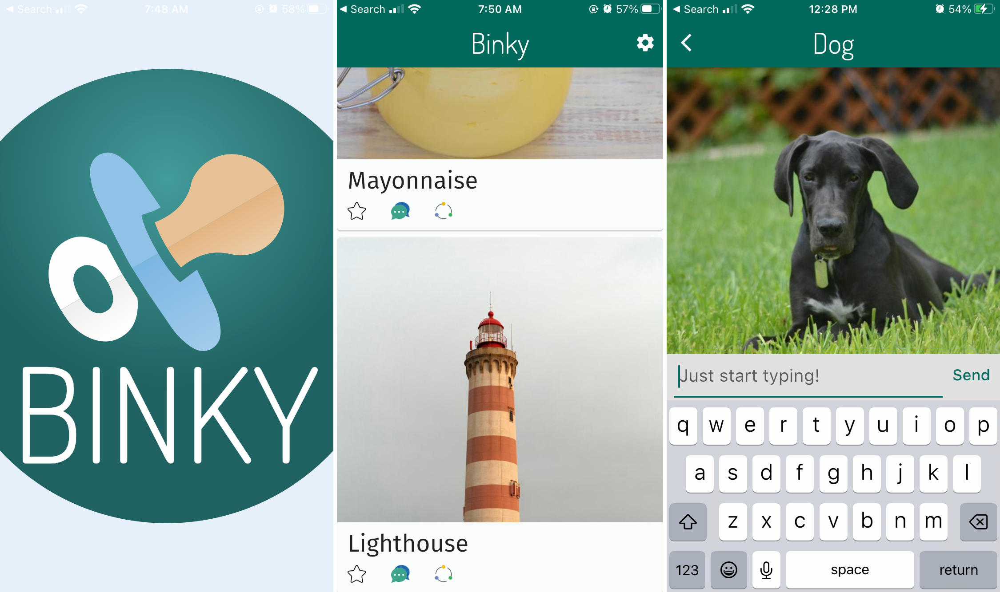
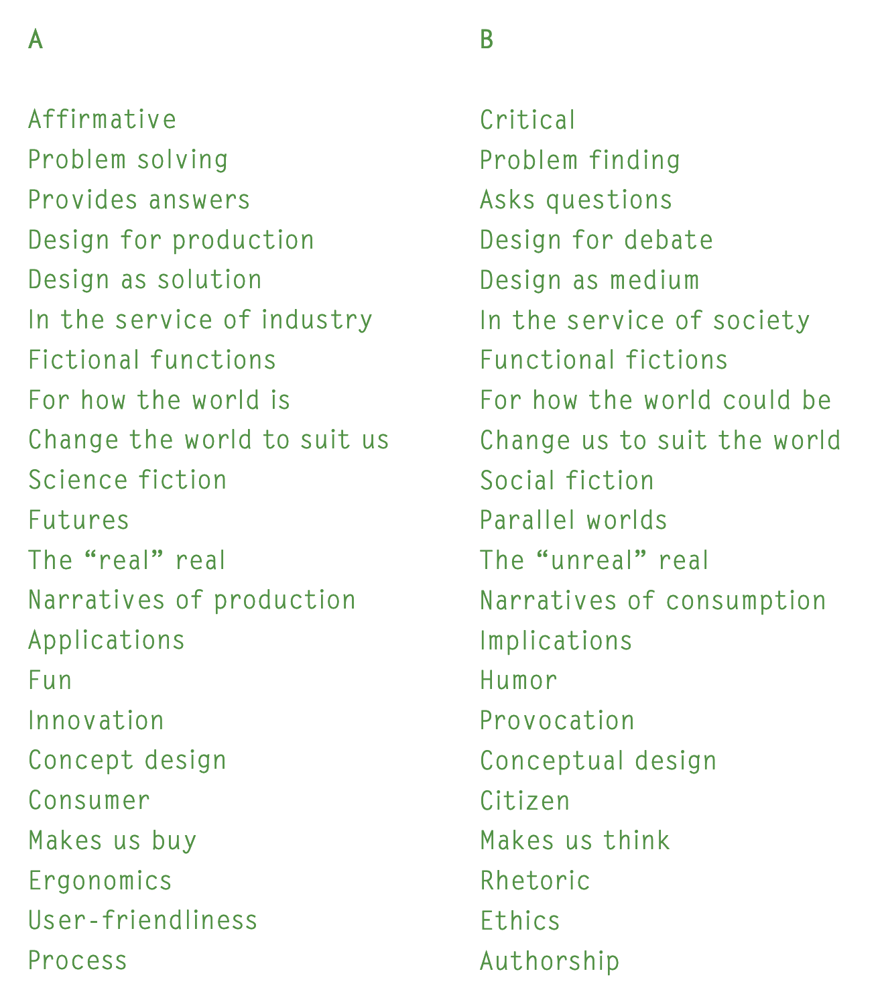
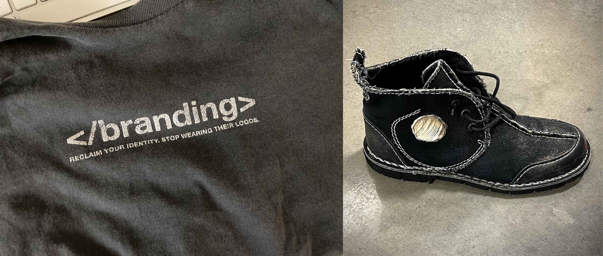
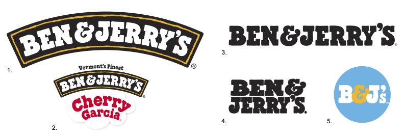
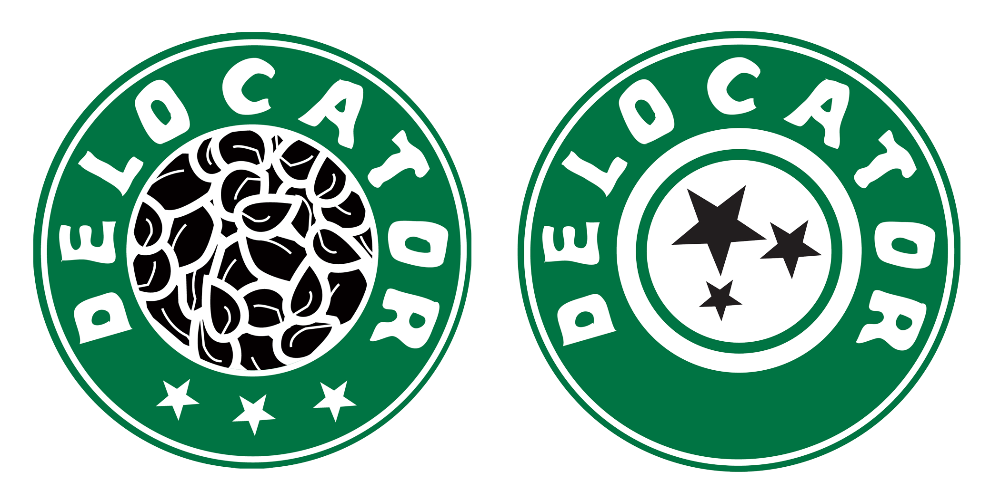

import CustomAside from '@/components/CustomAside.astro';

<CustomAside type="overview">{frontmatter.description}</CustomAside>

## Culture Jamming

<figure>

The Adbusters Corporate American Flag transforms the stars and stripes into a symbol of patriotism for a field of corporations. In money we trust. Search online to see many variations and updates to the corporate logos over the years.

</figure>

<figure>

This spoof cigarette ad from Adbusters Magazine reinterprets the Marlboro Man as a wistful cowboy who shares nostalgia and regretful longing for his healthy lung.  

</figure>

## Adversarial Design

<figure>

The Yes Men, Steve Lambert, Les Liens Invisibles, along with 30 writers, 50 advisors, approximately 1000 volunteer distributors, CODEPINK, May First/People Link, Evil Twin, Improv Everywhere and Not An Alternative produced and/or distributed the <a href="../../../assets/images/03/03-03-NYTimes-SE.pdf">New York Times Special Edition</a> (2008). <a href="https://news.artnet.com/art-world/yes-men-new-york-time-special-edition-brooklyn-museum-490466">Ref</a>

</figure>

## Critical Web Design

<figure>

Binky by Dan Kurtz is a real, fake mobile app that lets users, like other social media apps, scroll, like, and comment on posts. Like an infant’s binky (or pacifier), it satisfies the need to use social media, except it doesn't allow users to upload or save files, and it will not monetize your data. See https://www.binky.rocks/

</figure>

<figure>

Dunne & Raby’s [A/B](https://dunneandraby.co.uk/content/projects/476/0), 2009 and ongoing.  

</figure>

import YoutubeVideo from '@/components/YoutubeVideo.astro';

<figure>

  <YoutubeVideo src="https://www.youtube.com/watch?v=atn22-bmTPU" />

Paula Scher’s 2008 talk, [“Great Design is Serious, Not Solemn”](https://www.ted.com/talks/paula_scher_great_design_is_serious_not_solemn) TED Talk, 2008,  

</figure>

<figure>

Examples of un-branding from Adbusters include Owen’s t-shirt (left) and one of xtine’s Blackspot Unswoosher shoes (right).

</figure>

<figure>

Ben & Jerry's uses several graphics to express their identity including 1) the simple “Arch” logo; 2) the U.S. “Arch” logo with “flavor cloud;” 3) a wordmark, “for when the ‘Arch’ cannot be used;” 4) a stacked wordmark; and 5) an icon to represent their brand on social media.

</figure>

## Case Study

<figure>

[Delocator.net](https://web.archive.org/web/20050408030457/http://delocator.net/) logo variations (2005, 2009) include the distressed type reference to Starbucks, and in later versions stars to emphasize wayfinding. 

</figure>

