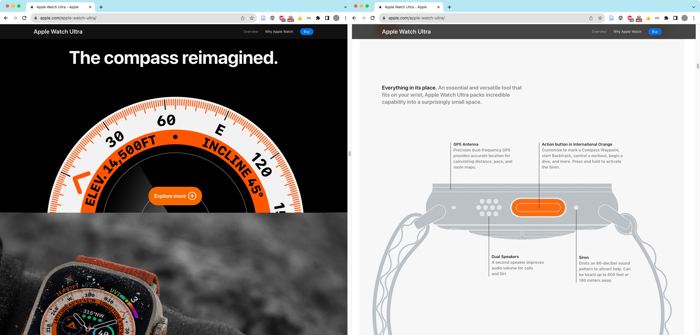
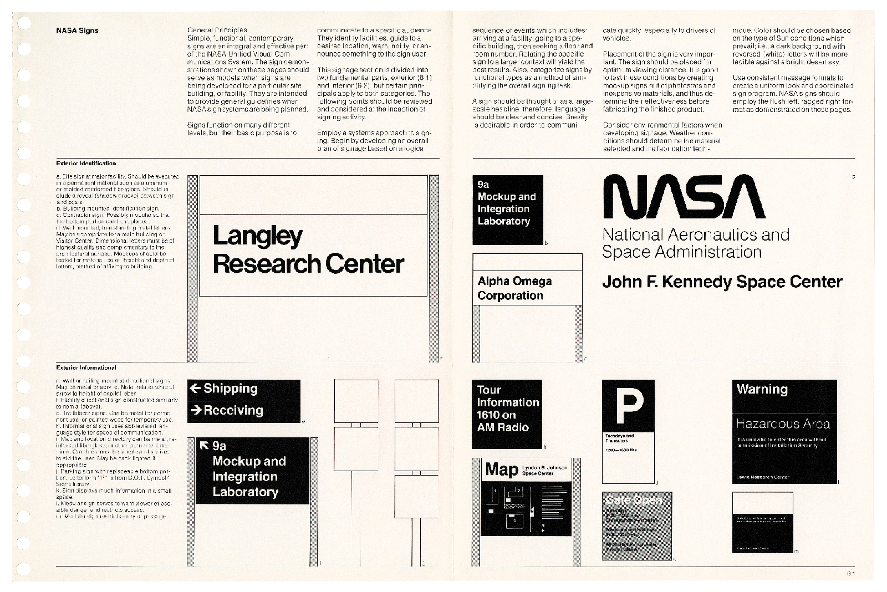
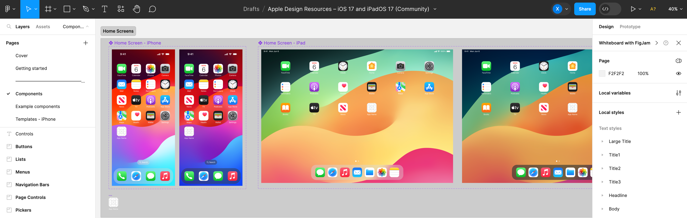
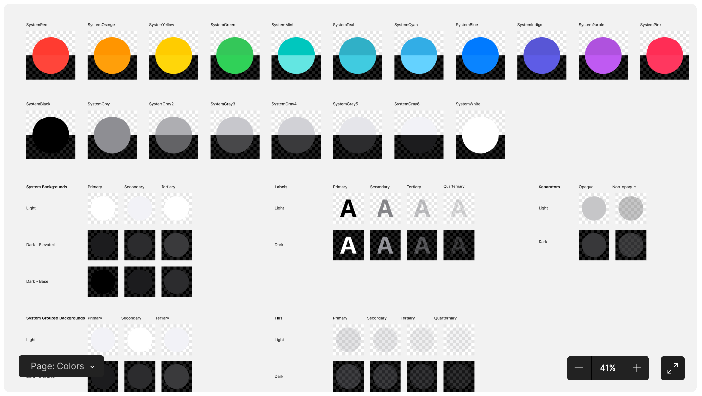
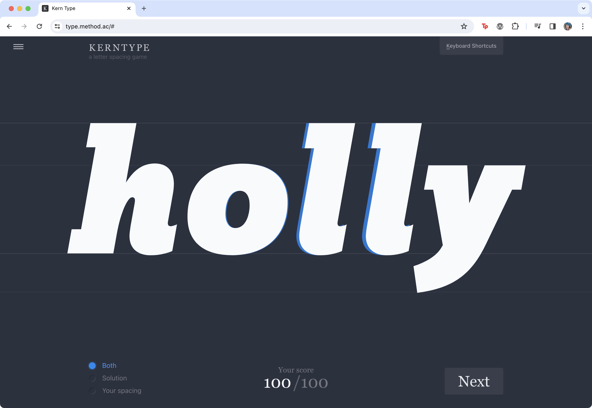

import CustomAside from '@/components/CustomAside.astro';

<CustomAside type="overview">{frontmatter.description}</CustomAside>

## Explore Good Design

<CustomAside type="excerpt" reference="Context 4.0"></CustomAside>

A [Think-Pair-Share](https://mtei.engineering.cornell.edu/teaching-resources/active-learning/think-pair-share/) exploring responses to design.

1. Think of a company or organization that you associate with “good design” and describe waht makes them exemplary.
2. Explore the website of the organization, consider the objects, software, or other things they create. Use the Thinking Aloud method (see chapter 4) to evaluate your response to the design.
3. List additional reasons why you have selected this organization. What about their website, products, or other aspects of their brand or identity (see chapter 3) are examples of good design?

:::note[Author's Note]
Here we share notes from our own response to the above questions, using the “Thinking Aloud” method (see the book) to assess apple.com: 

> [on the Apple home page] *“Apple spends billions of dollars on marketing each year, and it is evident in their product photography. All of these images are beautiful, especially the product close-ups and details.”*
> 
> [clicks the Apple Watch Ultra page] *“Isn't it interesting how the color chosen for the text that describes the watch features on the web page  matches the color on the actual watch crown and band? All the typefaces and type treatments on the page are equally consistent. Body text about the product is always left-aligned, making it easy to scan.”*
>
> [scrolls through the Watch Ultra page] *“There is that orange color again—on a watch band, a call to action (CTA) button (see sidebar), and even on icons above text blocks— creating focal points that guide our eyes around the page. So many things are uniform, even the animations on this page move at the same speed!”*

:::

<figure>

The Apple Watch Ultra home page

</figure>

## Style Guides and Design Systems

If there is one solid principle you can take from Apple's brand, products, webpage, everything, it is this: ***Consistency is central to good design.***

1. In the 220 page [NASA Graphics Standards Manual](https://standardsmanual.com/products/nasa-graphics-standards-manual) (1976), Richard Danne and Bruce Blackburn show how the NASA logo, U.S. flag, and classic Helvetica typeface should be used on vans, confidential documents, and even the space shuttle.

<figure>

The NASA Graphics Standards Manual (1976) shows how to produce consistent designs across everything that represents this iconic organization. ©Danne & Blackburn / NASA, Standards Manual.

</figure>

2. The [Apple Human Interface Guidelines](https://developer.apple.com/design/human-interface-guidelines/charts) explains best practices across all their content. For example on the Charts page inside Content, they remind readers to "Establish a consistent visual hierarchy [to] help communicate the relative importance of various chart elements.

<figure>

</figure>

<figure>

Two examples from a [Figma design templates](https://www.figma.com/community/file/1248375255495415511) published in the [Apple Design Resources for iOS 17 and iPadOS 17](https://developer.apple.com/design/resources/) to help designers and developers ensure consistency with all Apple interfaces.

</figure>

 

3. Continue exploring the above examples and find one more contemporary or past example using a search engine. Make notes about the system, including things that might not be evident at first glance.
	- [Porsche Design System](https://designsystem.porsche.com/v3/)
	- [Apple Human Interface Guidelines](https://developer.apple.com/design/)	
	- [Firefox](https://acorn.firefox.com/)
	- [Google Material Design System](https://m3.material.io/)
	- [Uber](https://brand.uber.com/)
	- [Design Systems and How to Learn (and Steal) From Them](https://designerup.co/blog/10-best-design-systems-and-how-to-learn-and-steal-from-them/)

## Practicing Consistency

<figure>

Kern Type challenges players to adjust the kerning between letters so that the negative space between them is consistent. See https://type.method.ac 

</figure>

