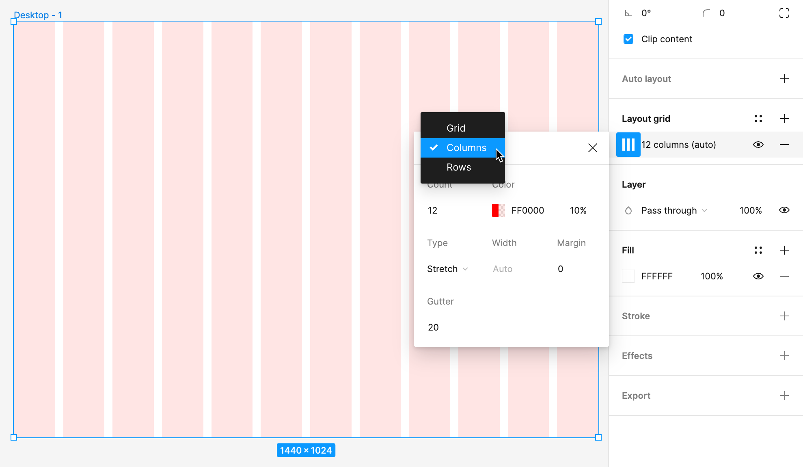
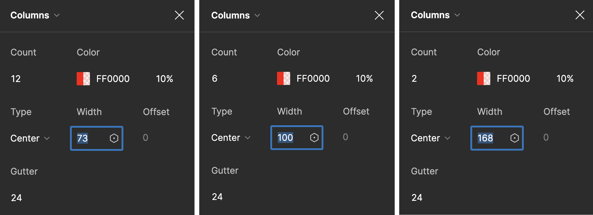
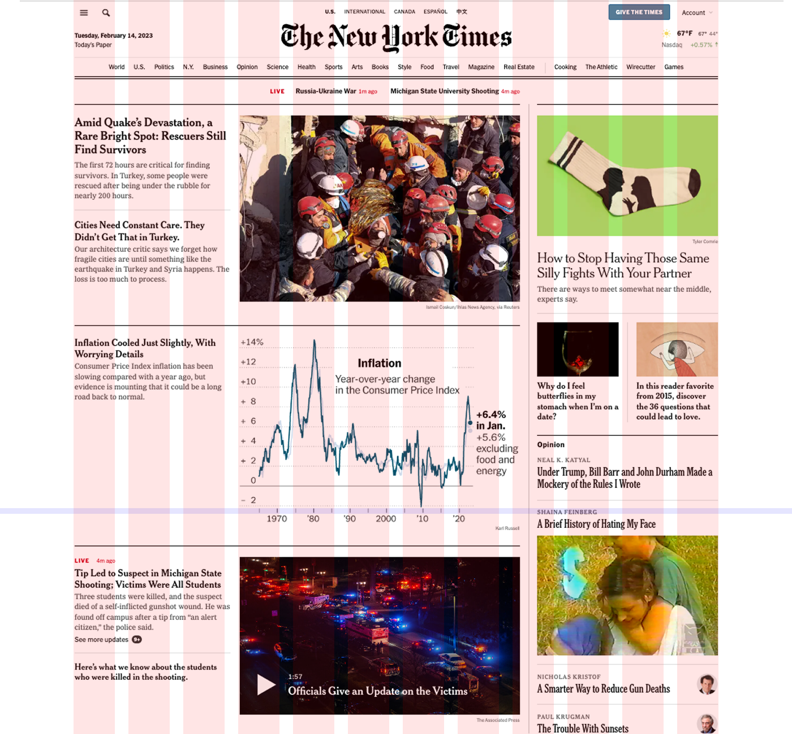
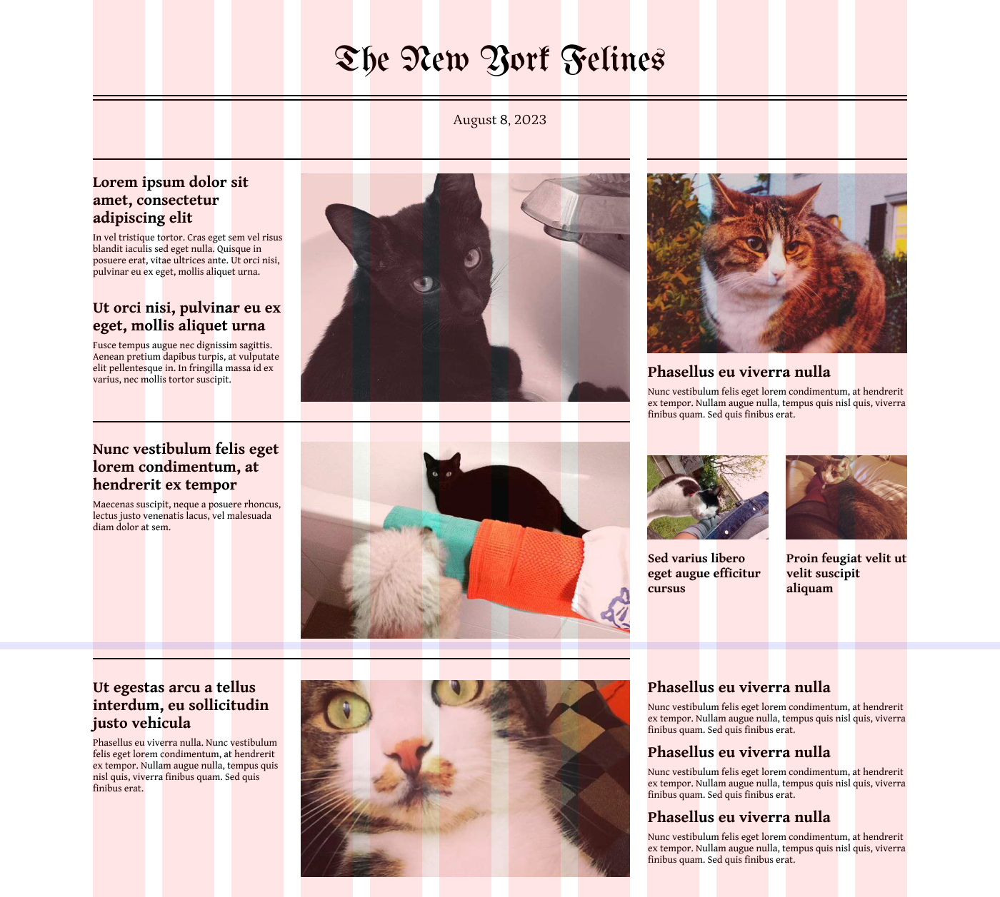
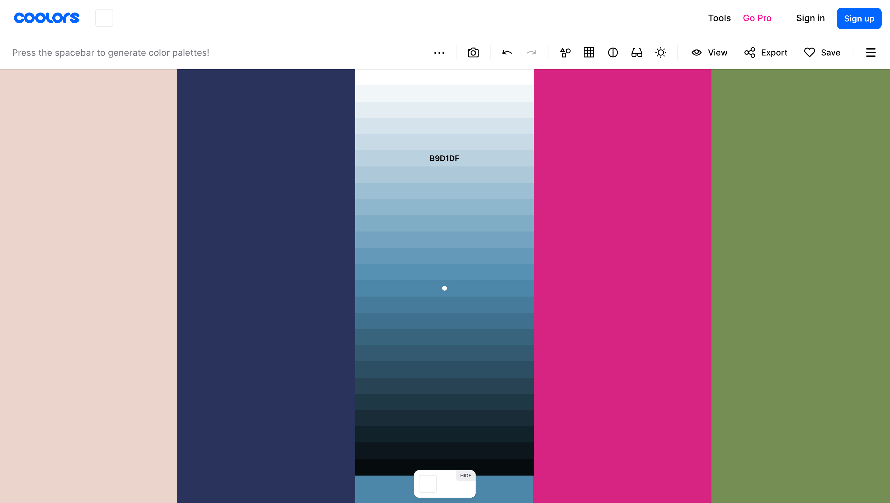
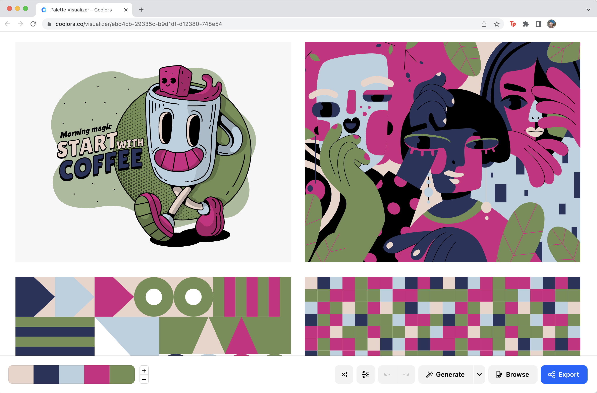
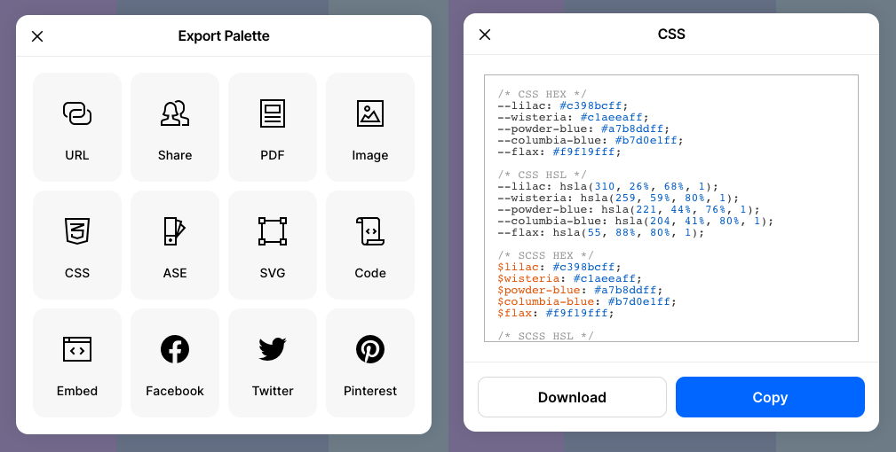

👉 Use Figma layout grids to create a multi-column page design.

## Set Up Layout Grids in Figma

:::tip[Use Our Figma Template]
Our [Figma file](https://www.figma.com/community/file/1501679035518799477) already contains these layout grid settings. Simply copy/paste any (desktop, tablet, mobile) frame from ours into your own whenever you start a new design. Make sure grids are enabled using `shift+G`. Or, you can create them from scratch following this exercise.
:::

1. In a new design file in Figma, select the Frame tool (it looks like a #) and choose Desktop from the panel on the right. This will create a new frame the size of a desktop display (1440 x 1024 pixels). 
2. Select the new frame and name it "Desktop".
3. In the panel on the right, click the plus sign (+) next to “Layout grid” to add a new grid. This will add a 10px grid.
4. Change the grid to columns by clicking the Layout grid settings icon to expand the options for the grid. Click on the pull-down menu set to “Grid” and change it to “Columns” then modify the grid so that it appears as 12 columns. Change the width of the grid to `73px` and the gutters (the spaces between the columns) to `24px`. This matches the 12 columns in the Bootstrap CSS framework and will make it easy to later transfer your design to the coded version. 

<figure>

Change the layout grid to a 12-column grid in Figrma using the layout grid settings. 

</figure>

5. Perform the previous steps in new frames for tablet and mobile sizes using the information in the graphic below.

<figure>

The grid column settings for the Desktop (12), Tablet (6), and Phone (2 columns) that will match the Bootstrap grid system code used later in the chapter.

</figure>

## Create a Grid-based Layout in Figma

1. Make a screenshot (see Common Key Commands table in the book Introduction) of *The New York Times* home page and place it into your Figma file. 

:::note
Scale images in Figma without stretching them by holding the Shift key to constrain the image’s proportions. 
:::

2. Move the image into the desktop frame and center it across the 12 columns, with the left text box aligned along the edge of the first column. 

<figure>

The New York Times home page screenshot scaled so the width matches the 12-column grid in Figma.

</figure>

3. Using the screenshot as a reference, begin laying out the wireframe of the page using the Rectangle (creating placeholders for images) and Text (using Lorem Ipsum for text) tools. The goal is to preserve the spirit of the design without trying to replicate their precise grid structure. The home page design of a news website changes often, and it is also possible they are not using a 12-column grid as their base structure. This is a work of interpretation.
4. When the desktop wireframe is complete, create a new frame based on the tablet grid and develop a wireframe for the tablet breakpoint. Start with either a twelve- or six-column grid. Then repeat for a mobile breakpoint. The grid you make for mobile can be four- or two-columns. You should have three wireframes when you are finished for the desktop, tablet, and mobile experience.

<figure>

Use the Text tool and replace images with a genre of your choice. Recreate the masthead with a Blackletter font such as UnifrakturMaguntia.

</figure>

5. Once your wireframes are complete, add images and [placeholder text](/wiki/resources/resources/#placeholder-text) in place of the boxes. Then add expressive typography, and color to give your layout an identity!

## Incorporate Color

<figure>

For this color palette generated on https://coolors.co we chose a much lighter shade of the blue that was automatically generated to counterbalance the deep blue, bright pink, and vibrant green in the palette. Consider having two light and/or neutral shades in your palette so you can make contrast between your dark and light values in your design. 

</figure>

<figure>

See your color palette in action! The Visualize Colors button leads you to a new web page that applies your color palette to vector art, type, and information design. 

</figure>

<figure>

[Coolors.co](https://coolors.co/) export options and CSS formats.

</figure>