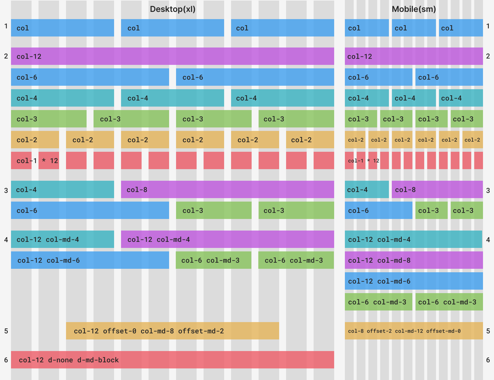
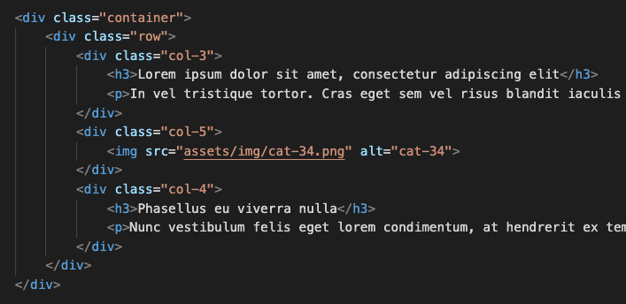
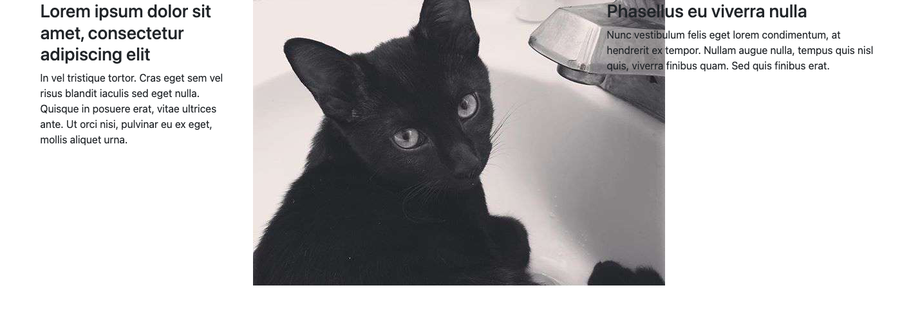
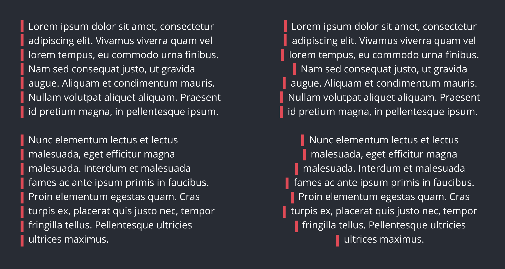
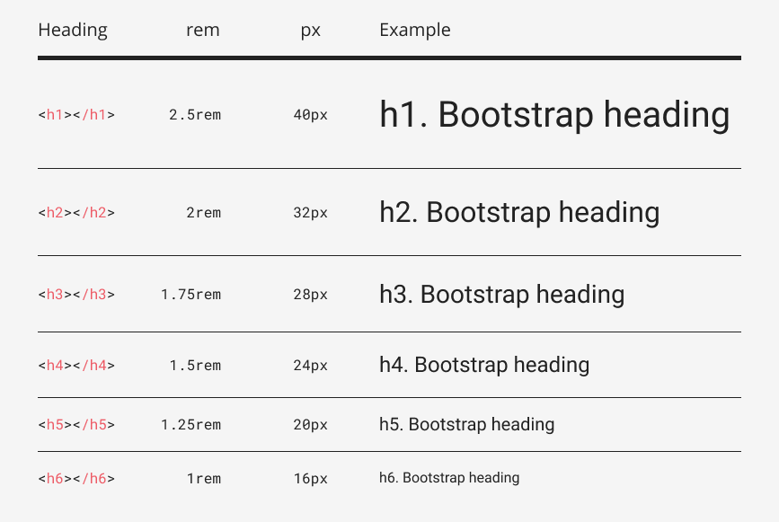
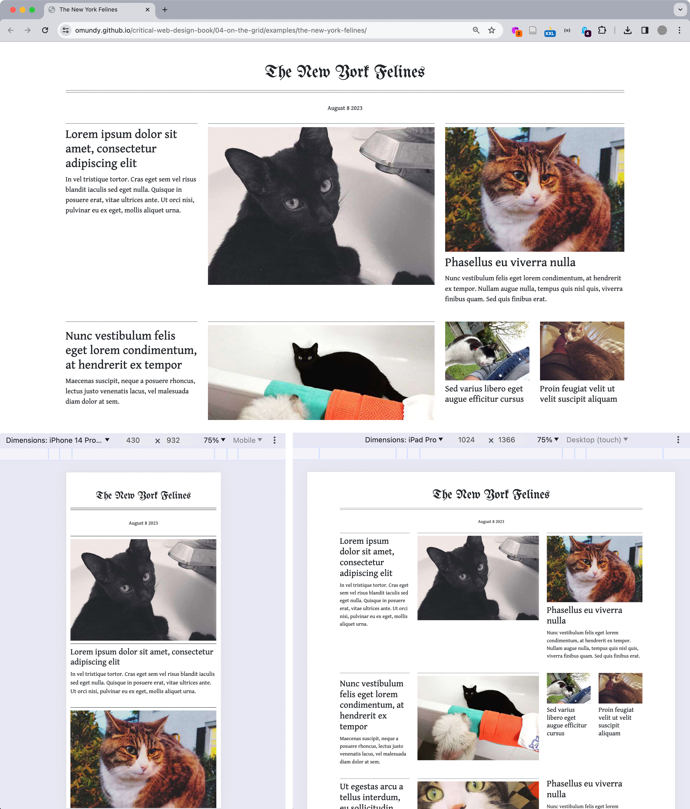

import CustomAside from '@/components/CustomAside.astro';

<CustomAside type="overview">{frontmatter.description}</CustomAside>


## Intro to Bootstrap

<CustomAside type="excerpt" reference="Exercise 4.2.1"></CustomAside>

A quick guide to using Bootstrap components.

1. Go to https://getbootstrap.com/ 
1. Click on Docs https://getbootstrap.com/docs/5.3/getting-started/introduction/ 
1. Scroll to code example #2 and copy/paste this code (with the CSS and JS links already in place) into a new HTML document or Codepen.
1. Click on Components > Buttons and paste in some example buttons https://getbootstrap.com/docs/5.3/components/buttons/ 

```html
<button type="button" class="btn btn-primary">Primary</button>
```

5. Note the class names of other button variants. Change your button by editing the class name only.

```html
<button type="button" class="btn btn-success">Success!</button>
```

6. Continue exploring other components like [Alerts](https://getbootstrap.com/docs/5.3/components/alerts/), [Carousel](https://getbootstrap.com/docs/5.3/components/carousel/), and [Modal](https://getbootstrap.com/docs/5.3/components/modal/).


## Grid Features

:::note
Explore the coded version of the below Bootstrap grid layout in our demo on Codepen https://criticalwebdesign.github.io#bootstrap-grid-examples
:::

<figure>



</figure>


1. Bootstrap's `.container-fluid` class always expands to the full width of the window, while the `.container` class has a maximum width. The `.col` class will expand to fill the width of the row on that container. Add multiple columns (in this case 3) and you will see that number of equally-sized columns per row. 
1. The `.col-{rows}` classes will take up only as many of the 12 Bootstrap columns as you define. The only rule is that the column and offset spans together add up to 12. 
1. Mix and match Bootstrap column sizes however you like.
1. The `.col-{breakpoint}-{rows}` classes span the Bootstrap columns, but only on the breakpoint you define (and larger). So, while example#3 `.col-4` remains the same, in example#4 `.col-12 .col-md-4` defaults to the full width, except on medium breakpoints and higher. This allows for different layouts with the same content across different device sizes.
1. The offset classes can center the columns in a container. 
1. There are also helper classes to control how elements are displayed.


## Coding Bootstrap Grids


import YoutubeVideo from '@/components/YoutubeVideo.astro';

<div class="max-w-3xl mx-auto not-content">
  <YoutubeVideo src="https://www.youtube.com/watch?v=eow125xV5-c" />
</div>


<figure>


Most editors let you type the beginning of an HTML element and press tab to add the open and close tag you want. This feature also lets you add HTML elements with their class names by typing the full name of the selector.

</figure>

<figure>


A three column layout coded. 

</figure>


## Creating Consistency

<figure>


The image in the second column is not scaling or reflowing like the text.

</figure>

<figure>


Notice the difference in negative space before and after we added top margin to the heading.

</figure>

<figure>


Notice that, aside from the masthead (the name of the publication), all text is left-aligned. Left aligned text has a straight edge on the left side that helps readers scan and find content. And, it's easier to read because each line starts at the same horizontal origin, whereas center-aligned text has a ragged left edge causing readers to search for the start of each line.

</figure>


:::caution
We highly recommend you use the default sizing (fonts, margins, columns, etc.) Bootstrap provides to help keep your layout consistent and your content and its structure easy to read by your users.
:::


<figure>


The headings in the Bootstrap framework scale at consistent values.

</figure>


## Finished Prompt


<figure>


Our final composition https://criticalwebdesign.github.io/book/04-on-the-grid/4-3/index.html for multiple breakpoints seen in the browser with DevTools. The Toggle Device Toolbar (see the cursor in the upper right corner of the top image) enables you to view your work across multiple devices in the Chrome browser.

</figure>


:::caution[Bootstrap Themes]
A **theme** is a collection of coded files that modify the appearance or behaviors of an interface. Themes can be installed in code editors, Wordpress websites, and even Bootstrap. For example, we have been using the one-dark theme in the graphics for the book as an homage to the Atom (R.I.P.) editor we used before VS Code. Bootstrap 5.3 has something like a theme in their in-progress color modes feature to let you select between light (default) or dark modes. Color mode differs from the themes widely available online that vary in quality, support, and price. It goes without saying that *practicing design* yourself is the most important path toward becoming a designer. But we also recommend you avoid using "bootstrap themes" for now so you learn the foundational concepts we present and avoid getting stuck. While third-party themes appear to be fast solutions, they usually create more work due to little documentation or support. And, perhaps more importantly, they lock you into choices someone else is making. In *The Language of New Media* Lev Manovich describes this problem well, stating that the “interface shapes how the computer user conceives the computer itself.” In other words, the tools you use ultimately affect the choices you are able to make due to the limits imposed by their creators. Instead of a theme, we sugest you see the next article on overriding Bootstrap styles.
:::
