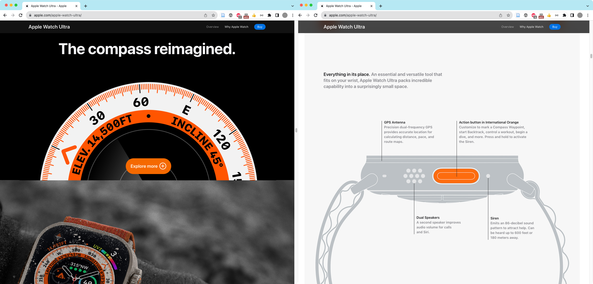
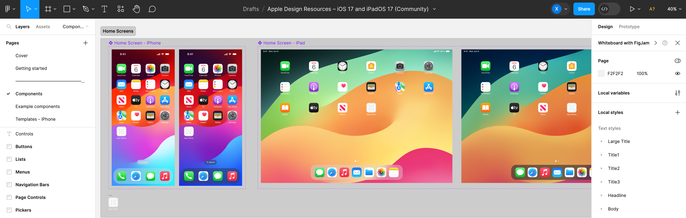
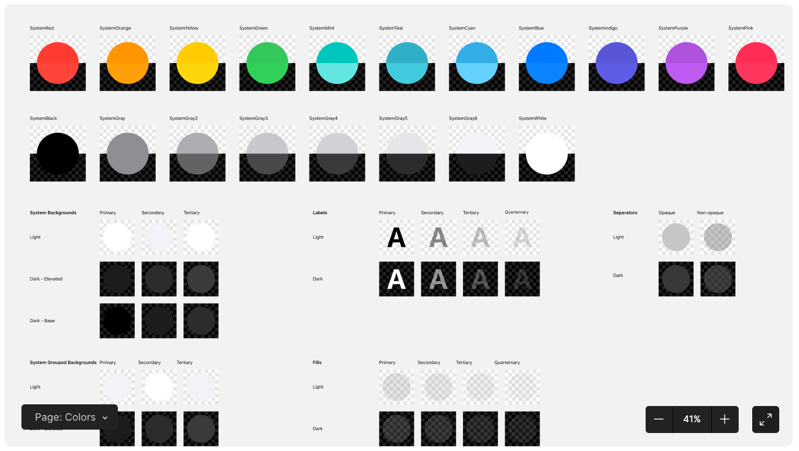
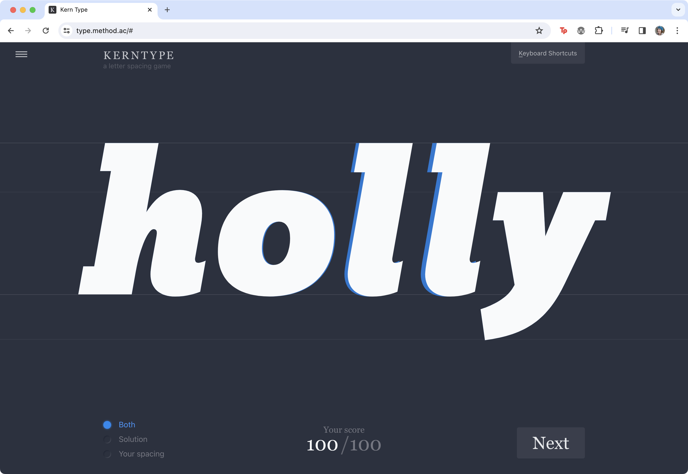

<!--  -->

<!-- ### Exercise 4.0.1: What is Good Design? -->

The following exercise asks you to evaluate your response to good design. As an example of “learning through discovery,” it works best if you actually do the activity, whether you are reading this section on your own or with a group in a classroom.

1. Think of a company or organization that you associate with “good design.” 
2. Explore the website of the organization, consider the objects, software, or other things they create. Use the Thinking Aloud method (see the sidebar) while you look to evaluate your response to the design.
3. List some reasons why you might have selected this organization. What about their website, products, or other aspects of their brand or identity (see chapter 3) are examples of good design?

Here we share notes from our own response to the above questions, using the “Thinking Aloud” method to assess apple.com (Figure 4.1): 

> [on the Apple home page] *“Apple spends billions of dollars on marketing each year, and it is evident in their product photography. All of these images are beautiful, especially the product close-ups and details.”*
>
>
> Figure 4.1 The Apple Watch Ultra home page
>
> [clicks the Apple Watch Ultra page] *“Isn't it interesting how the color chosen for the text that describes the watch features on the web page (Figure 4.0.1) matches the color on the actual watch crown and band? All the typefaces and type treatments on the page are equally consistent. Body text about the product is always left-aligned, making it easy to scan.”*
>
> [scrolls through the Watch Ultra page] *“There is that orange color again—on a watch band, a call to action (CTA) button (see sidebar), and even on icons above text blocks— creating focal points that guide our eyes around the page. So many things are uniform, even the animations on this page move at the same speed!”*

So, what is the answer to the question presented above? If there is one solid principle you can take from Apple's brand, products, webpage, everything, it is this: ***Consistency is central to good design.***

Figure 4.3 A Figma design template published in the Apple Design Resources for iOS 17 and iPadOS 17 https://developer.apple.com/design/resources/ to help designers and developers ensure consistency with all Apple interfaces.

Figure 4.2 Kern Type challenges players to adjust the kerning between letters so that the negative space between them is consistent. See https://type.method.ac 

Figure 4.5 A spread from the Gutenberg Bible, c.1450s.
