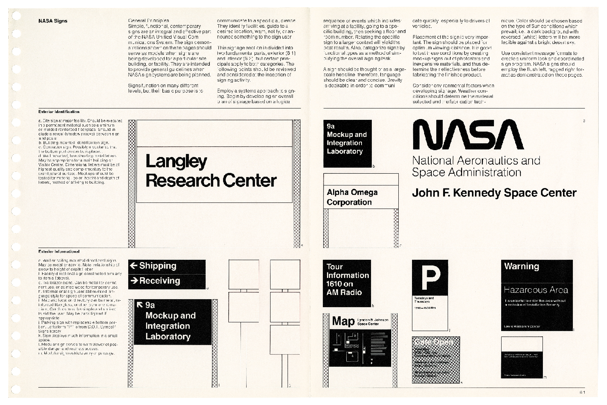

<!-- ### Exercise 4.0.2 Explore Style Guides -->

Explore style guides of organizations to see how they plan for design consistency.

Figure 4.4 The NASA Graphics Standards Manual (1976) shows how to produce consistent designs across everything that represents this iconic organization. ©Danne & Blackburn / NASA, Standards Manual.

1. In the 220 page [NASA Graphics Standards Manual](https://standardsmanual.com/products/nasa-graphics-standards-manual) (1976), Richard Danne and Bruce Blackburn show how the NASA logo, U.S. flag, and classic Helvetica typeface should be used on vans, confidential documents, and even the space shuttle (Figure 4.4).
2. The [Apple Human Interface Guidelines](https://developer.apple.com/design/human-interface-guidelines/charts) explains best practices across all their content. For example on the Charts page inside Content, they remind readers to "Establish a consistent visual hierarchy [to] help communicate the relative importance of various chart elements.
3. Continue exploring the above examples and find one more contemporary or past example using a search engine. Make notes about the system, including things that might not be evident at first glance.
	- [Firefox](https://acorn.firefox.com/)
	- [Uber](https://brand.uber.com/)
	- [Design Systems and How to Learn (and Steal) From Them](https://designerup.co/blog/10-best-design-systems-and-how-to-learn-and-steal-from-them/)

