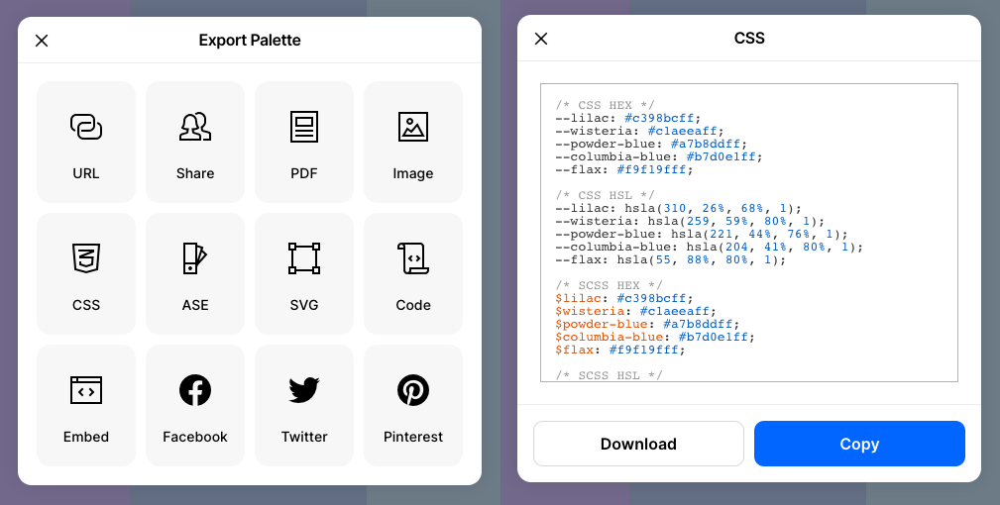
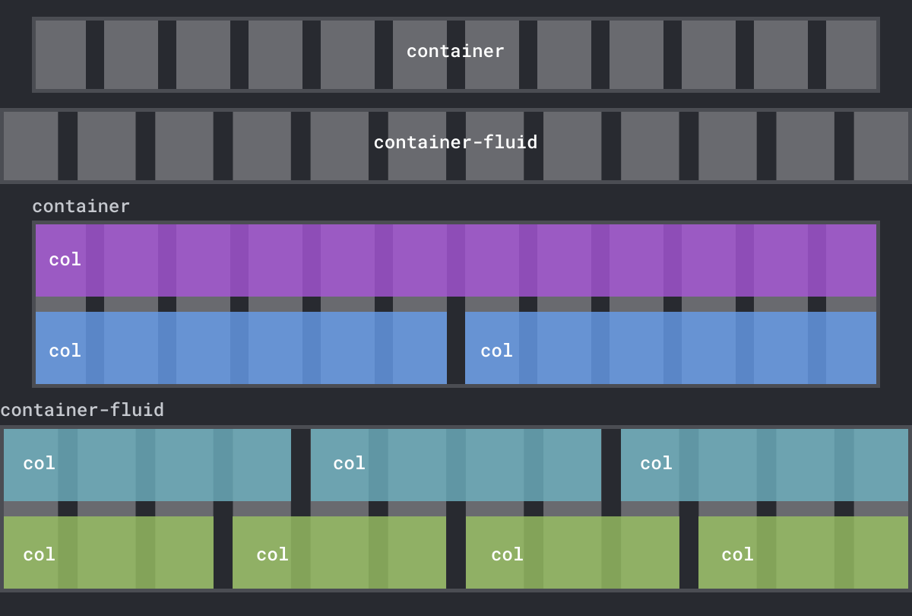
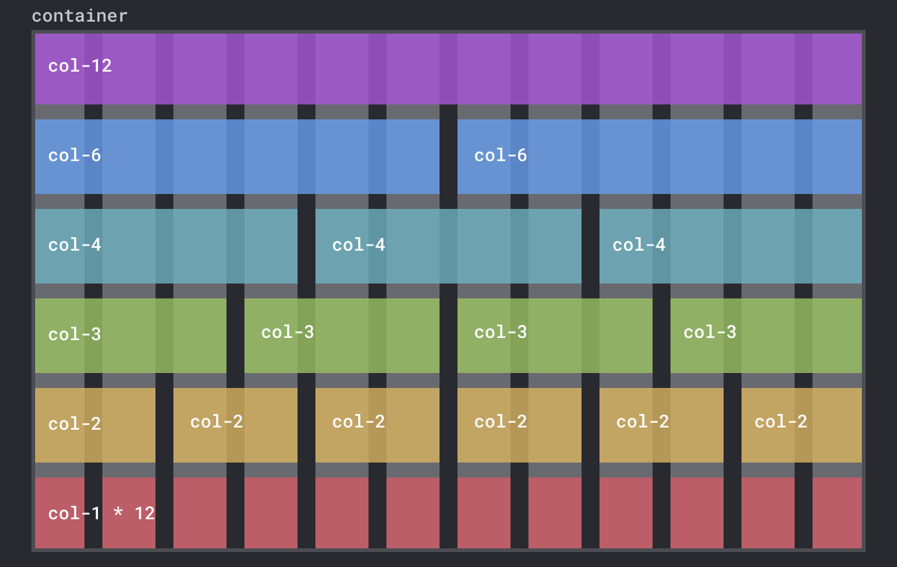
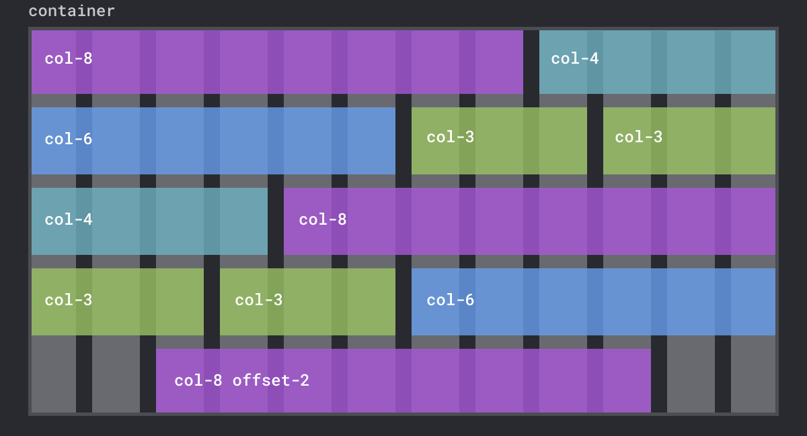
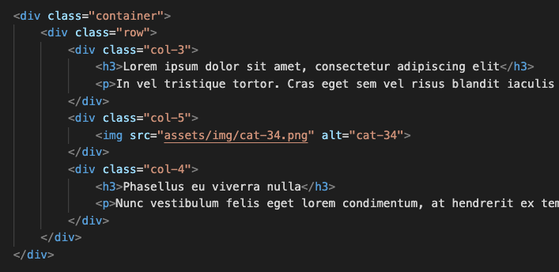
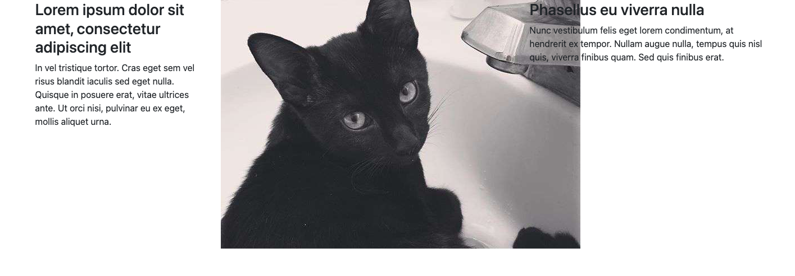
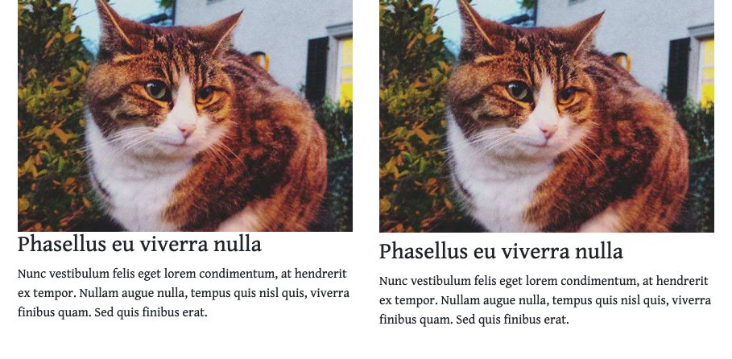
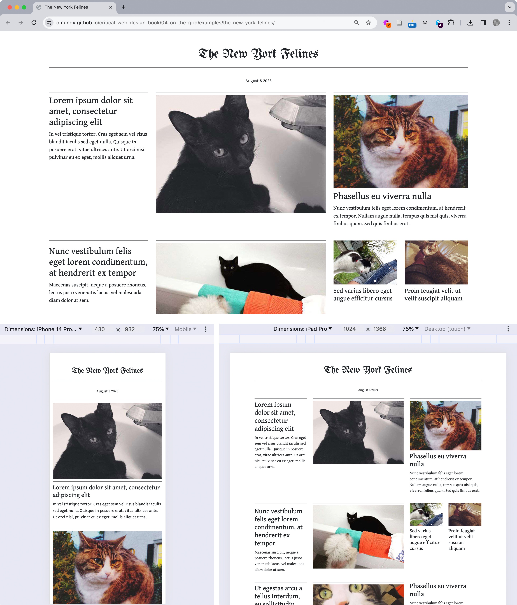

## 4.3 The Bootstrap Grid System

Bootstrap demo https://codepen.io/owenmundy/pen/oNLZpWM

Figure 4.27 [Coolors.co](https://coolors.co/) export options and CSS formats.
ALT: Coolors.co export options and CSS formats

Figure 4.28 Bootstrap's container-fluid class always expands to the full width of the window, while the container class has a maximum width. The .col class will expand to fill the width of the row on that container.
ALT: Diagram showing the container and container-fluid classes.

Figure 4.29 A design with Bootstrap grid system showing one, two, three, four, six, or twelve equally-sized columns per row. 
ALT: A design with Bootstrap grid system showing one, two, three, four, six, or twelve equally-sized columns per row.

Figure 4.30 You can mix and match Bootstrap column sizes however you like, including the offset set class which can center the columns in a container. The only rule is that the column and offset spans together add up to 12. 

Figure 4.31 The Emmet package in VS Code lets you type the beginning of an HTML element and press tab to add the open and close tag you want. This feature also lets you add HTML elements with their class names by typing the full name of the selector.
ALT A screenshot showing code autocompletion in VS Code.

Figure 4.32 Your code should contain five divisions in total, as well as headers and an image. 
ALT A screenshot showing code completed so far.

Figure 4.33 The image in the second column is not scaling or reflowing like the text.
ALT A screenshot of the image in the second column.

Figure 4.34 Notice the difference in negative space before and after we added top margin to the heading.
ALT A screenshot showing before and after adding spacing above the heading

Figure 4.35 Our final composition https://criticalwebdesign.github.io/book/04-on-the-grid/examples/the-new-york-felines/module4.3-finish.html for multiple breakpoints seen in the browser with DevTools. The Toggle Device Toolbar (see the cursor in the upper right corner of the top image) enables you to view your work across multiple devices in the Chrome browser.

