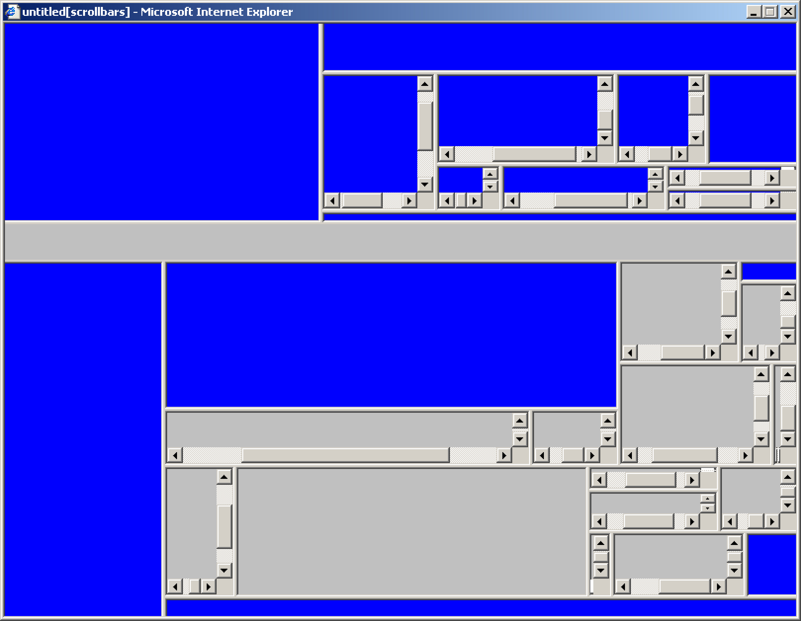
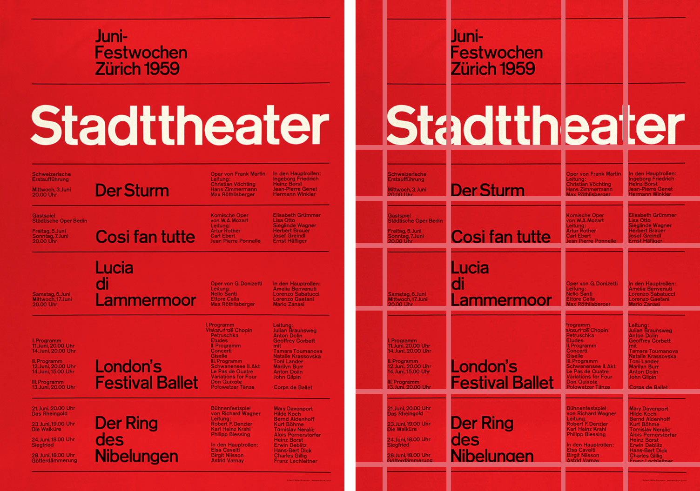
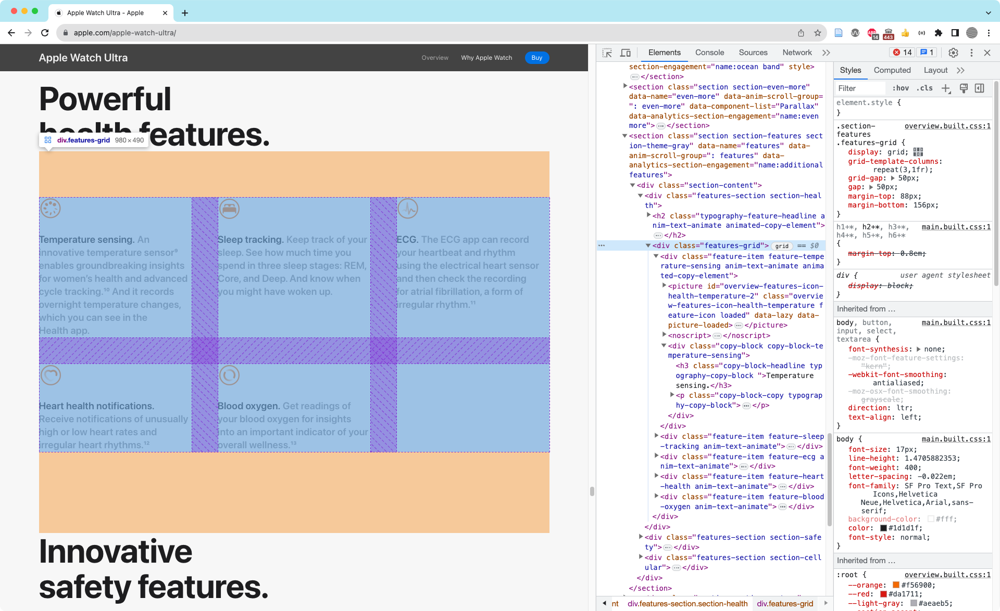
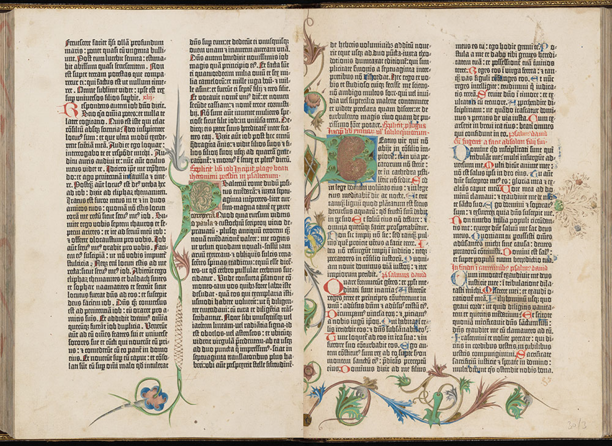
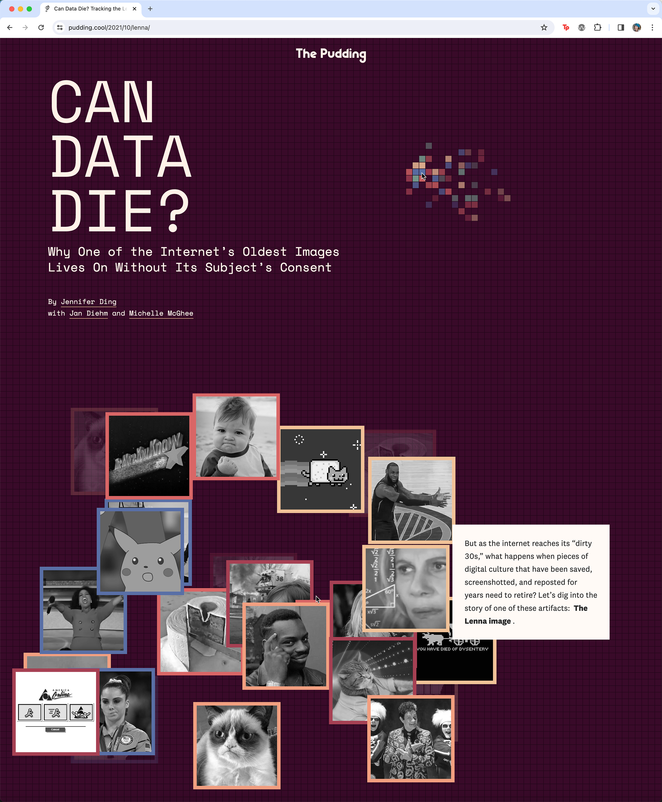
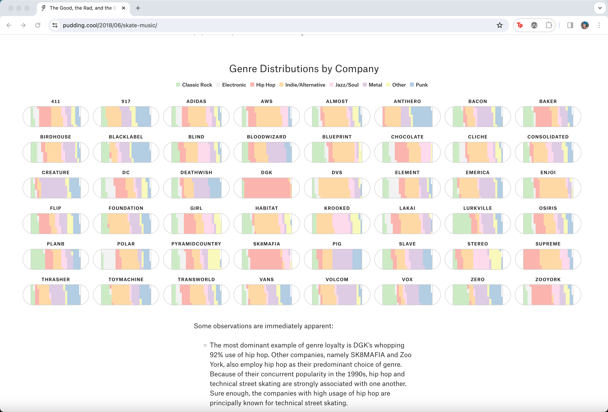
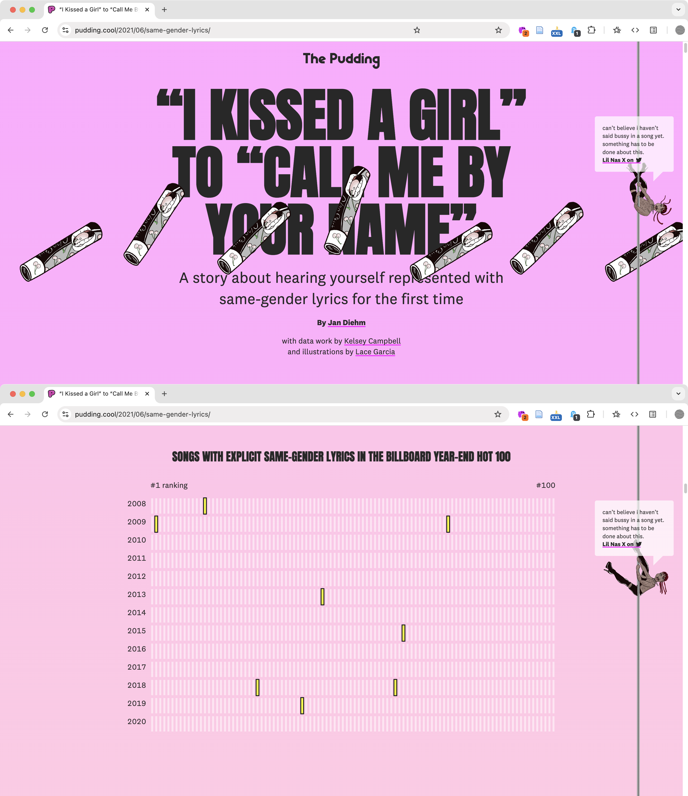

import CustomAside from '@/components/CustomAside.astro';

<CustomAside type="overview">{frontmatter.description}</CustomAside>

## Usability Resources

- NN/G [Thinking Aloud: The #1 Usability Tool](https://www.nngroup.com/articles/thinking-aloud-the-1-usability-tool/)
- Wikipedia [Think aloud protocol](https://en.wikipedia.org/wiki/Think_aloud_protocol)
- Wikipedia [Comparison of usability evaluation methods](https://en.wikipedia.org/wiki/Comparison_of_usability_evaluation_methods)

## On the Grid

<figure>

Internet artists have long embraced the grid as a defining feature for commentary and aesthetic disturbances. Jan Robert Leegte, Scrollbar Composition, 2000 website collection Stedelijk Museum Amsterdam http://www.scrollbarcomposition.com/ 

</figure>

<figure>

The text and graphic elements of the grid form invisible “leading lines” that move viewers' eyes around the page in our reproduction of a poster by Josef Müller-Brockmann, 1959.

</figure>

<figure>

DevTools revealing the underlying grid of HTML elements in the Apple Watch Ultra page.

</figure>

<figure>

These wireframes show how a responsive layout changes across device sizes. 

</figure>

<figure>

A spread from the Gutenberg Bible, c.1450s.

</figure>

## Case Study

<figure>

Jan Diehm’s design for The Pudding’s “Does Data Die?” incorporates an interactive grid and explosive image boxes that follow the cursor as the viewer scrolls through the article. The text consistently flows in an easy to read, high contrast single column on the right while graphics animate throughout the page. Just as pixels combine to form an image, the reader combines these elements to understand the history of Lenna's image. Read and interact with this piece at https://pudding.cool/2021/10/lenna/ 

</figure>

<figure>

Jan Diehm’s skateboard chart graphic for The Pudding’s “The Good, The Rad, and The Gnarly” appears in an evenly-spaced 8-column grid to visualize music genres that appear in skate company commercials. https://pudding.cool/2018/06/skate-music/

</figure>

<figure>

Jan Diehm’s design for The Pudding’s “I Kissed a Girl to Call Me By Your Name” featuring Lil Nas X sliding down a pole as a scrolling interaction. https://pudding.cool/2021/06/same-gender-lyrics/

</figure>
