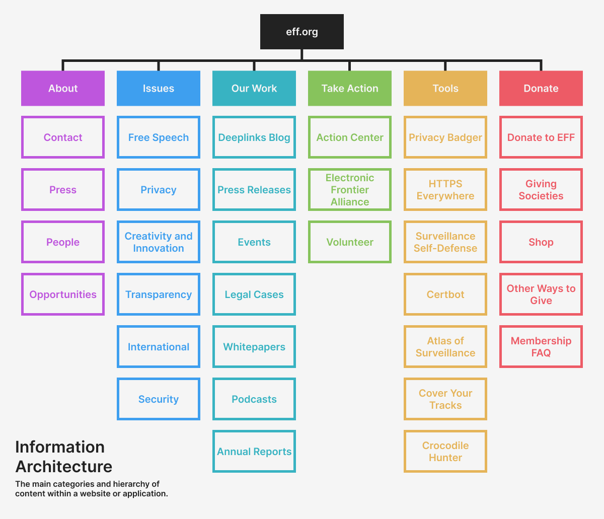
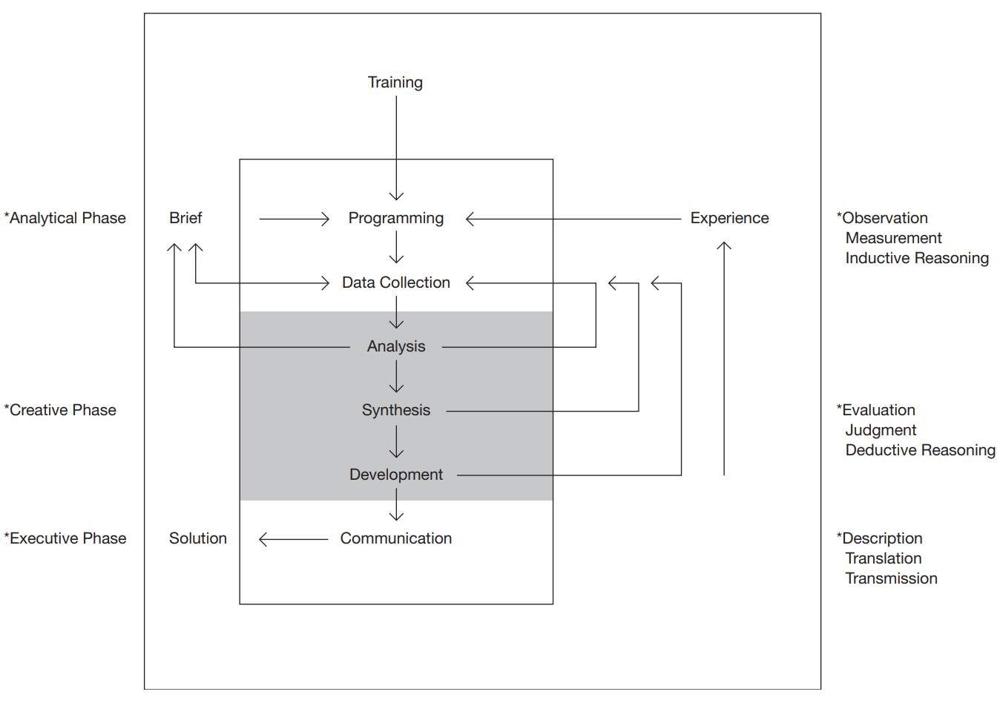
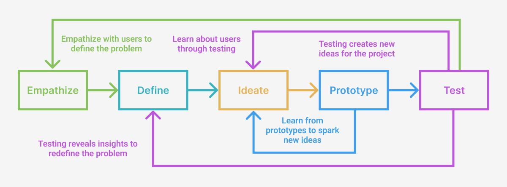
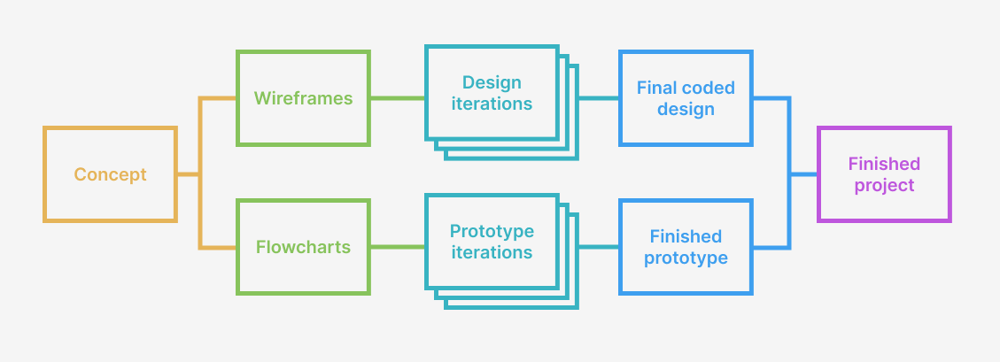
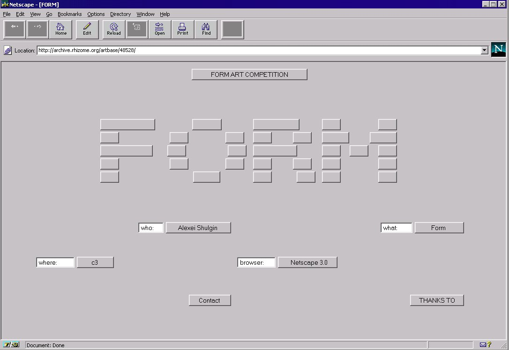
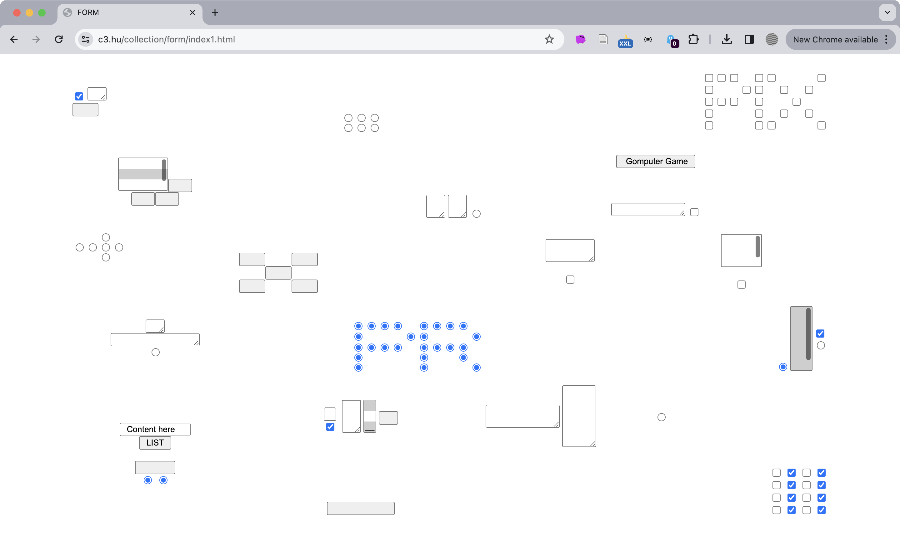

import CustomAside from '@/components/CustomAside.astro';

<CustomAside type="overview">{frontmatter.description}</CustomAside>

## Design Thinking Methods

<figure>

Example information architecture from the Electronic Freedom Foundation (EFF) website http://eff.org, a nonprofit organization defending civil liberties in the digital world.

</figure>

<figure>

Basic design procedure by Bruce Archer, recreated by Hugh Dubberly in his book, How do you design? A Compendium of Models (2005).

</figure>

<figure>

The common stages of a design thinking process are represented most often as a series of iterative loops that inform each other to improve your outcomes.

</figure>

<figure>

A competition scan showing how different mountain bike manufacturers have all solved the same design problem in different ways. Each company has to communicate bikes by intended terrain, wheel size, frame material, suspension, weight, etc. using menus, filters, images, quizzes, information hierarchy, and other methods for all the different bikes on their sites.

</figure>

<figure>

Student wireframes in-progress.
 
</figure>

<figure>

It is a good practice to create design and prototype iterations separately before merging them together, as we show in this "iterative design/prototype flowchart". This makes it easier to create and edit designs in Figma that echo and imagine the work you do in your prototype. Equally, keeping the prototype free of design code will simplify your testing and iterations. After multiple iterations you can bring them together into the final coded version of your project. 

</figure>

## Case Study

<figure>

Alexei Shulgin, Form Art, 1997 (https://www.c3.hu/collection/form) presents various functioning form elements, including inputs, radio buttons, and checkboxes. When clicked, scrolled, or checked, the elements animate, provide context, or link to new pages in a continuous narrative of virtual paperwork. You can interact with the project here https://sites.rhizome.org/anthology/form-art.html as it was originally published using a browser emulator. 

</figure>

<figure>

Alexei Shulgin, Form Art, 1997 (https://www.c3.hu/collection/form/index1.html) as seen today. You can also view a list of the project's content https://www.c3.hu/collection/form/list.html to provide order to your experience.

</figure>

