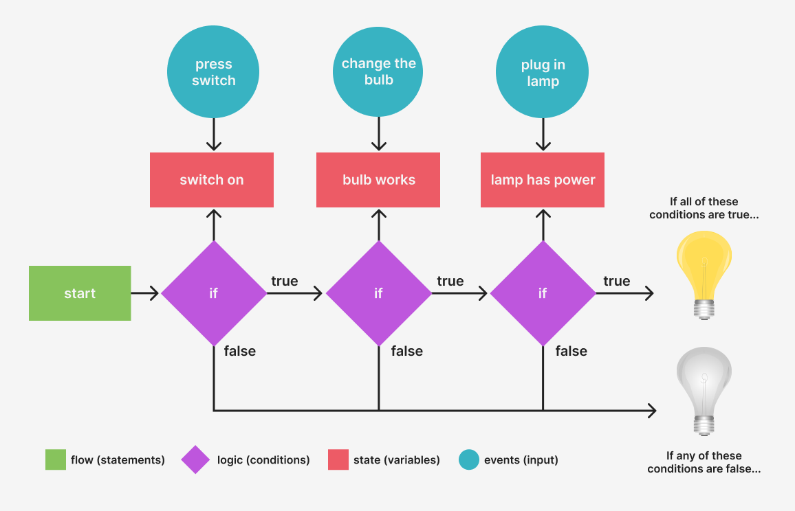
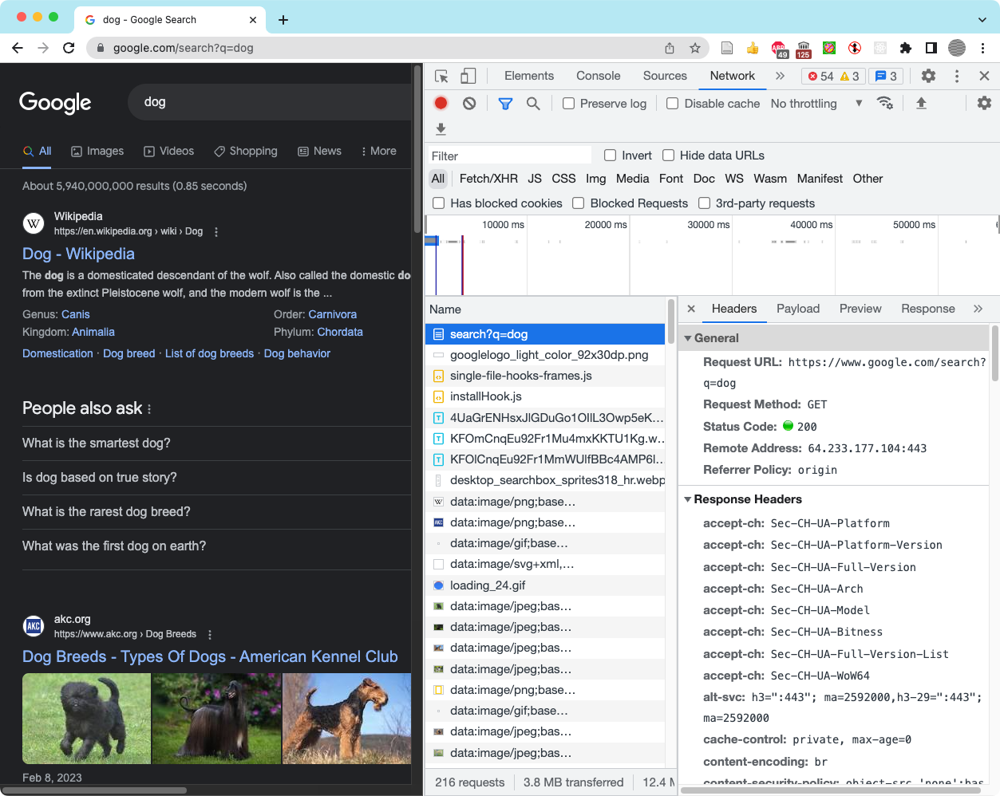
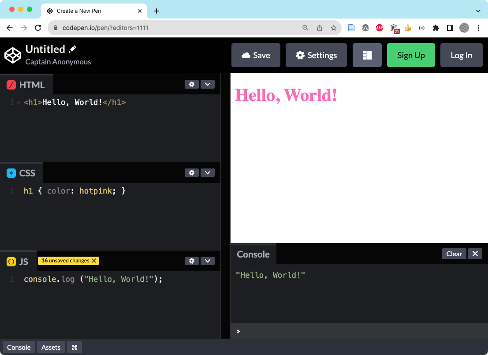
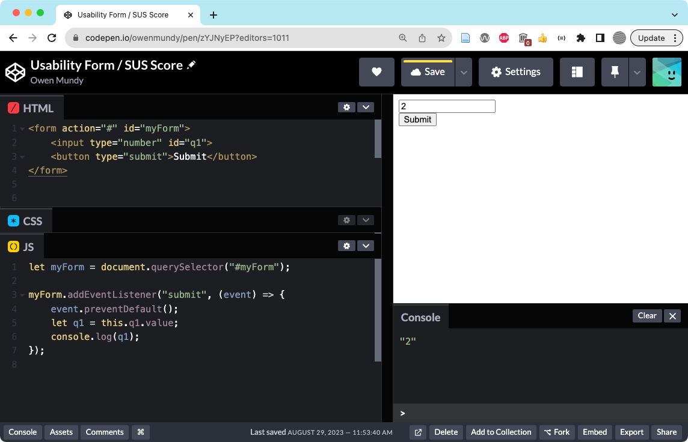
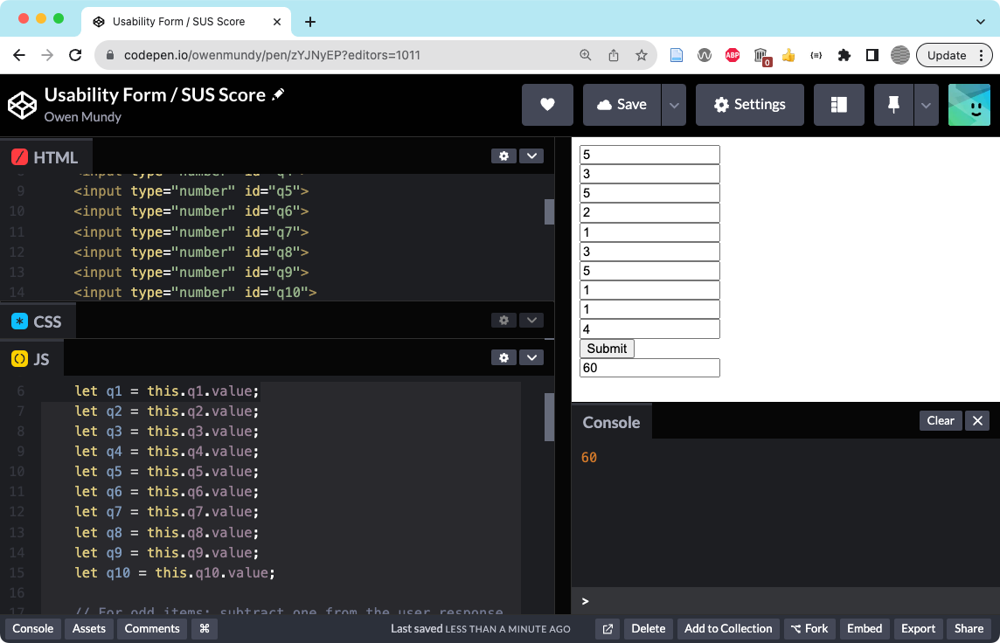
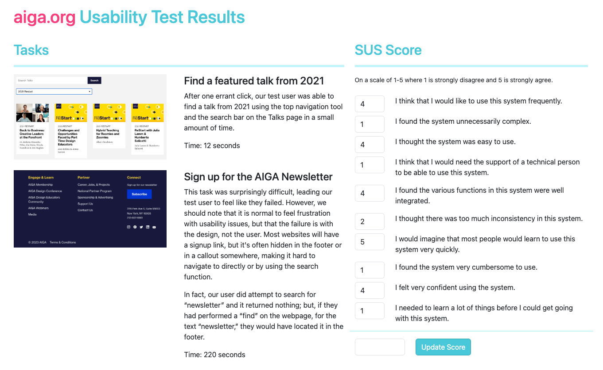

import CustomAside from '@/components/CustomAside.astro';

<CustomAside type="overview">{frontmatter.description}</CustomAside>

## Javascript Data Types

<figure>

Javascript organizes data by primitive and non-primitive types

</figure>

<figure>

This graphic shows the flow, state, logic, and events of a program that “turns a lamp on or off.” The logic (decisions the computer makes) is based on the state (the status of variables in the program) and events (e.g. user input) directing the computer towards its goal.

</figure>

## GET vs POST Requests

<figure>

Inspecting the headers of the GET request using a Google search for “dog.”

</figure>

## Javascript and Web Forms 

<figure>

We added HTML, CSS, and Javascript to a new codepen.

</figure>

<figure>

Set up the HTML and JS code to create a form in Codepen.io.

</figure>

<figure>

The finished SUS form prototype https://codepen.io/owenmundy/pen/zYJNyEP

</figure>

<figure>

An example of form validation thanks to the required attribute.

</figure>

## Finished Prompt

<figure>

The results of our usability test, coded in a web page with the SUS form can be found at https://criticalwebdesign.github.io/book/05-usability/5-3/

</figure>

