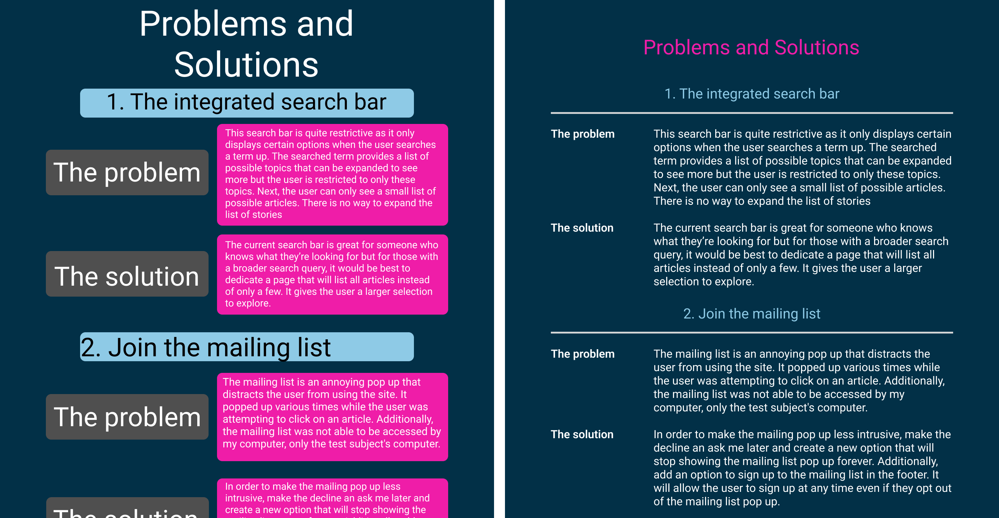

Figures from the book

## The “Less Is More” Critique

Remember when we said earlier that “you shouldn’t see good design”? A good rule of thumb for achieving this is to question everything you add to a layout. If it’s difficult to explain how a text treatment or graphic element makes it easier for your users to understand the content and achieve their goals, then it likely shouldn’t be added to the design.

Thus, we introduce the “Less is More” design critique. By now you may have noticed that content and graphical elements are often added through each design iteration but rarely removed. This feedback activity can be used with later versions of a design to help to simplify a layout and rely on the content itself to move viewers’ eyes to key focal points. It is written as a group activity so that you can gain new perspectives from others who might not be attached to elements in the design. If you are working on your own, then ask a friend to help you. A design critique is a way to generate helpful feedback, but remember the comments are not directed at you, but toward understanding how the design might be improved.

1. In Figma, duplicate and rename the frame containing the latest version of your desktop design so that you can let others edit it at will.
1. You (the designer) should watch and take notes (without speaking) while members of your group discuss the design and prioritize items that can be removed to improve, simplify, and make the layout easier to code. Again, the designer should not speak but focus on listening to the group’s feedback.
1. Your partners should select items (e.g., graphics, text treatments, colors) to remove and “speak out loud” (see chapter 4) about their motivations as they hide or change the items. While working, they should explain: “How does removing this improve, simplify, or make the design easier to see, use, or code?”
1. After you have taken several notes, you can ask your partners for more information or suggestions on any of the items they brought up.
1. Feel free to repeat with others as often as you like. You can see our outcomes from a similar activity in the wiki. After you have finished, code a new version of your desktop design and, finally, a mobile version of the layout as well.

## Example

Example feedback focused on the idea that “less is more.” 

<figure>

The original and improved designs  from the “less is more” critique. Open in new tab to see the full-size graphic.

</figure>

<table>
<tr>
<td class="tcol-num"></td>
<td class="tcol-text">Feedback</td>
<td class="tcol-text">Modifications</td>
</tr>

<tr>
<td class="tcol-num">1</td>
<td class="tcol-text">

The original design used unnecessary boxes to contain each content item. This "box in a box" approach is an inefficient use of valuable space that requires extra padding to separate the edges of each box from the content. The contrasting colors of the edges also create focal points that draw the viewer to look there rather than at content. 

</td>
<td class="tcol-text">

We removed all boxes since they didn't contribute to efficient communication of content. Thanks to this, the layout no longer needed the extra margins and padding required to contain the content.

</td>
</tr>

<tr>
<td class="tcol-num">2</td>
<td class="tcol-text">

An equally important consequence of the extra boxes is that they disturb the symmetry and continuity that a layout grid provides along horizontal and vertical axes. Additionally, the headers used col-10 while the discussion used col-12, leaving oddly shaped negative spaces on the left side of the composition, so readers cannot follow natural lines that should connect the heading on the left to the discussion on the right.

</td>
<td class="tcol-text">

Removing the boxes made it possible to align the text along the vertical and horizontal axes of the layout grid, emphasizing the relationships between text and helping to move users' eyes directly to relevant information.

</td>
</tr>

<tr>
<td class="tcol-num">3</td>
<td class="tcol-text">

Font sizes were not consistently scaled throughout the hierarchy, making it hard to know where to look first, and thereafter.

</td>
<td class="tcol-text">

We scaled the font sizes to be consistent with Bootstrap headings and to reflect a logical order of content on the page.

</td>
</tr>

<tr>
<td class="tcol-num">4</td>
<td class="tcol-text">

Finally, a “hot color” was used for the text background, which not only decreased legibility, but potentially attracted viewers' eyes before reading the heading.

</td>
<td class="tcol-text">

We moved the “hot color” to the header to maintain the spirit of the original and make the content easier to see.

</td>
</tr>
</table>

:::note[Author's Note]
Keep in mind these changes made the original design better, but there is still room for improvement. The chapter prompt includes screenshots of the targeted areas from the usability test, so later iterations would include those as well as other creative improvements. 
:::
