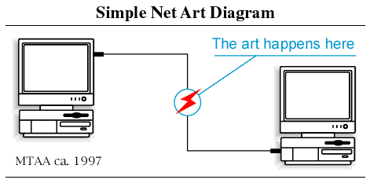
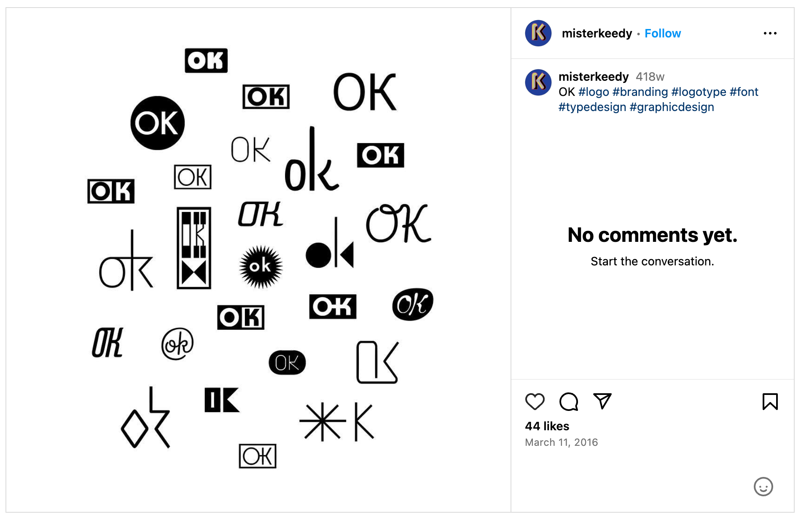
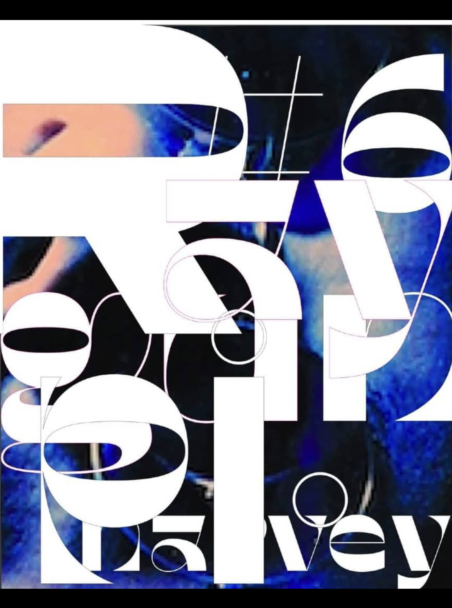
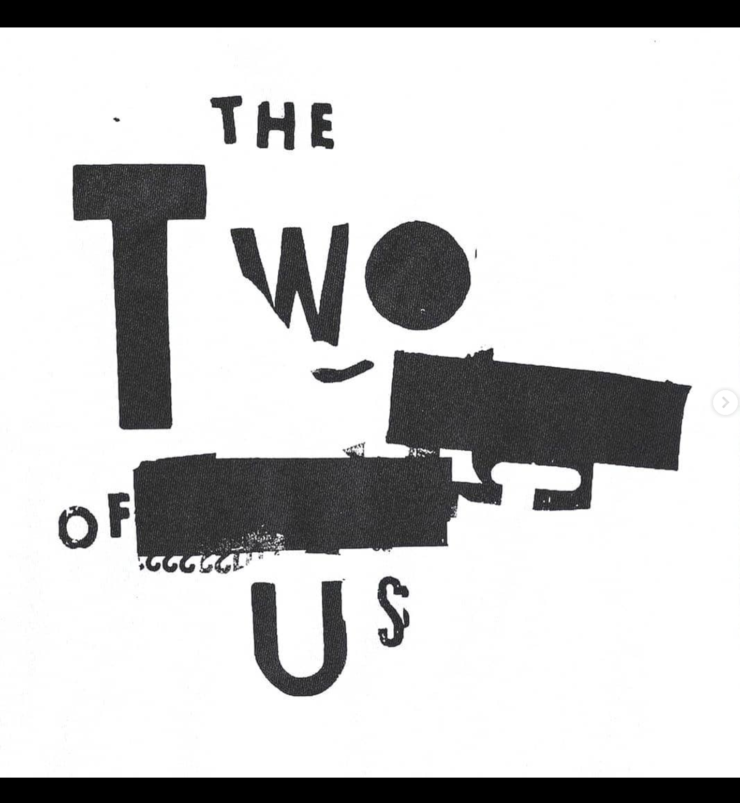
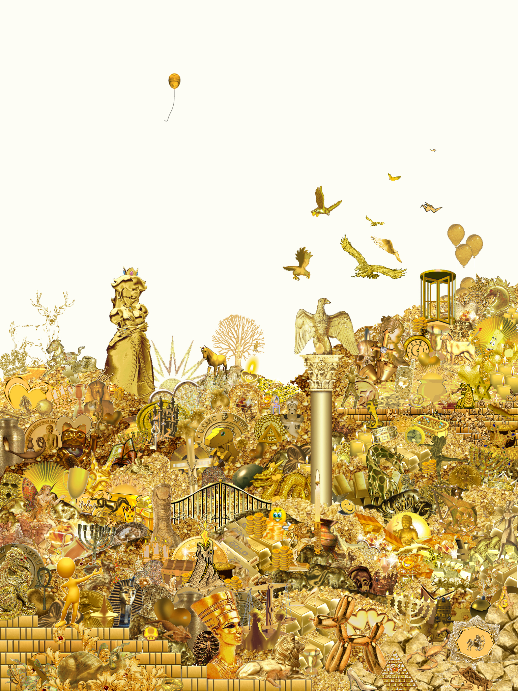
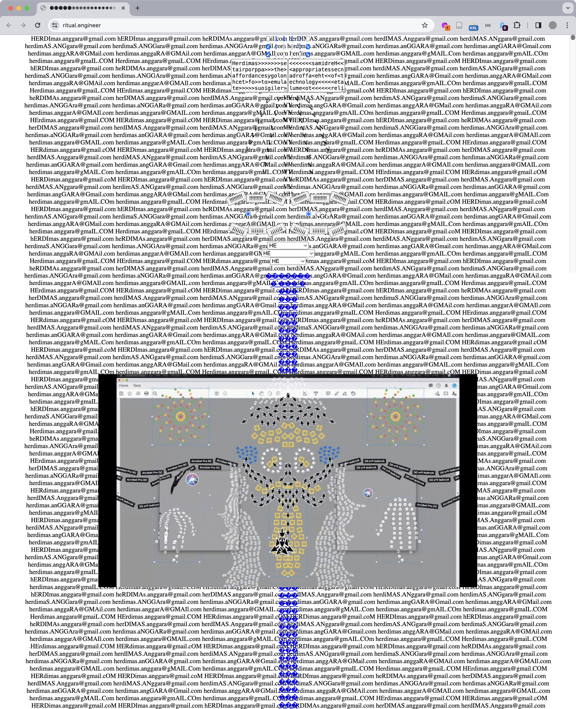
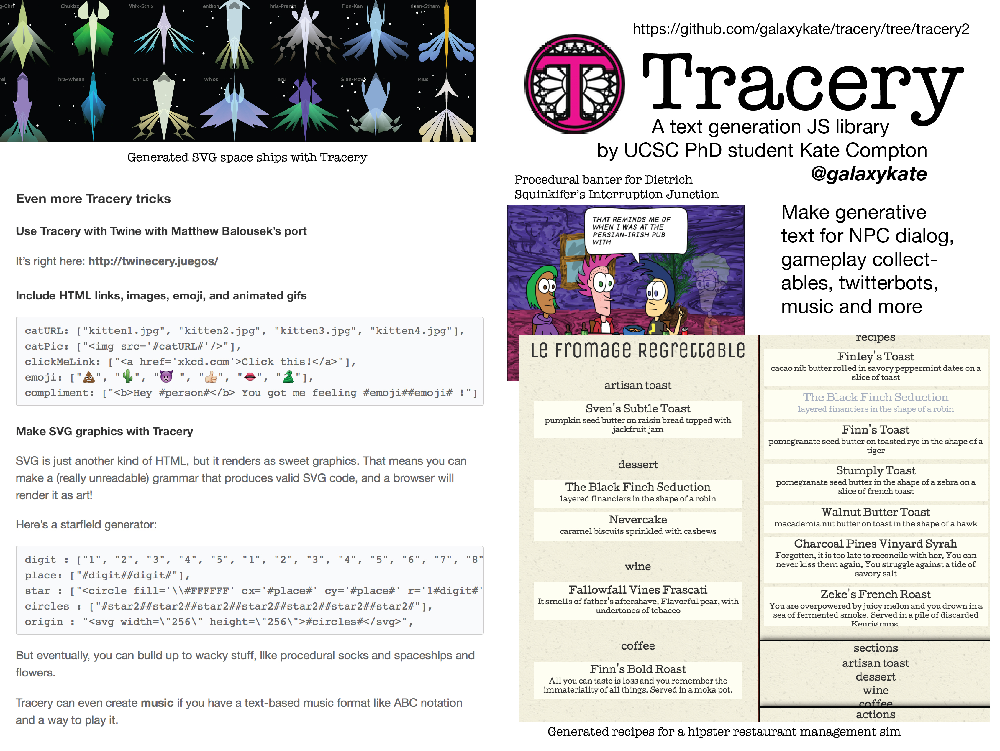
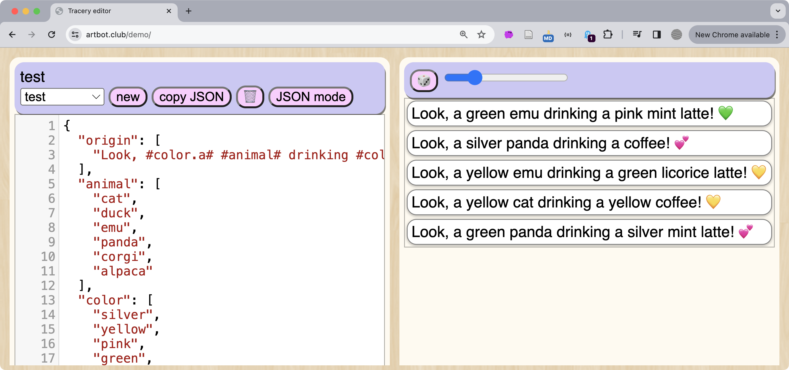

import Excerpt from '@/components/Excerpt.astro';
import Overview from '@/components/Overview.astro';

<Overview>{frontmatter.description}</Overview>

## Off the Grid

<figure>

 
MTAA, Simple Net Art Diagram, 1997. This punchy illustration alludes to the reconstitution of meaning that happens in the communication system between the artist (that is, the art work) and viewer. CC BY MTAA

</figure>

<figure>

“Multiple Interaction Team : an exhibition-event to travel (cover image),” MIT Libraries, Cambridge, Massachusetts, 1972. Call no. N6493 1972.M37. This 1973 exhibition was organized by Gyorgy Kepes and prepared by the Center for Advanced Visual Studies at MIT. The catalog is credited to designer Jacqueline Casey, who worked with Murial Cooper in the Design Services office. 

</figure>

<figure>

Mr. Keedy, “OK Identity” (1999) is an exciting yet pluralistic take on brand identity that neither accepts nor denies the constraints of corporate logo designing.

</figure>

<figure>

April Greiman, Think About What You Think About, Cal State Sacramento Lecture Poster, 2004. 

</figure>

<figure>

David Carson, Redesign of Raygun Issue 6 cover featuring PJ Harvey. 

</figure>

<figure>

David Carson, fashion design collaboration with Takahiromiyashita The Soloist.

</figure>

<figure>

Émilie Brout & Maxime Marion, Gold and Glitter, Installation, website, found GIF and objects, 30 x 30 x 130 cm, 2015, see [criticalwebdesign.github.io#goldandglitter](https://criticalwebdesign.github.io#goldandglitter). This work was presented on and offline, where the unique frame counts of each found GIF file made the whole composition feel alive and more present than most things we view on the flat screens used to access the internet.

</figure>

<figure>

Herdimas Anggara, [Ritual Engineer](https://ritual.engineer/), 2023.

</figure>

## Case Study

<figure>

Kate Compton, Tracery zine used as a teaching tool.

</figure>

<figure>

Kate Compton, Tracery user interface (editor) used to build most of the bots on Twitter. See: https://artbot.club/demo.

</figure>

