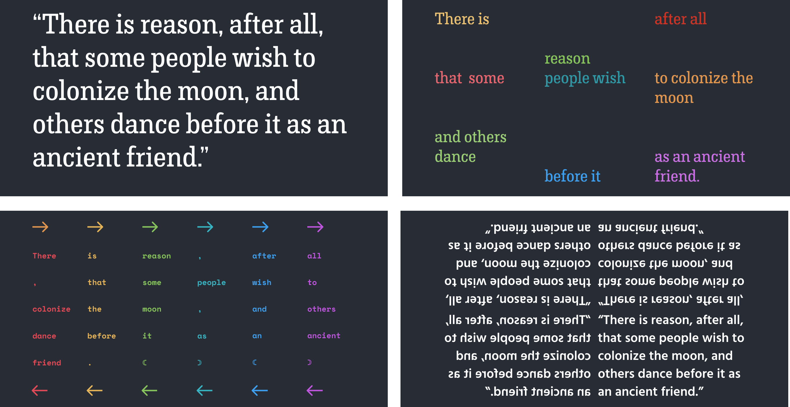
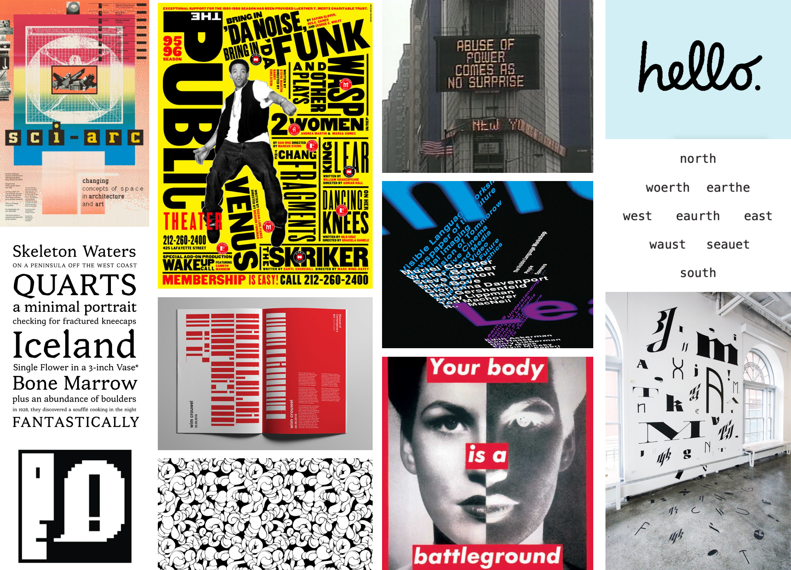
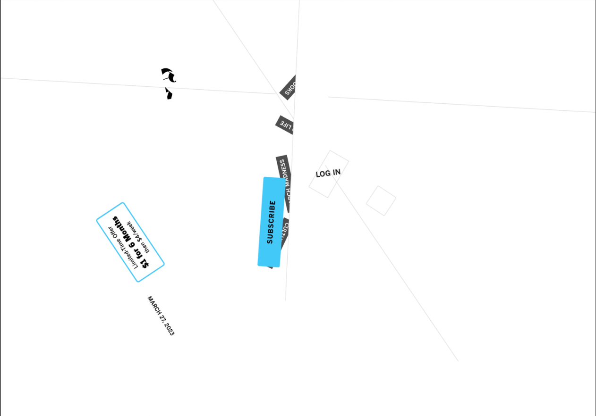
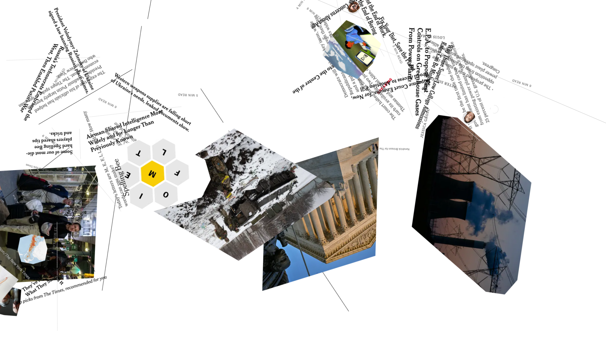
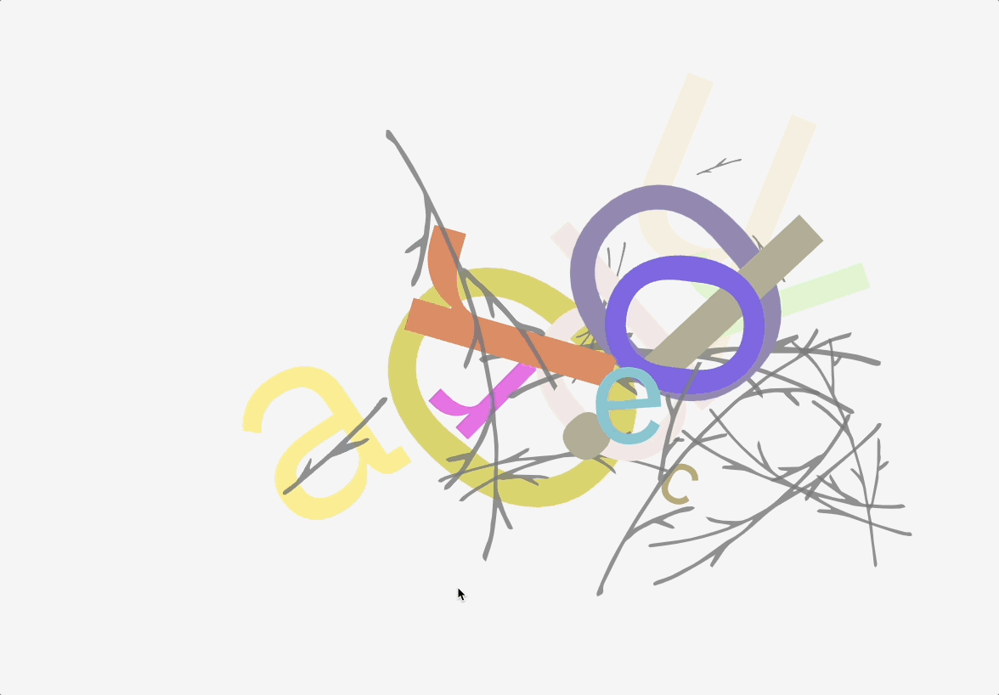
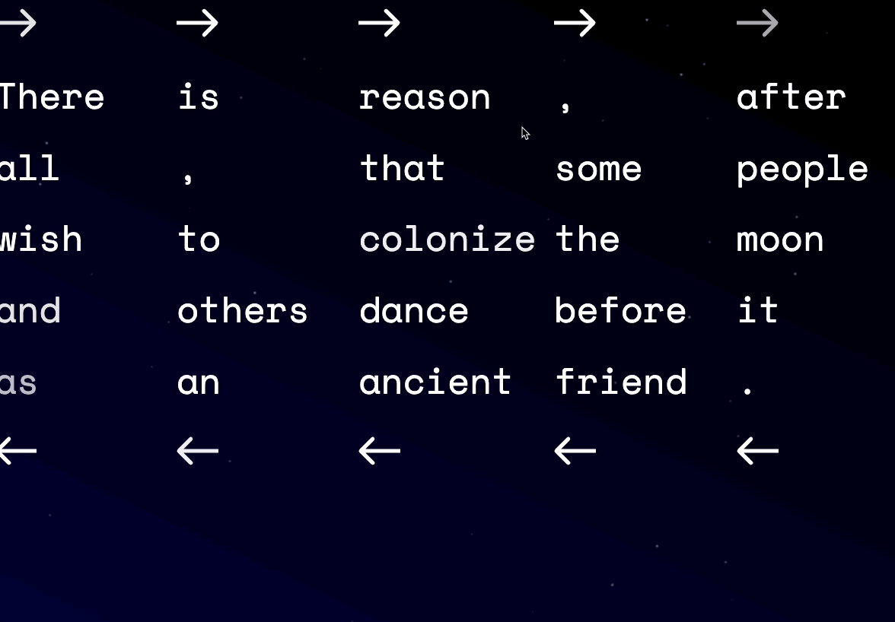

👉 Follow brainstorming suggestions from the book and experiment with diverse layouts of a simple phrase.

## Create a Text Layout on a Grid in Figma
{/* From the book */}

The first step in resisting any structure is to familiarize yourself with it. Once you understand and know how such a system functions then your resistance can be focused, specific, and effective. In this exercise you’ll complete four layout variations using only the text you've chosen and a layout grid in Figma. 

1. Create a new desktop-sized frame in Figma using the templates you used in Chapter 4, https://criticalwebdesign.github.io#figma-templates. 
1. Add the text that you have created in the haiku or sourced elsewhere. If you like, you can place an image of your poem to experiment and mock up possibilities over top of it.
1. Experiment with font, position, color, etc. 
1. Duplicate and rename the frame for each new iteration. Even though you are aligning the content on the grid you should try to make them significantly different.

<figure>

Owen used a quote from the poet and author, James Baldwin, to create four distinct grid layouts. The Figma layout grid is hidden in this figure, but it is clear the columns and rows provide structure to the text.

</figure>

## Find Inspiration in the Work of Others

<figure>

This mood board includes a selection of text and image works made by women. While some present easily-found grid structures, all of these works use intentional expressive typographic design or juxtapose text and image to animate their ideas. 

</figure>

<figure>

import YoutubeVideo from '@/components/YoutubeVideo.astro';

  <YoutubeVideo src="https://www.youtube.com/watch?v=vDqULFUg6CY" />

Miles Davis, Kind Of Blue, 1959

</figure>

In the chapter, “Improvisations and Limitations” of his book The Shape of Design, Frank Chimero writes about finding inspiration in the work of others. Using examples from both (interestingly) Japanese poetry as well as jazz music, Chimero suggests adopting improvisation to facilitate the creative process. He describes the instructions that Miles Davis gave the other musicians when recording Kind of Blue, the groundbreaking album that redefined improvisation across jazz music, by providing them only a “loose framework of limitations to focus them [and] plenty of space of exploration.” However, the music they produced at that moment could only have happened thanks to those who established so much of the language and patterns in this musical form. Davis and his group were informed by a history of jazz greats, like Dizzy Gillespie, Billie Holliday, and Louis Armstrong. While you should always seek to define your unique perspective in what you make, creativity is made possible thanks to others’ Giant Steps. We can “accept the light contained in the work of others” to find our own way. 

## Owen’s Design Process

Use these steps to iterate on and improve any design. 

1. Seek out, collect images, and make notes about works that inspire you or solve a design problem you are contemplating.
1. Duplicate a previous version of your design. After looking at finished works you might already see areas for improvement.
1. Draw from your inspiration to create a completely new attempt at your design.
1. Take a break so that you can approach the next iteration with a clear mind.
1. Repeat the process! 

## More Inspiration

- [Murial Cooper](https://mitpress.mit.edu/university-press-week-throwback-thursday-featuring-muriel-cooper/)
- Jacqueline Casey [1](https://issuu.com/sebastianchapman/docs/comd1200_chapmansebastian_designheroes_presentatio) [2](https://www.google.com/search?q=Jacqueline+Casey+designer&tbm=isch)

<figure>

The LA Times website exploded using code from chapter 6

The New York Times websites also gets a redesign. 

</figure>

<figure>

https://criticalwebdesign.github.io/book/06-off-the-grid/6-3

</figure>

<figure>

https://criticalwebdesign.github.io/book/06-off-the-grid/examples/birds.html 

</figure>

<figure>

https://criticalwebdesign.github.io/book/06-off-the-grid/examples/maintenance.html

</figure>

<figure>

https://criticalwebdesign.github.io/book/06-off-the-grid/examples/baldwin.html

</figure>

