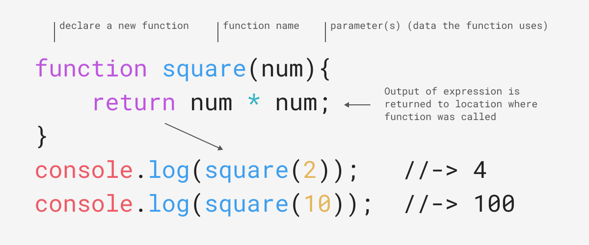
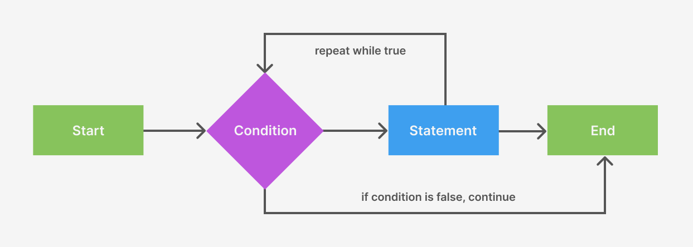
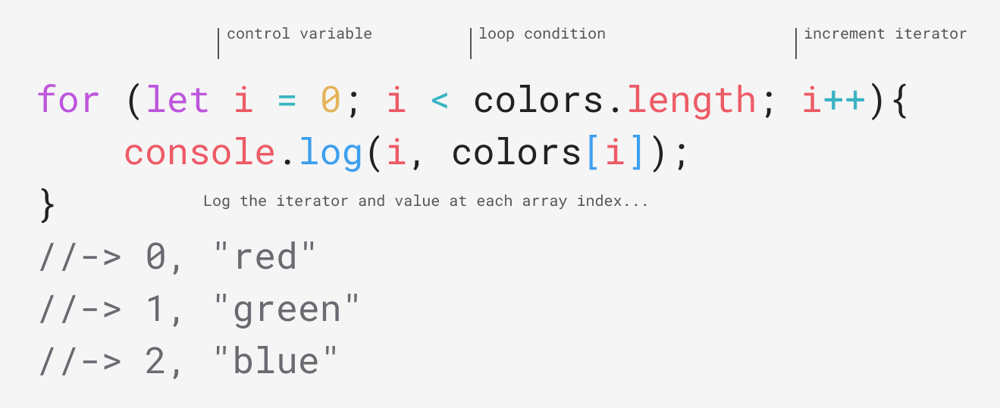
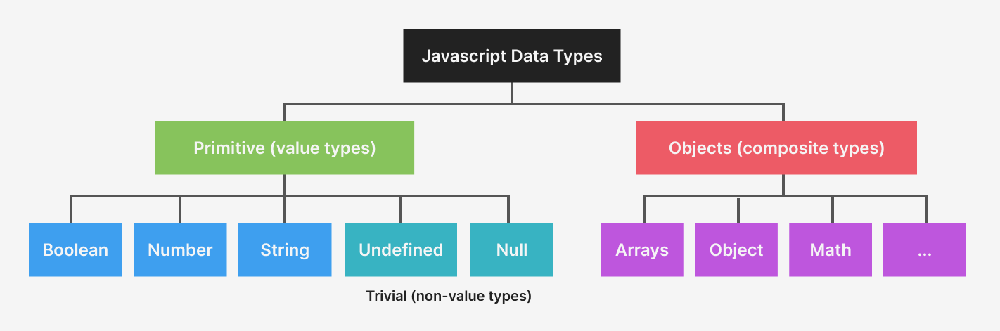

import CustomAside from '@/components/CustomAside.astro';

<CustomAside type="overview">{frontmatter.description}</CustomAside>


## Functions

A **function** allows you to reuse code. We use the `function` keyword to declare a function, one or more parameters to customize its task, and `return` to send data back to the location where it was called. ​​To use a function, call it with the function's name and two parentheses `()`. 


<figure>



</figure>


### Function Expressions

Functions can be written multiple ways. Following are four examples showuing essentially the same function. The above graphic shows a **function declaration** using the `function` keyword. Here is another example:

```js
function square (num){
	console.log("Hello from a function declaration!");
}
```


The same function can also be written as a **function expression** like this:

```js
const square = (num) => {
	console.log("Hello from a function expression!");
}
```

This example is the same as the above but, since it only contains one statement inside the function block it can be written without the curly braces using the fat arrow syntax.

```js
const square = (num) => console.log("Hello from a single line function expression!");

```

This is an example of a **anonymous function**. You can see it has no name because it is passed as the second parameter (the callback) of the `addEventListener()` handler.

```js
document.addEventListener("click", function (){
	console.log("Hello from an anonymous function!");
}
```


### Function Scope

The location you declare a variable determines its **scope**, or how its value can be accessed by other parts of your program. Below we declare `num` in the **global scope** (outside of any functions) so we can access it from anywhere ("globally") in the program, even inside a function. Alternately, variables created inside a statement block (inside functions, if statements, for loops, etc.) have **local scope** and are only accessible "locally" inside the curly braces where they were declared. So, creating a function not only packages your code for reuse, it also allows you to protect variables from being changed accidentally by other parts of your code. 

```js
let num = 7;
function main (){
    let secret = 7;
    console.log(`The number is ${num}`);
	console.log(`The secret number is ${secret}`);
}
console.log(`The number is ${num}`);
console.log(`The secret number is ${secret}`); // this will show an error
```


:::tip[Functional Programming]
With time, you’ll see that functions work best as small, single purpose expressions. Like functions in algebra, **pure functions**, those that always return the same output given the same input, are easier to test and reuse. You can see we have started to do this by linking to a single JS file called (appropriately) functions.js in the main assets folder of the repository. Pure functions are one feature of a programming paradigm called **functional programming** used by professional Javascript coders to write code that is easier to understand and more bug resistant. See [What Is Functional Programming?](https://medium.com/javascript-scene/master-the-javascript-interview-what-is-functional-programming-7f218c68b3a0) for more information.
:::


## Loops

**Loops** are a control structure that let you repeat specific code until a condition is met.

<figure>


A loop is a kind of control structure that will repeat until a condition is met.

</figure>

<figure>


A Javascript `for` loop includes a control variable, loop condition, and iterator. If the condition is true then the code in the statement block will run.

</figure>


## Arrays

Review the data type diagram from Chapter 5 below. In addition to primitive data types, Javascript can store collections of data. An **array** is an example of a collection type, letting you store multiple values inside a single variable. You can store any type of data inside an array, even other arrays. Explore a simple array in the DevTools console.

<figure>


Javascript organizes data by primitive and non-primitive types

</figure>


1. Open the DevTools console andto create the following array with a variable declaration, a name, and multiple comma-separated values between square brackets. This introduces a new array with three values. The variable name is written in plural form, a best practice for naming an entity that holds multiple values. 

```js
let colors = ["purple", "green", "blue"];
```

2. To retrieve any array value, use the index—the position or order of the data in the array—between two square brackets. Arrays are zero-indexed so the first data value is stored at 0, and then 1, and so on. Even though array indexes start at zero, their length reflects the total number in the array. Run this code, line by line, in the DevTools console to see what we mean.

```js
colors[0] // -> "purple"
colors[1] // -> “green”
colors.length // -> 3
```

3. Arrays are also like variables in that you can not only retrieve, or get stored values, you can set values by assigning them to an array index. Run these on the console to see this in action.

```js
colors[0] = "red";
colors[0] // -> "red"
colors // -> ["red", "green", "blue"];
```

4. In Javascript, arrays can store the same or different data types. This includes other arrays. An array inside an array adds a second dimension, similar to a table of data. While `people[0]` returns the entire array (or row), which is `['Mary', 18, 'mauve']`, `people[0][1]` returns only the first index inside the array at `people[0]`. 

```js
const people = [
	['Mary', 18, 'mauve'],
	['Pam', 33, 'periwinkle']
];
people[0] // -> ['Mary', 18, 'mauve']
people[0][1] // -> 18
```


## Put It All Together


Putting this all together, we can create a function that logs each element of an array with a loop. Open the console to see the results.

```html
<button class="logColors">Log them to the console</button>

<script>
let colors = ["red", "green", "blue"];
function logarray(){
    for (let i = 0; i < colors.length; i++){
        console.log(i, colors[i])
    }
}
document.querySelector(".logColors").addEventListener("click", logarray);
</script>
```

<button class="logColors bg-blue-500 hover:bg-blue-700 text-white font-bold py-2 px-4 rounded cursor-pointer">Log them to the console</button>


<script>{`
    let colors = ["red", "green", "blue"];
    function logarray(){
        for (let i = 0; i < colors.length; i++){
            console.log(i, colors[i])
        }
    }
    document.querySelector(".logColors").addEventListener("click", logarray);
`}</script>


{/* 

OLD EXAMPLE
<button class="jsColorsBtn bg-blue-500 hover:bg-blue-700 text-white font-bold py-2 px-4 rounded cursor-pointer">See it in action</button>
<style>
    .jsColors span { display: inline-block; text-align: center; color: white; padding: .2rem .6rem; margin-right: .2rem; }
</style>
<div class="jsColors"></div>
<script>
(()=> {
    // declare an array
    let colors = ["thistle", "plum", "violet", "orchid", "magenta", "mediumorchid", "mediumpurple"];
    // declare a function
    function changeColors(){
        let htmlContent = "";
        // move first element in array to last index
        colors.unshift(colors.pop());
        // loop through array
        for (let i = 0; i < colors.length; i++){
            htmlContent += `<span style="background-color: ${colors[i]};">${colors[i]}</span>`;
        }
        document.querySelector(".jsColors").innerHTML = htmlContent;
    }
    // on click, start a new interval to call changeColors() every .5 seconds
    document.querySelector(".jsColorsBtn").addEventListener("click", function(){
        setInterval(changeColors, 500);
    });
})();
</script> 

*/}


The above example is a little simplified so here's another [example](https://codepen.io/owenmundy/pen/dPMxgqj?editors=0110) that uses `setInterval()` to make elements appear to move. The next article covers animation.

<figure>
<div class="not-content">
    <p class="codepen" data-height="300" data-default-tab="js,result" data-slug-hash="dPMxgqj" data-pen-title="JS Color Array" data-editable="true" data-user="owenmundy" style="height: 300px; box-sizing: border-box; display: flex; align-items: center; justify-content: center; border: 2px solid; margin: 1em 0; padding: 1em;">
    <span>See the Pen <a href="https://codepen.io/owenmundy/pen/dPMxgqj">
    JS Color Array</a> by Owen Mundy (<a href="https://codepen.io/owenmundy">@owenmundy</a>) on <a href="https://codepen.io">CodePen</a>.</span>
    </p>
    <script async src="https://public.codepenassets.com/embed/index.js"></script>
</div>

See this Codepen https://codepen.io/owenmundy/pen/dPMxgqj
</figure>


