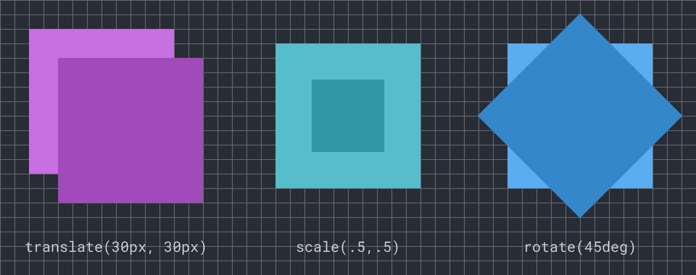
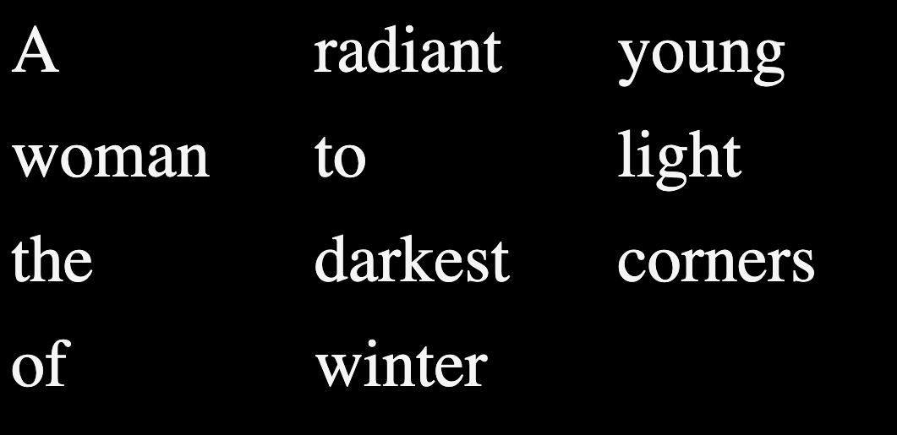
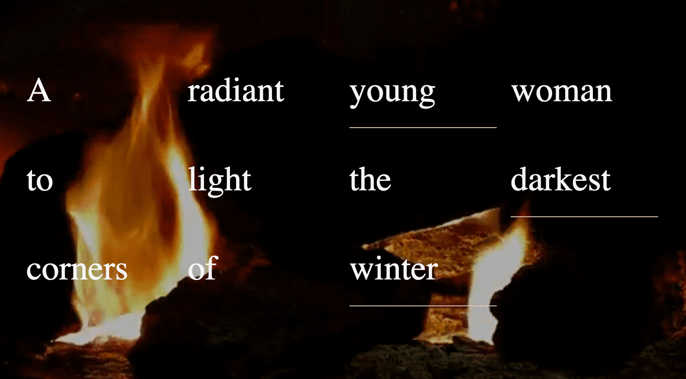

import Excerpt from '@/components/Excerpt.astro';
import Overview from '@/components/Overview.astro';

<Overview>
This article shows methods to create animations for the web using Javascript with CSS.
</Overview>


## Create a Simple Javascript Animation

<Excerpt>This is an excerpt from Module 6.2</Excerpt>

This simple exercise shows how to use Javascript to create animation by changing CSS properties over time with `setInterval()`. 

:::tip
There are many excellent Javascript and CSS libraries for animation, like [anime.js](https://animejs.com/), [p5.js](https://p5js.org/), and [animate.css](https://animate.style/) which we explore later in the book. 
:::

1. To access and change styles on any element you can use the `style` property. Add this code to a script tag before the closing body tag in index.html and test it. This single line of code will change the opacity of everything on the page using a decimal value between 0 and 1. You could select any element on the page but we are using the body to keep the example simple. 

```html
<script>
	document.body.style.opacity = .5;
</script>
```

2. Replace the above line of code with this next sample. The transform property requires a string containing one or more transform functions. The rotate() function uses a degree unit between parentheses. 

```js
document.body.style.transform = `rotate(90deg)`;
```


<figure>


The CSS transform property allows for several fundamental geometric transformations. See this Codepen to experiment with these examples https://bit.ly/cwd-codepen-css-transform 

</figure>


3. Change your script to match the below code which uses a built-in method called `setInterval()` that repeatedly executes a block of code. The `setInterval()` method accepts two parameters (a.k.a. arguments): a block of code that is executed repeatedly, and the interval in milliseconds (1000ms = 1s) that controls the frequency the code block runs. You can see that every 1/10th of a second (or 100ms) the repeated code increases the value of the rotation variable by 5 and then sets the value of `document.body.style.transform`. Test your document and watch as its contents rotate on the Z-axis. 

```js
let rotation = 0;
setInterval(function () {
	rotation += 5;
	document.body.style.transform = `rotate(${rotation}deg)`;
}, 100);
```


4. Continue experimenting with the number values to get a sense of how this block of code affects the page. 


See the above code applied to a button:

<button class="jsRotate bg-blue-500 hover:bg-blue-700 text-white font-bold py-2 px-4 rounded cursor-pointer">See it in action</button>

<script>{`
(()=> {
    let rotation = 0;
    document.querySelector(".jsRotate").addEventListener("click", function(){
        setInterval(function () {
            rotation += 5;
            document.querySelector(".jsRotate").style.transform = "rotate(" + rotation + "deg)";
        }, 100);
    });
})();
`}</script>


:::caution
Refresh the page to reset animations!
:::


## CSS Animation

While Javascript can change values repeatedly using `setInterval()`, CSS has two methods that create motion automatically. A [CSS animation](https://developer.mozilla.org/en-US/docs/Web/CSS/Guides/Animations/Using) uses the `@keyframes` rule to define the start and end values of a tween and the browser renders the frames between. 

1. Remove or comment out the Javascript you added inside the script tag above, and add this block of code to your stylesheet. While the `@keyframes` rule specifies the values and when the property changes, the body rule defines parameters like the name (fadeOut) and duration (2 seconds) of the animation.

```css
@keyframes animFrames {
	0% { transform: rotate(0deg); }
	100% { transform: rotate(360deg); }
}
.cssAnim {
	animation-name: animFrames;
	animation-duration: 2s;
}
```

2. Compare the performance of this with the code from the previous exercise you will see the CSS animation appears smoother. This is because it lets the browser optimize the rendering to minimize the frame-skipping that creates a stuttering effect. While `setInterval()` may be intuitive, a more efficient Javascript method exists called `requestAnimationFrame()`. See the documentation for substituting this method to increase your animation performance.


See the above code applied to a button:


<button class="cssAnimBtn bg-blue-500 hover:bg-blue-700 text-white font-bold py-2 px-4 rounded cursor-pointer">See it in action</button>

<style>{`
@keyframes animFrames {
	0% { transform: rotate(0deg); }
	100% { transform: rotate(360deg); }
}
.cssAnim {
	animation-name: animFrames;
	animation-duration: 2s;
}
`}</style>
<script>{`
(()=> {
    let rotation = 0;
    let cssAnimBtn = document.querySelector(".cssAnimBtn");
    cssAnimBtn.addEventListener("click", function () {
        cssAnimBtn.classList.add("cssAnim");
        setTimeout(function() { cssAnimBtn.classList.remove("cssAnim") }, 2000);
    });
})();
`}</script>


## CSS Transition

1. A [CSS transition](https://developer.mozilla.org/en-US/docs/Web/CSS/Reference/Properties/transition) is different from a CSS animation, defining only the parameters of the transition, but not the start or end values or when they occur. This means your code will need to change properties using an event to start the effect. One benefit of CSS transitions is how easy it is to control when they start. Comment out or remove the previous CSS animation then add this transition to your body tag. 

```css
body {
	transition-property: transform;
	transition-duration: 3s;
}
```

2. Add this code to your script tag in the index file to start the transition. The click listener changes the transform style on the body by adding a random number between 1 and 20 degrees which the CSS transition will animate to the new value. 

```js
let rotation = 0;
document.addEventListener("click", function () {
	let min = 1;
	let max = 20;
	rotation += Math.random() * (max - min + 1) + min;
	document.body.style.transform = `rotate(${rotation}deg)`;
});
```


See the above code applied to a button:


<button class="cssRotate bg-blue-500 hover:bg-blue-700 text-white font-bold py-2 px-4 rounded cursor-pointer">See it in action</button>

<style>{`
.cssRotate {
	transition-property: transform;
	transition-duration: 3s;
}
`}</style>
<script>{`
(()=> {
    let rotation = 0;
    document.querySelector(".cssRotate").addEventListener("click", function () {
        let min = 1;
        let max = 360;
        rotation += Math.random() * (max - min + 1) + min;
        document.querySelector(".cssRotate").style.transform = "rotate(" + rotation +"deg)";
    });
})();
`}</script>


## Prompt Results


<figure>


The lines of the poem presented in rows and columns thanks to the CSS grid.

</figure>

<figure>


The background image is centered in the browser. It appears only once, and the text is juxtaposed on top of it as a well-organized series of divs controlled by CSS grid.

</figure>


<figure>


Our example uses Javascript with CSS transformation properties to explode a grid into a surprising, dynamic composition. https://criticalwebdesign.github.io/book/06-off-the-grid/6-3

</figure>