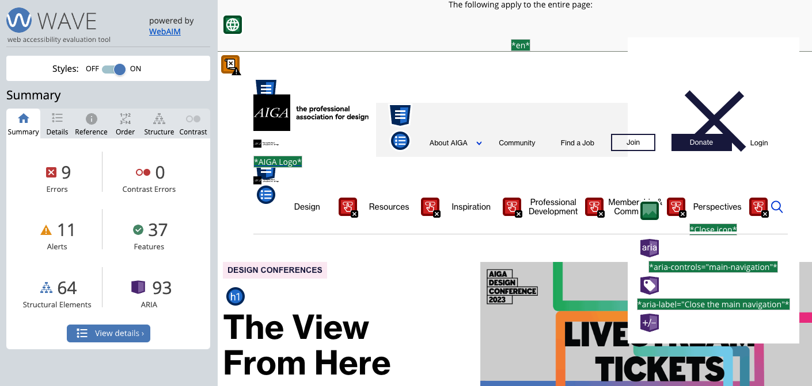
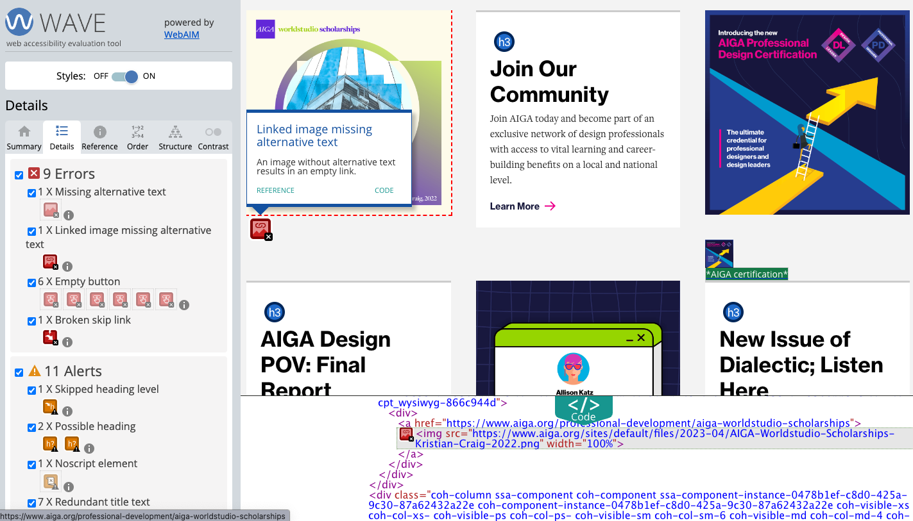
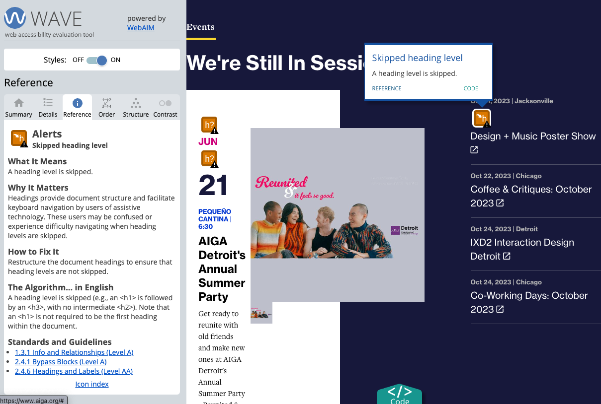
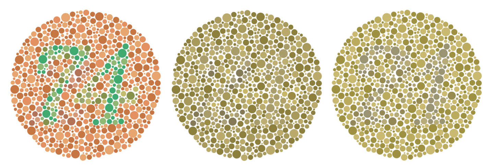

import CustomAside from '@/components/CustomAside.astro';

<CustomAside type="overview">{frontmatter.description}</CustomAside>

## Raise Awareness for Digital Accessibility

In 2023, after analyzing a million home pages, WebAIM found that 96.3% had at least one WCAG 2.0 failure. Out of this survey, they found 50 errors per page on average, including low text and background contrast, missing `ALT` text, and empty links among the most common. Global Accessibility Awareness Day (GAAD) https://accessibility.day is an effort to raise awareness for digital accessibility, and to “get everyone talking, thinking and learning about digital access/inclusion and people with different disabilities.” To contribute to this effort, we invite you to review their information for participating [accessibility.day/spread-awareness](https://accessibility.day/spread-awareness/) then collect data about accessibility and mockup a design that increases awareness for GAAD. To help you towards this goal, in chapter 7 you'll learn how to create a dynamic visualization using data about accessibility. 

## Accessibility Testing Tools

A list of accessibility testing tools that we found to be helpful and intuitive:

- WAVE https://wave.webaim.org/ 
- ANDI https://www.ssa.gov/accessibility/andi/ 
- LERA https://advancedbytez.com/lera/ 

<CustomAside type="excerpt" reference="Context 7.0">Accessibility describes the degree to which a design is usable by the broadest range of individuals, regardless of ability. An accessible design provides equal access and opportunity regardless of whether a user’s ability is permanent, temporary, or situational.</CustomAside>

## WAVE caveats

- This initial display of the WAVE tool and resulting addition of icons and manipulation of web page elements, we found, took some getting used to. However, WAVE is an industry standard that provides potentially valuable feedback regardless of issues we found as of December 2023: 
- The WAVE interface almost always breaks the page layout which makes it messy and hard to use. 
- The design of the WAVE interface itself could be improved. It does not make good use of whitespace, the Summary items are not hotlinked to their respective areas in the tabbed menu, nor does it make a clear distinction between which items are positive or negative accessibility findings on the page.  
- The icons WAVE uses, which contain tiny miniature icons attached to the bottom right (meant to communicate errors, warnings, and everything else) could be greatly improved to make them more readable, cohesive, and potentially, changed to overlay the page instead of interrupting (and breaking) the HTML flow.
- We also found WAVE recommendations to be inconsistent across installations. xtine found "structural tag" warnings with the module 7.3 start file, but Owen encountered none of these regardless of testing using the same file, browser, and operating system. 

<figure>

This screenshot of WAVE’s summary from October 2023 shows errors and alerts drawing attention to elements one could adjust to achieve greater accessibility. 

</figure>

<figure>

There are 9 errors found, including missing alternative text, which we can confirm in the code drawer at the bottom.

</figure>

<figure>

The “Skipped heading level” alert shows where the code presents heading levels seemingly out of order. 

</figure>

<figure>

Results from using the Emulate vision deficiencies option in DevTools. The original Ishihara test image is on the left, followed by the Protanopia and then Deuteranopia (red-green) emulation.

</figure>
