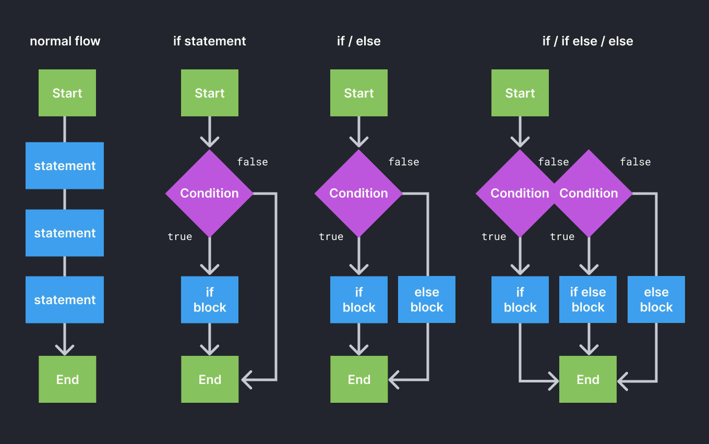
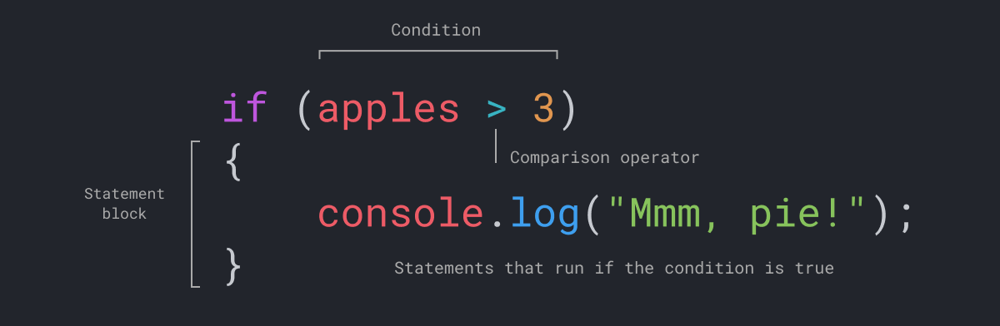

import CustomAside from '@/components/CustomAside.astro';

<CustomAside type="overview">{frontmatter.description}</CustomAside>


## Control Flow

By default, a web browser interprets Javascript code line by line, until it reaches the end. You already learned to control the flow of your program using a `for` loop in Chapter 6, repeating specific blocks of code as many times as needed. Similarly, a **conditional statement** allows you to change which code will run based on the state of information in your program. As the second example illustrates, when a conditional statement is evaluated, it either runs the statement block if the condition is true, or skips to the end when the condition is false. 

<figure>


This diagram demonstrates the normal flow of javascript code, as well as different scenarios using if statements. 

</figure>


To create the branching structures you see in the figure you can use an if statement. As the name suggests, if the expression is true, the following statement block (inside the curly braces) will be executed. Otherwise, if the condition is false, unless you also add an if/else or else block, the code will continue the normal flow. 

This figure shows how an if statement is written. At its core is an expression that returns a boolean value (either true or false) using a comparison operator. 


<figure>


The anatomy of an if statement. 

</figure>


## Comparison Operators

Expressions using comparison operators

Expression | Returns | Notes
--- | --- | ---
`1 == 1` | `true` | The double == returns true if the values are equal and false if not.
`1 == 2` | `false` | 
`1 != 2` | `true` | The != operator returns true if the expression is false.
`1 == "1"` | `true` | Javascript is a weakly-typed language; it will try to convert the value on the left to a string and then compare to find them equal.
`1 === "1"` | `false` | Javascript's special triple === evaluates the condition of both the value and the type of data being compared.
`3 > 1` | `true` | Greater than and less than operators also return a Boolean value

As you noticed in the figures, you can also test other conditions using an `if/else` statement. And finally, you can use an `else` statement to define a default condition. You can also combine conditional expressions using logical operators ( and `&&,` or `||`, not `!`) to combine the results of the expressions and account for more than one variable.


## Logical Operators

Expressions using logical operators

Expression | Returns | Notes
--- | --- | ---
`(1 < 2 && 3 > 4)` | `false` | Use && ("and") to test if both expressions are true
`(1 < 2 || 3 > 4)` | `true` | Use two "pipes" || ("or") to test if either expression is true
`!true` | `false` | Use ! ("not equal") to test if the expression is not true
`!(1 > 2)` | `true` | 


Now we will apply what you’ve learned about control flow by typing the following if statement in the Chrome Console. Open a new browser window and press Command+Option+J to access the Console. This code snippet evaluates more than one condition in an `if`, `if/else`, and `else` statement using comparison and logical operators. Notice how we use a comma to separate multiple variable declarations. What do you think this will output? Test your answer in the console.

```js
let apples = 2, 
    blueberries = 4; 

if (apples >= 2 && blueberries >= 4) {
	console.log("we can make fruit salad")
} else if (apples > 3 || blueberries > 2) {
	console.log("we can make pie!")
} else {
	console.log("we need more fruit")
}
```


:::note[Process of Elimination]
If ever you are coding and run into a hard to solve problem, consider using a process of elimination to find your issue. This can be done in HTML, CSS, JS or any code language (or a situation in life) by disabling or removing factors which make it hard to detect an issue. For example, say you are working on the prompt from this chapter and for some reason you cannot make the background fill the whole page
:::

