import Excerpt from '@/components/Excerpt.astro';
import Overview from '@/components/Overview.astro';

<Overview>{frontmatter.description}</Overview>

## Design Patterns

<figure>

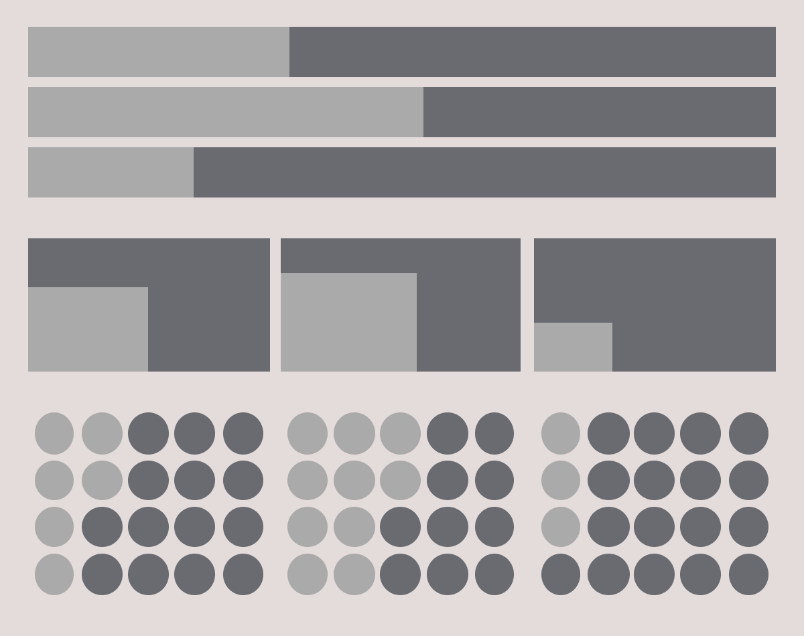
Potential methods for representing proportionality of a value, including (from top) horizontal stacked bar charts, proportional area charts, and icon array charts.

</figure>

## Card Pattern 

<figure>

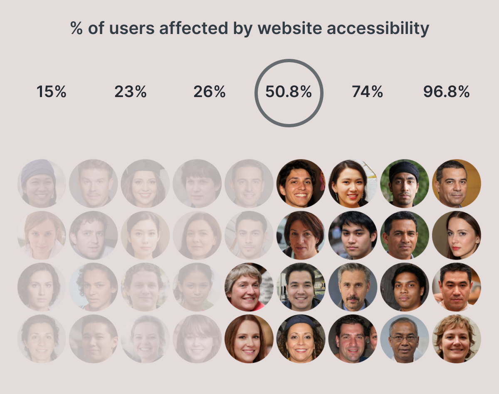
An early design prototype showing 50.8% of users affected by accessibility issues. 

</figure>

<figure>

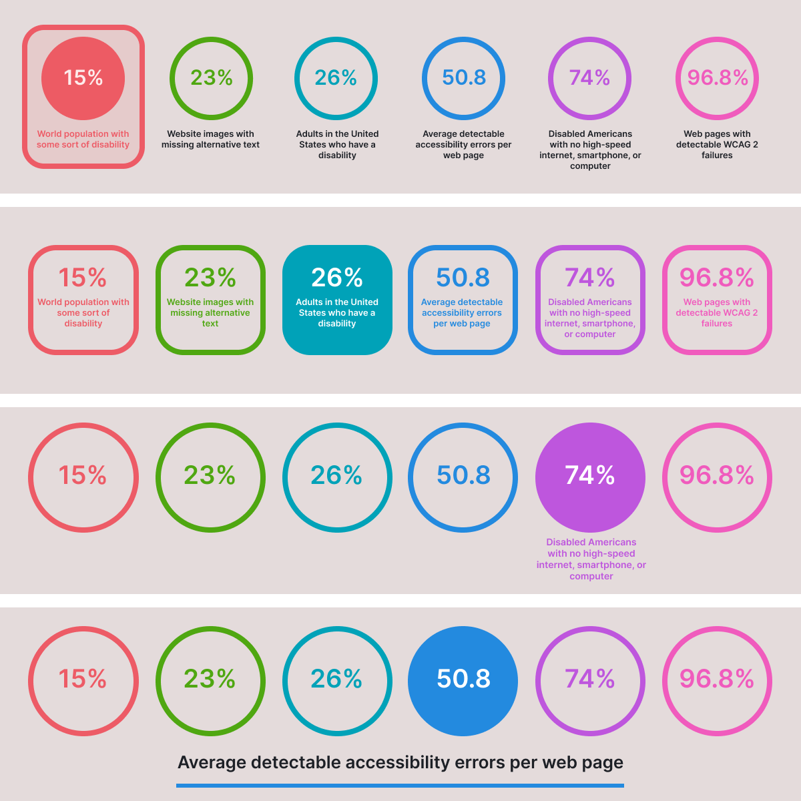
Variations of layouts showing the card pattern used to combine the percentage and text blurb into an interactive menu. 

</figure>

<figure>

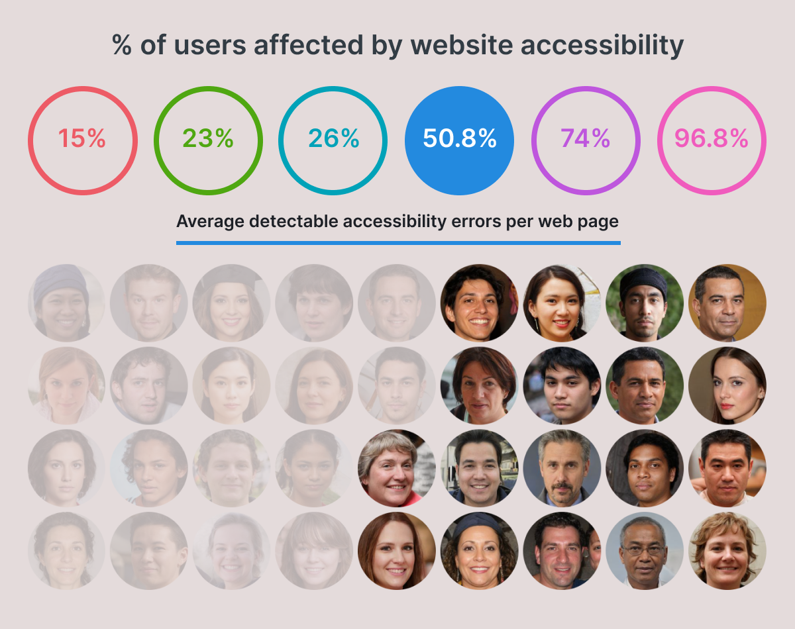
This final design departs from the card to use a progressive disclosure pattern. As users hover over the number values text is revealed underneath to describe the statistic.

</figure>

<figure>

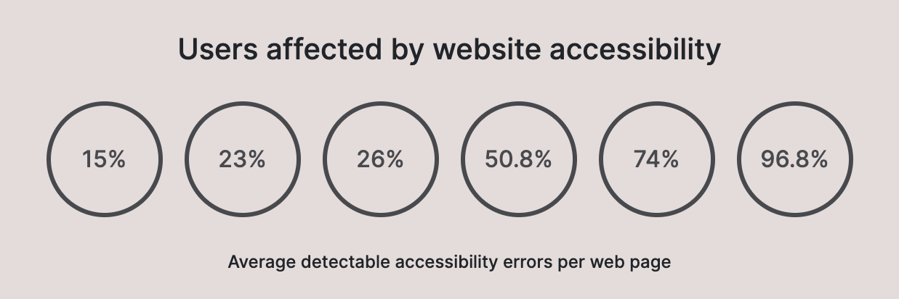
The title, menu with percentage values, and text blurb.

</figure>

<figure>

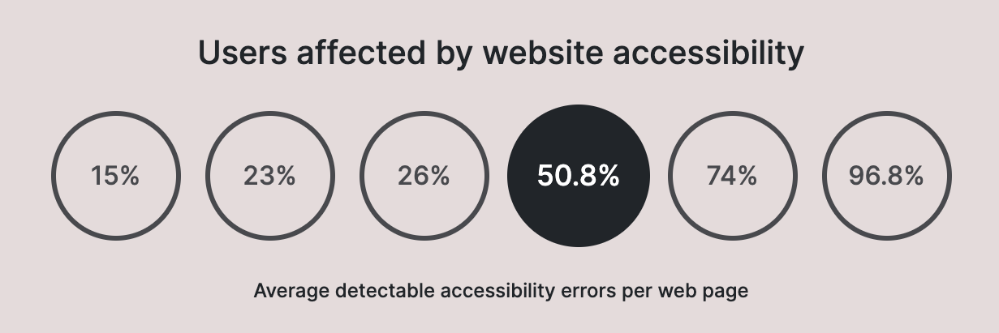
The navigation menu now shows which menu option is currently active.

</figure>

<figure>

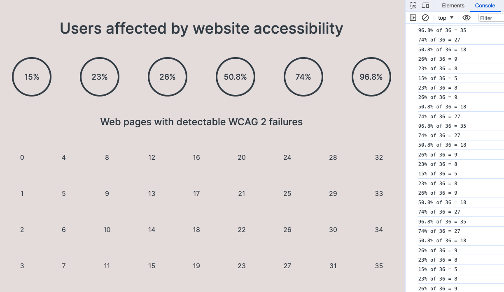
Using numbers to test the for loop.

</figure>

<figure>

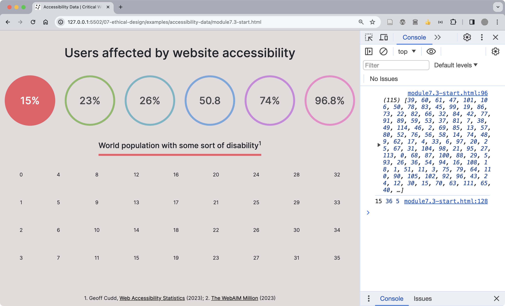
The Console shows the 36 randomized integers selected for the user array, between the numbers 0 and 115.

</figure>

<figure>

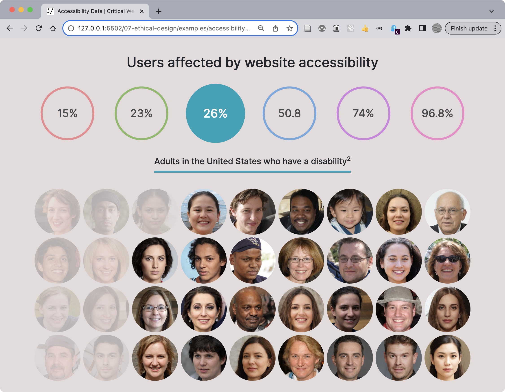
The working example after the above changes.

</figure>

## Implementing Accessible Design

<Excerpt>Following are figures showing test results for our prompt using WAVE.</Excerpt>

<figure>

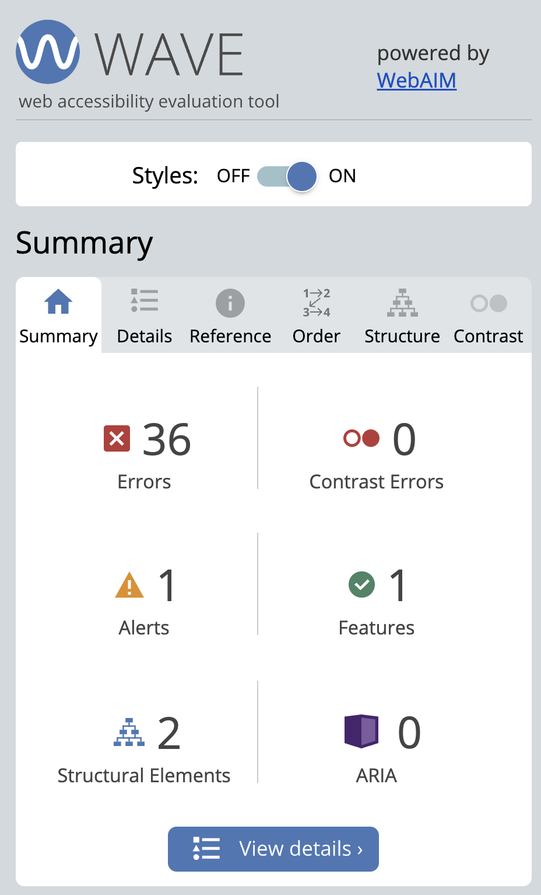
The WAVE tool summary shows errors, alerts, structural elements, and more.

</figure>

<figure>

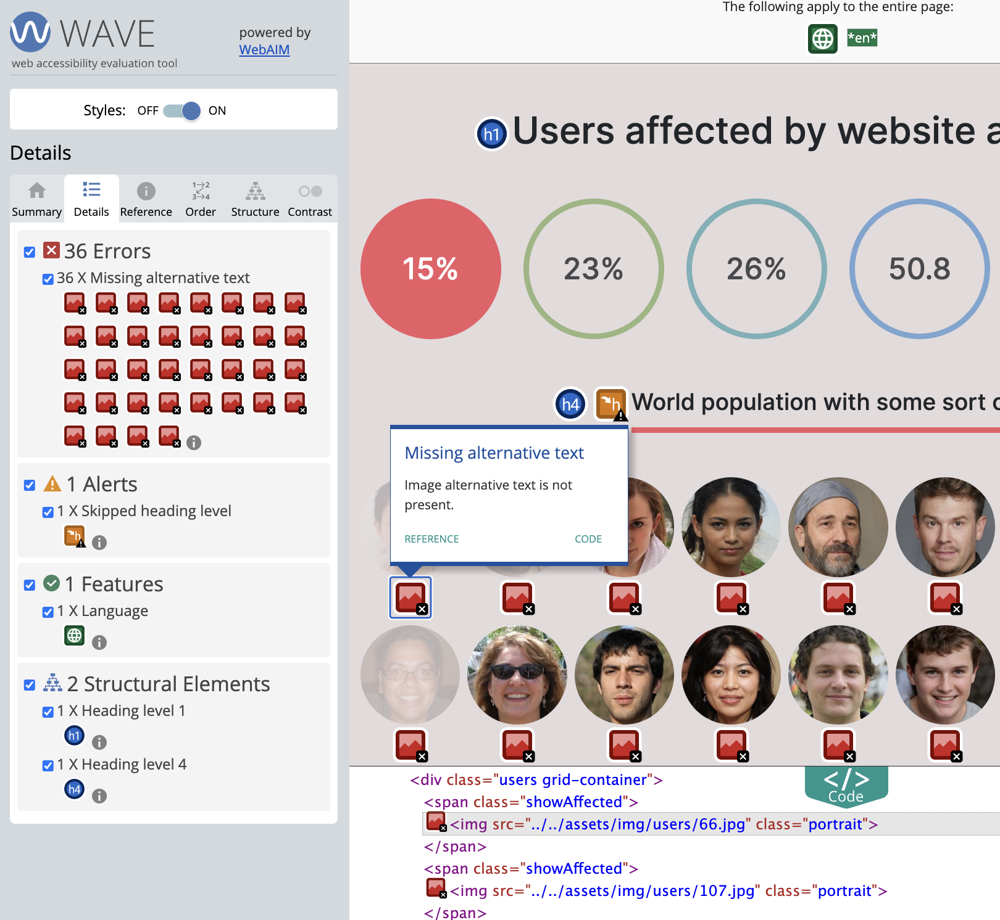
The 36 errors are all cases of missing alternative text for the portrait images.

</figure>

<figure>

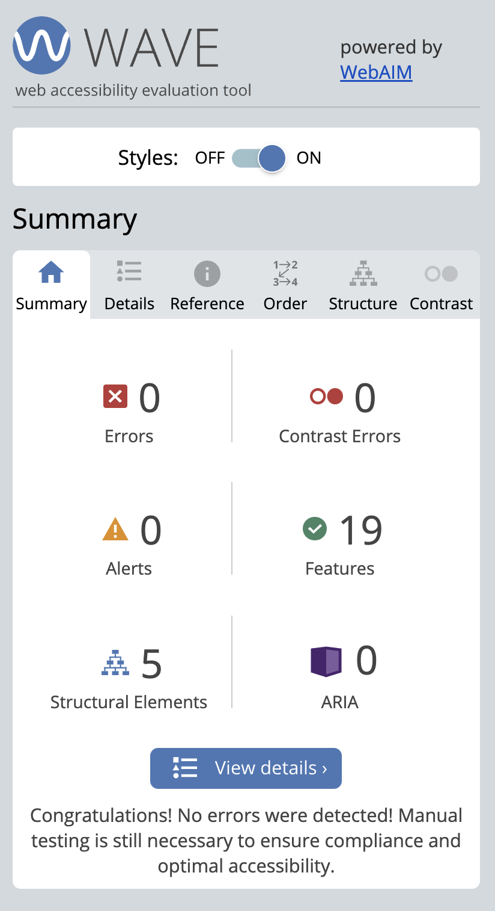
Results of a retest of our page after edits to correct accessibility errors and alerts.

</figure>

<figure>

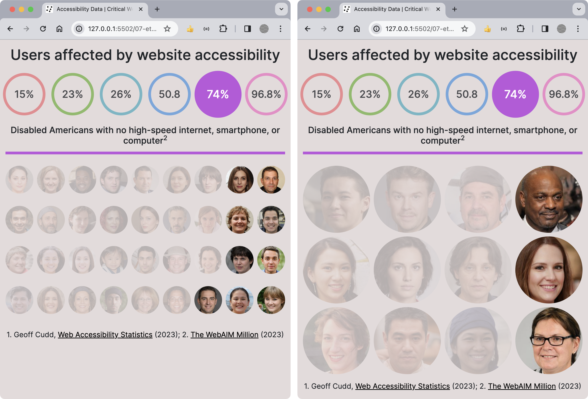
Before and after adding the code to update the number of users based on the viewport size.

</figure>

<figure>

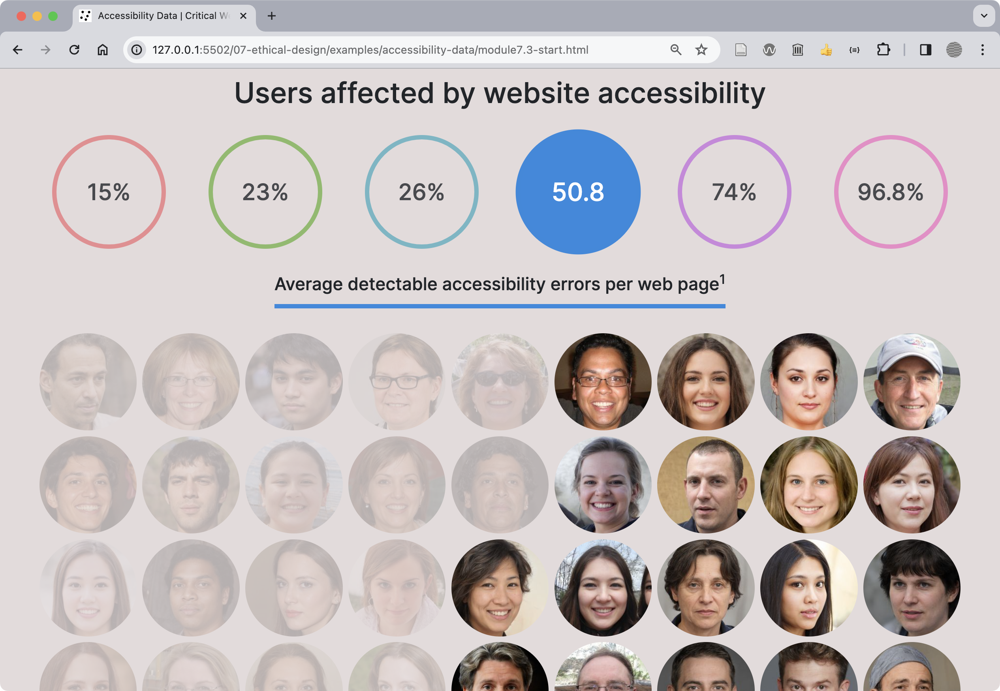
The final design follows accessibility guidelines.

</figure>

:::note[ARIA]
The Mozilla documentation for ARIA includes the following statements from the W3 specification about the importance of semantic HTML and its priority over ARIA landmarks: The first rule of ARIA use is, "If you can use a native HTML element or attribute with the semantics and behavior you require already built in, instead of repurposing an element and adding an ARIA role, state or property to make it accessible, then do so." Read more at https://developer.mozilla.org/en-US/docs/Web/Accessibility/ARIA 
:::

## Related

- [Target to pay $6 million to settle site accessibility suit](https://arstechnica.com/uncategorized/2008/08/target-to-pay-6-million-to-settle-site-accessibility-suit/), 2008
- [Ethical Design: The Practical Getting-Started Guide](https://www.smashingmagazine.com/2018/03/ethical-design-practical-getting-started-guide/), 2018
- [Accessible Websites: Arts Council of Northern Ireland](https://eyekiller.com/blog/accessible-websites-arts-council-of-northern-ireland), 2024

