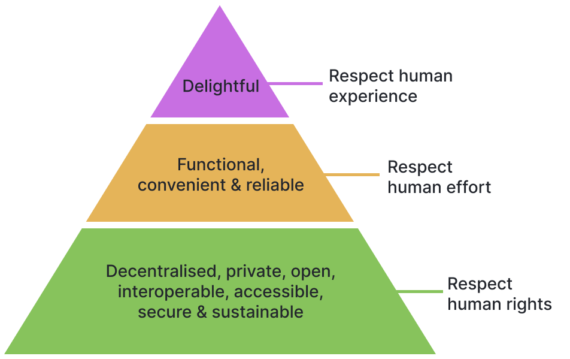
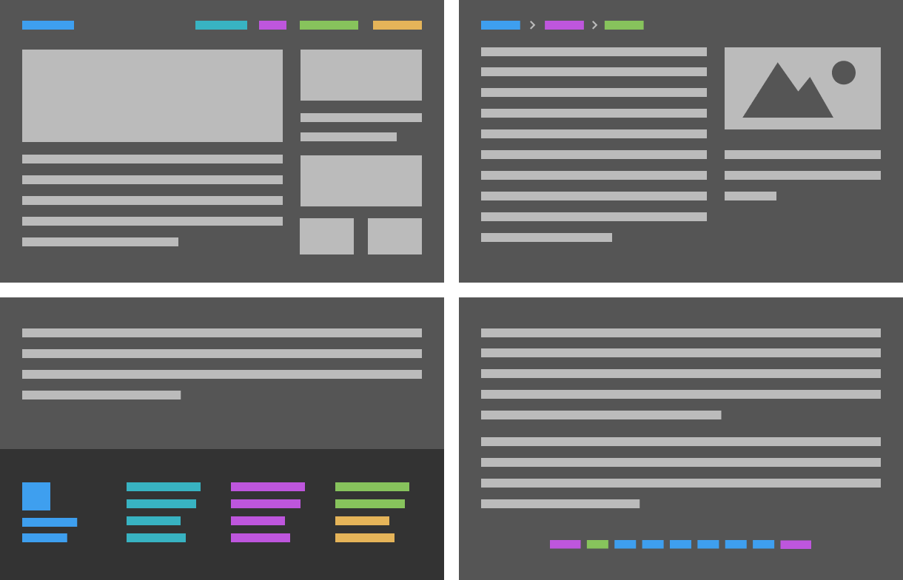
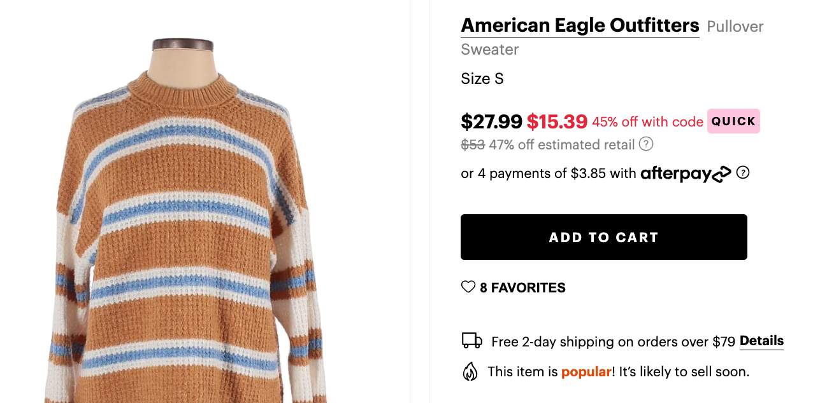
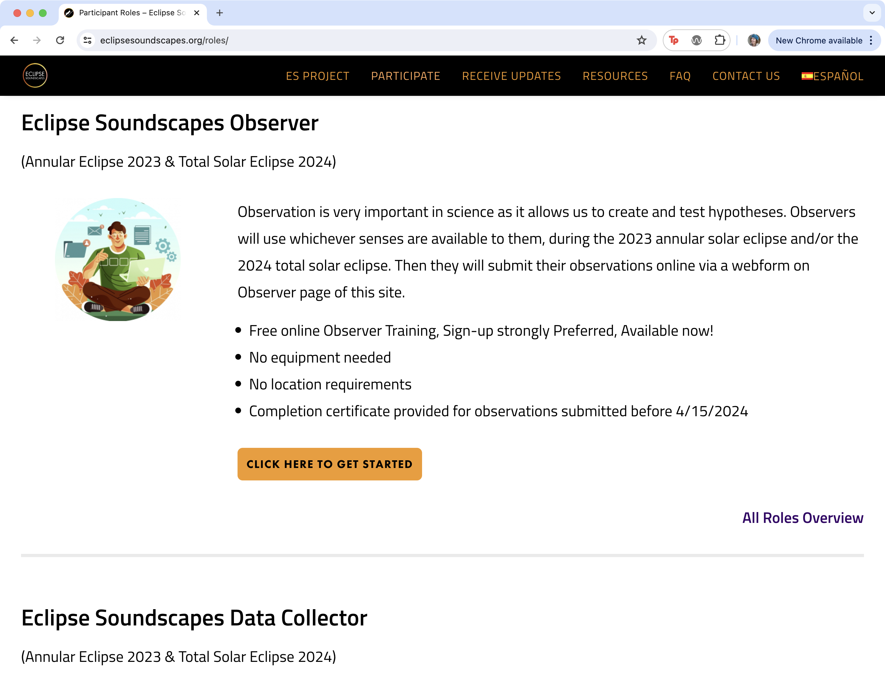

import CustomAside from '@/components/CustomAside.astro';

<CustomAside type="overview">{frontmatter.description}</CustomAside>

## Ethical by Design 

<figure>

Our interpretation of the “Ethical Hierarchy of Needs” (CC BY 4.0) from the Ethical Design Manifesto, created by Aral Balkan and Laura Kalbag https://ind.ie/ethical-design/ 

</figure>

<figure>

A selection of common design patterns for website navigation presented across these four sketches (in color) includes (clockwise from top left) the “main menu,” “breadcrumb,” “pagination,” and “fat footer.”

</figure>

<figure>

Deceptive patterns can be found on many shopping websites that pressure users to complete purchases by informing them that items are in high demand (Fake Social Proof) and/or will likely sell out soon (Fake Scarcity). 

</figure>

## Case Study

<figure>

Reginé Gilbert is an Industry Assistant Professor and James Weldon Johnson Professor at NYU in the Integrated Design & Media program of the Tandon School of Engineering. She lives and works in New York City. Reginé is author of Inclusive Design for a Digital World: Designing with Accessibility in Mind. For the last three years my students have been working on a NASA-funded UX/UI project to make soundscapes of the eclipse accessible for blind and low-vision folks. ARISA Labs received the grant to collect sounds from the eclipse for their Citizen Science project, https://eclipsesoundscapes.org. This project uses technology to study how solar eclipses affect life on earth. For instance, we know that before and after a solar eclipse you won’t hear crickets, but during the eclipse you will, because we have heard recordings of the crickets made by citizen scientists (participants with recorders). These recorded sounds are uploaded to the Zooniverse platform and shared through the EclipseSoundscapes web page. https://eclipsesoundscapes.org

</figure>