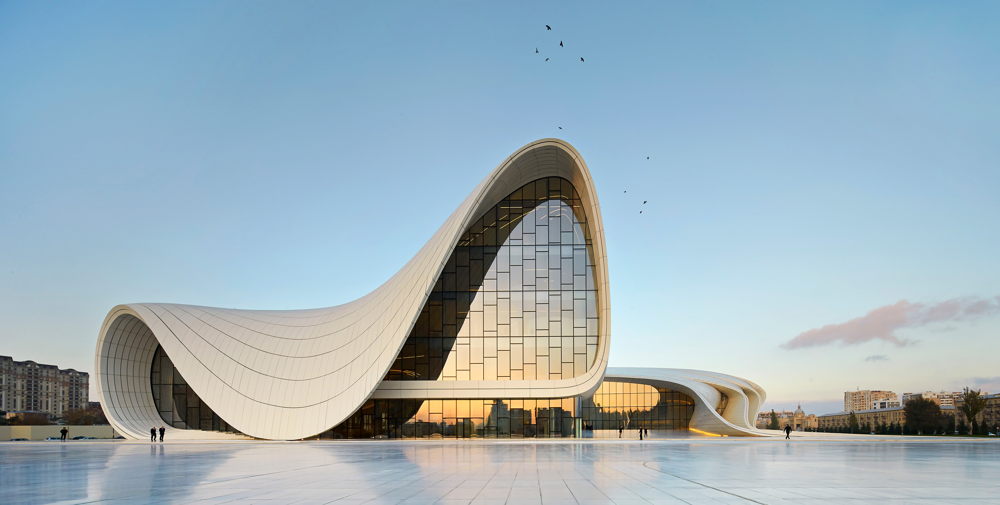
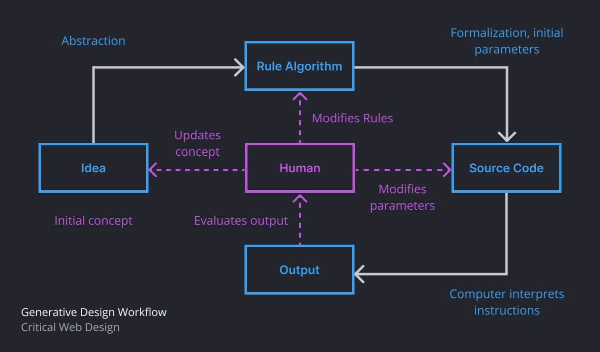
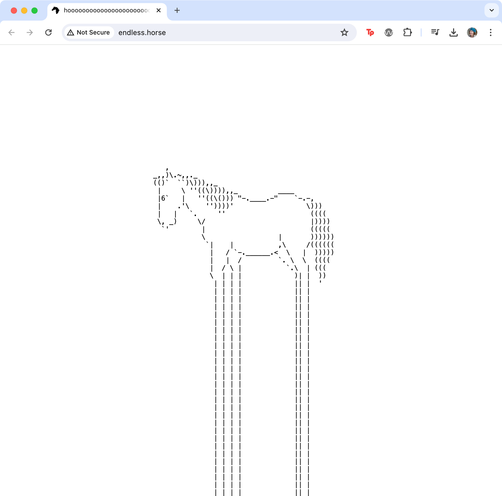
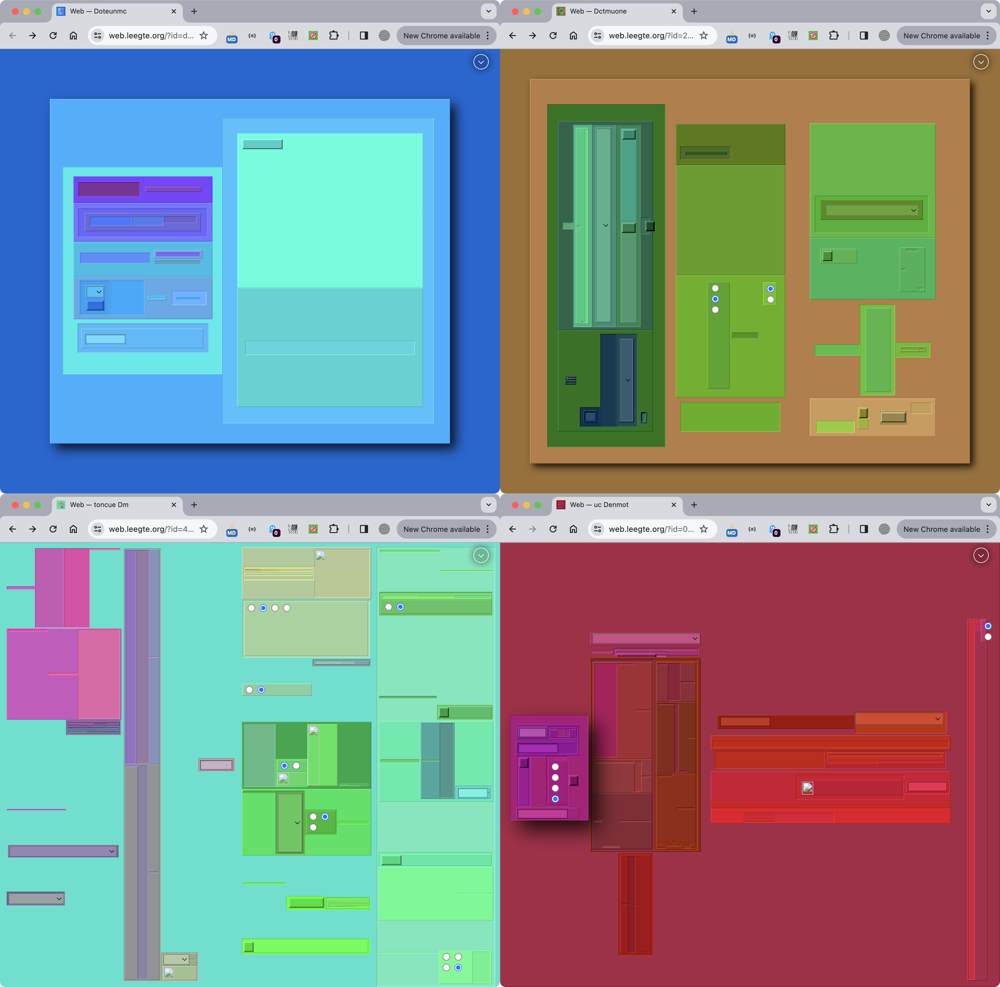
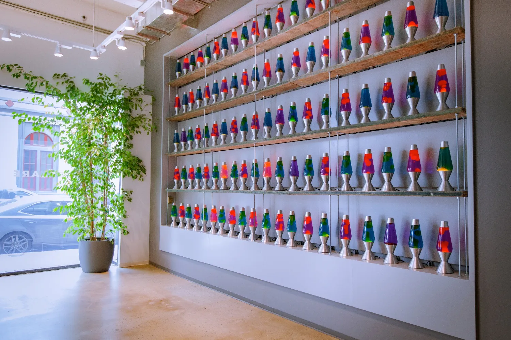
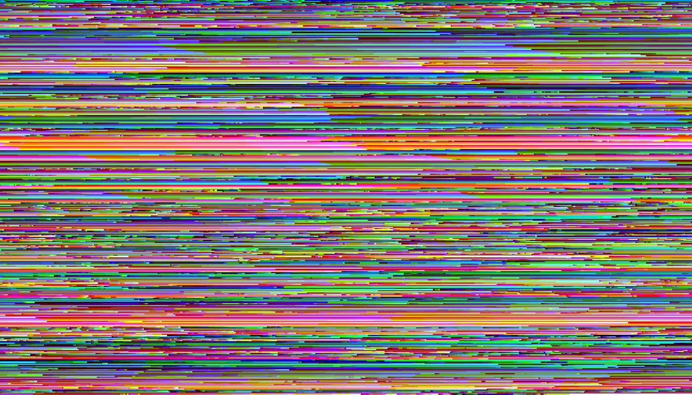
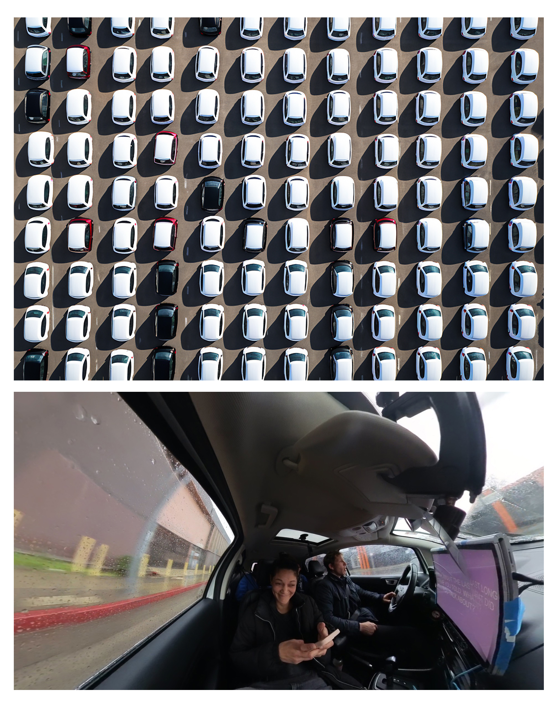

import Excerpt from '@/components/Excerpt.astro';
import Overview from '@/components/Overview.astro';

<Overview>{frontmatter.description}</Overview>

## Generative Design

<figure>

Heydar Aliyev Centre by Zaha Hadid Architects. The studio for the late architect, Zaha Hadid, incorporates systems to produce outputs that are then filtered and improved by humans. The computer is not the producer of the design, but used to automate and save time in the iterative process. 

</figure>

<figure>

Our version of a diagram showing the flow of the algorithmic project from concept to execution is inspired by Hartmut Bohnacker, Julia Laub, Benedikt Groß, and Claudius Lazzeroni’s 2009 infographic in Generative Gestaltung. Our version places the designer at the center of the process. None of the rules, code, or outputs would be initiated or further extended into action without the human putting the idea into play and making decisions following the iterative process.

</figure>

<figure>

endless.horse (2015) by Colleen Josephson and Kyle Miller, created during the Stupid Shit No One Needs & Terrible Ideas Hackathon https://stupidhackathon.com, depicts an ASCII art horse with legs that automatically extend as users scroll. 

</figure>

<figure>

Jan Robert Leegte and Superposition, Web, 2023. *Web* https://opensea.io/collection/web-2023, is a generative cross-linked network of 1000 web pages. The entire network of pages can be explored using the links on any page as a starting point. In addition to each unique generated composition, including its color palette, interface, and even favicon, each document is “on the chain”, making the code for the generated network accessible from any single blockchain record. 

</figure>

<figure>

To increase security the seed for a PRNG must use entropy, like the half-life of radioactive material, or some other unpredictable source. Cloudflare, a web performance and security company, uses pixel data from photographs of a wall of constantly flowing lava lamps to ensure their encryption algorithms cannot be reverse-engineered. Photo courtesy of Wiki author [HaeB](https://commons.wikimedia.org/wiki/File:Lava_lamp_wall_at_Cloudflare_office_-2.jpg).

</figure>

<figure>

Amy Alexander’s Deep Hysteria (2023) reveals gender bias in artificial intelligence by laying bare how AI describes, and therefore understands or “sees,” a series of neutral facial expressions. Alexander writes that the series “repurposes algorithmic bias in the service of unraveling a deep human bias” (https://amy-alexander.com/projects/deep-hysteria/). In conversation with historical renderings of female patients diagnosed with hysteria, Alexander created this AI rendering of “distressed women” using Stable Diffusion to illustrate reflective texts that accompany her project.

</figure>

<figure>

The colors in 1:1 (1999) by Lisa Jevbratt are based on rules she created using data collected via web crawlers. She assigned colors to groups of IP addresses that were accessible on the internet at the time, yet a degree of randomness exists in the outcome thanks to the many uncontrollable factors that contribute to the state of each address, such as dynamic software and databases, glitches and system errors, access to technology, and inclination to contribute to the growth by millions of people, to name a few. 

</figure>

## Case Study

<figure>

Lauren Lee McCarthy, Autonomous, 2024. Photography by David Leonard.

</figure>

