import CustomAside from '@/components/CustomAside.astro';

<CustomAside type="overview">{frontmatter.description}</CustomAside>

## Creative Coding Tools

<CustomAside type="excerpt" reference="Section 8.1.5"></CustomAside>

In this book we prioritize foundational concepts in HTML, CSS, and JS which you can later apply to any project, regardless of what additional tool is trending. Still, we want to share a sample of the many powerful Javascript libraries and frameworks for creating generative design and art online. Many of these libraries were created by artists or designers, some of whom are featured in the book. We hope you experiment with these tools, and continue to seek out others that will advance your critical and creative coding experiences.

-   p5.js https://p5js.org (created by Lauren McCarthy, see the Case Study in this chapter), and the popular Processing programming environment https://processing.org (Ben Fry and Casey Reas) on which the Javascript version is based, have been instrumental in helping artists and designers learn programming concepts to create games, interactive experiences, and data visualizations.
-   SVG.js https://svgjs.dev (Wout Fierens) lets you dig deeper into SVG gradients, bezier curves, and animations. Its powerful functions make manipulating SVG files easier and enjoyable. Search for "SVG" on Codepen to see what other designers are doing with this versatile format.
-   Two.js https://two.js.org (Jonathan "Jono" Brandel) is a two-dimensional drawing library for the web that also lets you output graphics to the page using SVG, HTML Canvas, and WebGL. See his [codepen](https://codepen.io/jonobr1/) for [inspiring examples](https://codepen.io/jonobr1/pen/MWaeWRr) [created using two.js](https://codepen.io/jonobr1/pen/qBONdKX)
-   Paper.js http://paperjs.org (Jürg Lehni & Jonathan Puckey) is a vector graphics scripting framework that uses the HTML Canvas. As with others, check out the inspiring examples on their site.
-   Three.js https://threejs.org (Ricardo Cabello) is a 3D graphics library for the web using JS and WebGL. This framework, and Cabello's (“mrdoob”) personal work, is rooted in the early generative visualizations of the DemoScene and Flash. See his [work](https://mrdoob.com/#/117/fire) at https://mrdoob.com
-   D3.js https://d3js.org (Mike Bostock) is a multi-faceted visualization library popular among data journalists for telling stories with data.
-   Twine https://twinery.org (Chris Klimas) is a tool for telling interactive, nonlinear stories using HTML, CSS, and Javascript. Twine has a huge user base, especially for creating game-like narrative experiences https://itch.io/games/made-with-twine
-   The honorable mention goes to some of the popular UI frameworks we discussed in the introduction. "Reactive" tools like React, Angular, Vue, and Svelte can greatly simplify keeping your page content updated (in reaction to) changes to data in your code. While we considered incorporating them in the exercises (see our experiment with the Svelte UI Framework here https://criticalwebdesign.github.io#string-art-generator), their setup, complexity, and special syntax can add a lot of overhead, making them only helpful for creating large websites.

## Flash

Macromedia’s Flash was a software tool that combined an animation timeline, a highly intuitive vector drawing and tweening tool, and a script editor which allowed creators to attach scripts to keyframes, objects, or events. Flash files could be exported in SWF format and then embedded in HTML. Flash was widespread, inspiring international conferences, and artists, designers, game developers across the web. Adobe, who purchased Macromedia, has mostly discontinued Flash today due to performance, accessibility, and security issues on mobile devices. While publishing Flash projects online is no longer possible one can still find evidence of its impact on generative design:

-   Flash Math Creativity (see photos http://levitated.net/bones/flashmath/photos.html) with interviews and sample code from generative artists and designers
-   Jared Tarbell https://www.artnome.com/news/2020/8/24/interview-with-generative-artist-jared-tarbell
-   Paul Prudence https://www.transphormetic.com/
-   Manny Tan https://experiments.withgoogle.com/search?q=Manny%20Tan
-   The New York Times has recently made it possible to view all their interactive reporting built using Flash in their archives. See: Robert Kosara, “The New York Times Now Has a Web Flash Player,” (January 8, 2024) https://eagereyes.org/blog/2024/nytimes-web-flash-player.

## Generative Art and Design

<figure>

{/* 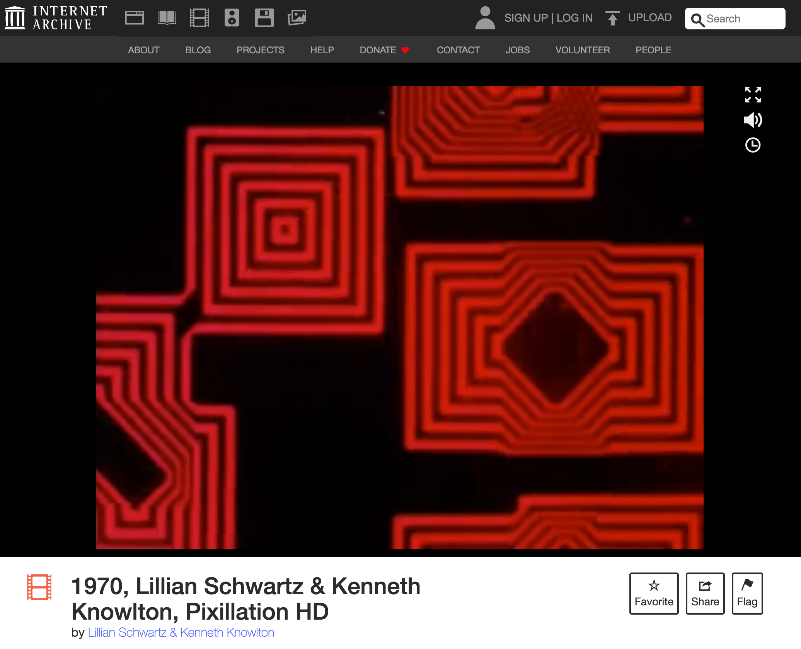 */}

import YoutubeVideo from '@/components/YoutubeVideo.astro';

  <YoutubeVideo src="https://www.youtube.com/watch?v=XAlXN-F2vPQ" />

Lillian Schwartz & Kenneth Knowlton, Pixillation HD, 1970. In this film, Schwartz developed an editing technique that synthesized computer code, black and white pixels, and hand-drawn colored animation to create abstracted pixel-like movement with a seemingly saturated color palette. See https://archive.org/details/1970LillianSchwartzPixillation.

</figure>

<figure>

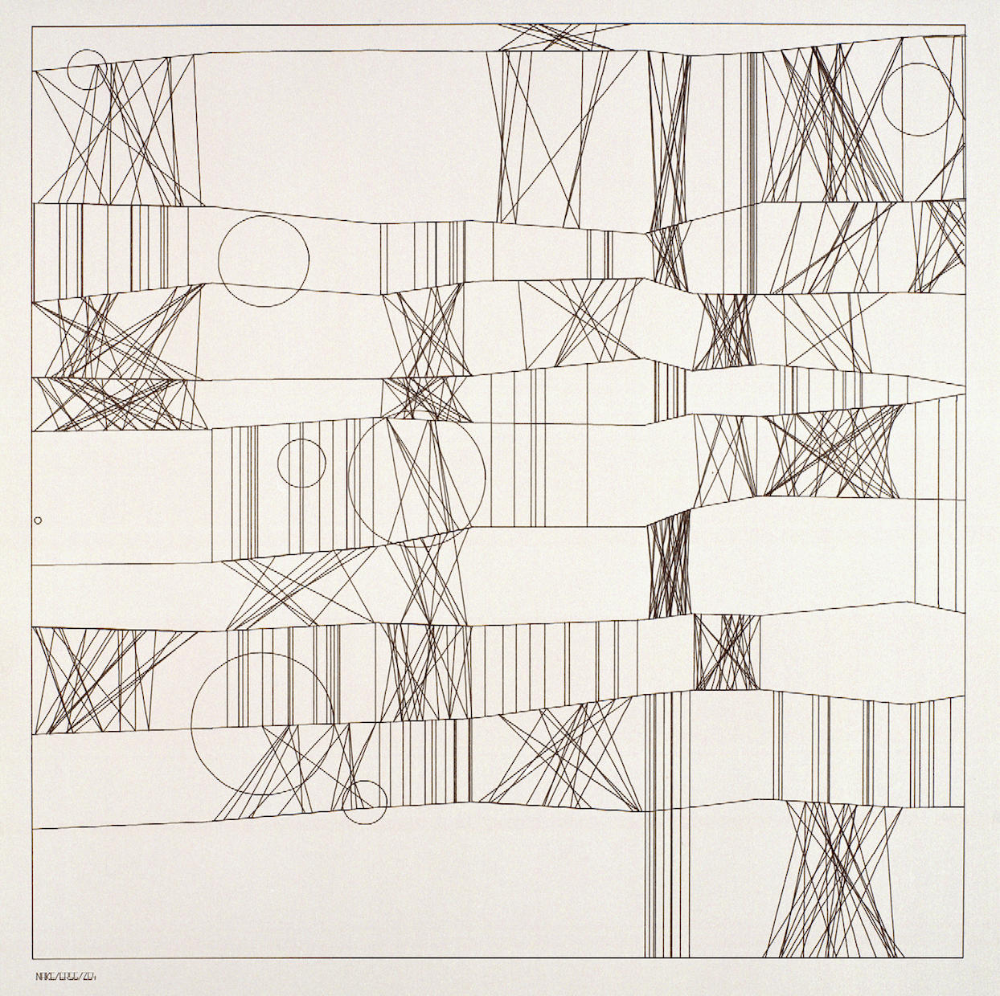
Frieder Nake, 13/9/65 Nr. 2 (“Homage to Paul Klee”), 1965.

</figure>

<figure>

Casey Reas created 923 EMPTY ROOMS #874 using P5.js, see https://arttab.xyz/?id=114. 

</figure>

More inspiring examples of generative art and design

-   A browser extension that shows curated generative works when you open a new tab https://arttab.xyz/
-   A selection of generative projects https://www.artblocks.io/
-   Generative Design: Visualize, Program, and Create with JavaScript in p5.js, 2nd Edition (2018) https://generative-gestaltung.de
-   Form+Code in Design, Art, and Architecture (2010) https://formandcode.com
-   Generative design tutorials and examples https://generativeartistry.com/
-   Google Experiments https://experiments.withgoogle.com/
-   https://www.rightclicksave.com/article/an-interview-with-frieder-nake

<figure>

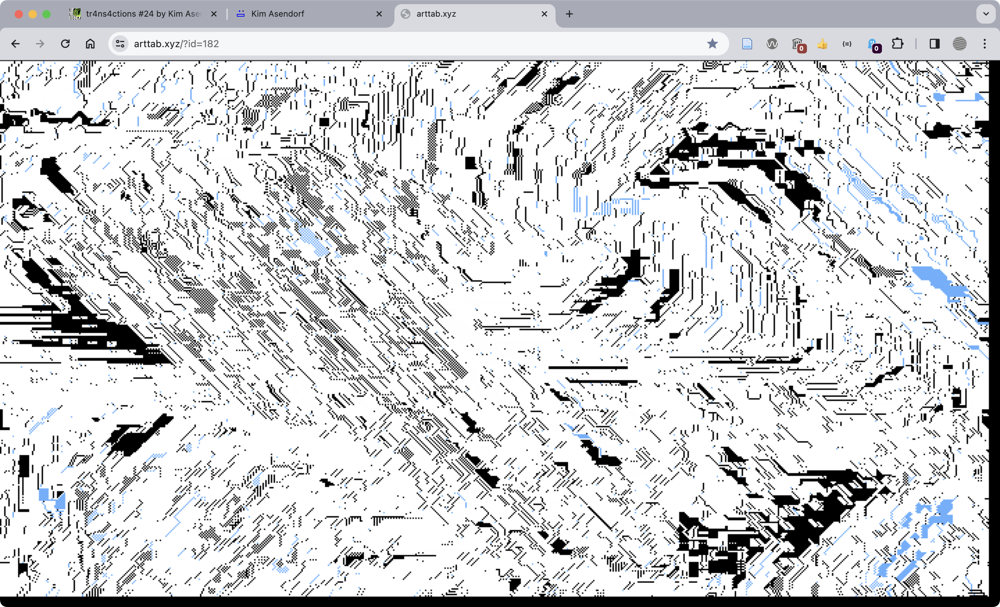
Work by Kim Asendorf https://naz.cx/ available in ArtTab https://arttab.xyz/ a chrome extension that features a vast collection of dynamic artworks https://arttab.xyz/explore

</figure>

## Electronic and Generative Literature

Examples related to computational, electronic, or generative literature/poetry

-   The Electronic Literature Archives https://eliterature.org/electronic-literature-archives/
-   The Electronic Literature Organization https://eliterature.org/
-   The New Media Writing Prize https://newmediawritingprize.co.uk/
-   The New River: A Journal of Digital Art & Literature https://thenewriver.us/
-   The School for Poetic Computation https://sfpc.study/
-   Taper https://taper.badquar.to/

<figure>

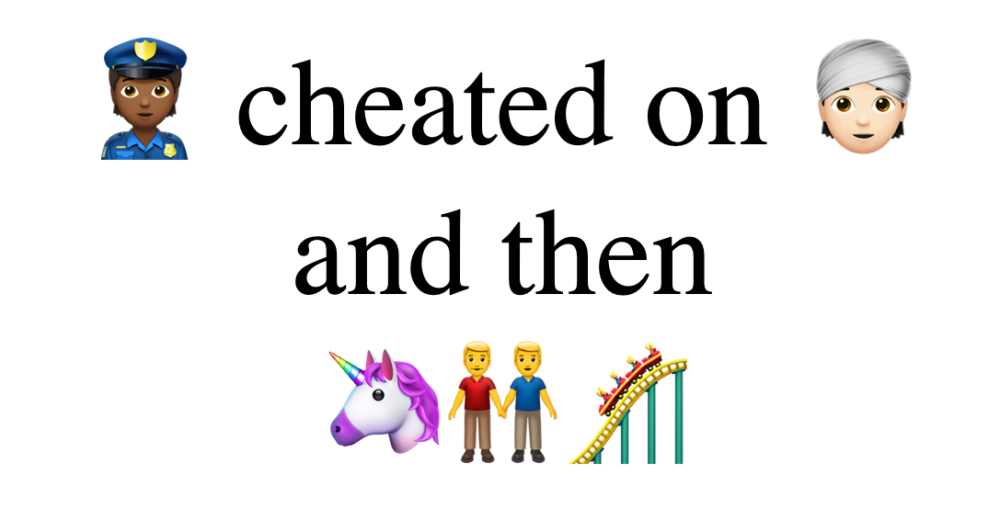
{/* 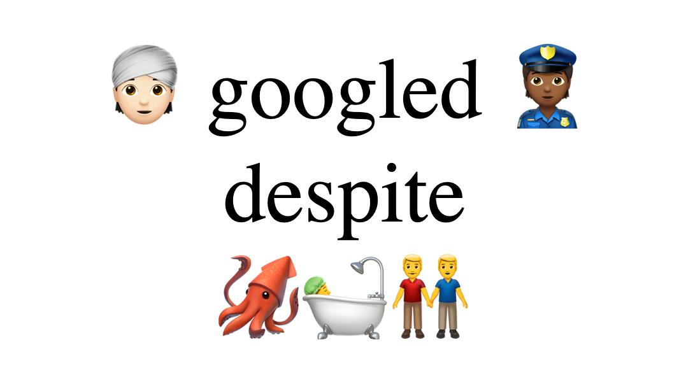
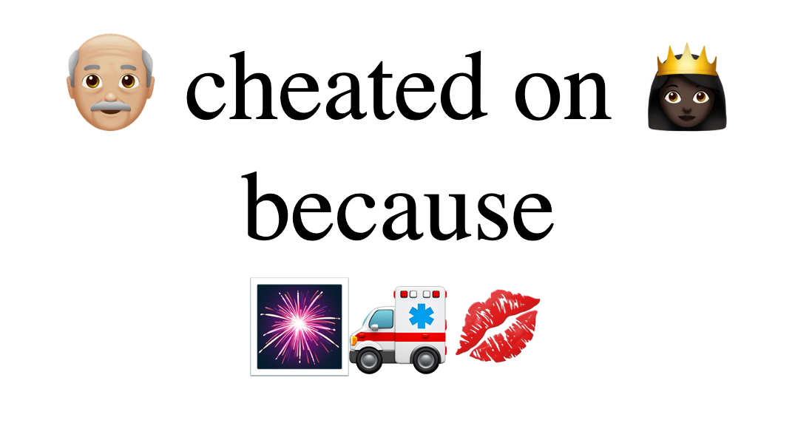
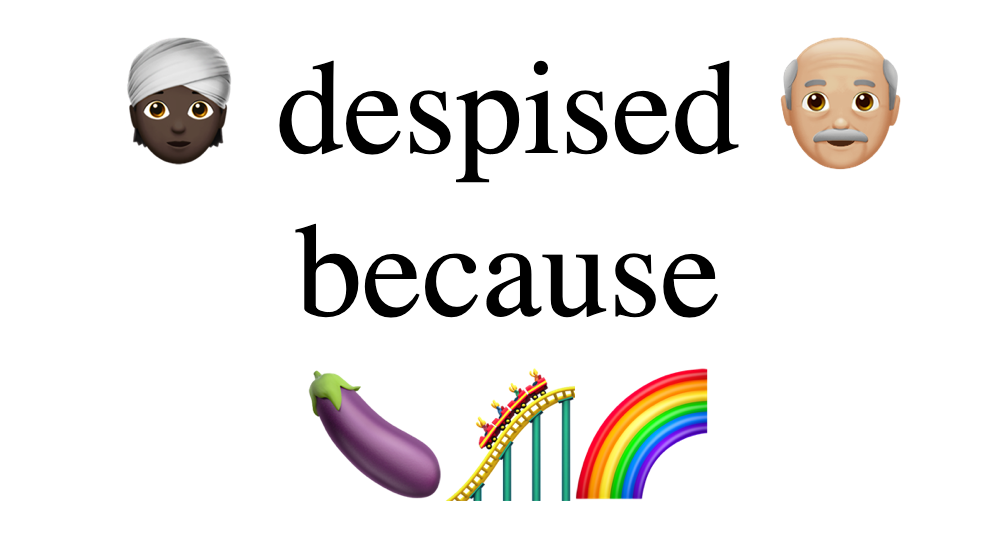 */}
Two Moji: A Modern Epic of Love and Betrayal https://taper.badquar.to/2/two_moji.html (2018) by Mark Sample generates infinite dramatic stories depicting guilty pleasure, forbidden romance, and crimes of passion using only emoji and Javascript.

</figure>

<figure>

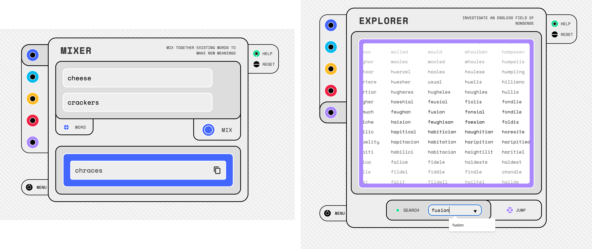
Allison Parrish, The Nonsense Laboratory, 2021, https://experiments.withgoogle.com/nonsense-laboratory. 

</figure>

<figure>

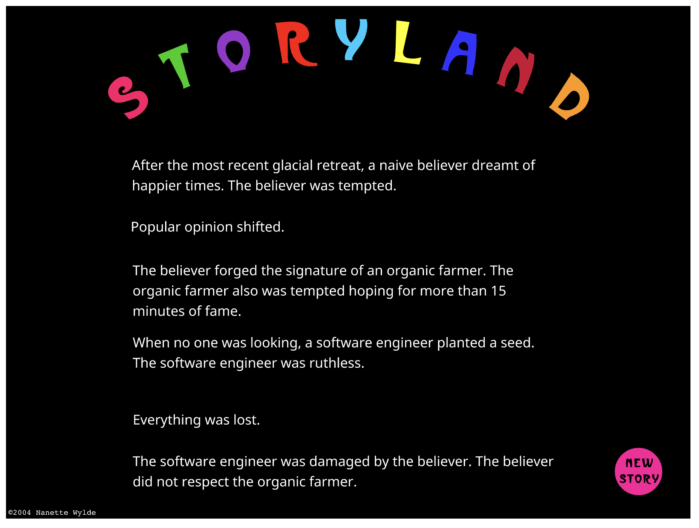
{/* 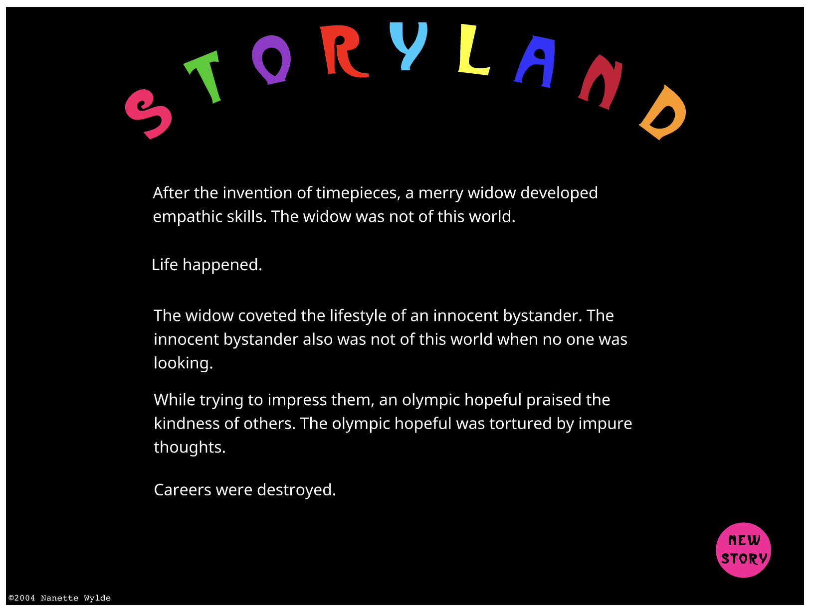 */}
A pioneering work demonstrating these connections is Nanette Wylde’s [Storyland](https://collection.eliterature.org/1/works/wylde__storyland.html ). Wylde describes the project as “a randomly created narrative which plays with social stereotypes and elements of popular culture.” This work was developed in 2002, revised for a second version in 2004 with the now outdated application and web format Flash, and recently preserved for viewers with [Ruffle](https://github.com/ruffle-rs/ruffle) (a Flash Player emulator written in Rust) by the Electronic Literature Lab in 2023. It is archived in [Volume 1 of the Electronic Literature Archive](https://collection.eliterature.org/1/index.html).

</figure>

## Generative Design in Games

<figure>

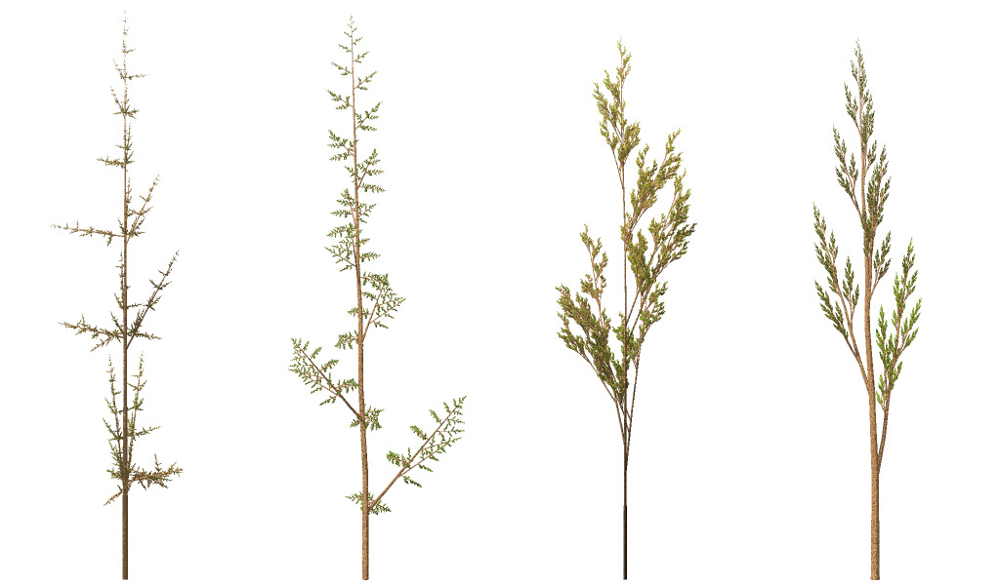
An example of procedural generation using the symbols, rules, and recursive nature (fractals) of an L-system to “grow” 3D models of weeds. Image uploaded to Wikipedia by user [Solkoll](https://en.m.wikipedia.org/wiki/File:Fractal_weeds.jpg). 

</figure>

<figure>

Four screenshots from No Man’s Sky (2016) which used procedural generation to create over 18 quintillion planets, each with their own ecosystem and unique flora, fauna, and alien species.

</figure>

Related examples found in video games

- https://gigl.scs.carleton.ca/sites/default/files/ling_xu/treemodelingwithguidingvectors.pdf
- https://www.google.com/search?q=procedural+generation&tbm=isch
- https://taper.badquar.to/2/tty.html
- https://en.wikipedia.org/wiki/Development_of_No_Man%27s_Sky
- https://en.wikipedia.org/wiki/Conway%27s_Game_of_Life
- https://en.wikipedia.org/wiki/Boids

## Demoscene

Another important influence on the history and practice of generative art is the demoscene, a subculture of hackers, clubs, and competitions (a.k.a. demoparties) (Figure 8.x) that blended creativity, hacking, and hardware testing. Emerging in Europe during the 1980s, demos were small self-contained computer programs written to test computer hardware capabilities using the most intense algorithmically-generated graphics and audio effects of the time. Typical competition categories restricted the size of the demo's executable, the compiled code packaged into a single file, by overall size (e.g. 1k, 4k, or 64k), and platform (8-bit like Atari or Commodore 64 or 16 bit Amiga). While the results (like "[PC DOS Demoscene mix](https://www.youtube.com/watch?v=O4T7pIs--LA)" or "[Hologon by The Electronic Knights [Amiga 500]](https://www.youtube.com/watch?v=pYtleuGV7ok)") might appear simplistic today, their output can be appreciated for their technical and artistic constraints when considering the abundant limitations on their hardware and access to programming resources (Stinson, Liz. “[The Ever-Changing Art of the Screensaver.](https://eyeondesign.aiga.org/the-ever-changing-art-of-the-screensaver/)” in Eye on Design).

<figure>

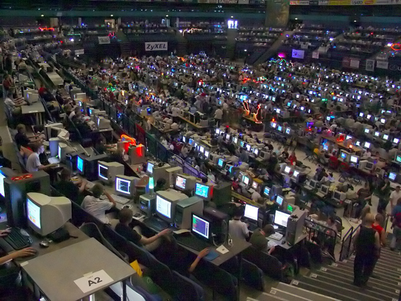
Hackers gathered in an ice rink during the 2004 Assembly demoscene party in Finland

</figure>

## Generative Interfaces

Example generative art and design web interfaces

- The NSynth Sound Maker (2017) by Yotam Mann https://experiments.withgoogle.com/sound-maker
- Pixeldudesmaker by 0x72 https://0x72.itch.io/pixeldudesmaker
- itch.io is popular for publishing indie games, but also showcases an impressive collection of procedural generators https://itch.io/tools/tag-procedural
- Pippen Barr https://pippinbarr.com/itisasifyouweredoingwork/
- https://galaxykate0.tumblr.com/post/139774965871/so-you-want-to-build-a-generator

<figure>

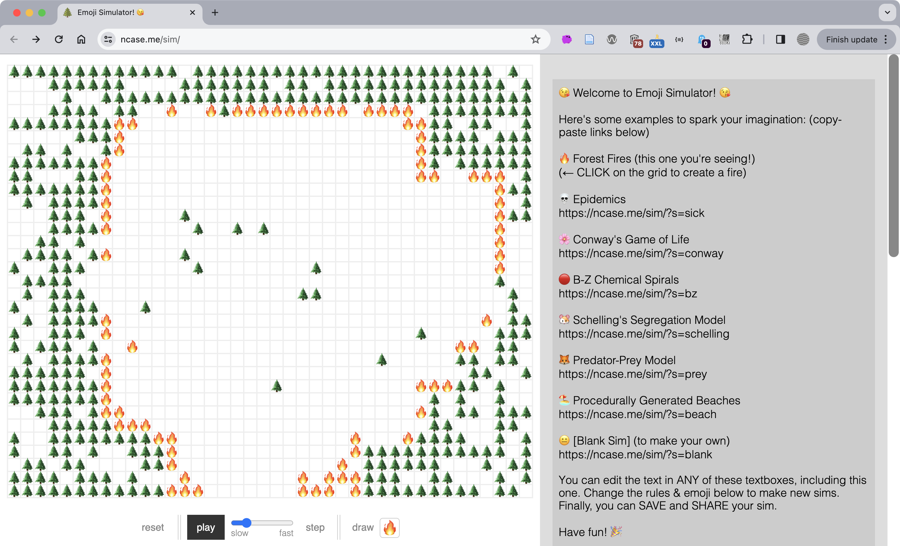
Nicky Case’s Emoji Simulator https://ncase.me/sim/ creates generative emoji “worlds” using Conway’s Game of Life and other systems. 

</figure>

<figure>

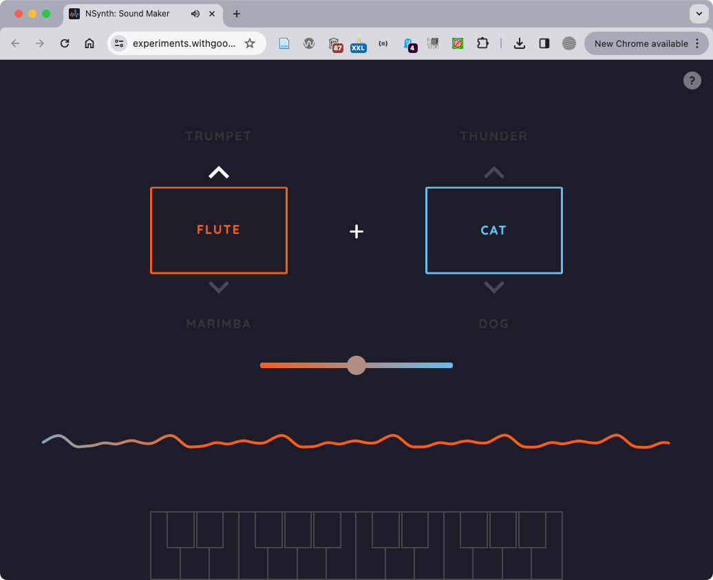
The NSynth Sound Maker (2017) https://experiments.withgoogle.com/sound-maker by Yotam Mann uses machine learning trained with a neural network of over 300,000 instrument sounds. 

</figure>

<figure>

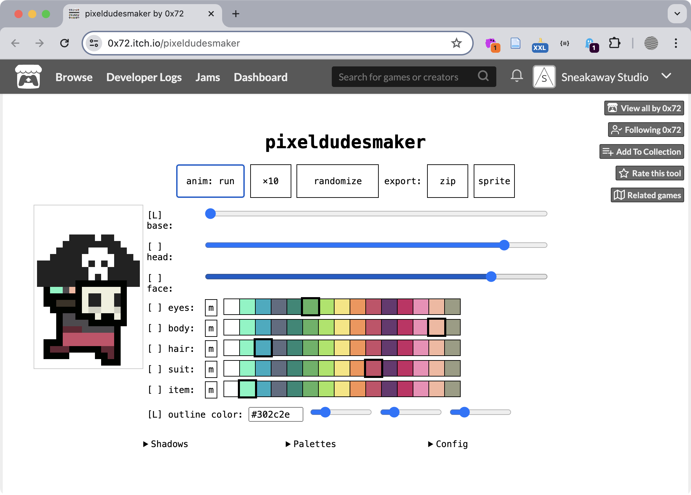
Pixeldudesmaker by 0x72 https://0x72.itch.io/pixeldudesmaker lets you modify your preferences after an initial completely random output. See other procedural generator interfaces on the Chapter 8 wiki.

</figure>
