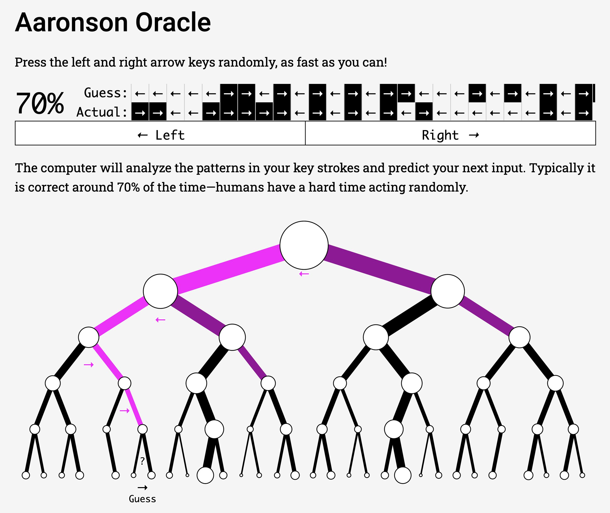

import Excerpt from '@/components/Excerpt.astro';
import Overview from '@/components/Overview.astro';

<Overview>{frontmatter.description}</Overview>

## Can You Be Random?

Computers can be programmed to mimic human reasoning using rules based on statistical averages. In this activity you will explore just how well a simple computer program can predict your actions using an Aaronson Oracle. 

1. Visit the links below and follow the instructions to play the game. Don't read the information about the prediction methods yet, just use your “free will” for your initial response.
    - Adam Pearce’s [Aaronson Oracle](https://roadtolarissa.com/oracle/) mimics a coin toss using left/right arrows 
    - Nick Merrill's [Aaronson Oracle](https://people.ischool.berkeley.edu/~nick/aaronson-oracle/index.html)
    - The New York Times uses the technology in a classic [Rock Paper Scissors game](https://nytimes.com/interactive/science/rock-paper-scissors.html)  
2. Was the computer able to predict your response? If you were able to fool the computer by being truly random, the average would be closer to a 50% win rate (100% / 2 players) or a statistical tie. With enough data, the computer programs should be able to predict your actions about 70% of the time. 
3. How does it work? These examples predict your guess by comparing your most recent guesses to your previous patterns. As it turns out, "humans have a hard time acting randomly", and even a simple program can track and find patterns in your behavior.

<figure>

Aaronson Oracle (2019) by Adam Pearce https://roadtolarissa.com/oracle/ based on Nick Merrills’ work of the same name, is a program that can predict your key presses. 

</figure>
