import CustomAside from '@/components/CustomAside.astro';

<CustomAside type="overview">{frontmatter.description}</CustomAside>

## Chapter Prompt

<figure>

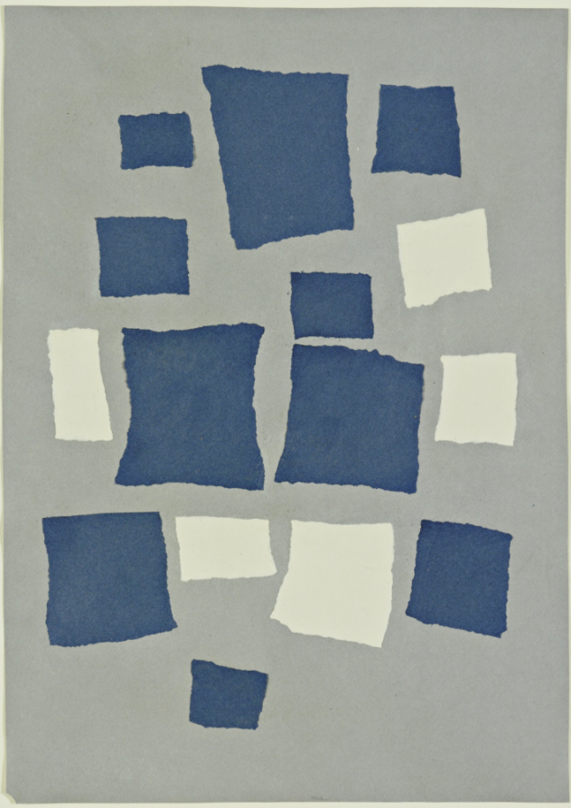
Untitled (Collage with Squares Arranged according to the Law of Chance) can be found on the Museum of Modern Art’s website: https://www.moma.org/collection/works/37013

</figure>

<figure>

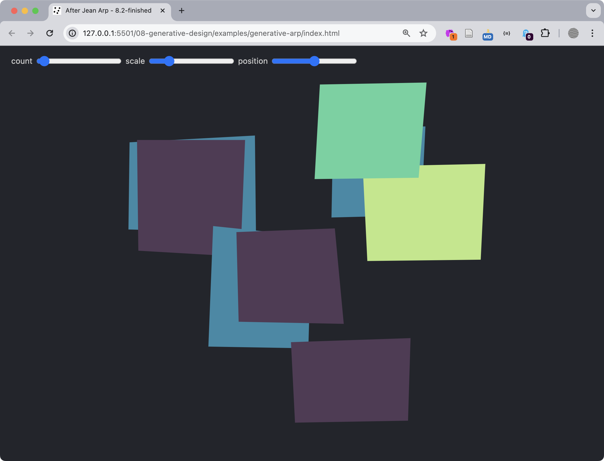
A screenshot from our Generative Arp https://criticalwebdesign.github.io/book/08-generative-design/8-3/

</figure>

## Generative Arp Process

<figure>

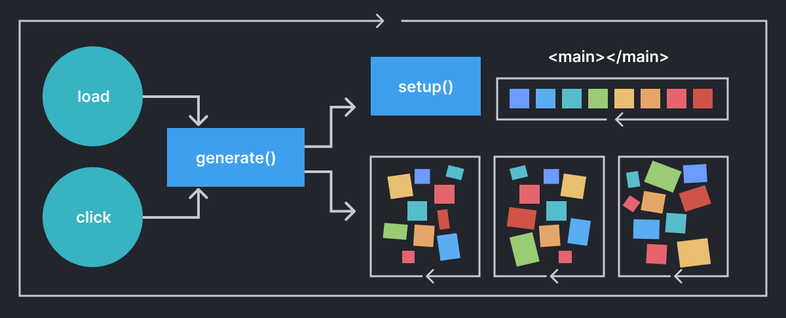
A visual flowchart showing the flow of the program described by the pseudocode.

</figure>

<figure>

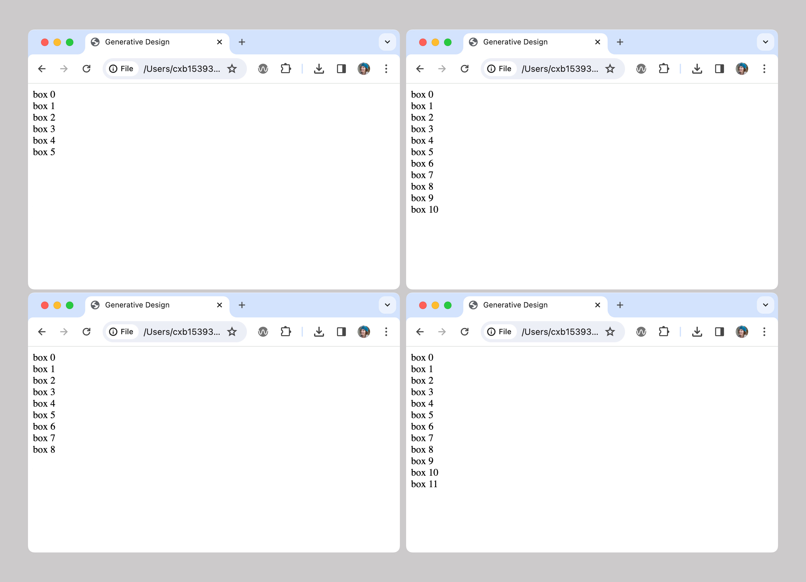
Four examples of outputs producing a random number of divisions that would hold polygons in later exercises.

</figure>

<figure>

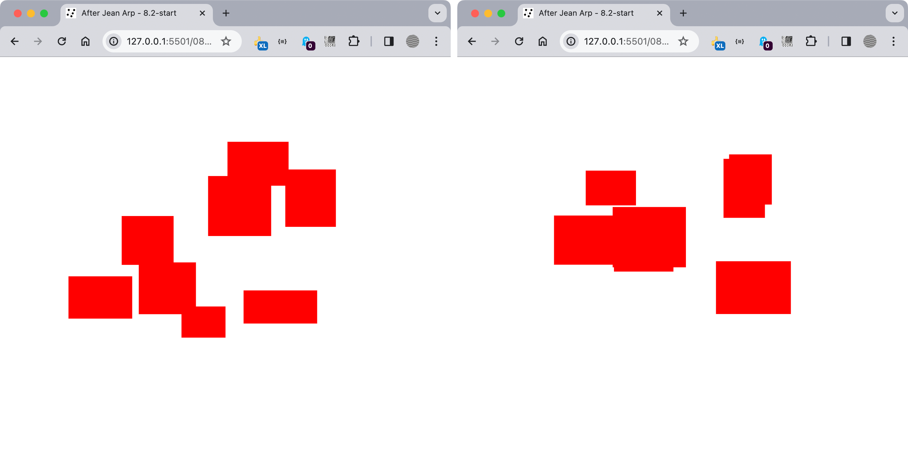
Two instances of Generative Arp show a random number of rectangles in red.

</figure>

<figure>

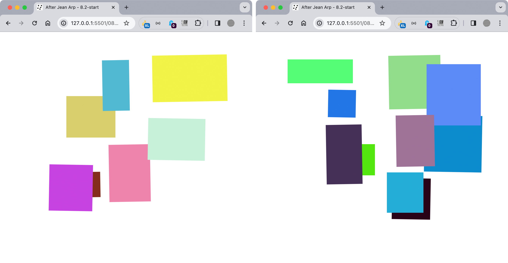
Two instances of Generative Arp with various colors and rotations.

</figure>

## 8.2 SVGs and Color Arrays

<figure>

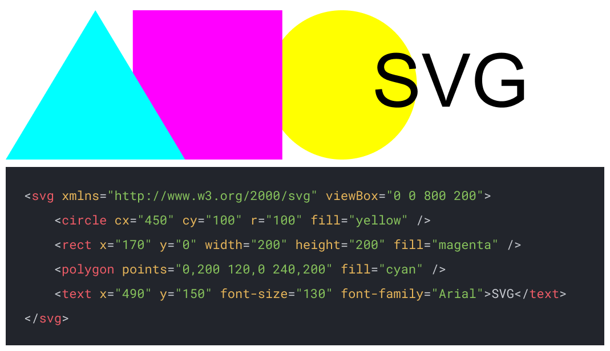
SVG images https://www.w3schools.com/graphics/svg_intro.asp are created using XML (eXtensible Markup Language), making their code easy to understand like HTML. 

</figure>

<figure>

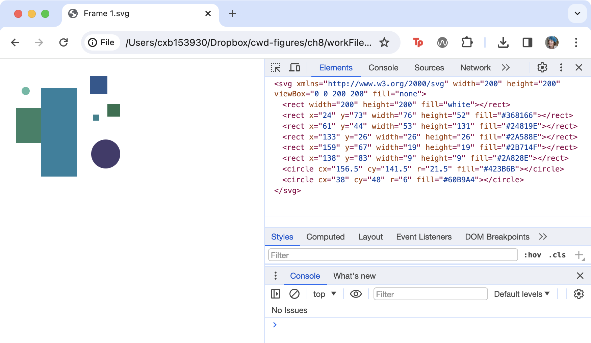
The SVG appears as an image in the Chrome browser, but a closer look at its source code shows how this image is composed of coordinates between the open and close `<svg>` tags.

</figure>

<figure>

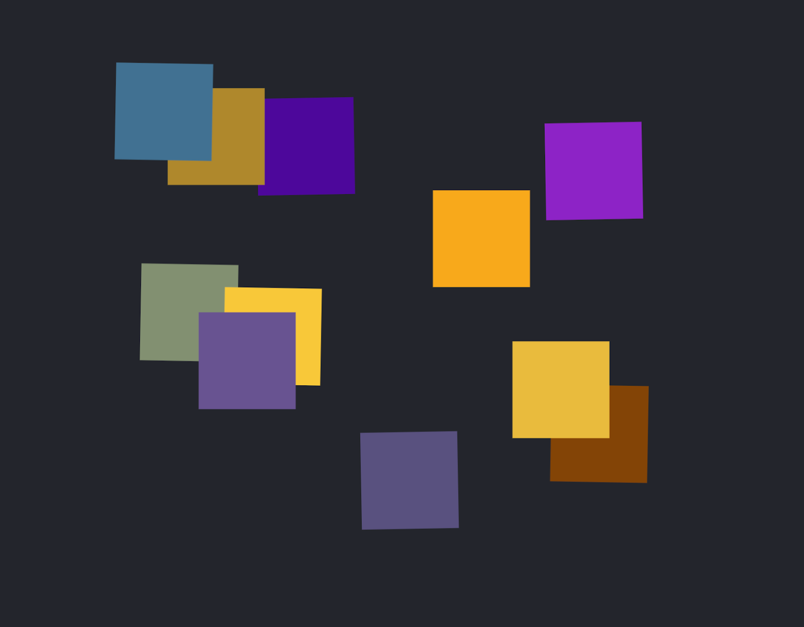
The polygons in the browser. Click or reload the page to see their color, size, and position change.

</figure>

<figure>

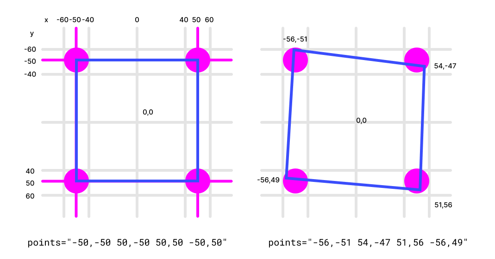
This diagram illustrates how the polygon points are selected. Each magenta circle defines the area within which the x or y values could be created.

</figure>

<figure>

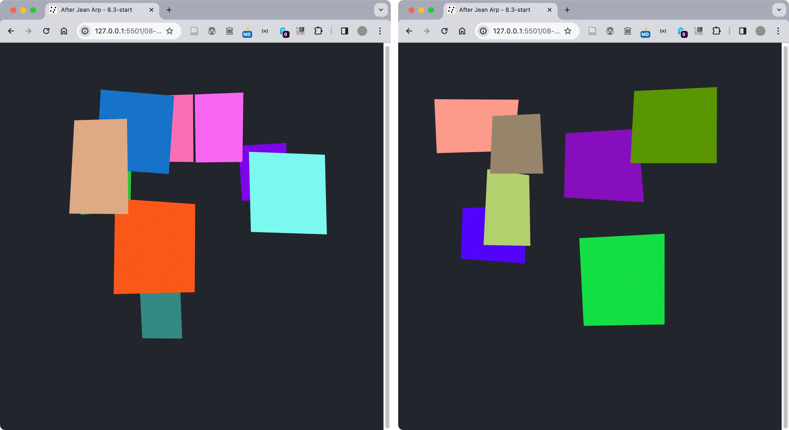
SVG Polygons generated for the browser. Click or refresh the page to see a new composition of polygons.

</figure>

<figure>

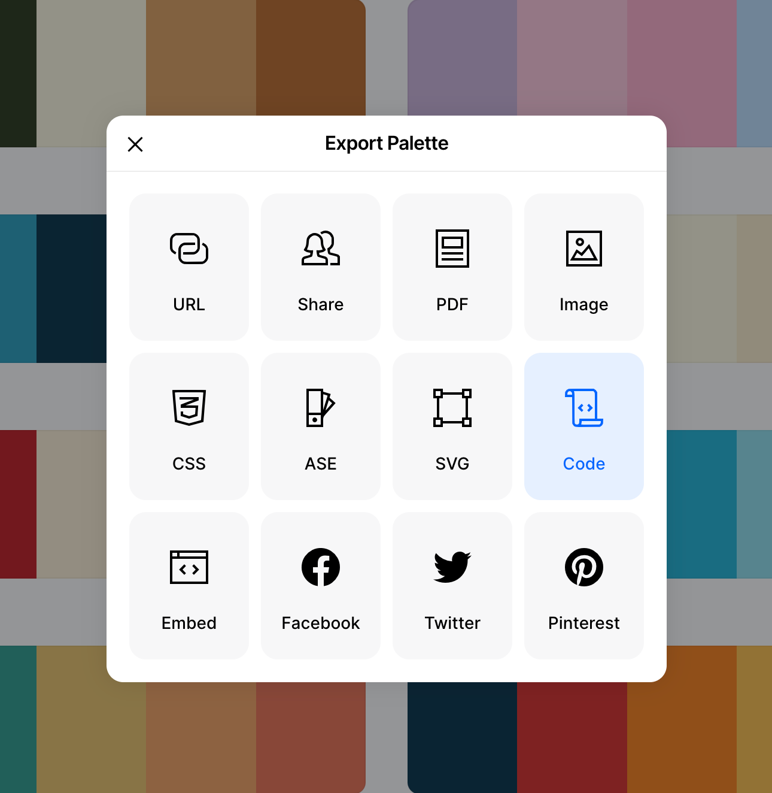
Export the code from a trending color palette on https://coolors.co/palettes/trending 

</figure>

<figure>

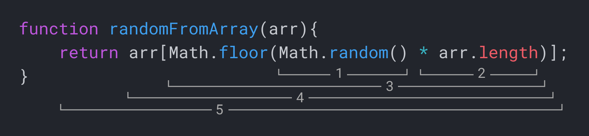
A diagram showing how a PRNG can be used to select random colors from an array. Each color is stored at an index number starting at 0. 

</figure>

:::tip[Functional Programming]
The `randomInt` function in Exercise 8.2.2 is an example of a **pure function**. It is written to perform a single task, all information is encapsulated in the data you give it, and it produces no **side effects**. Given the same input information, it will always return the same values, which makes it simple to debug and copy and paste into new projects. For more on this subject, find articles on **functional programming** with Javascript, which emphasizes the use of pure functions, immutability, and higher-order functions so you can create code that is more predictable and easier to use. 

- JSDevJournal, “Functional Programming With JavaScript: A Deep Dive,” HackerNoon, accessed January 18, 2024, https://hackernoon.com/functional-programming-with-javascript-a-deep-dive
- Eric Elliott, “Master the JavaScript Interview: What Is Functional Programming?” JavaScript Scene (blog), accessed August 24, 2021, https://medium.com/javascript-scene/master-the-javascript-interview-what-is-functional-programming-7f218c68b3a0
:::

<figure>

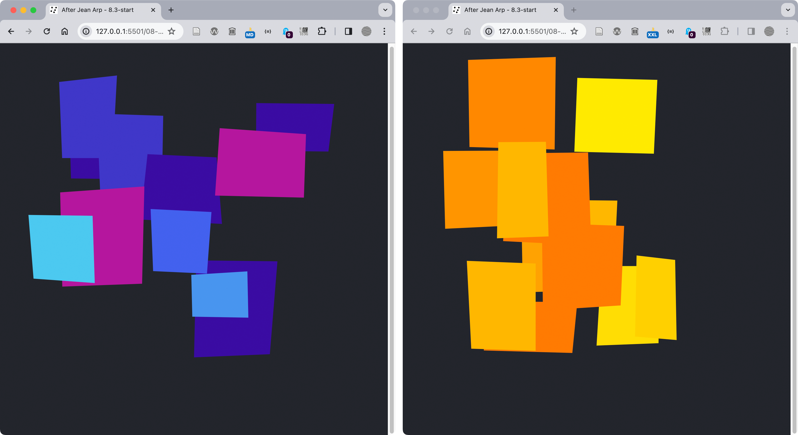
Two palettes from Coolors.co in our Generative Arp project.

</figure>

<figure>

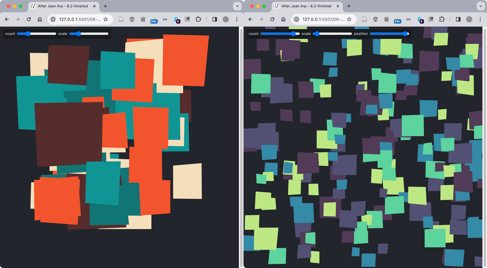
When you complete the exercises in 8.2 your version of the Generative Arp project will include controls for the number of polygons and their height values.

</figure>