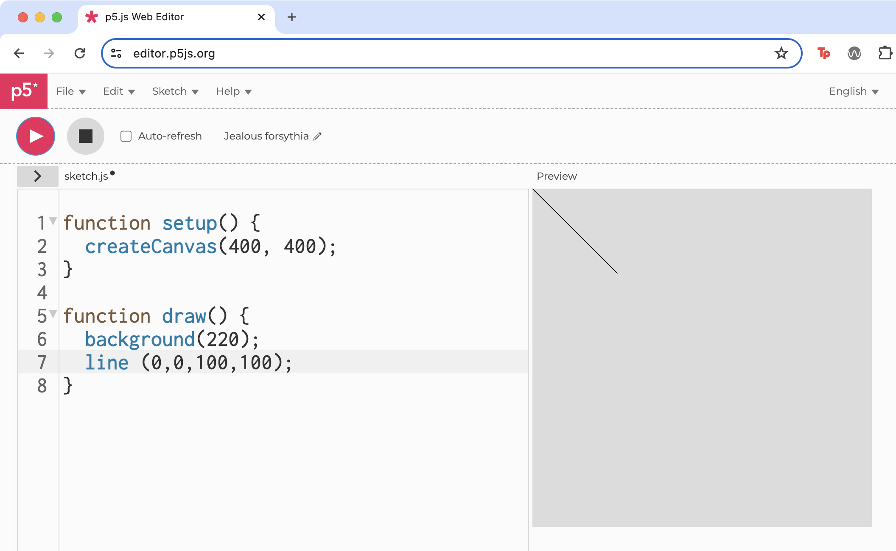
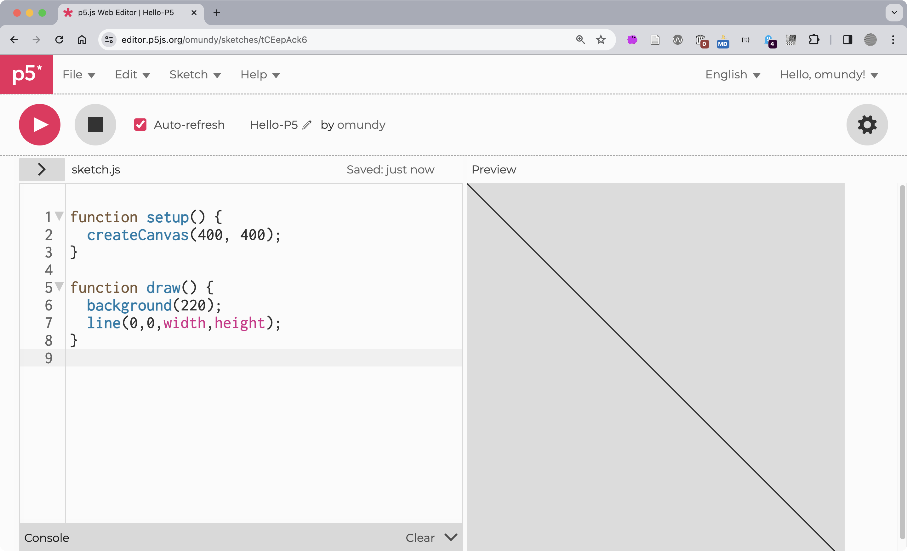
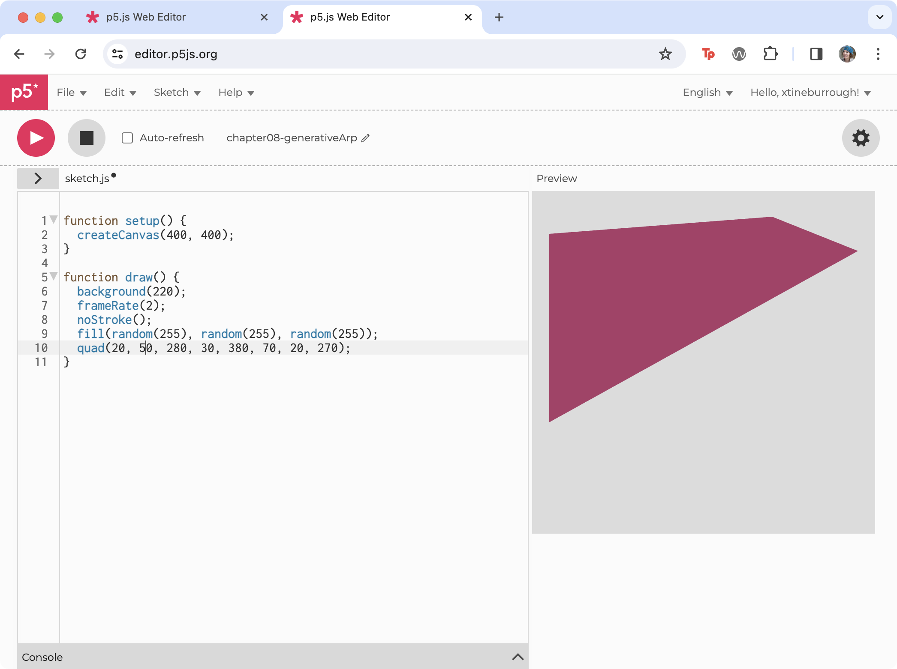
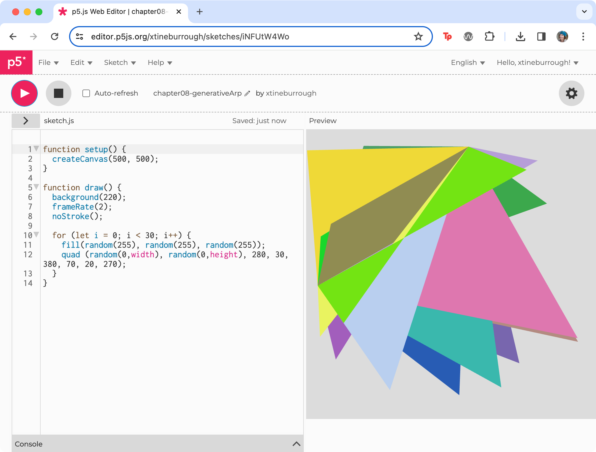
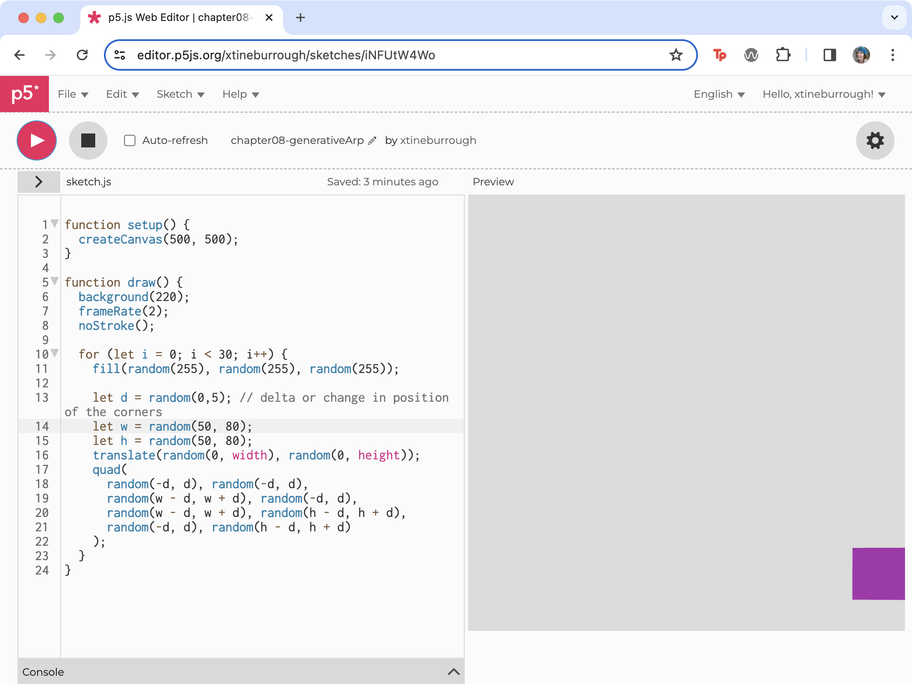
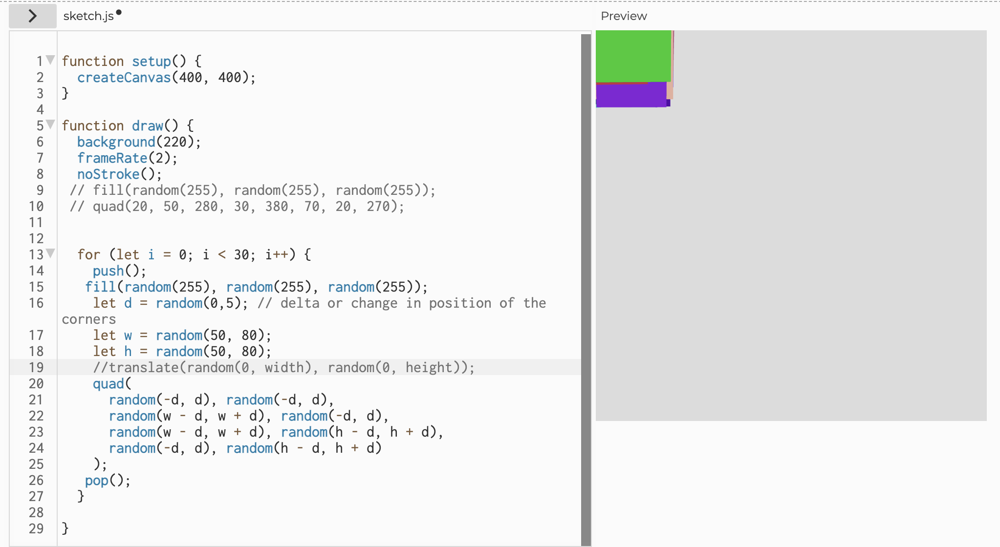
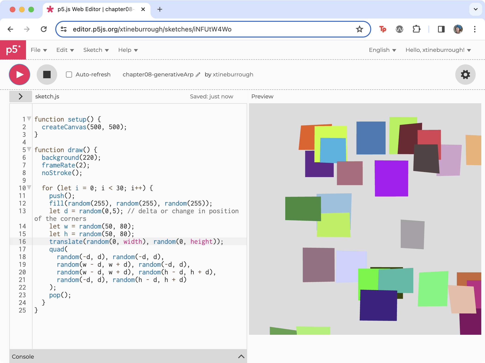

import Excerpt from '@/components/Excerpt.astro';
import Overview from '@/components/Overview.astro';

<Overview>{frontmatter.description}</Overview>


## P5 Intro

In this introduction to [p5.js](https://p5js.org) you’ll recreate a basic version of Generative Arp. As with other libraries, you can use p5.js by downloading or hotlinking to the Javascript file on a CDN. To minimize setup, we use the p5.js editor in the browser.

1. Open the p5.js Web Editor https://editor.p5js.org which will show a new file (a “Sketch”) where you can immediately start coding.

:::note[P5 Editor] 
Like other code playgrounds, you can sign up and log into the p5.js editor so that you can save your sketches in a personal library.
:::

2. p5.js contains two default functions in the main Sketch file. The `setup()` function is called once, when the program starts, to define key properties of the coded environment (like background size and color). The `draw()` function runs directly after, continuously executing the lines of code contained inside its block until the program is stopped. Update your `draw()` function to match ours below and press the play button at the top left corner in the web editor interface. You should see a line that extends diagonally from the top left corner `(0,0)` towards the middle of the canvas `(100,100)` (Figure 8.32).

```js
function draw() {
	background(220);
	line(0, 0, 100, 100);
}
```
<figure>


The line() function accepts four parameters representing numeric coordinates of the starting and ending x and y positions in the canvas.

</figure>

3. When you use `createCanvas()` it sets the values of built-in system variables, including `width` and `height`, that you can use throughout your sketch. (see Daniel Shiffman, “System Variables,” Learning Processing 2nd Edition, accessed April 9, 2024, http://learningprocessing.com/examples/chp04/example-04-05-systemvars) Update your line function to match our code below and press Play (Figure 8.33).

```js
function draw() {
	background(220);
	line(0, 0, width, height);
}
```

<figure>


Use the `width` and `height` variables to extend the line from the first position `(0,0)` to the opposing corner `(400, 400)`.

</figure>

4. The `createCanvas()` function adds an HTML5 Canvas element in the page on which to draw graphics. If you inspect the contents of a Canvas element with DevTools you will only see the parent Canvas element because the graphics it renders are only pixels on the screen. Unlike other HTML elements, graphics on a Canvas element are more like a real life painting in which every brush stroke the artist draws appears on top of previous strokes, until they paint over everything and start again. Of course drawing on the Canvas with p5.js is a little different, because you can create 2D or 3D graphics, and even use shaders and lighting to render interactive game worlds. You can also easily create animations by using the `background()` function to cover everything that was added on a previous frame, then make the drawing appear in a new location on the canvas, before repeating the process. Change your code to match ours to see this in action. Start by deleting the line function we added previously. The `draw()` loop now resets the canvas on each frame and then uses the current seconds on your computer to change the position of the line to suggest a makeshift clock.

```js
function draw() {
	background(220);
	strokeWeight(3);
	let x = second() * (width / 60);
	line(x, 0, x, height);
}
```
:::note[Line position]
To position the line relative to the current second, we multiplied the value returned from seconds() (0-59) by a percentage resulting from the width (400) of the canvas divided by the number of possible seconds (60). This means the range of x values will be 0 to 400, enabling our animation to span the width of the canvas. You could write 6.6 in your code but avoiding such magic numbers and letting p5.js do the math will ensure your equation will always work even if you change the width later.
:::


5. To create the four-sided polygons in Generative Arp you can use the p5.js quad() function. The shape is defined by four sets of coordinates,` x1,y1,x2,y2,x3,` and so on, placed clockwise. The random() function in p5.js is quite advanced, and includes the ability to return a random number within a range. Update your code as follows to draw a quadrilateral and fill it with a random color. Notice we use the `frameRate()` method to update our drawing every two seconds, during which the background is redrawn and a new random color fills the quadrilateral (Figure 8.34).

```js
function draw() {
	background(220);
	frameRate(2);
	noStroke();
	fill(random(255), random(255), random(255));
	quad(20, 50, 280, 30, 380, 70, 20, 270);
}
```

<figure>


Figure 8.34 A new quadrilateral is redrawn with a random fill color every two seconds.
ALT Screenshot of the p5.js editor with the quad method.

</figure>

6. The `draw()` function now creates a new quadrilateral with a random color each loop of the `draw()` function. To generate multiple quadrilaterals of various shapes we will need to add a loop that randomizes the coordinates of its vertices. Add the following `for` loop to your code, and move the fill and quad function into it. We only changed the first two parameters (`x1` and `y1`) in this step (Figure 8.35) to a random number between `0` and the `width` and `height` to show how it affects the quads. Run your code to see that on each loop, the `draw()` function “paints” over the canvas with `background()`, then the `for` loop draws 30 unique quadrilaterals, and then the `draw()` function loops and starts the process again.

```js
function draw() {
	background(220);
	frameRate(2);
	noStroke();
	for (let i = 0; i < 30; i++) {
		fill(random(255), random(255), random(255));
		quad(random(0, width), random(0, height), 280, 30, 380, 70, 20, 270);
	}
}
```


<figure>


Our code includes a for loop where a quadrilateral is drawn with a randomized fill color.

</figure>


7. With the quadrilaterals changing shape, we will return to the ideas presented in Figure 8.23, which govern how the vertices of the quadrilaterals will match those created by Jean Arp. We will use the same strategy here, constraining their potential values to ensure the polygons appear like Arp’s hand-cut rectangles dropped onto random positions. In Exercise 8.2.2 we used the CSS transform rule with the `translate()` and `rotate()` functions. We will do something similar in p5.js using three variables: a width (`w`) and height (`h`) variable for the `x` and `y` coordinates at each vertice, and a delta (`d`) variable. Delta is often used in math, logic, or programming to suggest “change.” You will notice that we have a pseudorandomized range for width and height, and then we again implement the random function using these variables. This enables us to draw the vertices in a “slightly random” format (Figure 8.36). The `translate()` function moves the polygons around the canvas. If you comment out the `translate()` function you will see how the polygons are drawn on top of each other, in the same position, on the canvas (Figure 8.37).

```js
for (let i = 0; i < 30; i++) {
	fill(random(255), random(255), random(255));
	let d = random(0, 5); // delta or change in position
	let w = random(50, 80);
	let h = random(50, 80);
	translate(random(0, width), random(0, height));
	quad(
		random(-d, d),
		random(-d, d),
		random(w - d, w + d),
		random(-d, d),
		random(w - d, w + d),
		random(h - d, h + d),
		random(-d, d),
		random(h - d, h + d)
	);
}
```

<figure>


Quadrilaterals using several random parameters to match Jean Arp’s using a variable d, which constrains the amount of change to the position of the vertices.

</figure>

<figure>


Comment out the translate function to see how the polygons are drawn on top of each other, in the same canvas position without the aid of translate(). Then, don’t forget to remove your comment slashes!

</figure>

8. Finally, add multiple polygons like our pure JS Generative Arp. However, when drawing to the HTML5 Canvas with p5.js, each time you call `translate()` it adds a new offset value to a global state. Over time the translations add up and push the elements off the screen. If you change your `w` and `h` maximum value to a smaller number (Figure 8.38) you can see what this looks like. So, we need to implement two p5.js methods called `push()` and `pop()`. “The `push()` function saves the current drawing style settings and transformations, while `pop()` restores these settings.” In other words, these functions, which are always used in tandem, allow us to preserve the blank slate (“push”) at the beginning of every iteration of the for loop, and then return to it (“pop”) at the end of each loop, instead of adding up. So, add `push()` to the first line of the for loop and `pop()` to the last line and test your code. You will see multiple polygons.

```js
for (let i = 0; i < 30; i++) {
	push();
	fill(random(255), random(255), random(255));
	let d = random(0, 5); // delta or change in position
	let w = random(50, 80);
	let h = random(50, 80);
	translate(random(0, width), random(0, height));
	quad(
		random(-d, d),
		random(-d, d),
		random(w - d, w + d),
		random(-d, d),
		random(w - d, w + d),
		random(h - d, h + d),
		random(-d, d),
		random(h - d, h + d)
	);
	pop();
}
```

<figure>


We replaced the max value of w and h with 55 to show how transformations add up in p5.js.

</figure>

The components of this basic generative page can be used in any of the above frameworks we mention above. And while we think they are great, and encourage you to experiment with them, keep in mind that you don’t need to be dependent upon any specific tool. Instead, the idea should dictate the methods you choose to use. However you continue to add to and customize your project, keep experimenting!

## More info

-   https://p5js.org/
-   https://www.w3schools.com/graphics/canvas_intro.asp
-   Check out Kate Compton's [So you want to build a generator...](https://galaxykate0.tumblr.com/post/139774965871/so-you-want-to-build-a-generator) tutorial


