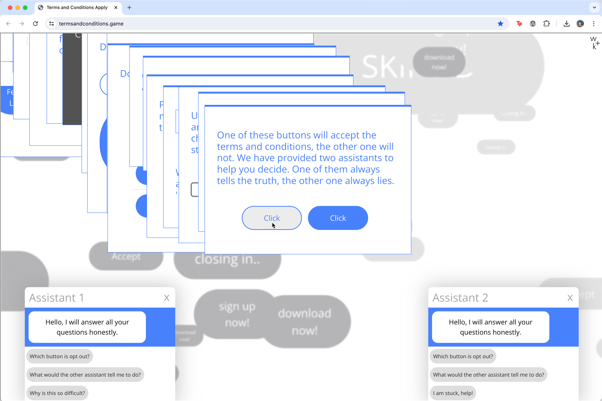
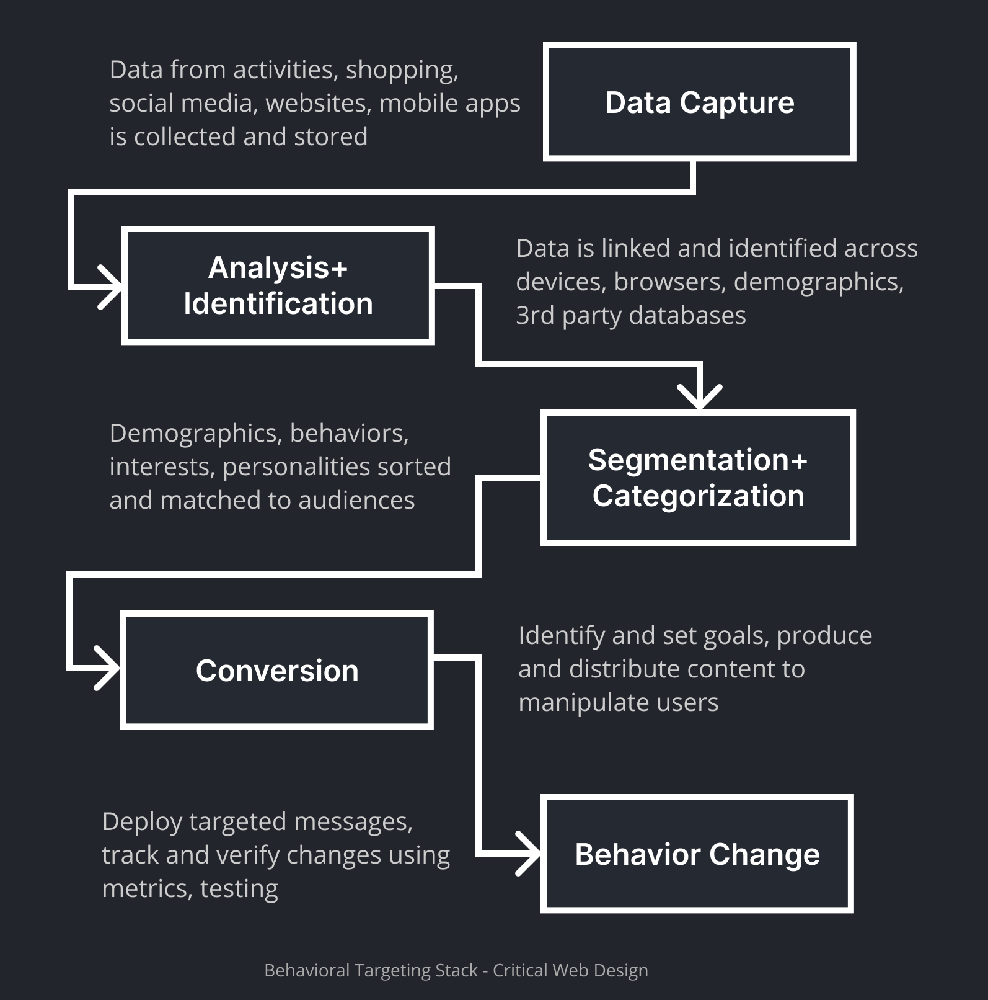
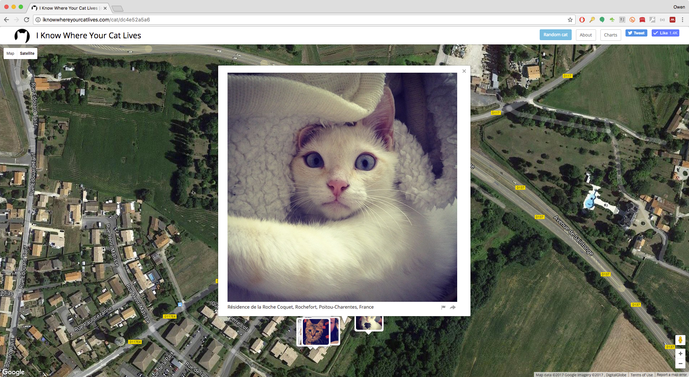
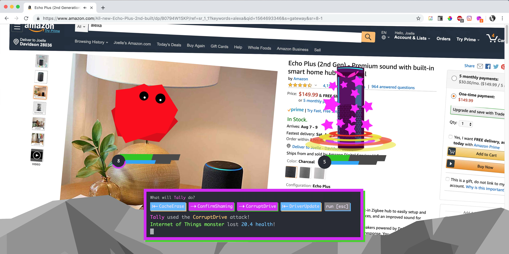

import CustomAside from '@/components/CustomAside.astro';

<CustomAside type="overview">{frontmatter.description}</CustomAside>

## Data Tracking 

<figure>

Terms and Conditions Apply was created by Wieden+Kennedy, Jon Plackett, Alex Bellos, Adam Says, https://www.termsandconditions.game/ 

</figure>

<figure>

This flowchart shows how behavioral targeting starts with data capture and results in behavioral change.

</figure>

## Case Study

<figure>

Owen Mundy, I Know Where Your Cat Lives, 2014. https://iknowwhereyourcatlives.com

</figure>

<figure>

Owen Mundy, I Know Where Your Cat Lives, 2014. https://iknowwhereyourcatlives.com

</figure>

<figure>

Joelle Dietrick and Owen Mundy, Tally Saves the Internet, 2021. https://tallysavestheinternet.com

</figure>

