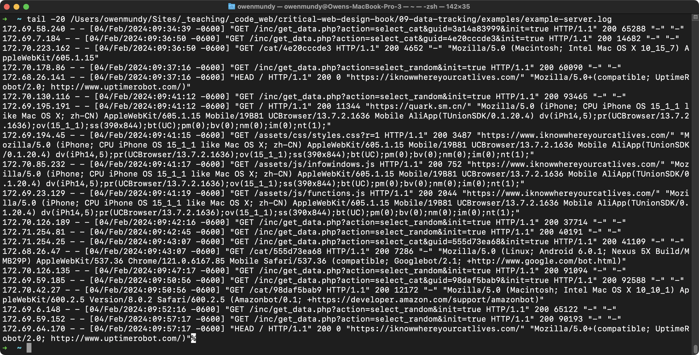
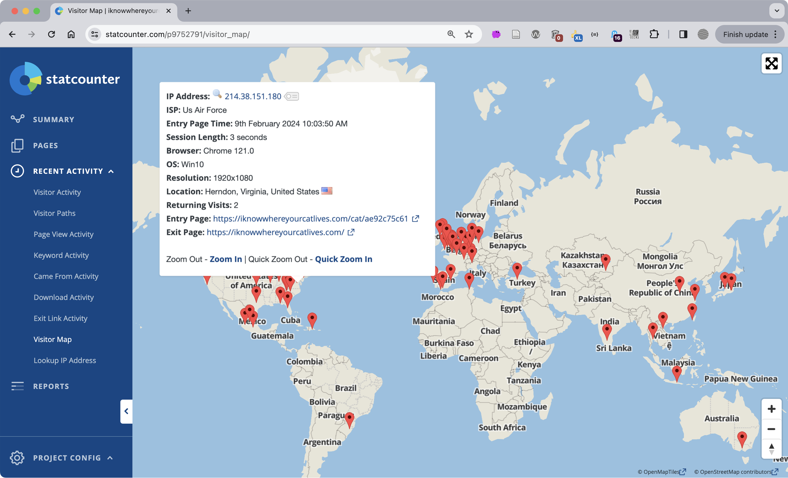
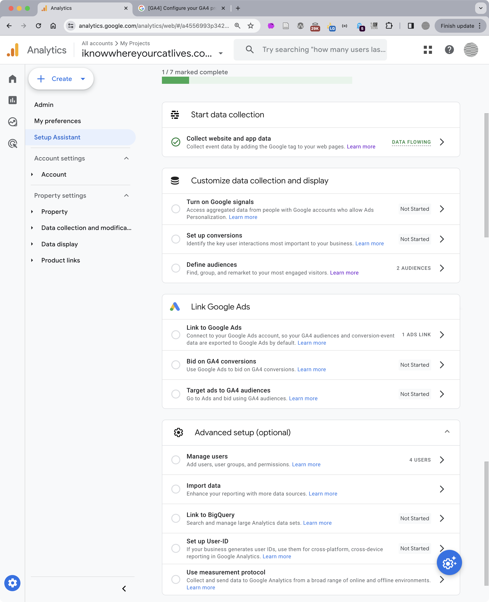
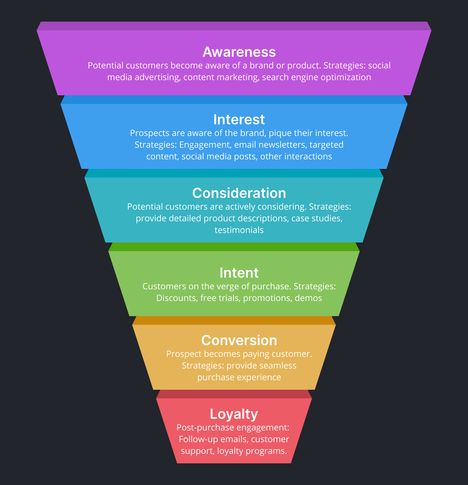
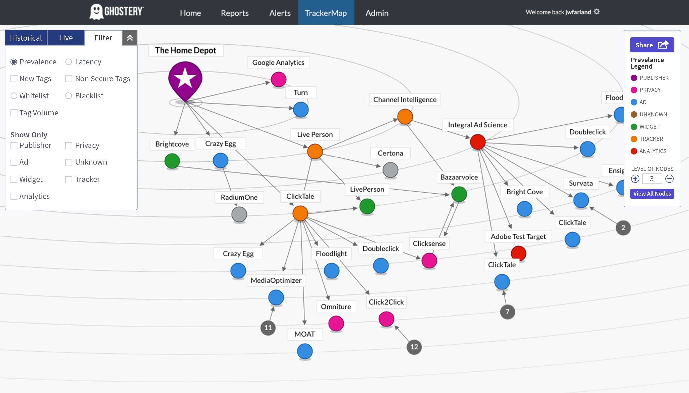
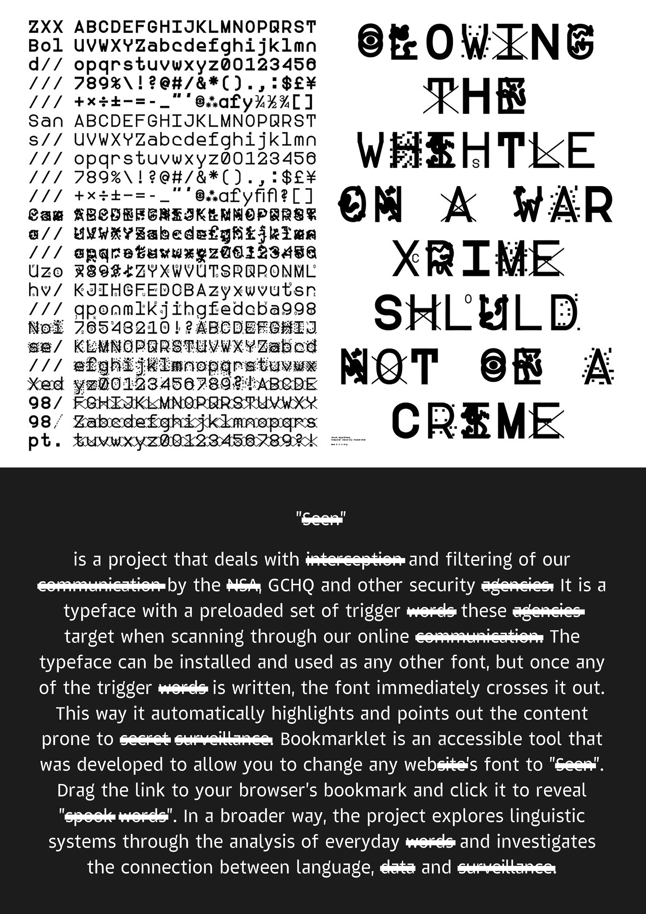
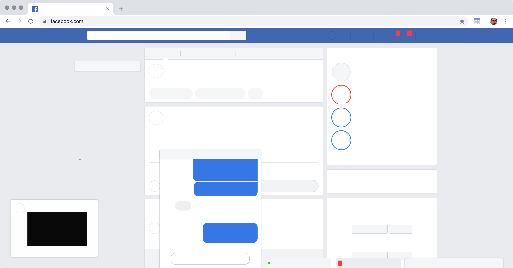
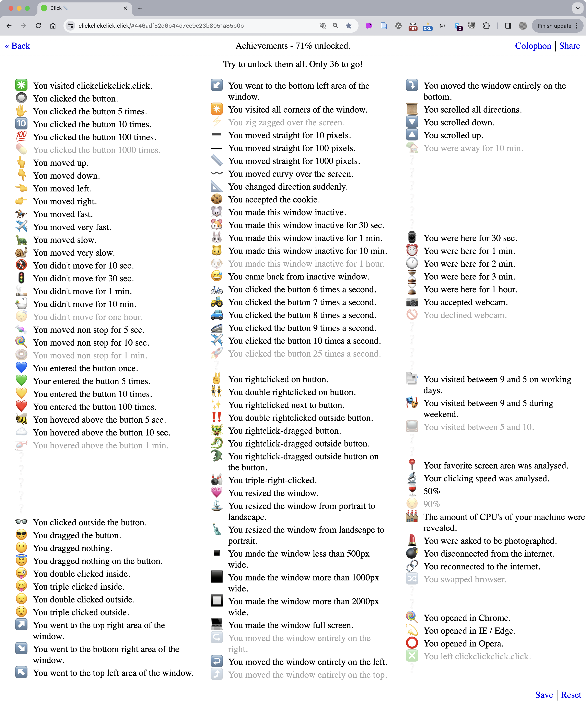
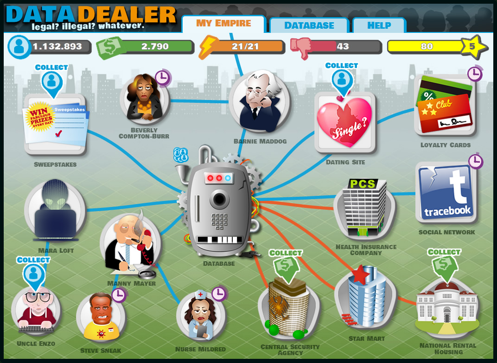

import CustomAside from '@/components/CustomAside.astro';

<CustomAside type="overview">{frontmatter.description}</CustomAside>

## Explore Your Data Double

More so than ever, your identity, physical self, and actions are represented by data. Information that can distinguish your identity, like your name, id number, address, or biometric records is said to be **personal data** (a.k.a. Personally-Identifiable Information or PII). Regardless of whether it is a correct representation, a **data double** of you exists because information about you has been collected, stored, and used to inform decisions by others in your absence. Explore this activity to consider how much of your personal data composes your other identity.

1. List all the organizations that have personal data about you. Examine items in your wallet or purse. List all your social media apps, financial information, and memberships.
1. Score each organization in your list by whether they store information that can identify you:
    - 3 points = Your name, contact information, or other unique id numbers
    - 3 points = Biometric data like fingerprints, retinal scans, or DNA
    - 2 points = Images of you, or data about your face
    - 1 point = Data about your current, or past locations
    - 1 point = Other identifying information which could be used to link you to your “incognito” activity or used to represent you directly or indirectly
1. Discussion
    - What’s your total? 
    - Were you surprised by the amount of organizations holding your data? 
    - What percentage of the items in your list would you feel comfortable with sharing as public information? 
    - What does your data double reveal about you—do you think it represents you well? 
    - Would you consider eliminating some or all of your social media accounts to reduce the impact of your data double?

:::note[Tracking the Trackers]
Explore how trackers and other embedded scripts collect, store, and identify your data in the browser. https://criticalwebdesign.github.io/book/09-data-tracking/examples/trackers.html 
:::

## Explore Data Tracking

- Browse the web safer, faster & with less ads https://www.ghostery.com
- Defend yourself against tracking, surveillance, and censorship https://www.torproject.org/
- Learn how identifiable you are on the Internet https://amiunique.org
- See how trackers view your browser https://coveryourtracks.eff.org/
- The Markup https://themarkup.org/series/blacklight
- Tactical Tech https://datadetoxkit.org/

## Data Capture

<CustomAside type="excerpt">Module 9.1</CustomAside>

<figure>

Example server access logs from https://iknowwhereyourcatlives.com showing IP addresses, dates, and files requested.

</figure>

<figure>

User information shown on a map at Statcounter.com.

</figure>

<figure>

Google Analytics (GA) is so much more than website feedback, as can be seen in this figure of the Setup Assistant. Unfortunately, Owen is not an ideal user of Google Analytics and has not completed all the prompts that GA wishes he would have.

</figure>

<figure>

A typical behavioral funnel converting your online clicks to sales.

</figure>

<figure>

The Ghostery Trackermap is a directed network graph representing how embedded scripts transmit user data for ad auctions that determine which targeted messages are shown to each user. The Trackermap was originally created  to identify and reduce latency and security issues, and has gone through many iterations, including this version by designer Joey Kilrain. https://kilrain.com   

</figure>

## Cultural Works About Tracking

- Studio Moniker https://clickclickclick.click/ and https://pointerpointer.com/ 
- Jamie Wilkinson and Greg Leuch (fffff.at) [Google Alarm extension](https://fffff.at/google-alarm/) 
- Ben Grosser [Facebook Demetricator](https://bengrosser.com/projects/facebook-demetricator/)
- Tim Schwartz [Resistant Systems](https://www.timschwartz.org/resistant-systems-spring-2022/), [Digital Resistance Kit](https://www.timschwartz.org/digital-resistance-kit/), [Password Cleanse](https://www.timschwartz.org/password-cleanse/) 

<figure>

Two typographic projects that explore surveillance. The type specimen poster at the top shows ZXX (2012), a typeface by Sang Mun designed to increase privacy through thwarting Optical Character Recognition (OCR) and automated machine intelligence methods. Project Seen (2015) by Emil Kozole is a typeface that points out content prone to surveillance by automatically striking through trigger words targeted by government agencies. Install the font or use the bookmarklet to explore the project, http://projectseen.com. 

</figure>

<figure>

Ben Grosser's browser extensions modify the content users see on social media to question their influence. His Safebook extension removes all content from Facebook, reminding users of the importance of their free labor to the company's bottom line. Grosser’s Facebook Demetricator extension removes the metrics on posts that gamify interpersonal communication to drive engagement (and thus ad views). As with all browser extensions, these modifications are performed using Javascript, but only in the browsers (clients) of users who install it.

</figure>

<figure>

A wealth of information about users is displayed on the Achievements page of the https://clickclickclick.click website. 

</figure>

<figure>

Data Dealer was a web-based game created by Ivan Averintsev, Wolfie Christl, Pascale Osterwalder, and Ralf Traunsteiner that explored the myriad ways that such companies harvest and sell user information.

</figure>

