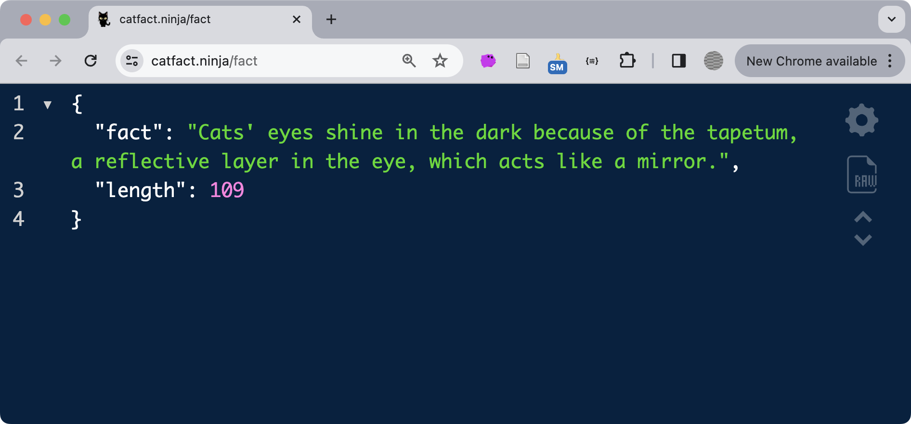
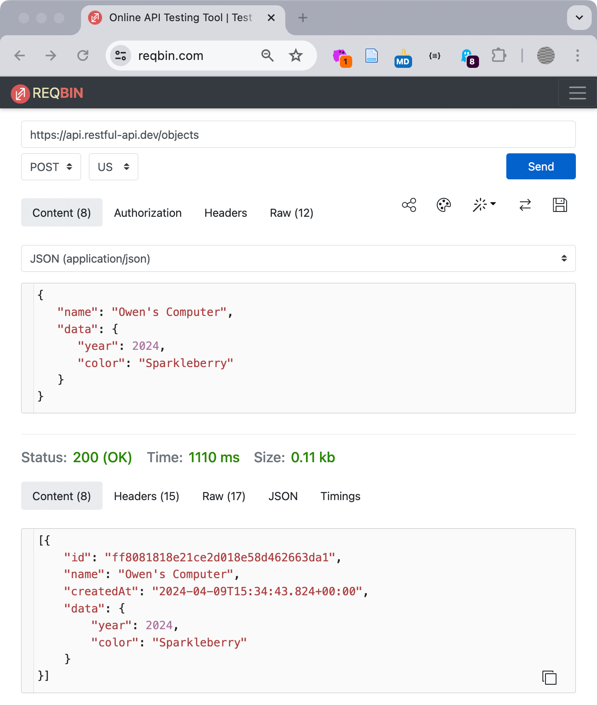
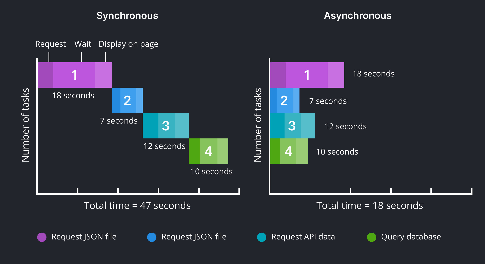
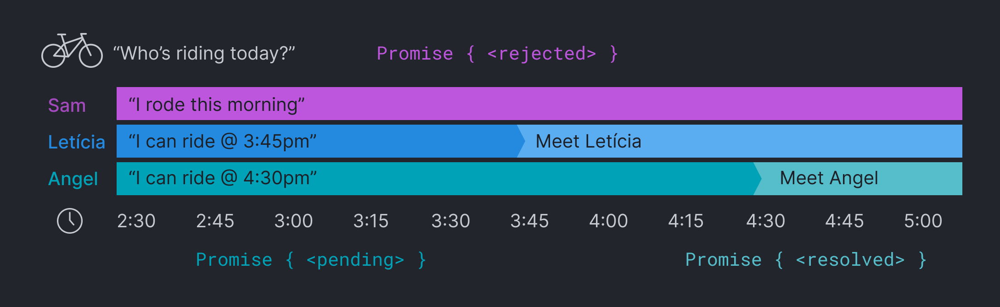
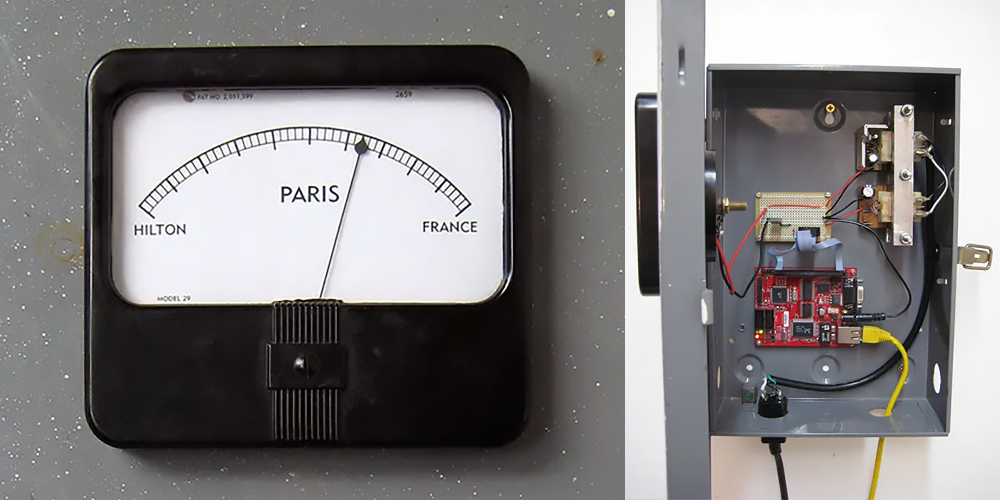

import CustomAside from '@/components/CustomAside.astro';

<CustomAside type="overview">{frontmatter.description}</CustomAside>


## Javascript Objects and JSON

<CustomAside type="excerpt" reference="Section 9.2.1"></CustomAside>


A Javascript object is a hierarchical format for storing collections of properties. While an array stores a list of values identified by their index, object properties store values using a name (also referred to as a key).

```js
let color = {
  id: "cyan",
  hex: "00ffff",
};
```


<figure>
<div class="not-content">
<p class="codepen" data-height="500" data-default-tab="result" data-slug-hash="OJGWyvL" data-pen-title="Javascript Objects" data-editable="true" data-user="owenmundy" style="height: 300px; box-sizing: border-box; display: flex; align-items: center; justify-content: center; border: 2px solid; margin: 1em 0; padding: 1em;">
<span>See the Pen <a href="https://codepen.io/owenmundy/pen/OJGWyvL">
Javascript Objects</a> by Owen Mundy (<a href="https://codepen.io/owenmundy">@owenmundy</a>)
on <a href="https://codepen.io">CodePen</a>.</span>
</p>
<script async src="https://public.codepenassets.com/embed/index.js"></script>
</div>
Explore this full tutorial https://criticalwebdesign.github.io#js-objects

</figure>


**JSON** (Javasscript Object Notation) is essentially the same structure, with some small differences, but it can be stored in a separate file and sent over a network.

```json 
// colors.json
[
    { "id": "cyan", "hex": "00ffff", "rgb": [0, 255, 255] },
    { "id": "magenta", "hex": "ff00ff", "rgb": [255, 0, 255] },
    { "id": "yellow", "hex": "ffff00", "rgb": [255, 255, 0] },
    { "id": "black", "hex": "000000", "rgb": [0, 0, 0] }
]
```

:::note[Javascript Objects]
See JSON, XML, and CSV examples https://github.com/criticalwebdesign/book/tree/main/09-data-tracking/examples/data-examples
:::


## Test an API 

<CustomAside type="newmaterial"></CustomAside>


<figure>


Diagram showing just a few of the many requests and responses between client and server when a page loads.

</figure>


In this exercise you’ll learn to test APIs. There are hundreds of free APIs that offer a wealth of functionality and data for you to use in your projects. Some APIs require you to register and send requests along with a special key to prevent abuse, but there are plenty of public APIs you can use as well.

1. We will use this free API that offers facts about cats. You should always refer to an API's documentation, in this case [catfact.ninja](https://catfact.ninja), to learn about the **endpoints**, or specific URLs used to access particular information. Open the following link in a web browser and you should see a simple JSON document, organized by `key:value` relationships: [catfact.ninja/fact](https://catfact.ninja/fact)
2. Install the [JSON Formatter extension](http://criticalwebdesign.github.io#json-formatter) for Chrome criticalwebdesign.github.io#json-formatter to make it easier to read JSON data in the browser, and reload the cat fact API (Figure 9.17).

<figure>


A cat fact in JSON formatted with JSON Formatter. Fascinating.

</figure>


3. {JSON} Placeholder is a free "realistic" API for testing. For example, access the “users” endpoint to get a list of fake users: [jsonplaceholder.typicode.com/users](https://jsonplaceholder.typicode.com/users)
4. While basic API testing can be as simple as viewing a web page, sometimes you may need special tools to send data or authenticate. For the next API we'll use a tool called REQBIN to send information with the API request that lets you mimic a web form’s POST request. The “Real REST API” [restful-api.dev](https://restful-api.dev/) we will use features endpoints that operate differently, depending on the HTTP verb you use in the request. Go to [reqbin.com](https://reqbin.com) and add the following URL in the field—watch out for errant spaces at the end of the URL. Send the request with GET selected in the dropdown and you'll see a list of devices.

[`https://api.restful-api.dev/objects`](https://api.restful-api.dev/objects)

5. Change the dropdown to POST, and then under content tab type or paste the following JSON data. Feel free to change the value of any property. Press Send and your data will be sent to the API and then returned with an additional id property. Copy the value of the id.

```json
{
    "name": "Owen's Computer",
   "data": {
       "year": 2024,
      "color": "Sparkleberry"
   }
}
```

6. Open a new browser tab and add the id you copied to the end of the following URL after the equal sign and press return. You should see the data you sent with the first request. Here is the one we sent: [criticalwebdesign.github.io#restful-api](http://criticalwebdesign.github.io#restful-api) (Figure 9.18).

```
https://api.restful-api.dev/objects?id=
```


<figure>


Using the POST method we added an entry to the dataset by following the  JSON formatting rules to specify keys and values. In the result, our entry includes a new key for id.

</figure>


:::note[Pro Tip]
Postman https://www.postman.com is an excellent tool for testing APIs.
:::


### More APIs

- https://github.com/public-apis/public-apis
- https://catfact.ninja/fact
- https://jsonplaceholder.typicode.com/
- https://restful-api.dev/
- https://api.restful-api.dev/objects?id=ff8081818e21ce2d018e58d462663da1


## Asynchronous Javascript

<CustomAside type="excerpt" reference="Section 9.3.1">Any time you load data over a network you incur latency, a delay between when you make your request and the moment the response arrives. With zero latency web pages feel speedy and the instant response is gratifying, while lag between user events can make a website clunky and frustrating.</CustomAside>


<figure>


The performance benefits from using asynchronous code are visible on these side-by-side charts.

</figure>

<figure> 


The work day is almost over and you want to go ride bikes with your friends. You reach out to see who is available (three requests) and wait for a reply. Of the three you ask, Sam cannot ride (promise rejected), Letícia can go at 3:45pm, and Angel can meet at 4:30pm (two promises pending). You do other work while you wait, perhaps finishing the section of a chapter you are writing, and then head out to meet each friend who resolves their promise by arriving at the trailhead.

</figure>

<figure>
<div class="not-content">
<p class="codepen" data-height="600" data-default-tab="result" data-slug-hash="MWRJxjK" data-pen-title="riAsynchronous Javascript" data-editable="true" data-user="owenmundy" style="height: 300px; box-sizing: border-box; display: flex; align-items: center; justify-content: center; border: 2px solid; margin: 1em 0; padding: 1em;">
<span>See the Pen <a href="https://codepen.io/owenmundy/pen/MWRJxjK">Asynchronous Javascript</a> by Owen Mundy (<a href="https://codepen.io/owenmundy">@owenmundy</a>) on <a href="https://codepen.io">CodePen</a>.</span>
</p>
<script async src="https://public.codepenassets.com/embed/index.js"></script>
</div> 

See this Codepen https://criticalwebdesign.github.io/#async-js
</figure>


<figure>


Tim Schwartz created Paris by writing a data scraper that monitored news and search engines for “paris hilton” and “paris france” and displayed the results in real time.

</figure>


## Javascript Prototype

<CustomAside type="newmaterial">Any time you load data over a network you incur latency, a delay between when you make your request and the moment the response arrives. With zero latency web pages feel speedy and the instant response is gratifying, while lag between user events can make a website clunky and frustrating.</CustomAside>


Objects are commonly used to represent the properties and behaviors of entities in a programming model called **Object Oriented Programming (OOP)**. OOP languages use predefined classes and inheritance to derive behavior. For example, all objects of a car class will have wheels and headlights that turn on, which are inherited by its child classes that define more specific properties. 

Javascript uses a(n arguably simpler) **prototype** pattern to define objects. When you create a new variable in Javascript it creates a new copy of the object prototype, cloning all its functionality and data. Javascript's prototype shares many of the OOP's benefits. For example, Javascript objects use **encapsulation** to group and identify similar information inside a single container (like formats for a color), and standardizes access to their properties. 

Type an open and close curly brace in the DevTools Console to see the properties all objects receive from the prototype:

```js
{} 
// -> [[Prototype]]: Object
    constructor: ƒ Date()
    hasOwnProperty: ƒ hasOwnProperty()
    isPrototypeOf: ƒ isPrototypeOf()
    ...
```

In the console, create a new object: 

```js
let color = {
    name: "red",
}
```

If you log the color value you can see the `name` property you creaded, as well as the constructor from the prototype:

```js
color
// -> {name: "red"}
    [[Prototype]]: Object
        constructor: ƒ Date()
        hasOwnProperty: ƒ hasOwnProperty()
        isPrototypeOf: ƒ isPrototypeOf()
        ...
```

If you type the constructor (the method in each object that creates itself) of any data type based on the object, like Date, you will again see the prototype functions listed below the functions (ƒ) specific to that object.

```js
new Date()
    // -> constructor: ƒ Date()
    getDate: ƒ getDate()
    getDay: ƒ getDay()
    getFullYear: ƒ getFullYear()
    ...
    [[Prototype]]: Object
        constructor: ƒ Date()
        ...
```
