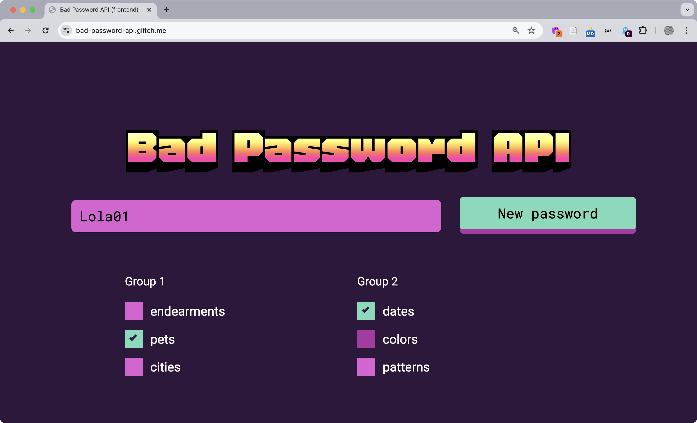
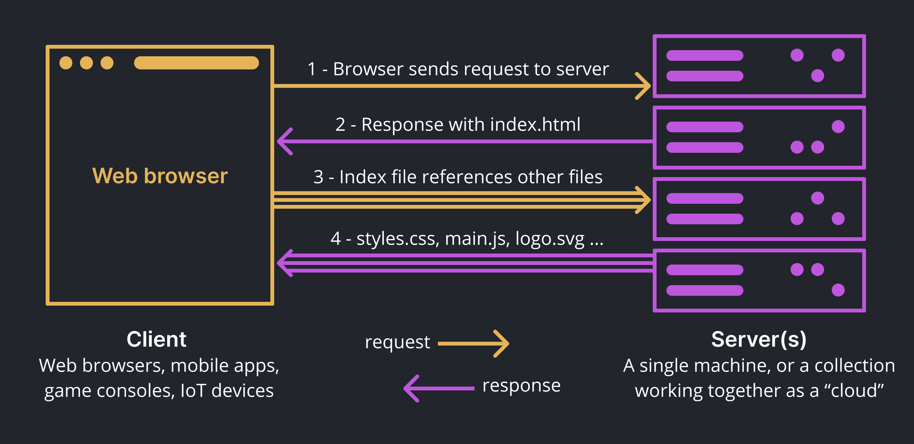
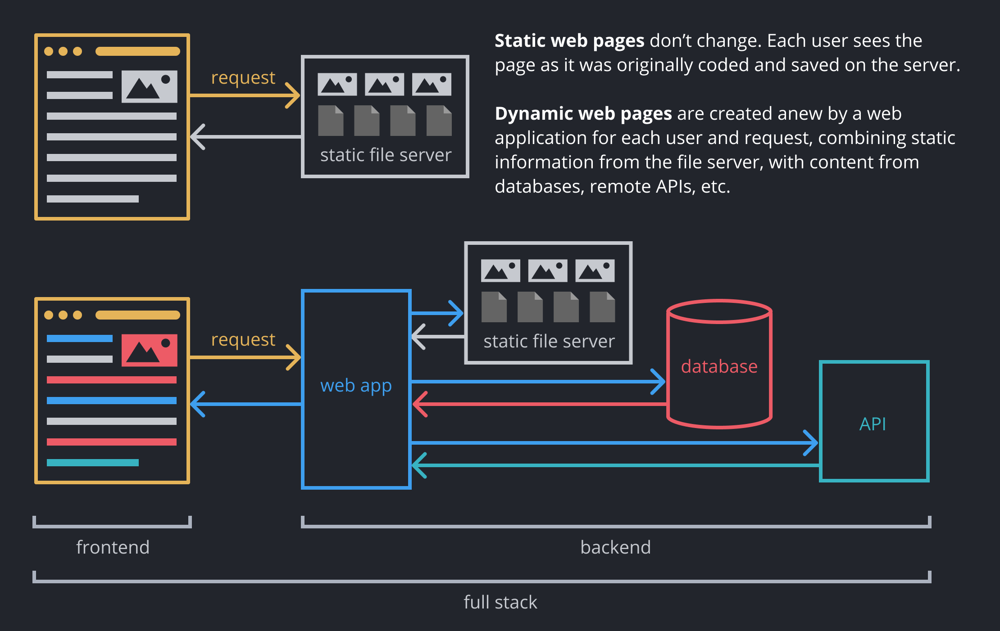
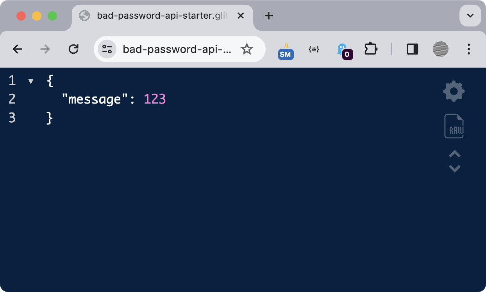

import CustomAside from '@/components/CustomAside.astro';

<CustomAside type="newmaterial">{frontmatter.description}</CustomAside>


<figure>


After completing the modules in Chapter 9 you will connect the Bad Password API front end to our back-end API. See it live here https://criticalwebdesign.github.io/#9-3

</figure>


:::caution[Prerequisites] 
We recommend you complete the following materials to prepare for this tutorial:
- Chapter 9 in the book
- [1.2 Command Line](/wiki/chapter-01/1-2-command-line/) 
- [9.2 JSON Data and APIs](/wiki/chapter-09/9-2-apis/) 
- [9.3 Using Node.js](/wiki/chapter-09/9-3-nodejs/) 
:::


## Static and Dynamic Web Pages

<CustomAside type="excerpt" reference="9.2.4">**Static** web pages don’t change. Each user sees the page as it was originally coded and saved on the server. **Dynamic** web pages are created anew by a web application (scripts that run on the server) for each user and request, combining static information from the file server, with content from databases, remote APIs, etc.</CustomAside>

<figure>


Each web page you visit involves many requests and responses between client (your browser) and server(s) when a page loads.

</figure>


<figure>


The difference between a static website and a full-stack application.

</figure>


## Full Stack API

<CustomAside type="newmaterial">Continue developing the full-stack version of the Bad Password API. </CustomAside>

:::caution 
This tutorial assumes you are continuing from the end of Chapter 9 in the book, and that you've completed **[1.2 Command Line](/wiki/chapter-01/1-2-command-line/)**, **[9.2 JSON Data and APIs](/wiki/chapter-09/9-2-apis/)**, and **[9.3 Using Node.js](/wiki/chapter-09/9-3-nodejs/)** in this wiki.
:::

### Project Setup

1. Using Codespaces (or VS Code if you are developing locally) open the `bad-password-api-starter` project repository that you edited in Chapter 9. 
1. We modified the project structure to make it easier to publish the front-end version on Github Pages. However, it's more convenient when the front end and back-end code is organized into separate folders. Move `index.html` and the `assets` folder into the `public` folder. Your structure should look like this...

import { FileTree } from '@astrojs/starlight/components';

<figure>
<FileTree>

- package.json Meta information and project dependencies
- api All server files live here
  - data.js Words and phrases to make bad passwords
  - index.js Run the server using routes.js and data.js
  - routes.js Contains the endpoints that return data
- public Static files go here
  - assets
    - css/
    - img/
    - js/
  - index.html The front end, uses client side JS to make requests to the server.

</FileTree>

This project has two parts. The back-end scripts inside `api/` that run on the server and respond to requests for data from the front-end files `index.html` etc. in the browser. 
</figure>

3. Open `api/index.js`. This is the main back-end entry point. When you run this file with Node.js it uses Javascript to start a server with [Express.js](https://expressjs.com/), which it imports on line 8. 
4. Open `package.json` and verify that `main` points to `api/index.js`. Note also that `express` is one of the dependencies. While these packages are referenced here, they haven't been installed yet. When you run the below command in the Terminal NPM will download and install the packages into a specially-named folder called `node_modules`. 

```
npm install 
```

5. Since you installed nodemon in [9.3 Using Node.js](/wiki/chapter-09/9-3-nodejs/) you can start the server by running any of these: `nodemon`, `nodemon api/index.js`, or `npm run dev`. A message will appear in the terminal telling you that... 

```
Your app is listening at: http://localhost:3000
```

6. Go to this URL to see the website. Notice we didn't need to install a Live Server extension because we are providing our own "localhost", even though it is currently only serving static files like `index.html`.


### Add a Static API Route

Most of what you see inside `api/index.js` is boilerplate code, but we added comments to explain what is happening. It simply starts a server and imports other files that create the response. In this section you'll add new endpoints to the API.

1. In `api/index.js`, notice that line 21 imports `routes.js`. This file defines [Express routes](https://expressjs.com/en/guide/routing.html), or the endpoints for your server. A route can be any path on your website. They can be static files like `index.html` or dynamic, responding to parameters users define in the URL. Here is an example dynamic route, Change the value assigned to `q` to `dog` to see how it changes all the content of the page.

``` 
https://www.google.com/search?q=cat
```

2. Open `api/routes.js` and notice that we import express and create a "router". Express makes Node run continuously on a server, listening for requests. Then we import `data` and `functions` from `data.js`, which we'll discuss later.

```js 
// import express, create router
import express from 'express';
const router = express.Router();
// import data for the API
import { data, functions } from "./data.js";
// console.log(data.pets);

// 👉 code (from Chapter 9 wiki) ...
```

:::note 
This project uses [Express 5](https://expressjs.com/en/guide/migrating-5.html) which can be imported as an ES Module.
:::


3. Create a new static route for the API by adding the following code after our `👉` prompt. This uses the express router to add a new endpoint called `api/`. The callback function uses the `res` parameter to send a simple **res**ponse, the text "Hello, World!" back to the browser. Save your file and refresh your URL (http://localhost:3000/api). If your project is still running (using `nodemon` from the previous section above) you should see the text.

```js 
// 👉 add routes here (from Chapter 9 wiki) ...
router.get("/api", async function (req, res) {
  res.send("Hello, World!");
});
```

4. "But an API is supposed to return JSON!?" — Not so! An API can return anything you like. JSON is definitely the most common though. Update your response to include curly braces and a `message` property inside the object, like so:

```js 
res.send({ message: "Hello, World!" });
```

5. Save `routes.js` and refresh your endpoint and you should now see a JSON object returned. Great! This is default endpoint for your API. 

```json 
{
  "message": "Hello, World!"
}
```

<figure>


You can also send non-string values inside JSON data returned from the API.
 
</figure>


### Add Dynamic API Routes

Now that you are getting data from an API into the web page, add new endpoints to return a common or custom password. 

1. In `routes.js` you'll notice we are importing `data` and `functions` from a file called `data.js`. In `data.js` you'll see it contains lists of potential words to use in new custom passwords. The property named `common` is a list of the most common passwords that have been hacked. Add this new endpoint under the previous route to return a random password from the common list.

```js
router.get("/api/common", async function (req, res) {
  res.send({ message: randomFromArray(data.common) });
});
```

2. Test this endpoint by viewing your project URL + `/api/common`. Refreshing the page returns a new, terrible password.

```json 
{
  "message": "12345"
}
```


import YoutubeVideo from '@/components/YoutubeVideo.astro';

<div class="max-w-3xl mx-auto not-content">
  <YoutubeVideo src="https://www.youtube.com/watch?v=_JNGI1dI-e8" />
</div>


3. In `data.js` you saw other collections of popular terms used in easy-to-hack passwords. Let's add a dynamic endpoint that uses them. Add the following code beneath the other endpoints inside `routes.js`. This will use the `returnPassword()` function to check the parameters and return appropriate random phrases from the hacked passwords list.

```js
router.get("/api/custom", async function (req, res) {
  console.log(`params = ${req.query.params}`);
  res.send({ message: returnPassword(req.query.params) });
});
```  

4. Visit your new endpoint `/api/custom?params=pets,dates` and play with other parameters `endearments, pets, cities, dates, colors, patterns` to see the new passwords. 

```json 
{
  "message": "Duke97"
}
```

5. With the API routes working you can change your project front end to use them instead. Open `public/assets/js/main.js` and update `url` to pull from your functional API: 

```js
// 👉 update url to pull from your own database (Chapter 9 wiki) ...
let url = "/api/custom?params=" + group1.value + "," + group2.value;
// 👈
```


:::note
You can always compare your API endpoint values with our finished project 
- https://bad-password-api.vercel.app/api 
- https://bad-password-api.vercel.app/api/common
- https://bad-password-api.vercel.app/api/custom?params=pets,dates 
:::


{/* 

// OLD FASTIFY + GLITCH INSTRUCTIONS

1. The file `index.js` imports and uses a web framework (that you just installed with NPM) called [Fastify](https://fastify.dev) that will run continuously, accepting requests to the API and returning new data. The code in this file is boilerplate language required to start the application server but we added comments to explain what is happening. Notice the line that imports another Javascript file called routes.js that contains all the routes (the URLs for the API endpoints) that you will create.

2. Open the `routes.js` file and you will see the following code. This is a function expression (see Chapter 6 on the wiki) that uses the async declaration (which we describe in next section) and a "fat arrow" syntax. As you saw in server.js this function is imported from the `routes.js` file (`import routes from "./routes.js"`) and used to define the endpoints for the API. The second line, that exports the routes function, makes that possible.

```js
const routes = async (server, options) => { };
export default routes;
```

3. Add this code to create your first endpoint. It will accept `GET` requests to the URL "/api" (the domain name + "/api"). The callback function uses the `server` parameter to send a simple reply, the number `123`. 

```js
const routes = async (server, options) => {
    server.get("/api", function (request, reply) {
        reply.send(123);
    });
};
export default routes;
``` 

4. If you open a new browser window and type the custom name that Glitch gave your project and "/api" you should see that the server is accepting requests to that endpoint. 
11. To make Fastify return a JSON file, simply restructure the value so it's wrapped in curly braces and assigned to a property. In the next exercise you will modify the client side code to get the data from this test API endpoint.

```js
server.get("/api", function (request, reply) {
    reply.send({ message: 123 });
});
```

5. Now that you are getting data from an API into the web page, add a new endpoint to return a common password. In `routes.js` you'll notice we are importing data and functions from a file called `data.js`. If you look at `data.js` you'll see it contains lists of potential words to use in new custom passwords. The property named common is a list of the most `common` passwords that have been hacked. Add this new endpoint to return data from this list inside `routes.js` under the previous route.

```js
const routes = async (server, options) => {
    server.get("/api", function (request, reply) {
        reply.send({ message: 123 });
    });
    server.get("/api/common", async function (request, reply) {
        reply.send({ message: functions.randomFromArray(data.common) }); 
};
```

6. Test this endpoint by viewing your project `URL + /common`. You can see our example here: https://bad-password-api.vercel.app/ Refreshing the page returns a new, terrible password.


3. In `data.js` you saw other collections of popular terms used in easy-to-hack passwords. Let's add an endpoint that uses them. Add the following code beneath the other endpoints inside routes. This will use the existing `returnPassword()` function to check the parameters and return appropriate random phrases from the hacked passwords list.

```js
server.get("/api/custom", async function (request, reply) {
    reply.send({ message: returnPassword(request.query.params) });
});  
```  

4. In a new tab, visit your `URL + /api/custom?params=pets,dates` (or any other combination of these parameters) to see the new passwords. For example: https://bad-password-api.vercel.app/api/custom?params=pets,dates 


*/}


## Publishing Full Stack Sites

Throughout the book you published your static web pages on Github Pages. All web hosts allow you to share static HTML with the world, but GH Pages lets you do it for free, with relatively simple overhead, and decent control over the subdomain (you can also [create a "Github username site"](/wiki/chapter-01/1-3-using-github/)). 

However, GH Pages does not allow you to run code in the back end. This means if you want to use a database, return custom response types (like JSON for our API), or do any other scripting on the server, you need to use a real web host. Generally speaking, if you want to keep your costs and technical requirements to a minimum, there are a few different ways to go. 

Feature | Github Pages | Cloud hosting | Shared Hosting | VPS hosting
--- | --- | --- | --- | ---
Cost | Free | Free for small projects | ~$10/month^ | ~$20/month
Learning curve | Beginner | Beginner | Beginner | Difficult
Providers | Github Pages | [Vercel](https://vercel.com/), Netlify  | [Dreamhost](https://click.dreamhost.com/aff_c?offer_id=8&aff_id=16277&aff_sub=&aff_sub5=/hosting/?offer_id={offer_id}&transaction_id={transaction_id}&aff_sub5=/hosting/)† | [Hostinger](https://hostinger.com?REFERRALCODE=EYCOMUNDYX85)†
Static sites | ✅ | ✅ | ✅ | ✅
Backend sites | ❌ | ✅ | ✅ | ✅
Node.js | ❌ | ✅ | ⚠️† | ✅†† 
Up time | 100% | 100%<sup>§</sup> | 100% | 100%

<figure>

^Some colleges (like [Davidson](https://domains.davidson.edu/)) provide a "Domains" service for free to students.<br />
†Most shared hosting do not allow access to the shell or running Node.js<br />
††Referral links let us know what services readers are selecting.<br />
‡Since you are installing the software yourself you can run anything you want!<br />
<sup>§</sup>Most free cloud hosting sites offer 100% uptime. <br />

</figure> 


 
{/* Follow the tutorial below to publish your project on Vercel, a beginner-friendly free cloud hosting service.  */}


## Publish a Website with Vercel

The first step to publish an API on Vercel, since you are defining routes, specific paths, and sending `json` headers using Express, is to add a new advanced configuration file called `vercel.json`. Paste the following code into it and save.

```json 
{
    "version": 2,
    "rewrites": [
        {
            "source": "/(.*)",
            "destination": "/api"
        }
    ]
}
```


Below, we cover two ways to publish your project to Vercel. The first [Connect Github to Vercel](#1-connect-github-to-vercel) is recommended for new users. The second tutorial [Vercel Command Line Tool](#2-vercel-command-line-tool) is more advanced but gives you finer control over how it is published. You can also use these both at the same time, in case you like to have the preference.


### Option 1-Connect Github to Vercel

Connect your Github account and import your repository to Vercel. This is the recommended way to publish if you are using Github Codespaces. It is also demonstrated in the video below.

1. Go to Vercel's "start deploying" page https://vercel.com/new
1. Under "Import Git Repository" select "Continue with Github" and login with Github. 
1. After that, click "Install" to allow Vercel to access your Github information. Select the Github repository you want to publish and click "Install".
1. Now you can import your repository to Vercel. Give it a project name. Leave the framework preset as "other". Click deploy.
1. Visit your dashboard to find (or rename) the url where your site is published.
1. Push new changes to your project on Github to automatically update your Vercel deployment. 


<figure>

<div class="max-w-3xl mx-auto not-content">
  <YoutubeVideo src="https://www.youtube.com/watch?v=E8xaV6fiTaA" />
</div>

How To Deploy GitHub Project on Vercel (easy method)
</figure>


### Option 2-Vercel Command Line Tool 

Install the Vercel CLI (command line) tool and run it from VS Code. This alternate method gives you more control for publishing your project. 


### Connect to Vercel


import { Tabs, TabItem } from '@astrojs/starlight/components';

1. Quit your app (if still running) `Ctl+c`
1. Create a free "Hobby" account at https://vercel.com/signup and login. We recommend using Github to authenticate.
1. Install the Vercel CLI using NPM ([recommended](https://vercel.com/docs/cli?package-manager=npm))

```
npm install -g vercel
```

4. Confirm installation.

```
vercel --version
```

5. Run the login command. The process will complete in the browser. Return to the console and you should see confirmation.

```
vercel login
```


### Deploy on Vercel

With your account connected, initiate your first deployment.


1. Run the following to configure your deployment

```
vercel
```

2. Follow the prompts (you only have to answer these config questions the first time): 
    1. Set up and deploy `yes`
    1. Which scope ... ? `choose your default team`
    1. Link to existing project? `no (unless you already created one)`
    1. What’s your project’s name? `ENTER_A_UNIQUE_NAME`
    1. In which directory is your code located? `./`
    1. No framework detected. Default Project Settings ... Do you want to modify? `no`
    1. Do you want to change additional project settings? `no`
    1. Connect repository ... ? `no ("yes" requires you commit for each deployment)`

:::caution[A Name Change]
You will need to enter a unique name for your project, since the `bad-password.vercel.com` and `bad-password-starter.vercel.com` project names are taken.
:::


3. After completing the above, Vercel will upload your files. Each time you run `vercel` it creates a private build and displays links to view your site. Like Github, every deployment has a specific identifier and build page.

```
🔍  Inspect: https://vercel.com/ [...] [1s] 
✅  Preview: https:// [...] .vercel.app [13s]
📝  To deploy to production ([...].vercel.app), run `vercel --prod`
```

4. Open the preview link and confirm everything works as expected. Test both the index file and the APIs.
5. Finally, make it live using 

```
vercel --prod
```


{/* 

NOTES

LIVE VERSION
https://bad-password-api.vercel.app/

A TEST VERSION IS PUBLISHED
https://bad-password-api-starter.vercel.app/
https://bad-password-api-starter-omundy-sneakway-studio.vercel.app/

*/}


## Prompt 9.4

Inside `api/data.js` you can see how the project uses comma-separated lists of words to create new password combinations. Add new potential parameters for the `/api/custom` endpoint by incorporating the list you created in Prompt 9.1. Then add new checkboxes to represent the new lists in the interface. Explore the articles linked on the [finished project](https://bad-password-api.vercel.app/) and experiment with new parameters. Or, make a fork of the project and create an entirely new generator API!


