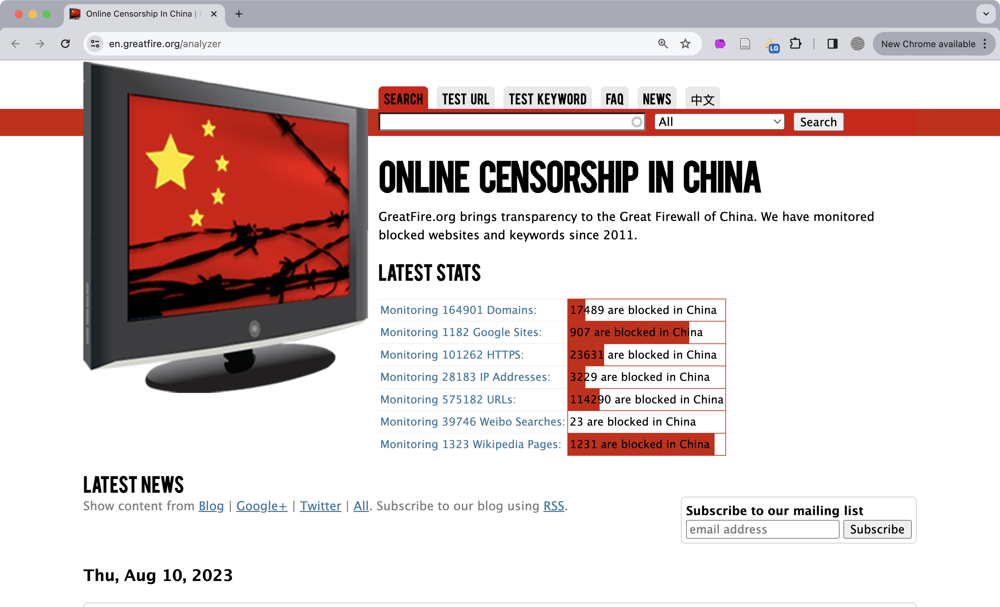
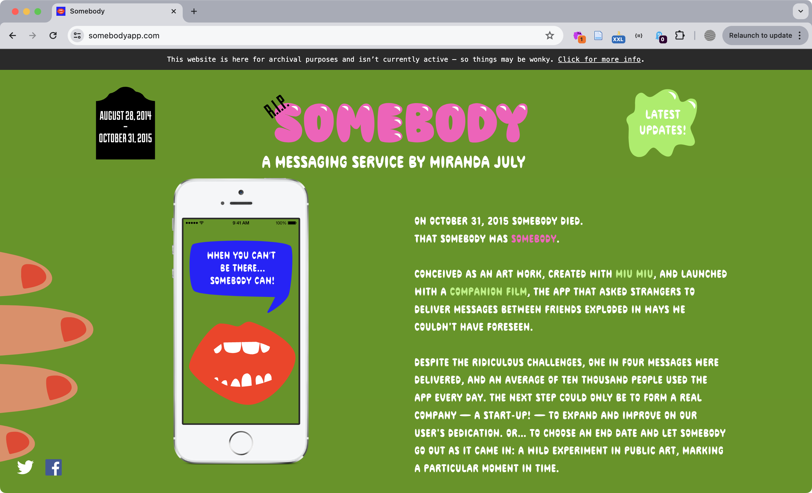
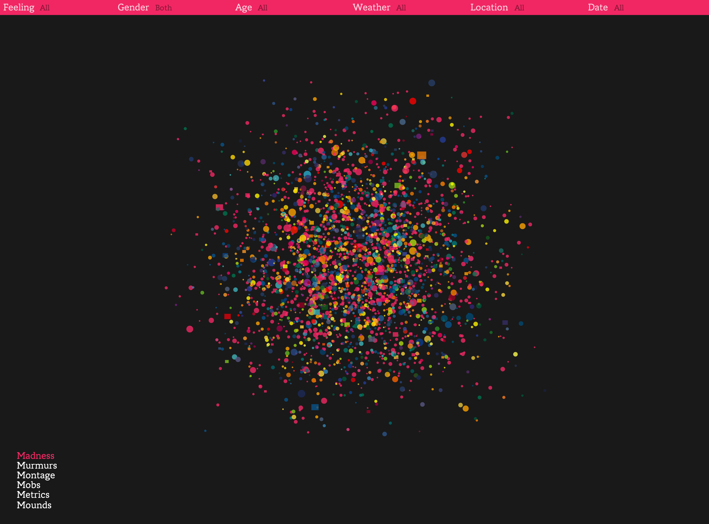
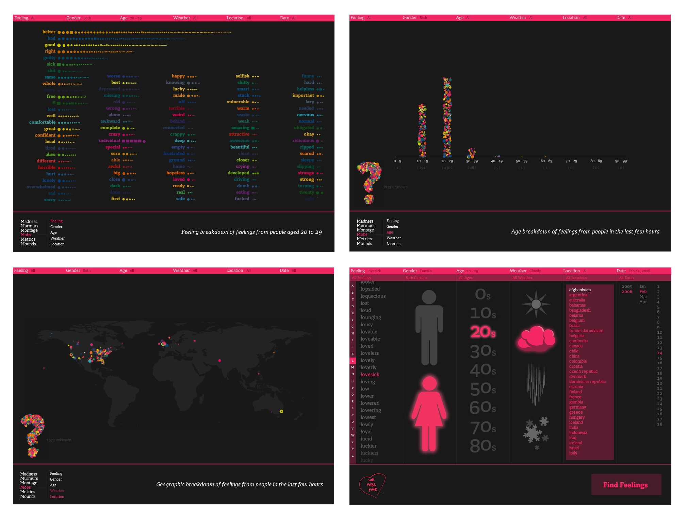
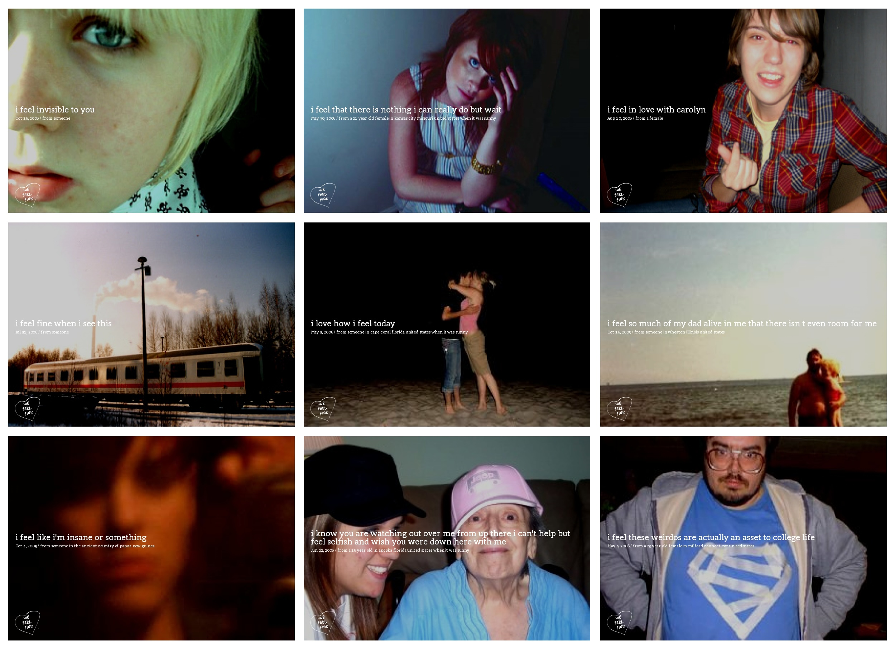
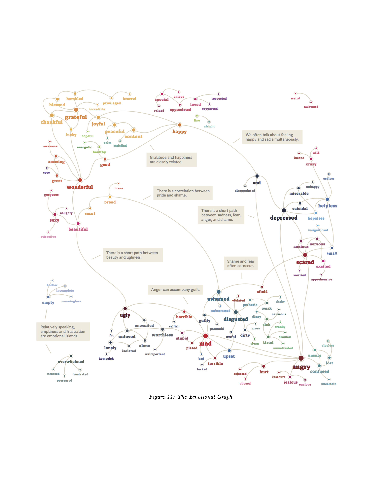

import CustomAside from '@/components/CustomAside.astro';

<CustomAside type="overview">{frontmatter.description}</CustomAside>

## Optimism

<figure>

The first prototype of the solar powered server that runs the Low-tech Magazine website. The solar charge controller (on the right) is powering the server (on the left). This image, like others on the site, is dithered to reduce the file size and make the server more efficient.

</figure>

- Tactical Tech https://tacticaltech.org is an organization that uses design and research to promote digital literacy through apps, experiences, interventions, and educational resources. Their Data Detox Kit https://datadetoxkit.org can help “take control of your digital privacy, security, and wellbeing,” along with other practical outcomes. 
- Games for Change https://gamesforchange.org is a festival dedicated to empowering diverse voices and innovation around social issues through games. 
- The Markup https://themarkup.org creates journalism and web applications that challenge technology to serve the public good. One of our favorites, their Blacklight tool https://themarkup.org/series/blacklight is a real-time website privacy inspector that exposes tracking technologies like, well, a blacklight. 
- Low-tech Magazine https://lowtechmagazine.com is an online publication that questions the value of technological progress, describes the potentials of often forgotten tech, and promotes sustainable energy practices. Unlike the mind-numbing megawatts required for server farms and data centers used by Amazon, Instagram, and TikTok, Low-tech focused on efficiency in their design by removing advertising and using a static site generator (Hugo) to [power their website with a single 50W solar panel](https://solar.lowtechmagazine.com/2018/09/how-to-build-a-low-tech-website/). 

Other groups who encourage technology companies to consider the public good over profit:

- https://www.humanetech.com
- https://accountabletech.org
- https://cltc.berkeley.edu/
- https://cyber.harvard.edu/
- https://lowtechmagazine.com/

## Participation

<figure>

The https://en.greatfire.org/analyzer shows which domains and keywords are blocked from within the "Great Firewall of China." Enter a website address and watch as the site attempts to access it from servers located within the People's Republic of China, to display a real-time report on the country's elaborate censorship network. The latest statistics about the number of blocked services (17,489 domains!) are saved to their database and displayed on the front page for the world to see. 

</figure>

Examples that involve crowdsourced information, user contributions, or other shared experiences.

- GreatFire.org is a site that brings “transparency to the Great Firewall of China.” Their GreatFire Analyzer tool https://en.greatfire.org/analyzer makes visible and provides crowdsourced reports on the Network-making Power (Castells) enacted by the Chinese government in the form of censorship, domain blocking, and deep packet inspection. 
- Brooke Singer and her team created https://www.toxicsites.us to collect and reconfigure publicly-available data into a more usable interface "to engage people in public information and encourage participation". 
- Terms of Service; Didn’t Read https://tosdr.org grades websites and services on how well they respect users in their Terms of Service. The site contains a wealth of user-contributed stats on Facebook, Amazon, and others' non-obvious power grabs enabled in the agreements everyone accepts, but rarely reads.

## Shared Experiences

- Projects like Pip Shea's [Any Cast](https://dev.themaninblue.com/anycast/) transform a mundane activity (like agreeing to Terms of Use for free wifi) into a collectively-generated stream of thoughts to create a whole truly greater than the sum of its parts. A similar project (without wifi, but still online today) is Alex Fuller's http://www.onamountaintop.com which equally allows anyone to share a simple message outside of their bubble and without signing away one's privacy. 
- Dries Depoorter offers another humorous take on shared experience with Die With Me, a networked chat app that connects people around the world who have less than 5% battery left on their phones. 
Speedshow.net was created by Aram Bartoll as a reusable model to transform Internet cafés into one-night internet art exhibitions that others can extend or expand at any location.

## Participatory Service

<figure>

https://somebodyapp.com/ by Miranda July was a short lived but imaginative reconfiguration of critical engagement and interpersonal communication. 

</figure>

- Miranda July created Somebody https://somebodyapp.com, an app and messaging service that was, in her words, “half-app, half-human.” The app connected participants in similar geographic areas, letting them send messages, or deliver them for others in person, as a social service. The companion film she created offers the best description, representing the app like a cross between Uber and Craigslist, where a stranger (or you) can transmit a message (an apology, an endearment, a breakup) in person that might be difficult to do yourself. 
- The Nicest Place https://thenicestplace.net offers hugs from its participants for a mediated audience. Informed by conceptual art practices, the website provides instructions so others can join and make an impactful experience out of a collection of small acts.
- We Feel Fine (2005) http://wefeelfine.org created by Jonathan Harris and Sepandar Kamvar was an online project that visualized publicly-available text (blogs, social media, etc.) that started with the phrase “I feel ...”

## Case Study

<figure>

Jonathan Harris and Sep Kamvar, We Feel Fine, “Madness,” http://wefeelfine.org. 

</figure>

<figure>

Jonathan Harris and Sep Kamvar, We Feel Fine, “Movements,” “Mobs (Age),” “Mobs,” and "Search Panel,” http://wefeelfine.org. 

</figure>

<figure>

Jonathan Harris and Sep Kamvar, We Feel Fine, “Madness,” http://wefeelfine.org. 

</figure>

<figure>

Jonathan Harris and Sep Kamvar, We Feel Fine, “Emotional Graph,” http://wefeelfine.org. 

</figure>

