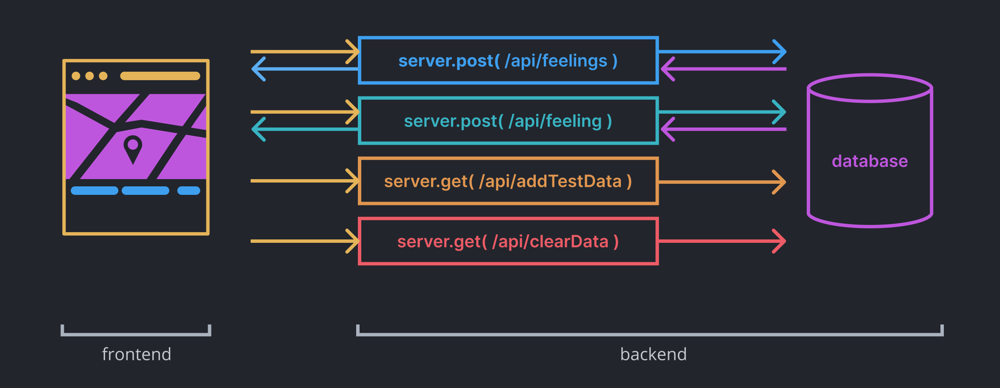

import CustomAside from '@/components/CustomAside.astro';

<CustomAside type="excerpt">{frontmatter.description}</CustomAside>

:::note
To be continued...
:::

## Planning and Design

<figure>

Queering the Map https://queeringthemap.com (2018) is a community-generated cartographic archive of queer experiences. Created by Lucas LaRochelle, the site catalogs, preserves, and locates the experiences of queer life, including encounters, collective action, and stories of coming out.

</figure>

<figure>

Exhausting a Crowd (2015) https://exhaustingacrowd.com by Kyle McDonald is a web application that depicts detailed security camera footage upon which website visitors can add annotations synced with both the imagery and the time code of the video. The crowdsourced text laid over the 12 hours of repeating footage from various sites offers curious commentary which perfectly balances the opposing forces of surveillance vs privacy, looking vs being seen, and control vs pleasure that defines our information culture and public spaces.

</figure>

<figure>

[pointerpointer.com](https://pointerpointer.com) (2012) by Studio Moniker and Studio Puckey matches your mouse position to significant locations using a database of images. 

</figure>

## Map Inspiration

- Jodi https://geogoo.net/
- Brooke Singer [toxicsites.us](https://toxicsites.us) 
- Lucas LaRochelle https://queeringthemap.com
- Kyle McDonald https://exhaustingacrowd.com
- Native Land Digital https://native-land.ca/
- Yehwan Song [And it's pouring in Korea](https://www.instagram.com/p/CDwHr6nBb5S/), [Rainbow behind clouds](https://www.instagram.com/p/B4ca3lThEvQ/)
- James Bridle [Dronestagram](https://www.instagram.com/dronestagram/?hl=en)
- https://www.geokitten.com
- Josh Begley [Metadata+](https://joshbegley.com/metadata/)
- Owen Mundy https://iknowwhereyourcatlives.com/

<figure>

A diagram showing the relationship between client, server, and database for Big Feelings.

</figure>

<figure>

In our initial conversations about Big Feelings we imagined feelings as colorful bubbles on the map, and we wanted our map to feel mushy, like a bunch of big feelings indefinitely overlapping each other. We experimented with color (1), size (2), opacity and blending modes (3), and gradients (4), of the shapes on top of a map screenshot. 

</figure>

<figure>

Once we knew we wanted to represent a list of feelings with associated colors we iterated on what those options would be and placed colored shapes on top of each other with various opacity levels and soft edges. We used common sentiments and selected colors by hand (1). xtine created a new, more contemporary version of the mood language (2). Owen used a gradient in Figma within a mask of circles to create a continuous gradient that spaced-out the color hues (3,4). 

</figure>

<figure>

A few of the mockups for Big Feelings. As you can see, an iterative process helped us to improve and test different layouts.

</figure>

