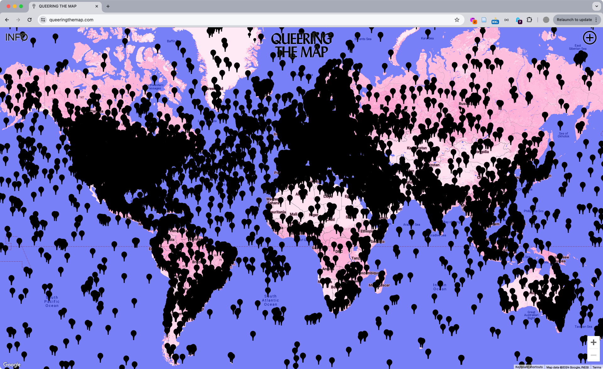
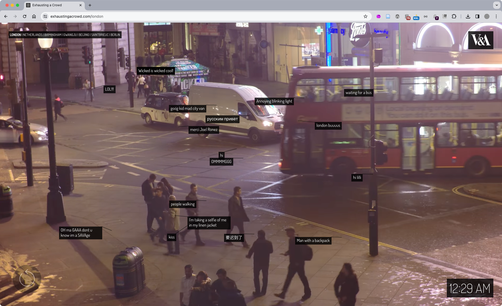
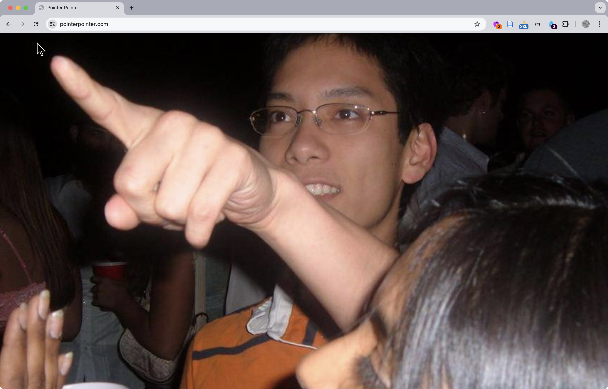
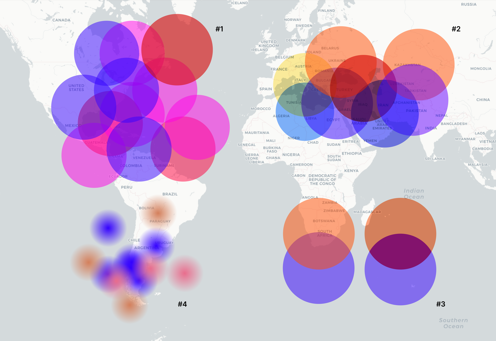
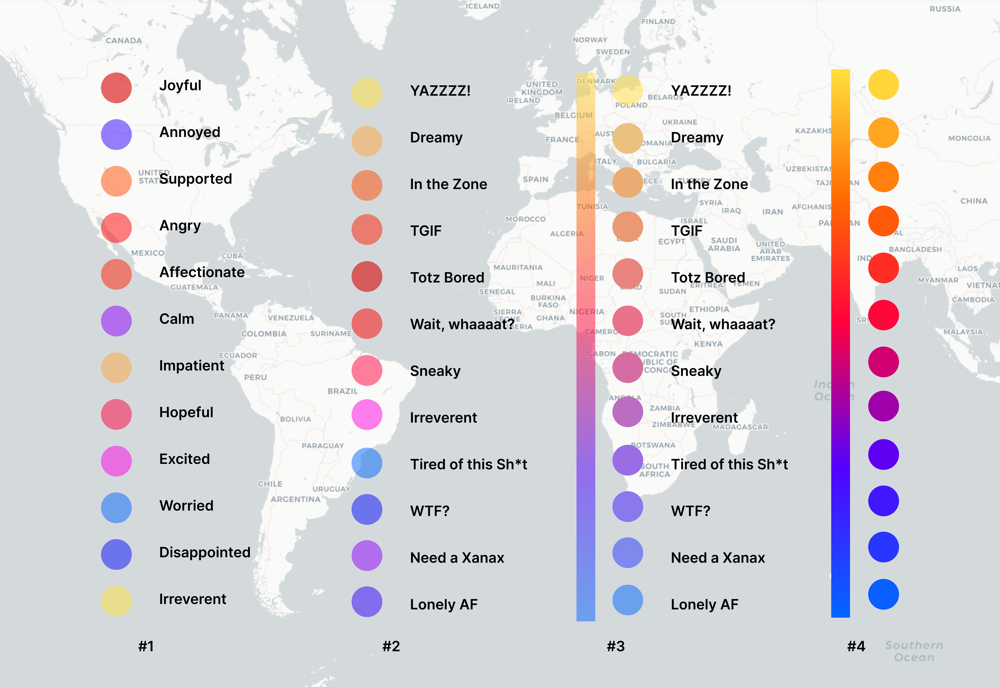

import CustomAside from '@/components/CustomAside.astro';

<CustomAside type="overview">{frontmatter.description}</CustomAside>

## Define Your Project Concept

<CustomAside type="excerpt" reference="Exercise 10.1.1"></CustomAside>

We’ve shared multiple methods for conducting research and planning a project throughout this book. The prompts below outline a general strategy to consider when starting a project.

1. Identify potential topics to explore using brainstorming strategies (chapters 3 and 6). The scope of your project is important, as working with a theme or issue too specific can narrow your audience and one that is too broad may create the kind of “scope creep” that results in an unfocused message or simply a project too large to tackle in a reasonable time period. Is there a problem you want to solve? Or do you wish to address issues by problematizing your subject?
2. Write a summary of your topic(s) and research. Address why you are drawn to this topic and why it is important to explore. Identify the communities, resources, and issues involved. Include technology you will potentially use in your project.
3. Collect research (related texts) and inspiration (visuals and works of art and design) in a competition scan (chapter 5). Look through this book and the wiki for examples. Figures below represent examples from our research.

<figure>

Queering the Map https://queeringthemap.com (2018) is a community-generated cartographic archive of queer experiences. Created by Lucas LaRochelle, the site catalogs, preserves, and locates the experiences of queer life, including encounters, collective action, and stories of coming out.

</figure>

<figure>

Exhausting a Crowd (2015) https://exhaustingacrowd.com by Kyle McDonald is a web application that depicts detailed security camera footage upon which website visitors can add annotations synced with both the imagery and the time code of the video. The crowdsourced text laid over the 12 hours of repeating footage from various sites offers curious commentary which perfectly balances the opposing forces of surveillance vs privacy, looking vs being seen, and control vs pleasure that defines our information culture and public spaces.

</figure>

<figure>

[pointerpointer.com](https://pointerpointer.com) (2012) by Studio Moniker and Studio Puckey matches your mouse position to significant locations using a database of images. 

</figure>

## Map Inspiration

<figure>

GeoGoo https://geogoo.net by Jodi (Joan Heemskerk and Dirk Paesmans) is a wonderfully chaotic series of animations using the default icons of the Google Map API. Users can select from the dropdown options or simply refresh the page to load new iterations that visualize mathematical functions, symbols, or completely random designs across a variety of terrains and lunar surfaces. *While offline for a period, the site (thankfully) is live again.

</figure>

- Brooke Singer [toxicsites.us](https://toxicsites.us) 
- Native Land Digital https://native-land.ca/
- Yehwan Song [And it's pouring in Korea](https://www.instagram.com/p/CDwHr6nBb5S/), [Rainbow behind clouds](https://www.instagram.com/p/B4ca3lThEvQ/)
- James Bridle [Dronestagram](https://www.instagram.com/dronestagram/?hl=en)
- https://www.geokitten.com
- Owen Mundy [I Know Where Your Cat Lives](https://iknowwhereyourcatlives.com/)
- Josh Begley [Metadata+](https://joshbegley.com/metadata/)

## Prompt Designs

<figure>

In our initial conversations about Big Feelings we imagined feelings as colorful bubbles on the map, and we wanted our map to feel mushy, like a bunch of big feelings indefinitely overlapping each other. We experimented with color (1), size (2), opacity and blending modes (3), and gradients (4), of the shapes on top of a map screenshot. 

</figure>

<figure>

Once we knew we wanted to represent a list of feelings with associated colors we iterated on what those options would be and placed colored shapes on top of each other with various opacity levels and soft edges. We used common sentiments and selected colors by hand (1). xtine created a new, more contemporary version of the mood language (2). Owen used a gradient in Figma within a mask of circles to create a continuous gradient that spaced-out the color hues (3,4). 

</figure>

<figure>

A few of the mockups for Big Feelings. As you can see, an iterative process helped us to improve and test different layouts.

</figure>

