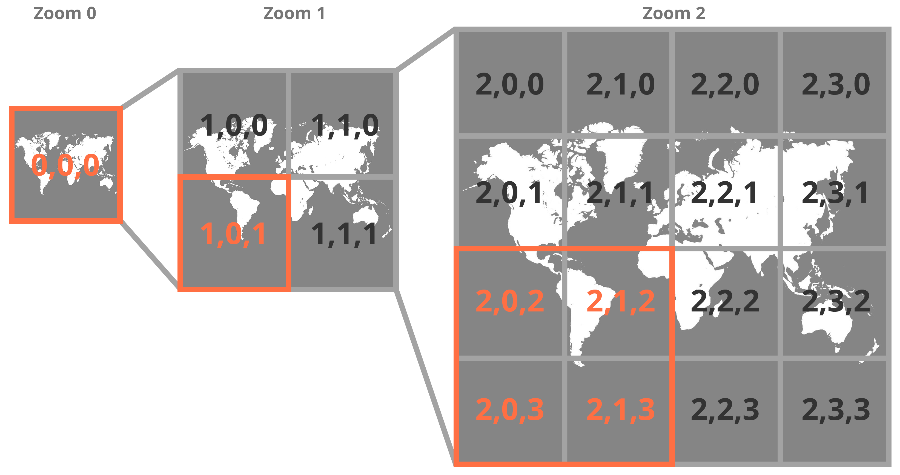
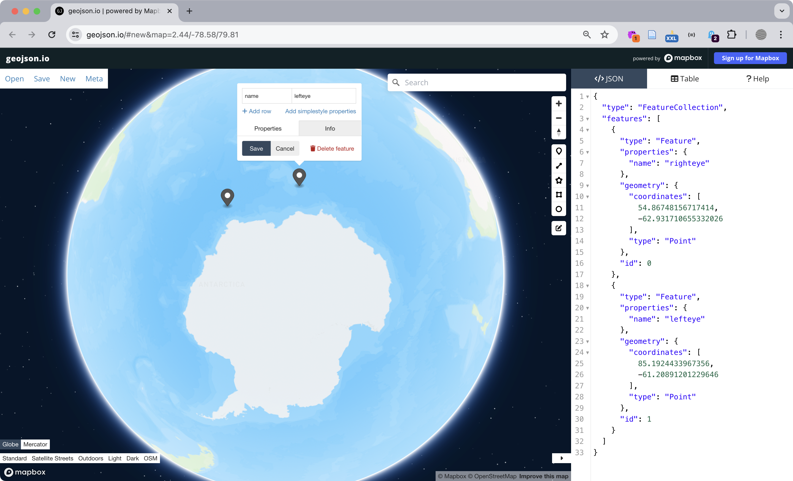
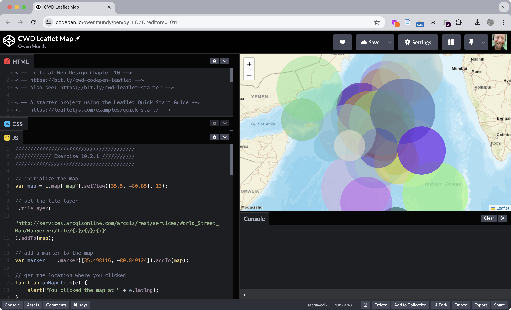

import CustomAside from '@/components/CustomAside.astro';

<CustomAside type="excerpt">{frontmatter.description}</CustomAside>


:::note
To be continued...
:::


## Map Resources

- https://leafletjs.com/
- https://geojson.io
- https://jsonlint.com/

## Map Tileset Providers

- https://omundy.github.io/free-tiles/
- http://mc.bbbike.org/mc/
- https://wiki.openstreetmap.org/wiki/Raster_tile_providers
- https://leaflet-extras.github.io/leaflet-providers/preview/
- https://maps.stamen.com/
- https://www.thunderforest.com/maps/
- https://www.mapbox.com/gallery


<figure>


Three zoom levels in a map tileset. The labels in our graphic follow the z (zoom), x (longitude position), and y (latitude position) format of tileset templates.

</figure>

<figure>


[geojson.io](https://geojson.io) is a user-friendly site for creating and formatting JSON map data.

</figure>

<figure>


GeoGoo https://geogoo.net by Jodi (Joan Heemskerk and Dirk Paesmans) is a wonderfully chaotic series of animations using the default icons of the Google Map API. Users can select from the dropdown options or simply refresh the page to load new iterations that visualize mathematical functions, symbols, or completely random designs across a variety of terrains and lunar surfaces. *While offline for a period, the site (thankfully) is live again.

</figure>

<figure>


The result of exercises in 10.2 is a map populated with fake data using two libraries, Leaflet (for the map) and Faker.js (for the data). 

</figure>


```json
{
  "type": "FeatureCollection",
  "features": [
    {
      "type": "Feature",
      "properties": {
        "name": "lefteye",
        "color": "red"
      },
      "geometry": {
        "coordinates": [
          20.254210258899974,
          10.248324129891202
        ],
        "type": "Point"
      },
      "id": 0
    },
    {
      "type": "Feature",
      "properties": {
        "name": "righteye",
        "color": "blue"
      },
      "geometry": {
        "coordinates": [
          33.5857337777679,
          7.011603808791804
        ],
        "type": "Point"
      },
      "id": 1
    },
    {
      "type": "Feature",
      "properties": {},
      "geometry": {
        "coordinates": [
          17.013013048764776,
          1.1816459451551538
        ],
        "type": "Point"
      },
      "id": 2
    }
  ]
}
```

